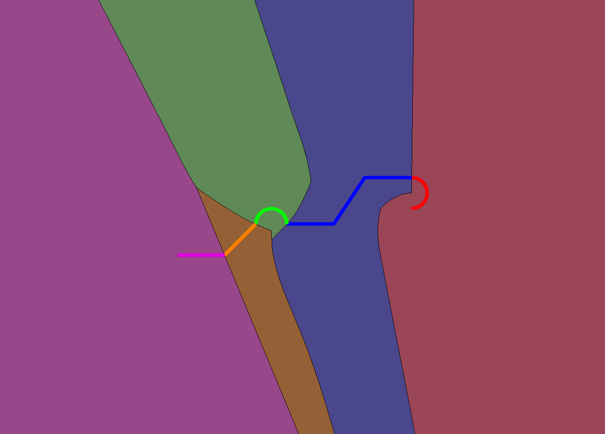
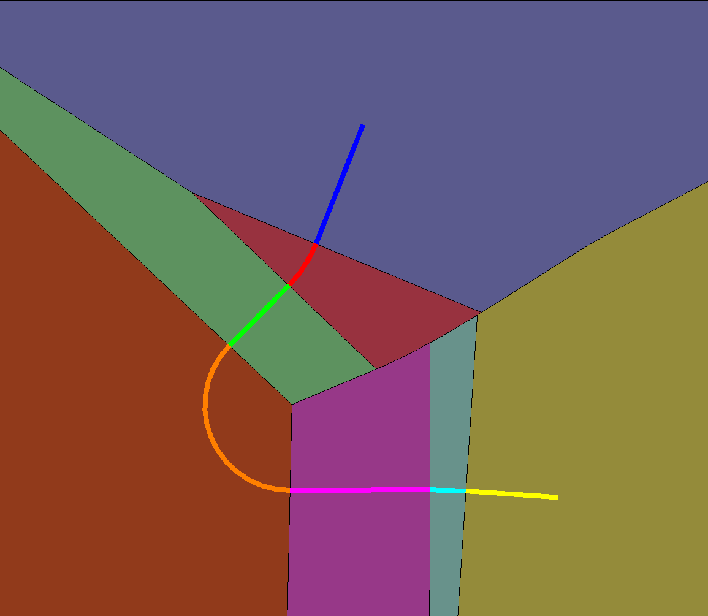

# 5.2.0 Change Notes

- [5.2.0 Change Notes](#5.2.0 Change Notes)
  - [@itwin/core-ecschema-metadata](#itwincore-ecschema-metadata)
    - [Additions](#additions)
    - [Changes](#changes)
  - [Presentation](#presentation)
    - [Deprecation of hierarchy-related APIs](#deprecation-of-hierarchy-related-apis)
  - [API deprecations](#api-deprecations)
    - [@itwin/presentation-common](#itwinpresentation-common)
    - [@itwin/presentation-backend](#itwinpresentation-backend)
    - [@itwin/presentation-frontend](#itwinpresentation-frontend)
  - [Display](#display)
    - [Draco decoding](#draco-decoding)
  - [Geometry](#geometry)
    - [Clippers for a curve chain](#clippers-for-a-curve-chain)
  - [Electron 38 support](#electron-38-support)

## @itwin/core-ecschema-metadata

### Additions

- Added [FormatSetFormatsProvider]($ecschema-metadata) class that implements [MutableFormatsProvider]($quantity) to manage format definitions within a format set. This provider supports adding and removing formats at runtime and automatically updates the underlying format set when changes are made.

### Changes

- Added  `unitSystem` property to [FormatSet]($ecschema-metadata) interface, using [UnitSystemKey]($quantity) type. This will help move APIs away from relying on `activeUnitSystem` in `quantityFormatter`, as they move to the new formatting APIs using `IModelApp.formatsProvider`. Looking ahead, tools and components that use formatting APIs can then listen to just the `onFormatsChanged` event from `IModelApp.formatsProvider` instead of `IModelApp.quantityFormatter.onActiveUnitSystemChanged`.
- Added optional `description` property to [FormatSet]($ecschema-metadata) interface. This property allows for additional descriptive text to be associated with a format set, providing better documentation and user context for format set purposes.
- Changed interface for formats in `FormatSet` from [SchemaItemFormatProps]($ecschema-metadata) to [FormatDefinition]($quantity). FormatSet just uses the `name`, `label`, `description` field from `SchemaItemFormatProps`, which `FormatDefinition` already has.

## Presentation

### Deprecation of hierarchy-related APIs

All hierarchies-related APIs have been deprecated in favor of the new-generation hierarchy building APIs, provided with the [`@itwin/presentation-hierarchies` package](https://github.com/iTwin/presentation/blob/master/packages/hierarchies/README.md). See the [learning section](https://github.com/iTwin/presentation/blob/master/packages/hierarchies/README.md#learning) and [migration guide](https://github.com/iTwin/presentation/blob/master/packages/hierarchies/learning/PresentationRulesMigrationGuide.md) for details on how to create similar hierarchies using those APIs. See the [API deprecations](#api-deprecations) section for a list of specific APIs that have been deprecated.

## API deprecations

### @itwin/presentation-common

Deprecated all hierarchy-related types (see [Deprecation of hierarchy-related APIs](#deprecation-of-hierarchy-related-apis) section for more details).

- Presentation rule types:
  - `ChildNodeRule`
  - `ChildNodeSpecification`
  - `ChildNodeSpecificationBase`
  - `ChildNodeSpecificationTypes`
  - `ClassGroup`
  - `CustomNodeSpecification`
  - `CustomQueryInstanceNodesSpecification`
  - `DefaultGroupingPropertiesContainer`
  - `ECPropertyValueQuerySpecification`
  - `GroupingRule`
  - `GroupingSpecification`
  - `GroupingSpecificationBase`
  - `GroupingSpecificationTypes`
  - `InstanceNodesOfSpecificClassesSpecification`
  - `NavigationRule`
  - `NavigationRuleBase`
  - `NodeArtifactsRule`
  - `PropertyGroup`
  - `PropertyRangeGroupSpecification`
  - `QuerySpecification`
  - `QuerySpecificationBase`
  - `QuerySpecificationTypes`
  - `RelatedInstanceNodesSpecification`
  - `RootNodeRule`
  - `SameLabelInstanceGroup`
  - `SameLabelInstanceGroupApplicationStage`
  - `StringQuerySpecification`
  - `SubCondition`
- Node key types:
  - `BaseNodeKey`
  - `ECClassGroupingNodeKey`
  - `ECInstancesNodeKey`
  - `ECPropertyGroupingNodeKey`
  - `GroupingNodeKey`
  - `LabelGroupingNodeKey`
  - `NodeKey`
  - `NodeKeyPath`
  - `KeySet.nodeKeys`, `KeySet.nodeKeysCount`, `KeySetJSON.nodeKeys`
- Node types:
  - `Node`
  - `NodePathElement`
  - `NodePathFilteringData`
  - `PartialNode`
  - `StandardNodeTypes`
- Presentation manager prop and return types:
  - `FilterByInstancePathsHierarchyRequestOptions`
  - `FilterByInstancePathsHierarchyRpcRequestOptions`
  - `FilterByTextHierarchyRequestOptions`
  - `FilterByTextHierarchyRpcRequestOptions`
  - `HierarchyCompareInfo`
  - `HierarchyCompareOptions`
  - `HierarchyLevel`
  - `HierarchyLevelDescriptorRequestOptions`
  - `HierarchyLevelDescriptorRpcRequestOptions`
  - `HierarchyRequestOptions`
  - `HierarchyRpcRequestOptions`
  - `HierarchyUpdateInfo`
  - `NodeDeletionInfo`
  - `NodeInsertionInfo`
  - `NodeUpdateInfo`
  - `PartialHierarchyModification`

### @itwin/presentation-backend

Deprecated all hierarchy-related types (see [Deprecation of hierarchy-related APIs](#deprecation-of-hierarchy-related-apis) section for more details).

- Hierarchy cache configuration:
  - `DiskHierarchyCacheConfig`
  - `HierarchyCacheConfig`
  - `HierarchyCacheMode`
  - `HybridCacheConfig`
  - `MemoryHierarchyCacheConfig`
  - `PresentationManagerCachingConfig.hierarchies`
- `PresentationManager` methods:
  - `PresentationManager.compareHierarchies`
  - `PresentationManager.getFilteredNodePaths`
  - `PresentationManager.getNodePaths`
  - `PresentationManager.getNodes`
  - `PresentationManager.getNodesCount`
  - `PresentationManager.getNodesDescriptor`

### @itwin/presentation-frontend

Deprecated all hierarchy-related types (see [Deprecation of hierarchy-related APIs](#deprecation-of-hierarchy-related-apis) section for more details).

- `GetNodesRequestOptions`
- `IModelHierarchyChangeEventArgs`
- `PresentationManager` methods & members:
  - `PresentationManager.getFilteredNodePaths`
  - `PresentationManager.getNodePaths`
  - `PresentationManager.getNodesCount`
  - `PresentationManager.getNodesDescriptor`
  - `PresentationManager.getNodesIterator`
  - `PresentationManager.onIModelHierarchyChanged`

## Display

### Draco decoding

Draco decoding in iTwin.js has been changed so that the loaders.gl dependency will no longer use a CDN to request the draco-decoder source files. Instead, we now bundle those resources into iTwin.js from a new draco3d dependency. We ask the loaders.gl library to locally use those resources.

## Geometry

### Clippers for a curve chain

Added a new API **ClipUtilities.createClippersForRegionsClosestToCurvePrimitivesXY** to the clip utilities class to create clippers for regions closest to the children of a curve chain.

The API takes a curve chain (z-coordinate is ignored) and other optional inputs (which control the accuracy and xy-range of the returned clippers) and returns an ordered array of clippers, each of which represents the region closest to the corresponding primitive in the input curve chain.

**Examples**<br>
A custom path is generated and passed along with control options to the API:
```ts
const bbox = Range2d.createXYXY(70250, 1209900, 70950, 1210500);
const clippers = ClipUtilities.createClippersForRegionsClosestToCurvePrimitivesXY(path, strokeOptions, distanceTol, bbox);
```
Below you can see the visualization of `clippers`. Each child is shown by a color and the corresponding region to that child is shown by a similar color. Note that regions crossed the curve chain exactly at the joins.


Here is another example for a path provided by the Civil team:


## Electron 38 support

In addition to [already supported Electron versions](../learning/SupportedPlatforms.md#electron), iTwin.js now supports [Electron 38](https://www.electronjs.org/blog/electron-38-0).


