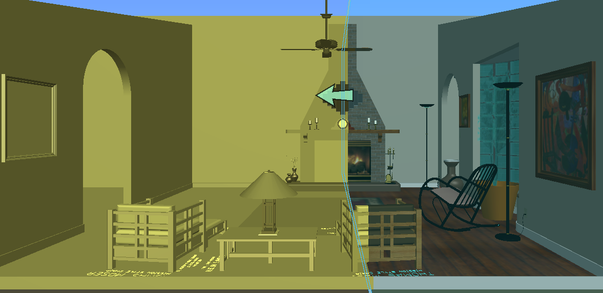

# NextVersion

## 3D Globe Background Map Display

The background map can now be displayed as either a plane or a three-dimensional globe. This is controlled by the [GlobeMode]($common) property of the [DisplayStyleSettings.backgroundMap]($common) associated with a [DisplayStyleState]($frontend) or [DisplayStyle]($backend).

* [GlobeMode.Plane]($common) projects the map onto the XY plane.
* [GlobeMode.Ellipsoid]($common) - the default mode - projects the map onto the [WGS84](https://en.wikipedia.org/wiki/World_Geodetic_System) ellipsoid when sufficiently zoomed-out.

In Plane mode, or in 3d mode when sufficiently zoomed-in on the iModel, the iModel's [geographic coordinate system](https://www.imodeljs.org/learning/geolocation/#the-geographic-coordinate-system) is used to transform the map into the iModel's coordinate space.


<p align="center">Plane mode</p>


<p align="center">Ellipsoid mode</p>

### Globe View Tools

The following are view tools that allow a user to navigate a plane or three-dimensional globe. All of these tools operate on the selected view.

* [ViewGlobeSatelliteTool]($frontend) views a location on the background map from a satellite's perspective; the viewed location is derived from the position of the current camera's eye above the map.
* [ViewGlobeBirdTool]($frontend) views a location on the background map from a bird's eye perspective; the viewed location is derived from the position of the current camera's eye above the globe.
* [ViewGlobeLocationTool]($frontend) views a location on the background map corresponding to a specified string. This will either look down at the location using a bird's eye height, or, if a range is available, the entire range corresponding to the location will be viewed.
* [ViewGlobeIModelTool]($frontend) views the current iModel on the background map so that the extent of the project is visible.

[ViewGlobeSatelliteTool]($frontend), [ViewGlobeBirdTool]($frontend), and [ViewGlobeIModelTool]($frontend) run in the following manner:

* The tool, once constructed, will execute when its `onDataButtonDown` or `onPostInstall` methods are called.
* `onDataButtonDown` will execute the tool if its `BeButtonEvent` argument has a defined `viewport` property. It will use that viewport.
* `onPostInstall` will use the viewport specified in the tool's constructor. If that does not exist, it will use `IModelApp.viewManager.selectedView`.

[ViewGlobeLocationTool]($frontend) runs in the following manner:

* The tool, once constructed, will execute when its `parseAndRun` method is called.
* To navigate to a precise latitude/longitude location on the map, specify exactly two numeric arguments to `parseAndRun`. The first will be the latitude and the second will be the longitude. These are specified in degrees.
* To search for and possibly navigate to a named location, specify any number of string arguments to `parseAndRun`. They will be joined with single spaces between them. If a location corresponding to the joined strings can be found, the tool will navigate there.

## Colorizing Clip Regions

[Viewport]($frontend) now contains the following properties which control the color of pixels outside or inside a clip region. If either of these are defined, the corresponding pixels will be shown using the specified color; otherwise, no color override occurs and clipping proceeds normally for that area of the clip region. By default, these are both undefined.

* `outsideClipColor` - Either a [ColorDef]($common) or undefined. This setting controls the color override for pixels outside a clip region.
* `insideClipColor` - Either a [ColorDef]($common) or undefined. This setting controls the color override for pixels inside a clip region.


<p align="center">Clipped geometry drawn in yellow - arrow indicates direction of clip plane</p>

## Incremental Precompilation of Shaders

Previously, shader programs used by the [RenderSystem]($frontend) were never compiled until the first time they were used. This could produce very noticeable delays when the user interacts with a [Viewport]($frontend). The [RenderSystem]($frontend) can now precompile shader programs before any [Viewport]($frontend) is opened.

* To enable this functionality, set the `doIdleWork` property of the `RenderSystem.Options` object passed to `IModelApp.startup` to true.
* Applications should consider enabling this feature if they do not open a Viewport immediately upon startup - for example, if the user is first expected to select an iModel and  a view through the user interface.
* Shader precompilation will cease once all shader programs have been compiled, or when a Viewport is opened (registered with the [ViewManager]($frontend)).

## Opening iModels

  The API now allows opening iModels (briefcases) at the backend with a new [SyncMode.pullOnly]($backend) option. e.g.,
  ```ts
  const iModel = await BriefcaseDb.open(requestContext, projectId, iModelId, OpenParams.pullOnly());
  ```
  * Opening with this new option establishes a local briefcase that allows change sets to be pulled from the iModel Hub and merged in. e.g.,
    ```ts
    iModel.pullAndMergeChanges(requestContext, IModelVersion.latest());
    ```
  *  Upon open a new briefcase is *acquired* from the iModel Hub and is meant for exclusive use by that user.
  * The briefcase is opened ReadWrite to allow merging of change sets even if no changes can be made to it.

## Breaking API changes

With a new major version of the iModel.js library come breaking API changes. The majority of those changes result from the removal of previously deprecated APIs. In addition, the following APis have changed in ways that may require calling code to be adjusted:

### IModel, IModelConnection, IModelDb

The properties formerly under `IModel.iModelToken` have been promoted to [IModel]($common). These renames affect [IModelConnection]($frontend) and [IModelDb]($backend):

* `IModel.iModelToken.contextId` --> [IModel.contextId]($common)
* `IModel.iModelToken.iModelId` --> [IModel.iModelId]($common)
* `IModel.iModelToken.changeSetId` --> [IModel.changeSetId]($common)

And for RPC implementations, the following method has been added to replace other uses of `IModel.iModelToken`:

* [IModel.getRpcProps]($common)
  * This method returns an object of type [IModelRpcProps]($common) which replaces `IModelToken` and `IModelTokenProps` but maintains the same property names as before.

And the following method has been renamed/refactored to *find* based on a key:

* `IModelDb.find` --> [IModelDb.findByKey]

### Briefcase iModels

The methods for working with Briefcase iModels (those that are synchronized with iModelHub) have been moved into a new [BriefcaseDb]($backend) class, which is a breaking change.
The following methods have been moved from (the now abstract) [IModelDb]($backend) class:

* `IModelDb.open` --> [BriefcaseDb.open]($backend)
* `IModelDb.create` --> [BriefcaseDb.create]($backend)
* `IModelDb.pullAndMergeChanges` --> [BriefcaseDb.pullAndMergeChanges]($backend)
* `IModelDb.pushChanges` --> [BriefcaseDb.pushChanges]($backend)
* `IModelDb.reverseChanges` --> [BriefcaseDb.reverseChanges]($backend)
* `IModelDb.reinstateChanges` --> [BriefcaseDb.reinstateChanges]($backend)
* `IModelDb.concurrencyControl` --> [BriefcaseDb.concurrencyControl]($backend)

Corresponding changes have been made to the frontend. The following methods have been moved from (the now abstract) [IModelConnection]($frontend) class:

* `IModelConnection.open` --> [BriefcaseConnection.open]($frontend)

### Snapshot iModels

The methods for working with snapshot iModels have been moved into a new [SnapshotDb]($backend) class, which is a breaking change.
The following renames are required:

* `IModelDb.createSnapshot` (static) --> [SnapshotDb.createEmpty]($backend)
* `IModelDb.createSnapshot` --> [SnapshotDb.createFrom]($backend)
* `IModelDb.openSnapshot` --> [SnapshotDb.openFile]($backend)
* `IModelDb.closeSnapshot` --> [SnapshotDb.close]($backend)

Corresponding changes have been made to the frontend. The following methods have been moved from (the now abstract) [IModelConnection]($frontend) class:

* `IModelConnection.openSnapshot` --> [SnapshotConnection.openFile]($frontend)
* `IModelConnection.closeSnapshot` --> [IModelConnection.close]($frontend) (abstract) and [SnapshotConnection.close]($frontend) (concrete)

### BlankConnection

A new [BlankConnection]($frontend) subclass of of [IModelConnection]($frontend) has been introduced for working with reality data services without requiring an iModel.
The following renames are required:

* `IModelConnection.createBlank` --> [BlankConnection.create]($frontend)

### BriefcaseId / ReservedBriefcaseId

The former `BriefcaseId` class has been replaced by the [BriefcaseId]($backend) type (which is just `number`) and the [ReservedBriefcaseId]($backend) enumeration.

### GeometryStream iteration

The [GeometryStreamIteratorEntry]($common) exposed by a [GeometryStreamIterator]($common) has been simplified down to only four members. Access the geometric primitive associated with the entry by type-switching on its `type` property. For example, code that previously looked like:

```ts
function tryTransformGeometry(entry: GeometryStreamIteratorEntry, transform: Transform): void {
  if (undefined !== entry.geometryQuery)
    return entry.geometryQuery.tryTransformInPlace(transform);

  if (undefined !== entry.textString) {
    entry.textString.transformInPlace(transform);
    return true;
  } else if (undefined !== entry.image)
    entry.image.transformInPlace(transform);
    return true;
  }
  // etc...
}
```

Is now written as:

```ts
function tryTransformGeometry(entry: GeometryStreamIteratorEntry, transform: Transform): void {
  switch (entry.primitive.type) {
    case "geometryQuery":
      // The compiler knows that entry.primitive is of type AnyGeometryQuery
      return entry.primitive.geometryQuery.tryTransformInPlace(transform);
    case "textString":
    case "image":
      // The compiler knows that entry.primitive is a TextString or an ImageGraphic, both of which have a transformInPlace() method
      entry.primitive.transformInPlace(transform);
      return true;
    // etc...
  }
}
```

### PropertyRecord classes moved to `ui-abstract` package

This includes the classes in the following files:

* Description.ts
* EditorParams.ts
* PrimitiveTypes.ts
* Record.ts
* Value.ts

The deprecated ToolSettingsValue.ts has been removed.

### API changes in `ui-components` package

#### Hard-Deprecation

A couple of already `@deprecated` APIs are now being hard-deprecated by adding a `DEPRECATED_` prefix to increase consumers' awareness about future removal of the APIs:

* `Tree` to `DEPRECATED_Tree`
* `withTreeDragDrop` to `DEPRECATED_withTreeDragDrop`

As a short term solution consumers can simply do a rename when importing the module, e.g.:

```ts
import { DEPRECATED_Tree as Tree } from "@bentley/ui-components";
```

#### Removals and Changes

* Renamed `ITreeNodeLoaderWithProvider.getDataProvider()` to `ITreeNodeLoaderWithProvider.dataProvider`.
* Renamed `PagedTreeNodeLoader.getPageSize()` to `PagedTreeNodeLoader.pageSize`.
* Renamed `TreeCheckboxStateChangeEvent` to `TreeCheckboxStateChangeEventArgs`.
* Renamed `TreeNodeEvent` to `TreeNodeEventArgs`.
* Renamed `TreeSelectionModificationEvent` to `TreeSelectionModificationEventArgs`.
* Renamed `TreeSelectionReplacementEvent` to `TreeSelectionReplacementEventArgs`.
* Renamed `useModelSource` to `useTreeModelSource`.
* Renamed `useNodeLoader` to `useTreeNodeLoader`.
* Renamed `usePagedNodeLoader` to `usePagedTreeNodeLoader`.
* Changed `IPropertyValueRenderer.render` to only be allowed to return `ReactNode` (do not allow `Promise<ReactNode>` anymore). This makes the calling code much simpler at the cost of a few more complex renderers. To help handle async rendering, a helper `useAsyncValue` hook has been added. Example usage:

  ```ts
  import { useAsyncValue } from "@bentley/ui-components";
  const MyComponent = (props: { asyncValue : Promise<string> }) => {
    const value = useAsyncValue(props.asyncValue);
    return value ?? "Loading...";
  };
  ```

* Changed type of `label` attribute from `string` to `PropertyRecord` for these types:
  * `BreadcrumbNodeProps`
  * `TreeModelNode`
  * `MutableTreeModelNode`
  * `TreeModelNodeInput`

  Also removed `labelDefinition` attribute in `PropertyData` and `TreeNodeItem` in favor of `label` whose type changed from `string` to `PropertyRecord`.

  To render `PropertyRecords` we suggest using `PropertyValueRendererManager` API:

  ```ts
  import { PropertyValueRendererManager } from "@bentley/ui-components";
  const MyComponent = (props: { label: PropertyRecord }) => {
    return PropertyValueRendererManager.defaultManager.render(props.label);
  };
  ```

* Removed `HorizontalAlignment`. Use the `HorizontalAlignment` in @bentley/ui-core instead.

### API changes in `ui-framework` package

#### Renames

A couple of types were renamed to better match their intention:

* `VisibilityTree` to `ModelsTree`
* `IModelConnectedVisibilityTree` to `IModelConnectedModelsTree`

#### Removal of deprecated APIs

The following items that were marked as @deprecated in the 1.x time frame have been removed:

* FrontstageDef.inheritZoneStates (never implemented in iModel.js)
* FrontstageDef.hubEnabled (never implemented in iModel.js)
* FrontstageDef.contextToolbarEnabled (never implemented in iModel.js)
* IconSpec (Use IconSpec in @bentley/ui-core instead)
* IconProps (Use IconProps in @bentley/ui-core instead)
* Icon (Use the Icon component in @bentley/ui-core instead)
* ItemDefBase.betaBadge (use badgeType instead)
* ItemProps.betaBadge  (use badgeType instead)
* WidgetDef.betaBadge (use badgeType instead)
* WidgetProps.betaBadge (use badgeType instead)

#### Other changes

* Removed `useControlledTree` flag from the following *Prop* types:
  * `CategoryTreeProps`
  * `ModelsTreeProps`
  * `SpatialContainmentTreeProps`
  * `VisibilityComponentProps`

  The components now always use controlled tree as the internal tree implementation.

* Removed `UiFramework.getDefaultRulesetId()` and `UiFramework.setDefaultRulesetId()`. Each component
should decide what ruleset it wants to use.

* Custom registered ToolUiProviders should now return a 'horizontalToolSettingNodes' property that contain an array of ToolSettingsEntry items.
These items define the label and editor to use for each value when the Tool Settings container is in its default Horizontal orientation. The existing 'toolSettingsNode' property is still used to specify the UI if the Tool Settings are shown in a floating/rectangular container.

*When using the DefaultToolSettingsProvider as specified in the `ToolUiManager`, the toolSettingsProperty argument to `ToolUiManager.initializeToolSettingsData()` has been changed from `ToolSettingsPropertyRecord[]` to `DialogItem[]`. `DialogItem` is an interface that you will find in the ui-abstract package in the file DialogItem.ts. The classes in the file ToolSettingsValue.ts have been deprecated and removed from the source tree.

### API changes in `ui-core` package

#### Removal of deprecated APIs

The following items that were marked as @deprecated in the 1.x time frame have been removed:

* UiError (use UiError in @bentley/ui-abstract instead)
* Position for Popup component (Use RelativePosition in @bentley/ui-abstract instead)

### API changes in `presentation-common` package

#### RPC Changes

The following endpoints have been either changed or removed:

* `PresentationRpcInterface.getDisplayLabel` removed in favor of `PresentationRpcInterface.getDisplayLabelDefinition`.
* `PresentationRpcInterface.getDisplayLabels` removed in favor of `PresentationRpcInterface.getDisplayLabelDefinitions`.
* `PresentationRpcInterface.getDisplayLabelsDefinitions` renamed to `PresentationRpcInterface.getDisplayLabelDefinitions`.
* `RequestOptionsWithRuleset` required either `rulesetId` or `rulesetOrId` (both optional). Now it only has a required attribute `rulesetOrId`.

In addition, support for stateful backed was removed.

Because of the above breaking `PresentationRpcInterface` changes its version was changed to `2.0`.

#### Hard-Deprecation

Some of already `@deprecated` APIs are now being hard-deprecated by adding a `DEPRECATED_` prefix to increase consumers' awareness about future removal of the APIs:

* `AllInstanceNodesSpecification` to `DEPRECATED_AllInstanceNodesSpecification`
* `AllRelatedInstanceNodesSpecification` to `DEPRECATED_AllRelatedInstanceNodesSpecification`
* `ChildNodeSpecificationTypes.AllInstanceNodes` to `ChildNodeSpecificationTypes.DEPRECATED_AllInstanceNodes`
* `ChildNodeSpecificationTypes.AllRelatedInstanceNodes` to `ChildNodeSpecificationTypes.DEPRECATED_AllRelatedInstanceNodes`
* `PropertiesDisplaySpecification` to `DEPRECATED_PropertiesDisplaySpecification`
* `PropertyEditorsSpecification` to `DEPRECATED_PropertyEditorsSpecification`
* `PropertiesDisplaySpecification` to `DEPRECATED_PropertiesDisplaySpecification`
* `PropertyEditorsSpecification` to `DEPRECATED_PropertyEditorsSpecification`

As a short term solution consumers can simply do a rename when importing the module, e.g.:

```ts
import { DEPRECATED_PropertiesDisplaySpecification as PropertiesDisplaySpecification } from "@bentley/presentation-common";
```

#### Removals and Changes

* Removed `@deprecated` APIs: `ECInstanceNodeKey`, `ECInstanceNodeKeyJSON`, `ECInstancesNodeKey.instanceKey`, `NodeKey.isInstanceNodeKey`, `StandardNodeTypes.ECInstanceNode`. Instead, the multi-ECInstance type of node should be used, since ECInstance nodes may be created off of more than one ECInstance. Matching APIs: `ECInstancesNodeKey`, `ECInstancesNodeKeyJSON`, `ECInstancesNodeKey.instanceKeys`, `NodeKey.isInstancesNodeKey`, `StandardNodeTypes.ECInstancesNode`.
* Removed `Item.labelDefinition` and `Node.labelDefinition`. Instead, `Item.label` and `Node.label` should be used, whose type has been changed from `string` to `LabelDefinition`. The `LabelDefinition` type has not only display value, but also raw value and type information which allows localizing and formatting raw value.
* Removed `PersistentKeysContainer`. Instead, `KeySetJSON` should be used.
* Changed `RulesetsFactory.createSimilarInstancesRuleset` to async. Removed `RulesetsFactory.createSimilarInstancesRulesetAsync`.

### API changes in `presentation-backend` package

#### Removals and Changes

* `PresentationManager.getDisplayLabel` was removed in favor of `PresentationManager.getDisplayLabelDefinition`
* `PresentationManager.getDisplayLabels` was removed in favor of `PresentationManager.getDisplayLabelDefinitions`
* `PresentationManager.getDisplayLabelsDefinitions` was renamed to `PresentationManager.getDisplayLabelDefinitions`
* `RulesetEmbedder` now takes a "props" object instead of arguments' list in its constructor. Example fix:

  ```ts
  const embedder = new RulesetEmbedder({ imodel });
  ```

  instead of:

  ```ts
  const embedder = new RulesetEmbedder(imodel);
  ```

### API changes in `presentation-frontend` package

#### Removals and Changes

* `Presentation.initialize` is now async.
* `PresentationManager.getDisplayLabel` was removed in favor of `PresentationManager.getDisplayLabelDefinition`
* `PresentationManager.getDisplayLabels` was removed in favor of `PresentationManager.getDisplayLabelDefinitions`
* `PresentationManager.getDisplayLabelsDefinitions` was renamed to `PresentationManager.getDisplayLabelDefinitions`
* `PersistenceHelper` was removed in favor of `KeySet` and its `toJSON` and `fromJSON` functions.
* `HiliteSetProvider` and `SelectionHandler` now take a "props" object instead of arguments' list in constructor. Example fix:

  ```ts
  const provider = new HiliteSetProvider({ imodel });
  ```

  instead of:

  ```ts
  const provider = new HiliteSetProvider(imodel);
  ```

### API changes in `presentation-components` package

#### Hard-Deprecation

Some of already `@deprecated` APIs are now being hard-deprecated by adding a `DEPRECATED_` prefix to increase consumers' awareness about future removal of the APIs:

* `controlledTreeWithFilteringSupport` renamed to `DEPRECATED_controlledTreeWithFilteringSupport`.
* `controlledTreeWithVisibleNodes` renamed to `DEPRECATED_controlledTreeWithVisibleNodes`.
* `treeWithFilteringSupport` renamed to `DEPRECATED_treeWithFilteringSupport`.
* `treeWithUnifiedSelection` renamed to `DEPRECATED_treeWithUnifiedSelection`.

As a short term solution consumers can simply do a rename when importing the module, e.g.:

```ts
import { DEPRECATED_treeWithUnifiedSelection as treeWithUnifiedSelection } from "@bentley/presentation-components";
```

#### Removals and Changes

* All presentation data providers that used to memoize all requests now only memoize the last one to preserve consumed memory.
* All presentation data providers are now `IDisposable`. This means their `dispose()` method has to be called whenever they're stopped being used. In the context of a hooks-based React component this can be done like this:

  ```ts
  import { useDisposable } from "@bentley/ui-core";
  import { IPresentationDataProvider } from "@bentley/presentation-components";
  const MyComponent = () => {
    const dataProvider = useDisposable(useCallback(() => createSomeDataProvider(), []));
    // can use `dataProvider` here - it'll be disposed as needed
  };
  ```

  In a class based React component the providers have to be disposed in either `componentWillUnmount` or `componentDidUpdate` callbacks, whenever the provider becomes unnecessary.
* APIs that now take a "props" object instead of arguments' list:
  * `ContentDataProvider`
  * `PresentationLabelsProvider`
  * `PresentationPropertyDataProvider`
  * `PresentationTreeDataProvider`
  * `useControlledTreeFiltering`
  * `useUnifiedSelectionTreeEventHandler`
  Example fix:

  ```ts
  const provider = new PresentationLabelsProvider({ imodel });
  ```

  instead of:

  ```ts
  const provider = new PresentationLabelsProvider(imodel);
  ```

* Removed `FavoritePropertiesDataProvider.customRulesetId`. Now it can be supplied when constructing the provider through `FavoritePropertiesDataProviderProps.ruleset`.
* Renamed `LabelsProvider` to `PresentationLabelsProvider`.
* Renamed `PresentationNodeLoaderProps` to `PresentationTreeNodeLoaderProps`.
* Renamed `PresentationTreeNodeLoaderProps.rulesetId` to `PresentationTreeNodeLoaderProps.ruleset`.
* Renamed `usePresentationNodeLoader` to `usePresentationTreeNodeLoader`.
* Renamed `useUnifiedSelectionEventHandler` to `useUnifiedSelectionTreeEventHandler`.
* Removed attributes from `UnifiedSelectionTreeEventHandlerParams`: `dataProvider`, `modelSource`. They're now taken from `nodeLoader`.

### API changes in `presentation-testing` package

#### Removals and Changes

* `initialize` helper function is now async.
* `ContentBuilder` and `HierarchyBuilder` now take a "props" object instead of arguments' list. Example fix:

  ```ts
  const builder = new ContentBuilder({ imodel, dataProvider });
  ```

  instead of:

  ```ts
  const builder = new ContentBuilder(imodel, dataProvider);
  ```

## Geometry

### Remove deprecated methods

* `CurveCurve` intersection methods which formerly returned a pair of arrays (with matched length and corresponding CurveLocationDetail entries) now return a single array whose entries each have the two corresponding CurveLocationDetails.
  * The affected methods are
    * For computing intersections among of the (simple xy projection of) curves:
      * old `CurveCurve.intersectionXY (...) : CurveLocationDetailArrayPair`
      * new `CurveCurve.intersectionXYPairs (...) : CurveLocationDetailPair[]`
    * For computing intersections among projections of curves with 4d (i.e. perspective) projection:
      * old `CurveCurve.intersectionProjectedXY (...) : CurveLocationDetailArrayPair`
      * new `CurveCurve.intersectionProjectedXYPairs (...) : CurveLocationDetailPair[]`
  * If `oldIntersections` is the old pair of arrays and `newIntersections` is the new array of pairs,
     * change   `oldIntersections.dataA[i]`
     * to `newIntersections[i].detailA`
     * old `intersections.dataB[i]`
     * to `newIntersections[i].detailB`
  * The method `CurveCurveIntersectXY.grabResults()` is removed -- `grabPairedResults` is the modernized form.
* `GrowableXYZArray` method `myArray.distance(i,j)` for distance between points identified by indices `(i,j)` is replaced by
   * old:   `myArray.distance(i,j)`
   * new:   `myArray.distanceIndexIndex(i,j)`
   * this clarifies the difference among distance methods:
      * `myArray.distanceIndexToPoint(i: number, point: Point3d)`
      * `myArray.distanceSquaredIndexIndex(i: number, point: Point3d)`
* In `PointHelpers`, the methods to parse variant XYZ data are removed.
   * In the replacements, the original single callback is replaced by an callback object that can receive start-end callbacks in addition to the primary xyz or xyz pair callback.
   * old `Point3dArray.streamXYZ (.. )` is removed.
   * new `VariantPointDataStream.streamXYZ (..)`
   * old `Point3dArray.streamXYZXYZ(..)` is removed.
   * new `VariantPointDataStream.streamXYZXYZ (..)`
* `PolyfaceBuilder`
  * old (impropertly cased) method `findOrAddNormalnLineString` is removed. The properly spelled replacement is `findOrAddNormalInLineString` (note the added capital `I`)
* `ArcSweep`
  * old (improperly cased) method `radiansArraytoPositivePeriodicFractions` is renamed `radiansArrayToPositivePeriodicFractions` (Note the capital "T")
* `ClipPlane`
  * `ClipPlane` supports the `PlaneAltitudeEvaluator` interface.
  * This allows services previously seen as specific to `ClipPlane` to be supported with other plane types (especially `Plane3dByOriginAndNormal`)
  * old instance method `myClipPlane.evaluatePoint(point)` is replaced by `myClipPlane.altitude (point)`
  * old instance method `myClipPlane.dotProductVector(point)` is replaced by `myClipPlane.velocity (point)`
  * old instance method `myClipPlane.convexPolygonClipInPlace (. . )` is replaced by (static) `Point3dArrayPolygonOps.convexPolygonClipInPlace`
  * old instance method `myClipPlane.polygonCrossings(polygonPoints, crossings)` is replaced by (static) Point3dArrayPolygonOps.polygonPlaneCrossings (clipPlane, polygonPoints, crossings)`
  * old static  method `myClipPlane.intersectRangeConvexPolygonInPlace (. . )` is replaced by (static) `IndexedXYZCollectionPolygonOps.intersectRangeConvexPolygonInPlace`
 * Various methods (usually static createXXXX) that accept `MultiLineStringDataVariant` have previously been marked as deprecated, with replacement methods that include the words `FromVariant` data.  This decision has been reversed, and that short names are again considered ok.   This includes:
  * `LineString3d.createArrayOfLineString3d (variantLinestringData:MultiLineStringDataVariant): LineString3d[]` is un-deprecated, and the mangled name `createArrayOfLineString3dFromVariantData` is deprecated.

### various method name changes (breaking)

  * On Arc3d, there were previously (confusingly) two "get" properties for the internal matrix of the Arc3d.
    * arc.matrixRef
       * This returns a reference to the matrix.
      * This is not changed.
      * Direct access to the matrix is dangerous, but the "Ref" qualifier makes that clear.
    * arc.matrix
      * this formerly returned a clone of the matrix.
      * Cloning is expensive.
      * this is removed.
      * It is replaced by a method (not property)  `arc3d.matrixClone ()`
      * `arc3d.matrixClone()` clones the matrix.
    * `Ellipsoid` API changed to eliminate use of `Point2d` as carrier for a pair of angles.
      * angle pairs are instead returned in strongly typed`LongitudeLatitudeNumber` objects.
      * method `ellipsoid.surfaceNormalToRadians` is removed.
        Use `ellipsoid.surfaceNormalToAngles` for the same result in proper `LongitudeLatitudeNumber` form.
      * method `ellipsoid.intersectRay (ray, rayFractions[], xyz[], thetaPhiRadians[])` now returns `thetaPhiRadians` as an array of strongly typed `LongitutdeLatitudeNumber`.
        * Changes made to callers in core\frontend\BackgroundMapGeometry.ts
      * `SurfaceLocationDetail` has a new (constructor-like) static method `createUVNumbersPoint (surface, u, v, point)` with the surface `u` and `v` parameters as separate numeric values (previously packaged as `Point2d`)
      * `SphereImplicit.intersectSphereRay` returns its surface angle data as `LongitudeLatitudePoint` instead of as `Point2d`.


### Bug fixes

* Apply on-plane tolerances in mesh-plane clip. (https://bentleycs.visualstudio.com/iModelTechnologies/_workitems/edit/273249/)
* `ClipUtils.selectIntervals01` announces fractional intervals of clipped geometry.  The logic previously considered any non-zero interval to be a valid candidate, resulting in extremely small arcs with seep angle less than the smallest non-zero angle.   This logic is modified so that any fractional interval shorter than `Geometry.smallFractionalResult` is ignored.

### Small angle arc issues

* Angle methods for converting an angle to a fraction of an `AngleSweep` interval have added args to specify default return value on near-zero length intervals.
  * static `AngleSweep.radiansToPositivePeriodicFraction(radians: number, zeroSweepDefault?: number): number;`
  * instance method `angleSweep.radiansToPositivePeriodicFraction(radians: number, zeroSweepDefault?: number): number;`
* static const `Geometry.smallFraction` is a typical value (1.0e-10) to consider a fraction interval small.

### Polyface clipping

* New class `ClippedPolyfaceBuilders` is carries output data and options from clip operations
* static `ClipUtilities.announceLoopsOfConvexClipPlaneSetIntersectRange(convexSet: ConvexClipPlaneSet | ClipPlane, range: Range3d, loopFunction: (loopPoints: GrowableXYZArray) => void, includeConvexSetFaces?: boolean, includeRangeFaces?: boolean, ignoreInvisiblePlanes?: boolean): void;`
  * Accepts simple `ClipPlane` in addition to `ConvexClipPlaneSet`
* static `ClipUtilities.loopsOfConvexClipPlaneIntersectionWithRange(allClippers: ConvexClipPlaneSet | UnionOfConvexClipPlaneSets | ClipPlane, range: Range3d, includeConvexSetFaces?: boolean, includeRangeFaces?: boolean, ignoreInvisiblePlanes?: boolean): GeometryQuery[]`
  * accepts `UnionOfConvexClipPlaneSets` and `ClipPlane` in addition to `ConvexClipPlaneSet`
* static `ConvexClipPlaneSet.clipInsidePushOutside(xyz: GrowableXYZArray, outsideFragments: GrowableXYZArray[], arrayCache: GrowableXYZArrayCache): GrowableXYZArray | undefined;`
  * clips `xyz` polygon to the clip plane set.   Inside result is the return argument; outside fragments (possibly many) are pushed to the `outsideFragments` array (which is not cleared first.)
* `PolyfaceClip` methods to do both inside and outside clip of polyfaces.
  * static `PolyfaceClip.clipPolyfaceClipPlane(polyface: Polyface, clipper: ClipPlane, insideClip?: boolean, buildClosureFaces?: boolean): Polyface;`
  * static `PolyfaceClip.clipPolyfaceClipPlaneWithClosureFace(polyface: Polyface, clipper: ClipPlane, insideClip?: boolean, buildClosureFaces?: boolean): Polyface;`

## ecschema-metadata Package

### Remove deprecated API

* Class `SchemaFileLocater` has been moved to the `ecschema-locaters` package.
* Class `SchemaJsonFileLocater` has been moved to the `ecschema-locaters` package.
* Class `SchemaFileLocater` has been moved to the `ecschema-locaters` package.
* In `Schema`, the methods for (de)serializing to/from JSON have been renamed.
  * `Schema.toJson()` renamed to `Schema.toJSON()`
  * `Schema.deserialize(...)` renamed to `Schema.fromJSON(...)`
  * `Schema.deserializeSync(...)` renamed to `Schema.fromJSONSync(...)`
* In `Property` and all classes deriving from `Property`, the methods for (de)serializing to/from JSON have been renamed.
  * `Property.toJson()` renamed to `Property.toJSON()`
  * `Property.deserialize(...)` renamed to `Property.fromJSON(s...)`
  * `Property.deserializeSync(...)` renamed to `Property.fromJSONSync(...)`
* In `SchemaItem` and all classes deriving directly or indirectly from `SchemaItem`, the methods for (de)serializing to/from JSON have been renamed.
  * `SchemaItem.toJson()` renamed to `SchemaItem.toJSON()`
  * `SchemaItem.deserialize(...)` renamed to `SchemaItem.fromJSON(...)`
  * `SchemaItem.deserializeSync(...)` renamed to `SchemaItem.fromJSONSync(...)`
