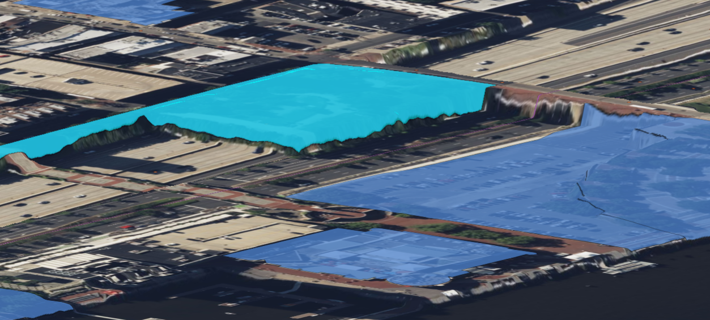

# NextVersion

Table of contents:

- [Text APIs](#text-apis)
- [Transaction metadata](#transaction-metadata)
- [Display](#display)
  - [Compressed 3D assets](#compressed-3d-assets)
- [Electron 30 support](#electron-30-support)
- [API deprecations](#api-deprecations)
- [Schemas](#schemas)
- [Map Layers](#map-layers)

## Text APIs

iTwin.js now provides APIs for creating and manipulating blocks of formatted text. A [TextBlock]($common) defines [Run]($common)s of text grouped into paragraphs. Each run can be formatted differently, based on its [TextStyle]($common). A text block can be associated with 2d or 3d model as a [TextAnnotation]($common). Annotations can be persisted as [TextAnnotation2d]($backend) and [TextAnnotation3d]($backend) elements, causing the text block to be displayed when viewing the model. Updating the annotation stored on the element via [TextAnnotation2d.setAnnotation]($backend) or [TextAnnotation3d.setAnnotation]($backend) will also update the geometric representation of the element. You can also produce a geometric representation of an annotation via [produceTextAnnotationGeometry]($backend), which can then be added to a geometry stream using [GeometryStreamBuilder.appendTextBlock]($common).

## Transaction metadata

Imagine you are implementing a UI control that lists the names of all of the [ViewDefinition]($backend)s in an iModel. When a view is created, deleted, or renamed, you'd like to automatically update the list presented to the user. You won't care about changes to any other types of elements. How can you efficiently solve this problem?

When you make changes to the contents of a [BriefcaseConnection]($frontend), the front-end is notified about the entities modified by those transactions via the [BriefcaseTxns.onElementsChanged]($frontend) and [BriefcaseTxns.onModelsChanged]($frontend) events. Previously these events received as payload a [ChangedEntities]($common) object, providing only the Ids of each entity in the space-efficient but awkward-to-use form of a [CompressedId64Set]($bentley).

To detect changes to view definitions using the [ChangedEntities]($common) API, you would need to query the backend to find out the class name of every changed element. Then, you would need to check each class name against an exhaustive list of view class names (DrawingViewDefinition, SpatialViewDefinition, etc) - which wouuld be error-prone given that BIS permits new subclasses of ViewDefinition to be introduced. Finally, you would be able to determine which, if any, of the changed elements is a view definition, and update your UI list accordingly.

We've addressed these shortcomings by enhancing the events to provide a [TxnEntityChanges]($frontend) payload instead. This type is compatible with [ChangedEntities]($common), so your existing code will continue to compile and behave as before. But you can also take advantage of simpler iteration over individual [TxnEntityChange]($frontend)s, which provide access to each entity's [TxnEntityMetadata]($frontend) describing the BIS class hierarchy of the entity. [TxnEntityMetadata.classFullName]($frontend) tells you the exact BIS class of the entity, while [TxnEntityMetadata.is]($frontend) tells you whether the entity is derived from a specific superclass. You can easily extract only the changes of interest to you using [TxnEntityChanges.filter]($frontend).

Using the new API, your logic for determining whether the list of view definitions needs to be updated could look something like this:

```ts
  briefcase.txns.onElementsChanged.addListener((changes: TxnEntityChanges) => {
    const viewChanges = Array.from(changes.filter({
      // Include only view definitions.
      includeMetadata: (metadata: TxnEntityMetadata) => metadata.is("BisCore:ViewDefinition"),
    }));

    if (viewChanges.length > 0) {
      updateViewList(viewChanges);
    }
  });
```

## Display

### Compressed 3D assets

The data within [glTF](https://en.wikipedia.org/wiki/GlTF) assets - including those delivered by [3D tilesets](https://github.com/CesiumGS/3d-tiles) - can optionally be compressed using two different methods: [draco compression](https://github.com/KhronosGroup/glTF/blob/main/extensions/2.0/Khronos/KHR_draco_mesh_compression/README.md) and [meshopt compression](https://github.com/KhronosGroup/glTF/tree/main/extensions/2.0/Vendor/EXT_meshopt_compression). Both methods can significantly reduce the file size (and therefore download time) of an asset. iTwin.js already supports Draco compression, but that method only applies to triangle meshes. Meshopt compression works for many other kinds of data, including point clouds.

Now, meshopt compression is supported. You can use a library like [meshoptimizer](https://github.com/zeux/meshoptimizer) to compress 3D assets using this technique.

## Electron 30 support

In addition to [already supported Electron versions](../learning/SupportedPlatforms.md#electron), iTwin.js now supports [Electron 30](https://www.electronjs.org/blog/electron-30-0).

## API deprecations

### @itwin/ecschema-metadata

The enumeration `SchemaItemType` has changed it's underlying type from numbers to strings which match the names of the schema item classes.
The method `schemaItemToString` has been marked deprecated as a translation between the enumeration value and the type names isn't longer necessary.

## Schemas

### QueryView support

See our [ECViews page](../learning/ECSqlReference/Views.md) for reference.
Introduces new custom attributes which allow classes that are backed by a query instead of physical data.

### CustomAttribute in ECDbMeta

[See our MetaQueries page for details](../learning/ECSqlReference/MetaQueries.md#examples-on-how-to-query-for-custom-attributes)
Allows querying for custom attributes on a schema, class or property.

## Map Layers

### Improved MapFeatureInfo tool
The actual MapFeatureInfo tool has been improved to highlight map-layer geometries when the terrain is turned ON.  

To achieve this, the appropriate resolution terrain tiles needs to be collected from the tile tree, then the `@itwin/core-geometry` functionalities are used to drape the map-layer geometries (which include point, lines and polygons) to be draped on the terrain mesh.  The resulting geometries are displayed as decorations.

In the following screenshot, we can see sample highlighted :

