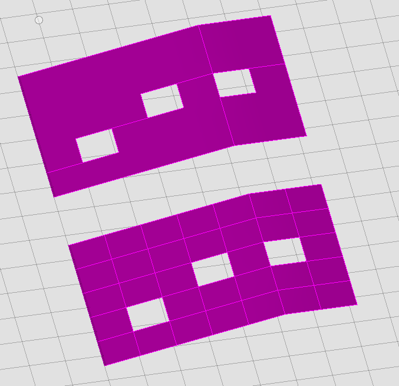
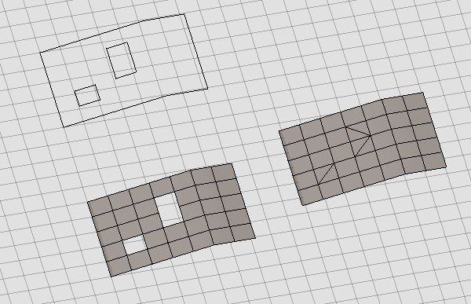

# NextVersion

Table of contents:

- [Electron 17 support](#electron-17-support)
- [IModelSchemaLoader replaced](#imodelschemaloader-replaced)
- [Improved link table selection](improved-link-table-selection)
- [Cloud storage changes](#cloud-storage-changes)
- [Display](#display)
  - [Custom terrain providers](#custom-terrain-providers)
  - [Ambient occlusion improvements](#ambient-occlusion-improvements)
  - [Improved display transform support](#improved-display-transform-support)
  - [Wait for scene completion](#wait-for-scene-completion)
- [Presentation](#presentation)
  - [Restoring presentation tree state](#restoring-presentation-tree-state)
  - [Diagnostics improvements and OpenTelemetry](#diagnostics-improvements-and-opentelemetry)
  - [Localization changes](#localization-changes)
  - [Content sources](#content-sources)
- [Geometry](#geometry)
  - [Coplanar facet consolidation](#coplanar-facet-consolidation)
  - [Filling mesh holes](#filling-mesh-holes)
- [AppUi](#appui)
  - [Setting allowed panel zones for widgets](#setting-allowed-panel-zones-for-widgets)
- [Deprecations](#deprecations)
  - [@itwin/core-transformer](#itwincore-transformer)

## Electron 17 support

In addition to the already supported Electron 14, iTwin.js now supports Electron versions [15](https://www.electronjs.org/blog/electron-15-0), [16](https://www.electronjs.org/blog/electron-16-0), and [17](https://www.electronjs.org/blog/electron-17-0). At the moment, support for Electron 18 and 19 is blocked due to a [bug in the V8 javascript engine](https://github.com/electron/electron/issues/35043).

## IModelSchemaLoader replaced

The `IModelSchemaLoader` class has been replaced with [SchemaLoader]($ecschema-metadata) for obtaining schemas from an iModel. This allows us to remove the @itwin/ecschema-metadata dependency from @itwin/core-backend.

```typescript
// Old
import { IModelSchemaLoader } from "@itwin/core-backend";
const loader = new IModelSchemaLoader(iModel);
const schema = loader.getSchema("BisCore");

// New
import { SchemaLoader } from "@itwin/ecschema-metadata";
const loader = new SchemaLoader((name) => iModel.getSchemaProps(name); );
const schema = loader.getSchema("BisCore");
```

[SchemaLoader]($ecschema-metadata) can be constructed with any function that returns [ECSchemaProps]($common) when passed a schema name string.

## Improved link table selection

Previously when we did `SELECT *` on a link table, it would only return `ECInstanceId`, `ECClassId`, `SourceECInstanceId` and `TargetECInstanceId`. It would omit `SourceECClassId` and `TargetECClassId`. Those two omitted columns are now included in the query result rows.

## Cloud storage changes

The existing beta implementations of cloud storage tile cache ([CloudStorageService]($backend) - [AzureBlobStorage]($backend), [AliCloudStorageService]($backend)) have been deprecated in favor of the [iTwin/object-storage](https://github.com/iTwin/object-storage) project, which exposes a unified cloud-agnostic object storage interface in turn simplifying the setup of Microsoft Azure or S3 based (OSS, MinIO) cloud storage providers.

[CloudStorageService]($backend) remains to support older frontends, however the new implementation of cloud storage still has to be setup. This is done automatically if [IModelHostOptions.tileCacheAzureCredentials]($backend) are used.

A different cloud provider may be set in [IModelHostOptions.tileCacheStorage]($backend) and `IModelAppOptions.tileAdmin.tileStorage`, which could be any of [the implementations iTwin/object-storage](https://github.com/iTwin/object-storage/tree/main/storage) provides.

## Display

### Custom terrain providers

Previously, 3d terrain required access to [Cesium World Terrain](https://cesium.com/platform/cesium-ion/content/cesium-world-terrain/), a paid service. Now, applications can use their own sources of 3d terrain by registering a [TerrainProvider]($frontend) and implementing a [TerrainMeshProvider]($frontend) to produce 3d terrain meshes.

The name of the provider is stored in [TerrainSettings.providerName]($common). The default is "CesiumWorldTerrain".

See [BingTerrainProvider](https://github.com/iTwin/itwinjs-core/blob/master/test-apps/display-test-app/src/frontend/BingTerrainProvider.ts) for an example of a custom terrain provider.

### Ambient occlusion improvements

The ambient occlusion effect has undergone some quality improvements.

Changes:

- The shadows cast by ambient occlusion will decrease in size the more distant the geometry is.
- The maximum distance for applying ambient occlusion now defaults to 10,000 meters instead of 100 meters.
- The effect will now fade as it approaches the maximum distance.

Old effect, as shown below:


New effect, shown below:


For more details, see the new descriptions of the `texelStepSize` and `maxDistance` properties of [AmbientOcclusion.Props]($common).

### Improved display transform support

In some cases, geometry is displayed within a [Viewport]($frontend) at a different location, orientation, and/or scale than that with which it is persisted in the iModel. For example:

- A [DisplayStyle]($backend) may use [PlanProjectionSettings.elevation]($common) to adjust a plan projection model's position on the Z axis.
- A [ModelDisplayTransformProvider]($frontend) may supply [Transform]($core-geometry)s to be applied to specific models.
- A [RenderSchedule.Script]($common) may apply [Transform]($core-geometry)s to groups of elements belonging to a [RenderSchedule.ElementTimeline]($common).

Tools that interact both with a [Viewport]($frontend) and with persistent geometry sometimes need to account for such display transforms. Such tools can now use [ViewState.computeDisplayTransform]($frontend) to compute the transform applied to a model or element for display. For example, [AccuSnap]($frontend) applies the display transform to the snap points and curves received from the backend to display them correctly in the viewport; and [ViewClipByElementTool]($frontend) applies it to the element's bounding box to orient the clip with the element as displayed in the viewport.

### Wait for scene completion

As you navigate inside a [Viewport]($frontend), [Tile]($frontend)s, texture images, and other resources are streamed in asynchronously to display the contents of the view. Sometimes, you may want to wait until the scene has been fully rendered - for example, so that you can capture a complete image of the viewport's contents. [Viewport.waitForSceneCompletion]($frontend) provides a `Promise` that resolves when the scene has been fully rendered. Here's an example that captures an image of the fully-rendered scene:

```ts
async function captureImage(vp: Viewport): Promise<ImageBuffer | undefined> {
  await vp.waitForSceneCompletion();
  return vp.readImageBuffer();
}
```

## Presentation

### Restoring presentation tree state

It is now possible to restore previously saved Presentation tree state on component mount.

```ts
// Save current tree state
const { nodeLoader } = usePresentationTreeNodeLoader(args);
useEffect(() => exampleStoreTreeModel(nodeLoader.modelSource.getModel()), []);

// Restore tree state on component mount
const seedTreeModel = exampleRetrieveStoredTreeModel();
const { nodeLoader } = usePresentationTreeNodeLoader({ ...args, seedTreeModel });
```

### Diagnostics improvements and OpenTelemetry

The Presentation [Diagnostics API](../presentation/advanced/Diagnostics.md) has been upgraded from `@alpha` to `@beta`. Several new features have also been added:

- Ability to retrieve backend version when sending a request from the frontend. See [Getting request diagnostics on the frontend](../presentation/advanced/Diagnostics.md#getting-request-diagnostics-on-the-frontend) section for an example.
- Ability to request diagnostics on the backend at the [PresentationManager]($presentation-backend) level. See [Getting diagnostics for all requests](../presentation/advanced/Diagnostics.md#getting-diagnostics-for-all-requests) section for an example.
- Introduced a new `@itwin/presentation-opentelemetry` package that provides an easy way to convert Presentation Diagnostics objects to OpenTelemetry objects. See [Diagnostics and OpenTelemetry](../presentation/advanced/Diagnostics.md#diagnostics-and-opentelemetry) section for an example.

### Localization changes

Previously, some of the data produced by the Presentation library was being localized both on the backend. This behavior was dropped in favor of localizing everything on the frontend. As a result, the requirement to supply localization assets with the backend is also removed.

In case of a backend-only application, localization may be setup by providing a [localization function when initializing the Presentation backend](../presentation/advanced/Localization.md).  By default the library localizes known strings to English.

**Deprecated APIs:**

- PresentationManagerProps.localeDirectories
- PresentationManagerProps.defaultLocale
- PresentationManager.activeLocale

### Content sources

Presentation API provides the [PresentationManager.getContentSources]($presentation-backend) function to retrieve a list of classes that are used to build content for a given class of elements. It used to create this list based on actual instances in the given iModel, which made the call very expensive on large iModels. Requesting this for `bis.Element` would result in a response like the following:

```json
[
  {
    selectClassInfo: { name: "ConcreteElementClassA" },
    relatedPropertyPaths: [
      [{
        relationshipInfo: { name: "bis.ElementOwnsMultiAspects" },
        targetClassInfo: { name: "ConcreteAspectX" },
      }], [{
        relationshipInfo: { name: "bis.ElementOwnsMultiAspects" },
        targetClassInfo: { name: "ConcreteAspectY" },
      }],
      // ... and so on for every different concrete related property class
    ],
  },
  {
    selectClassInfo: { name: "ConcreteElementClassB" },
  },
  // ... and so on for every different element class that has instances
]
```

It turns out that for purposes this function is intended for, it's not necessary to get concrete classes and their base classes can be used instead. So now, when requesting this for `bis.Element`, the response is like the following:

```json
[
  {
    selectClassInfo: { name: "bis.Element" },
    relatedPropertyPaths: [
      [{
        relationshipInfo: { name: "bis.ElementOwnsMultiAspects" },
        targetClassInfo: { name: "bis.ElementMultiAspect" },
      }],
    ],
  },
]
```

This allows the result to be created purely by looking at ECSchemas in the iModel instead of querying actual instances and relationships, which provides an orders of magnitude performance improvement over the previous approach.

## Geometry

### Coplanar facet consolidation

A new method, [PolyfaceQuery.cloneWithMaximalPlanarFacets]($core-geometry), can identify groups of adjacent coplanar facets in a mesh and produce a new mesh in which each group is consolidated into a single facet. The consolidated facets are necessarily not triangular and various bridge edges will be present in non-convex facets.



### Filling mesh holes

A new method, [PolyfaceQuery.fillSimpleHoles]($core-geometry), can identify holes in a mesh and produce a new mesh in which some or all of the holes are replaced with facets. Which holes are filled can be controlled using [HoleFillOptions]($core-geometry) to specify constraints such as maximum hole perimeter, number of edges, and/or loop direction.



## AppUi

### Setting allowed panel zones for widgets

When defining a Widget with AbstractWidgetProperties, you can now specify on which sides of the ContentArea the it can be docked. The optional prop allowedPanelTargets is an array of any of the following: "left", "right", "top", "bottom". By default, all regions are allowed. You must specify at least one allowed target in the array.

## Deprecations

### @itwin/core-transformer

The synchronous `void`-returning overload of [IModelTransformer.initFromExternalSourceAspects]($transformer) has been deprecated. It will still perform the old behavior synchronously until it is removed. It will now however return a `Promise` (which should be `await`ed) if invoked with the an [InitFromExternalSourceAspectsArgs]($transformer) argument, which is necessary when processing changes instead of the full source contents.
