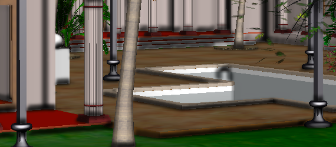
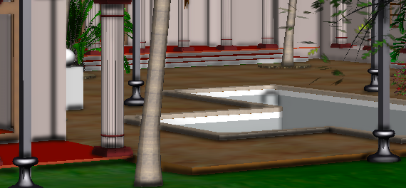

# NextVersion

## Ambient Occlusion Improvements

The ambient occlusion effect has undergone some quality improvements.

Changes:

- The shadows cast by ambient occlusion will decrease in size the more distant the geometry is.
- The maximum distance for applying ambient occlusion now defaults to 10,000 meters instead of 100 meters.
- The effect will now fade as it approaches the maximum distance.

Old effect, as shown below:



New effect, shown below:



For more details, see the new descriptions of the `texelStepSize` and `maxDistance` properties of [AmbientOcclusion.Props]($common).

## Transformer API

The synchronous `void`-returning overload of [IModelTransformer.initFromExternalSourceAspects]($transformer) has been deprecated.
It will still perform the old behavior synchronously until it is removed. It will now however return a `Promise` (which should be
awaited) if invoked with the an [InitFromExternalSourceAspectsArgs]($transformer) argument, which is necessary when processing
changes instead of the full source contents.

## Presentation

## Restoring Presentation tree state

It is now possible to restore previously saved Presentation tree state on component mount.

```ts
// Save current tree state
const { nodeLoader } = usePresentationTreeNodeLoader(args);
useEffect(() => exampleStoreTreeModel(nodeLoader.modelSource.getModel()), []);

// Restore tree state on component mount
const seedTreeModel = exampleRetrieveStoredTreeModel();
const { nodeLoader } = usePresentationTreeNodeLoader({ ...args, seedTreeModel });
```
