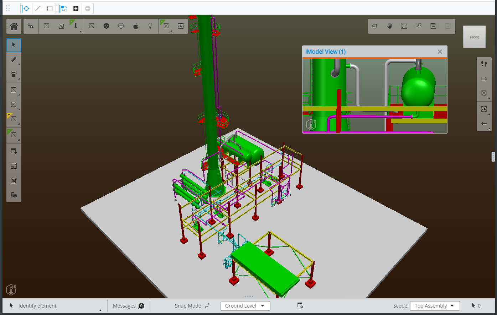

# NextVersion

## Simplified material creation

[RenderSystem.createMaterial]($frontend) presents an awkward API requiring the instantiation of several related objects to create even a simple [RenderMaterial]($common). It also requires an [IModelConnection]($frontend). It has been deprecated in favor of [RenderSystem.createRenderMaterial]($frontend), which accepts a single [CreateRenderMaterialArgs]($frontend) object concisely specifying only the properties of interest to the caller. For example, the following:

```ts
  const params = new RenderMaterial.Params();
  params.alpha = 0.5;
  params.diffuseColor = ColorDef.blue;
  params.diffuse = 0.4;

  const mapParams = new TextureMapping.Params({ textureWeight: 0.25 });
  params.textureMapping = new TextureMapping(texture, mapParams);
  const material = IModelApp.renderSystem.createMaterial(params, iModel);
```

Can now be expressed as follows (note no IModelConnection is required):

```ts
  const material = IModelApp.renderSystem.createRenderMaterial({
    alpha: 0.5,
    diffuse: { color: ColorDef.blue, weight: 0.4 },
    textureMapping: { texture, weight: 0.25 },
  });
```

## Obtain geometry from terrain and reality models

When terrain or reality models are displayed in a [Viewport]($frontend), their geometry is downloaded as meshes to create [RenderGraphic]($frontend)s. But those meshes can be useful for purposes other than display, such as analyzing geography or producing customized decorations. @itwin/core-frontend 3.1.0 introduces two related `beta` APIs for obtaining [Polyface]($core-geometry)s from reality models and terrain meshes:

- [TileGeometryCollector]($core-frontend), which specifies the level of detail, spatial volume, and other criteria for determining which tile meshes to obtain; and
- [GeometryTileTreeReference]($core-frontend), a [TileTreeReference]($core-frontend) that can supply [Polyface]($core-geometry) for its tiles.

A [GeometryTileTreeReference]($core-frontend) can be obtained from an existing [TileTreeReference]($core-frontend) via [TileTreeReference.createGeometryTreeReference]($core-frontend). You can then supply a [TileGeometryCollector]($core-frontend) to [GeometryTileTreeReference.collectTileGeometry]($core-frontend) to collect the polyfaces. Because tile contents are downloaded asynchronously, you will need to repeat this process over successive frames until [TileGeometryCollector.isAllGeometryLoaded]($core-frontend) evaluates `true`.

display-test-app provides [an example tool](https://github.com/iTwin/itwinjs-core/blob/master/test-apps/display-test-app/src/frontend/TerrainDrapeTool.ts) that uses these APIs to allow the user to drape line strings onto terrain and reality models.

## Draco compression

[Draco compression](https://codelabs.developers.google.com/codelabs/draco-3d) can significantly reduce the sizes of meshes and point clouds. iTwin.js has been enhanced to correctly decompress reality models, point clouds, and glTF models that contain draco-encoded data, reducing download time and bandwidth usage.

## Floating content views in AppUI

The [FloatingViewportContent]($appui-react) component has been added to support the display an IModel view within a modeless [ContentDialog]($appui-react). These "floating" viewports are displayed above the "fixed" viewports and below other UI items. See example `OpenViewDialogTool` in `ui-test-app` that opens a "floating" viewport in file [ImmediateTools.tsx](https://github.com/iTwin/itwinjs-core/blob/master/test-apps/ui-test-app/src/frontend/tools/ImmediateTools.tsx). See example below with floating content in dialog labeled "IModel View (1)".



## Font Workspaces

It is now possible to store and load fonts from a Font Workspace. See [Fonts]($docs/learning/backend/Fonts.md) for more details.
