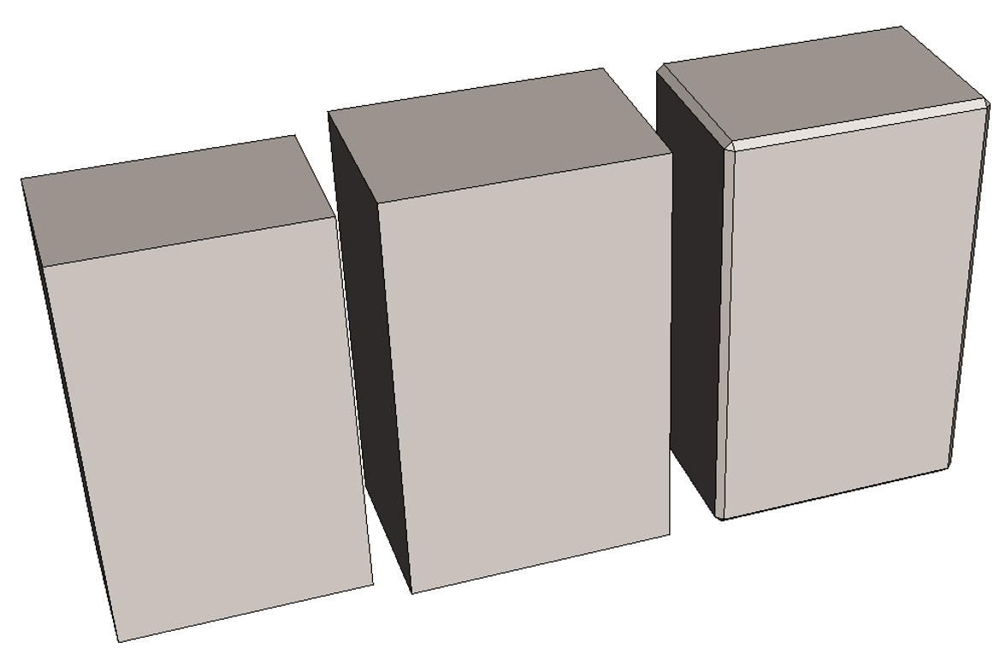
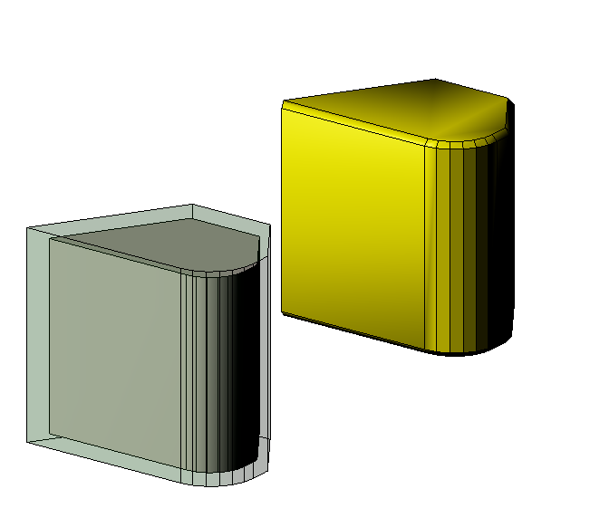

# NextVersion

Table of contents:

- [Updated minimum requirements](#updated-minimum-requirements)
  - [Node.js](#node-js)
  - [WebGL](#webgl)

## Updated minimum requirements

A new major release of iTwin.js affords us the opportunity to update our requirements to continue to provide modern, secure, and featureful libraries. Please visit our [Supported Platforms](../learning/SupportedPlatforms) documentation for a full breakdown.

### Node.js

Node 12 reached [end-of-life](https://github.com/nodejs/release#end-of-life-releases) in 2020, and Node 14 will do so shortly. iTwin.js 4.0 requires a minimum of Node 16.13.0, though we recommend using the latest long-term-support version.

### WebGL

Web browsers display 3d graphics using an API called [WebGL](https://en.wikipedia.org/wiki/WebGL), which comes in 2 versions: WebGL 1, released 11 years ago; and WebGL 2, released 6 years ago. WebGL 2 provides many more capabilities than WebGL 1. Because some browsers (chiefly Safari) did not provide support for WebGL 2, iTwin.js has maintained support for both versions, which imposed some limitations on the features and efficiency of its rendering system.

Over a year ago, support for WebGL 2 finally became [available in all major browsers](https://www.khronos.org/blog/webgl-2-achieves-pervasive-support-from-all-major-web-browsers). iTwin.js now **requires** WebGL 2 - WebGL 1 is no longer supported. This change will have no effect on most users, other than to improve their graphics performance. However, users of iOS will need to make sure they have upgraded to iOS 15 or newer to take advantage of WebGL 2 (along with the many other benefits of keeping their operating system up to date).

[IModelApp.queryRenderCompatibility]($frontend) will now produce [WebGLRenderCompatibilityStatus.CannotCreateContext]($webgl-compatibility) for a client that does not support WebGL 2.

### Mesh offset

The new static method `PolyfaceQuery.cloneOffsetMesh (inputMesh: IndexedPolyface, signedOffsetDistance: number, offsetOptions: OffsetMeshOptions)`
creates a mesh with facets offset by given distance.

The image with 3 boxes shows the basic concepts.   At left is the original box, size 3 x 5 in the large face and 2 deep   The middle is constructed by `cloneOffsetMesh` with offset of 0.15 and default options.   Note that it maintains the original sharp corners.   The right box is constructed with `chamferAngleBetweenNormals` of 80 degrees.    This says that when the original angle between normals of adjacent facets exceeds 80 degrees the corner should be chamfered.   This creates the slender chamfer faces along the edges and the triangles at the vertices.  The default 120 degree chamfer threshhold encourages corners to be extended to intersection rather than chamfered.

The second example shows results with a more complex cross section.  The lower left is the original (smaller, inside) mesh with the (transparent) offset mesh around it with all sharp corners.   At upper right the offset has chamfers, again due to setting the `chamferAngleBetweenNormals` to 120 degrees.
