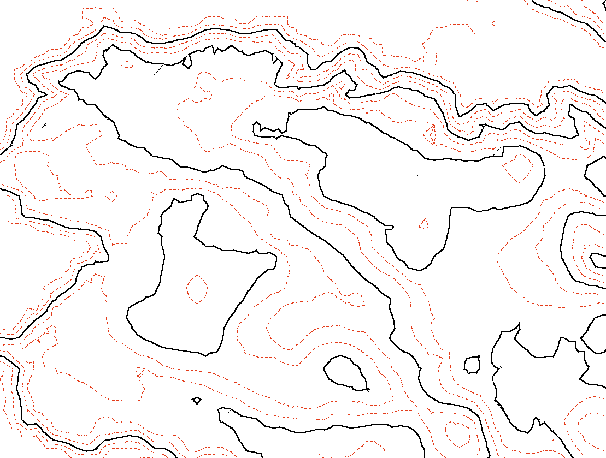

# NextVersion

Table of contents:

- [NextVersion](#nextversion)
  - [Revert timeline changes](#revert-timeline-changes)
  - [Display](#display)
    - [Instancing](#instancing)
    - [Overriding line color](#overriding-line-color)
    - [Context Reality model visibility](#context-reality-model-visibility)
    - [Contour Display](#contour-display)
  - [Interactive Tools](#interactive-tools)
    - [Element Locate](#element-locate)
  - [Presentation](#presentation)
    - [Calculated properties specification enhancements](#calculated-properties-specification-enhancements)
  - [Quantity](#quantity)
  - [API deprecations](#api-deprecations)
    - [@itwin/appui-abstract](#itwinappui-abstract)
    - [@itwin/core-backend](#itwincore-backend)
    - [@itwin/core-frontend](#itwincore-frontend)
    - [@itwin/core-quantity](#itwincore-quantity)

## Revert timeline changes

At present, the sole method to reverse a defective changeset is to remove it from the iModel hub, which can lead to numerous side effects. A preferable approach would be to reverse the changeset in the timeline and introduce it as a new changeset. Although this method remains intrusive and necessitates a schema lock, it is safer because it allows for the reversal to restore previous changes, ensuring that nothing is permanently lost from the timeline.

[BriefcaseDb.revertAndPushChanges]($backend) Allow to push a single changeset that undo all changeset from tip to specified changeset in history.

Some detail and requirements are as following.

- When invoking the iModel, it must not have any local modifications.
- The operation is atomic; if it fails, the database will revert to its previous state.
- The revert operation necessitates a schema lock (an exclusive lock on the iModel) because it does not lock each individual element affected by the revert.
- If no description is provided after a revert, a default description for the changeset will be created and pushed, which releases the schema lock.
- Schema changes are not reverted during SchemaSync, or they can be optionally skipped when SchemaSync is not utilized.

## Display

### Instancing

Some scenarios involve displaying the same basic graphic repeatedly. For example, imagine you are writing a [Decorator]($frontend) that displays stop signs at many intersections along a road network. You might create one [RenderGraphic]($frontend) for each individual stop sign and draw them all, but doing so would waste a lot of memory by duplicating the same geometry many times, and negatively impact your frame rate by invoking many draw calls.

WebGL provides [instanced rendering](https://webglfundamentals.org/webgl/lessons/webgl-instanced-drawing.html) to more efficiently support this kind of use case. You can define a single representation of the stop sign graphic, and then tell the renderer to draw it many times at different locations, orientations, and scales. iTwin.js now provides APIs that make it easy for you to create instanced graphics:

- [GraphicTemplate]($frontend) defines what the graphic should look like. You can obtain a template from [GraphicBuilder.finishTemplate]($frontend), [RenderSystem.createTemplateFromDescription]($frontend), or [readGltfTemplate]($frontend).
- [RenderInstances]($frontend) defines the set of instances of the template to draw. In addition to a [Transform]($geometry), each instance can also override aspects of the template's appearance like color and line width, along with a unique [Feature]($common) to permit each instance to behave as a discrete entity. You can create a `RenderInstances` using [RenderInstancesParamsBuilder]($frontend).
- [RenderSystem.createGraphicFromTemplate]($frontend) produces a [RenderGraphic]($frontend) from a graphic template and a set of instances.

`GraphicTemplate` and `RenderInstances` are both reusable - you can produce multiple sets of instances of a given template, and use the same set of instances with multiple different templates.

For the stop sign example described above, you might have a [glTF model](https://en.wikipedia.org/wiki/GlTF) representing a stop sign and an array containing the position of each stop sign. You could then use a function like the following to produce a graphic that draws the stop sign at each of those positions.

```ts
[[include:Gltf_Instancing]]
```

### Overriding line color

iTwin.js allows you to [dynamically override](https://www.itwinjs.org/learning/display/symbologyoverrides/) aspects of the appearance of geometry at display time. However, unlike [SubCategoryAppearance]($common) and [GeometryParams]($common), which can distinguish between "line color" and "fill color", [FeatureAppearance]($common) only provides a single color override that applies to both types of geometry.

To address this discrepancy, we've [added](https://github.com/iTwin/itwinjs-core/pull/7251) a way to dynamically override the color and transparency of linear geometry independently from the rest of the geometry. Linear geometry includes open curves, line strings, point strings, and the outlines of planar regions. [FeatureAppearance.lineRgb]($common) controls the color of linear geometry, and [FeatureAppearance.lineTransparency]($common) controls the transparency. Both of these properties can be `undefined`, in which case the existing `rgb` or `transparency` property affects linear geometry - just as it always has. Or, they can be `false`, indicating that no color/transparency override is applied to linear geometry. Or, they can specify a transparency value or `RgbColor` that applies only to linear geometry.

### Context Reality model visibility

Context reality models that have been attached using `DisplayStyleState.attachRealityModel`, can now be hidden by turning ON the `ContextRealityModel.invisible` flag.  Previous implementation requiered context reality models to be detached in order to hide it from the scene.

### Contour Display

A new rendering technique has been added to iTwin.js which allows a user to apply specific contour line renderings to subcategories within a scene.

iTwin.js now provides the following API to use this feature:

- [DisplayStyle3dSettings]($common) now has a `contours` property which contains all of the subcategories-to-styling association data necessary to enable this feature. That object is of type [ContourDisplay]($common).
- [ContourDisplay]($common) defines how contours are displayed in the iModel based on a list of [ContourGroup]($common) objects in the `groups` property. Whether or not contours will be displayed in the viewport is controlled by this object's `displayContours` property, which defaults to false.
- [ContourGroup]($common) describes an association of subcategories to contour styling. It contains a set of subcategory IDs titled `subCategories`. Those subcategories will have the contour styling within the same group's [Contour]($common) `contourDef` object applied to them.
- [Contour]($common) describes the rendering settings that apply to a specific set of subcategories within a [ContourGroup]($common). This actually describes stylings for two sets of contours: major and minor. These stylings are separate from each other. The minor contour occurs at a defined interval in meters. These intervals draw at a fixed height; they are not dependent on the range of the geometry to which they are applied. The major contour is dependent on the minor contour. The interval of its occurence is not measured directly in meters; rather its occurence is determined by the major interval count thusly: every nth contour will be styled as a major contour where n = the major interval count. For example, if you set this number to 1, every contour will be styled as a major contour. When it is 2, every other contour will be styled as a major contour, and so on. The properties describing how major and minor contours are styled are listed here:
  - `majorStyle` is the style that a major contour line will use. Defaults to an instantation of [ContourStyle]($common) using `pixelWidth` of 2 and default values for the other properties.
  - `minorStyle` is the style that a minor contour line will use. Defaults to an instantation of [ContourStyle]($common) using default values for the properties.
  - `minorInterval` is the interval for the minor contour occurrence in meters; these can be specified as fractional. Defaults to 1. If a value <= 0 is specified, this will be treated as 1 meter.
  - `majorIntervalCount` is the count of minor contour intervals that define a major interval (integer > 0). A value of 1 means no minor contours will be shown, only major contours. Defaults to 5. If a value < 1 is specified, this will be treated as 1. If a non-integer value is specified, it will be treated as if it were rounded to the nearest integer.
  - `showGeometry`, if true, shows underlying geometry along with the associated contours. If false, only shows the contours, not the underlying geometry. Defaults to true.
- [ContourStyle]($common) describes the style settings used by either a major or minor contour. It contains the following properties:
  - `color` is a color used by the major or minor contour of type [RgbColor]($common). Defaults to black.
  - `pixelWidth` is the width in pixels of a major or minor contour line, using range 1 to 8.5 in 0.5 increments. Defaults to 1.
  - `pattern` is the line pattern applied to a major or minor contour line of type [LinePixels]($common). Defaults to [LinePixels.Solid]($common).

Consult the following code for an example of enabling and configuring contour display in iTwin.js:

```ts
[[include:Setup_ContourDisplay]]
```

Here is a sample screenshot of applying some contour display settings to a terrain iModel:



## Interactive Tools

### Element Locate

After calling [ElementLocateManager.doLocate]($frontend), Reset may now be used to accept some elements that were obscured by another element. Previously Reset would only choose between visible elements within the locate aperture.


## Presentation

### Calculated properties specification enhancements

A new optional [`extendedData`]($docs/presentation/content/CalculatedPropertiesSpecification.md#attribute-extendeddata) attribute has been added to [calculated properties specification]($docs/presentation/content/CalculatedPropertiesSpecification.md). The attribute allows associating resulting calculated properties field with some extra information, which may be especially useful for dynamically created calculated properties.

## Quantity

- Add support for 'Ratio' format type (e.g. "1:2")
  - Example: Formatting a Ratio
  - Assuming that a `UnitsProvider` has been registered and initialized, here's how to format a ratio:

```ts
const ratioFormatProps: FormatProps = {
    type: "Ratio",
    ratioType: "OneToN",  // Formats the ratio in "1:N" form
    composite: {
        includeZero: true,
        units: [
            { name: "Units.HORIZONTAL_PER_VERTICAL" },
        ],
    },
};

const ratioFormat = new Format("Ratio");
ratioFormat.fromJSON(unitsProvider, ratioFormatProps).catch(() => {});
```

- Add support for unit inversion during unit conversion

- Change azimuth and bearing logic from working with east-based counterclockwise persisted values to working with north-based clockwise values.
- The previous applies to azimuthBase as well, if provided.

## API deprecations

### @itwin/appui-abstract

- `LayoutFragmentProps`, `ContentLayoutProps`, `LayoutSplitPropsBase`, `LayoutHorizontalSplitProps`, `LayoutVerticalSplitProps`, and `StandardContentLayouts` have been deprecated. Use the same APIs from `@itwin/appui-react` instead.

- `BackendItemsManager` is internal and should never have been consumed. It has been deprecated and will be removed in 5.0.0. Use `UiFramework.backstage` from `@itwin/appui-react` instead.

### @itwin/core-backend

- [IModelHost.snapshotFileNameResolver]($backend) and [FileNameResolver]($backend) have been deprecated. Make sure to provide resolved file path to [SnapshotConnection.openFile]($frontend).

### @itwin/core-frontend

- [SnapshotConnection.openRemote]($frontend) has been deprecated. Use [CheckpointConnection.openRemote]($frontend) to open a connection to an iModel within web application.

### @itwin/core-quantity

- Refactored `FormatType`, `ScientificType`, `ShowSignOption` from int enums to string enums and added `RatioType` as a string enum. Relevant toString functions, including [formatTypeToString]($quantity), [scientificTypeToString]($quantity), and [showSignOptionToString]($quantity), have been deprecated because they don't need serialization methods.

- [Parser.parseToQuantityValue]($quantity) have been deprecated. Use the existing method [Parser.parseQuantityString]($quantity) instead.
