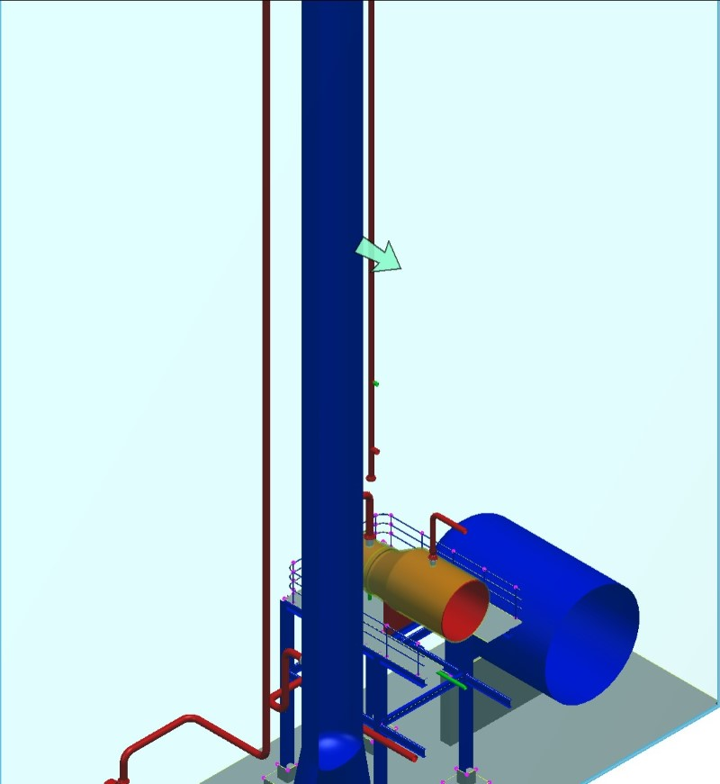
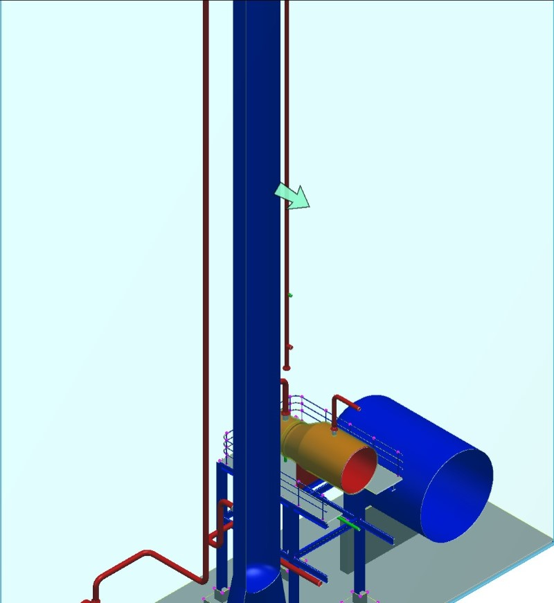
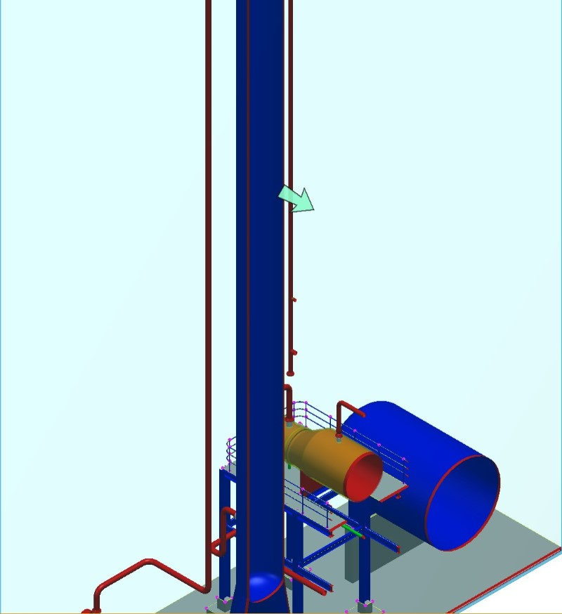

# NextVersion

Table of contents:

- [Geometry](#geometry)
  - [Clip any curve](#clip-any-curve)
- [ECSQL instance properties](#ecsql-instance-properties)
- [Node 20 support](#node-20-support)
- [Electron 27 and Electron 28 support](#electron-27-and-electron-28-support)
- [Element aspects require locking](#element-aspects-require-locking)
- [Display](#display)
  - [Colorizing clip intersections](#colorizing-clip-intersections)
  - [Thematic transparency](#thematic-transparency)
  - [Analysis style transparency](#analysis-style-transparency)

## Geometry

### Clip any curve

The new [ClipUtilities.clipAnyCurve]($core-geometry) clips any `CurvePrimitive`, `Path`, or `BagOfCurves` and any region including any `Loop`, `ParityRegion`, or `UnionRegion`. One just needs to pass `AnyCurve` and a `Clipper` and the functions collect portions of any curve that are within the clipper into an array of any curves and returns the array.

## ECSQL instance properties

ECSQL supports querying instance properties, which are any property in a class selected in ECSql or its derived classes.

[**ECSQL Instance Properties Documentation**](../learning/ECSQLTutorial/InstanceProps.md)

## Node 20 support

iTwin.js now officially supports Node 20 starting with LTS version of 20.9.0. Node 20 support is in addition to Node 18, not a replacement.

## Electron 27 and Electron 28 support

In addition to [already supported Electron versions](../learning/SupportedPlatforms.md#electron), iTwin.js now supports [Electron 27](https://www.electronjs.org/blog/electron-27-0) and [Electron 28](https://releases.electronjs.org/release/v28.0.0).

## Element aspects require locking

Inserting, updating or deleting an aspect now requires the exclusive lock be held on its element. This is a new requirement to prevent conflicts that may result in corrupt changesets. Before changes may be made to an element's aspects, you must now acquire its exclusive lock (see `IModelDb.LockControl.acquireLocks`).

## Display

### Colorizing clip intersections

Geometry which intersects clip volumes can now be colorized with [ClipStyle.intersectionStyle]($common). The images below illustrate this effect, first with the intersection style turned off, second with it turned on.

 

You can toggle this colorization on and off using [ClipStyle.colorizeIntersection]($common). The style of this colorization can be controled using [ClipStyle.intersectionStyle]($common) by defining a [ClipIntersectionStyle]($common). [ClipIntersectionStyle.color]($common) defines the color to apply to the intersecting geometry, and [ClipIntersectionStyle.width]($common) defines the number of pixels considered to be intersecting the clip volume, which will therefore be colorized. The image below illustrates an altered [ClipStyle.intersectionStyle]($common), with [ClipIntersectionStyle.color]($common) set to red, and [ClipIntersectionStyle.width]($common) set to 5.

### Thematic transparency

[ThematicDisplay]($common) colorizes surfaces in a view using a gradient produced from a list of [Gradient.KeyColor]($common)s and a margin color. Each of these colors has a transparency value. However, thematic display has always entirely ignored the gradient's transparency values, using the transparency of the surface itself instead.

Now, you can use [ThematicGradientSettings.transparencyMode]($common) to specify that the transparency of both the surface and the gradient color should be combined to produce the final transparency value.

### Analysis style transparency

An [AnalysisStyle]($common) colorizes surfaces in a view using a gradient produced from a list of [Gradient.KeyColor]($common)s and a margin color. These colors are intended to entirely override the color of every surface to which the style is applied. However, the transparency of the gradient colors has never been consistently applied. That oversight has now been addressed - the transparency of the surface is ignored in favor of the transparency of the gradient color.

Note: [ThematicGradientSettings.transparencyMode]($common) has no effect on analysis styles.
