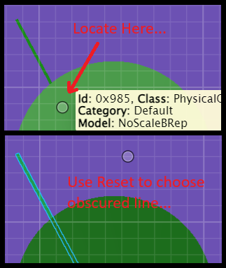

# NextVersion

Table of contents:

- [Revert timeline changes](#revert-timeline-changes)
- [Display](#display)
  - [Instancing](#instancing)
- [Interactive Tools](#interactive-tools)
  - [Element Locate](#element-locate)
- [Presentation](#presentation)
  - [Calculated properties specification enhancements](#calculated-properties-specification-enhancements)
- [Deprecations](#deprecations)
  - [@itwin/appui-abstract](#itwinappui-abstract)
  - [@itwin/core-frontend](#itwincore-frontend)

## Revert timeline changes

At present, the sole method to reverse a defective changeset is to remove it from the iModel hub, which can lead to numerous side effects. A preferable approach would be to reverse the changeset in the timeline and introduce it as a new changeset. Although this method remains intrusive and necessitates a schema lock, it is safer because it allows for the reversal to restore previous changes, ensuring that nothing is permanently lost from the timeline.

[BriefcaseDb.revertAndPushChanges]($backend) Allow to push a single changeset that undo all changeset from tip to specified changeset in history.

Some detail and requirements are as following.

- When invoking the iModel, it must not have any local modifications.
- The operation is atomic; if it fails, the database will revert to its previous state.
- The revert operation necessitates a schema lock (an exclusive lock on the iModel) because it does not lock each individual element affected by the revert.
- If no description is provided after a revert, a default description for the changeset will be created and pushed, which releases the schema lock.
- Schema changes are not reverted during SchemaSync, or they can be optionally skipped when SchemaSync is not utilized.

## Display

### Instancing

Some scenarios involve displaying the same basic graphic repeatedly. For example, imagine you are writing a [Decorator]($frontend) that displays stop signs at many intersections along a road network. You might create one [RenderGraphic]($frontend) for each individual stop sign and draw them all, but doing so would waste a lot of memory by duplicating the same geometry many times, and negatively impact your frame rate by invoking many draw calls.

WebGL provides [instanced rendering](https://webglfundamentals.org/webgl/lessons/webgl-instanced-drawing.html) to more efficiently support this kind of use case. You can define a single representation of the stop sign graphic, and then tell the renderer to draw it many times at different locations, orientations, and scales. iTwin.js now provides APIs that make it easy for you to create instanced graphics:

- [GraphicTemplate]($frontend) defines what the graphic should look like. You can obtain a template from [GraphicBuilder.finishTemplate]($frontend), [RenderSystem.createTemplateFromDescription]($frontend), or [readGltfTemplate]($frontend).
- [RenderInstances]($frontend) defines the set of instances of the template to draw. In addition to a [Transform]($geometry), each instance can also override aspects of the template's appearance like color and line width, along with a unique [Feature]($common) to permit each instance to behave as a discrete entity. You can create a `RenderInstances` using [RenderInstancesParamsBuilder]($frontend).
- [RenderSystem.createGraphicFromTemplate]($frontend) produces a [RenderGraphic]($frontend) from a graphic template and a set of instances.

`GraphicTemplate` and `RenderInstances` are both reusable - you can produce multiple sets of instances of a given template, and use the same set of instances with multiple different templates.

For the stop sign example described above, you might have a [glTF model](https://en.wikipedia.org/wiki/GlTF) representing a stop sign and an array containing the position of each stop sign. You could then use a function like the following to produce a graphic that draws the stop sign at each of those positions.

```ts
[[include:Gltf_Instancing]]
```
### Context Reality model visibility
Context reality models that have been attached using `DisplayStyleState.attachRealityModel`, can now be hidden by turning ON the `ContextRealityModel.invisible` flag.  Previous implementation requiered context reality models to be detached in order to hide it from the scene.

## Interactive Tools

### Element Locate

After calling [ElementLocateManager.doLocate]($frontend), Reset may now be used to accept some elements that were obscured by another element. Previously Reset would only choose between visible elements within the locate aperture.



## Presentation

### Calculated properties specification enhancements

A new optional [`extendedData`]($docs/presentation/content/CalculatedPropertiesSpecification.md#attribute-extendeddata) attribute has been added to [calculated properties specification]($docs/presentation/content/CalculatedPropertiesSpecification.md). The attribute allows associating resulting calculated properties field with some extra information, which may be especially useful for dynamically created calculated properties.

## Deprecations

### @itwin/appui-abstract

- `LayoutFragmentProps`, `ContentLayoutProps`, `LayoutSplitPropsBase`, `LayoutHorizontalSplitProps`, `LayoutVerticalSplitProps`, and `StandardContentLayouts` have been deprecated. Use the same APIs from `@itwin/appui-react` instead.

- `BackendItemsManager` is internal and should never have been consumed. It has been deprecated and will be removed in 5.0.0. Use `UiFramework.backstage` from `@itwin/appui-react` instead.

### @itwin/core-frontend

- [SnapshotConnection.openRemote]($frontend) is deprecated. To open iModel for web workflows use [CheckpointConnection.openRemote]($frontend) instead.
