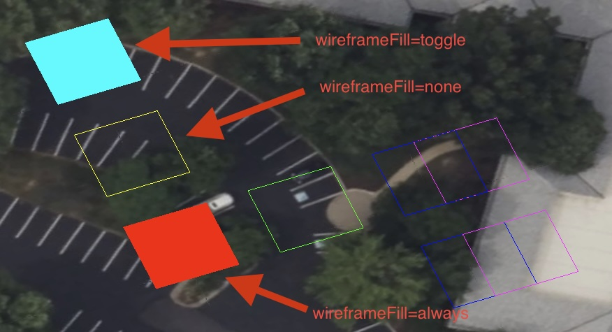
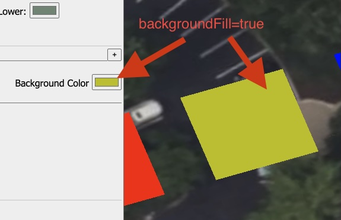
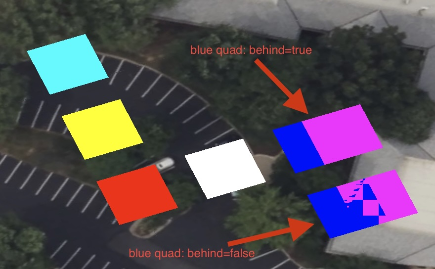

# NextVersion

- [@itwin/presentation-common](#itwinpresentation-common)
  - [Additions](#additions)
  - [Fixes](#fixes)
- [Display](#display)
  - [BENTLEY_materials_planar_fill](#bentley_materials_planar_fill)
- [@itwin/core-backend](#itwincore-backend)
  - [vacuum API](#vacuum)
  - [analyze API](#analyze)
  - [optimize API](#optimize)
  - [TextAnnotation render priorities](#textannotation-render-priorities)

## @itwin/presentation-common

### Additions

- Added `parentArrayField` and `parentStructField` attributes to `PropertiesField` class to allow easier navigation to parent fields when traversing content. The new properties, together with `parent` property, are mutually exclusive, i.e., only one of them can be defined at a time (a field can't be a struct member and an array item field at the same time).
- Added `getFieldByName` method to `ArrayPropertiesField` and `StructPropertiesField`.
  - For array field, the method returns items field if its name matches the given name.
  - For struct field, the method returns the member field with the given name, if any.

### Fixes

- Fixed content traverser (result of `createContentTraverser` call) not passing parent struct / array field names as `parentFieldName` to `IContentVisitor` methods.

## Display

### BENTLEY_materials_planar_fill

Support has been added for the proposed [BENTLEY_materials_planar_fill](https://github.com/CesiumGS/glTF/pull/90) glTF extension.

This allows iTwin.js to process and apply the above extension when loading glTF files. This means mesh primitives will be able to have planar fill display properties specified and respected in iTwin.js when loaded via glTF. The extension supports controlling whether meshes are filled in wireframe mode, whether they fill with the background color, and whether they render behind other coplanar geometry belonging to the same logical object.

When this extension is present on a material, iTwin.js will apply the appropriate fill flags to control the rendering appearance of the associated mesh geometry.

Here is an example of `wireframeFill` being applied to a test dataset:



Here is an example of `backgroundFill` being applied to a test dataset:



Here is an example of `behind` being applied to a test dataset:



## @itwin/core-backend

### Database Optimization APIs

Three new database optimization APIs have been added to maintain optimal query performance and iModel file size.

#### vacuum()

Reclaims unused space and defragments the database file.

```typescript
// After large deletions
briefcaseDb.vacuum();
```

#### analyze()

Updates SQLite query optimizer statistics.

```typescript
// After large data imports or schema changes
briefcaseDb.analyze();
```

#### optimize()

Performs both `vacuum()` and `analyze()` operations in sequence. This is the recommended way to optimize an iModel.

For convenience, optimization can be performed automatically when closing an iModel by using the `optimize` property of the `CloseIModelArgs`:

```typescript
// Automatically optimize when closing
briefcaseDb.close({ optimize: true });
```

Alternatively, call `optimize()` explicitly for more control over when optimization is needed:

```typescript
// Optimize before closing
briefcaseDb.performCheckpoint();  // Changes might still be in the WAL file
briefcaseDb.optimize();
briefcaseDb.saveChanges();

// Later close without re-optimizing
briefcaseDb.close();
```

### TextAnnotation render priorities

TextAnnotation elements now support custom render priorities for better control over z-ordering in 2D views. The new `renderPriority` option in [appendTextAnnotationGeometry]($backend) allows you to specify different priorities for annotation labels versus other annotation geometry (frame, leaders, etc.).

```typescript
import { appendTextAnnotationGeometry } from "@itwin/core-backend";

// Set different priorities for text labels and annotation geometry
appendTextAnnotationGeometry({
  annotationProps,
  layout,
  textStyleResolver,
  scaleFactor,
  builder,
  categoryId,
  renderPriority: {
    annotationLabels: 100,  // Priority for text block and fill
    annotation: 50          // Priority for frame, leaders, and other geometry
  }
});
```

The render priority values are added to [SubCategoryAppearance.priority]($common) to determine the final display priority. This allows text annotations to render correctly relative to other 2D graphics. Note that render priorities have no effect in 3D views.
