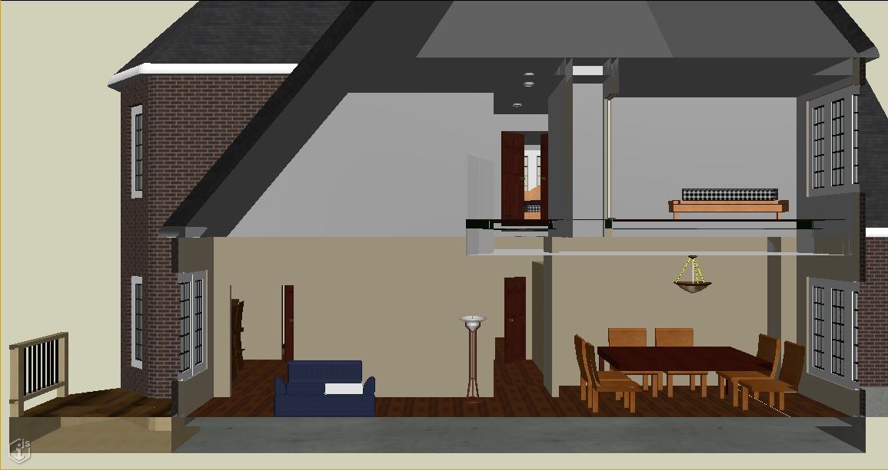
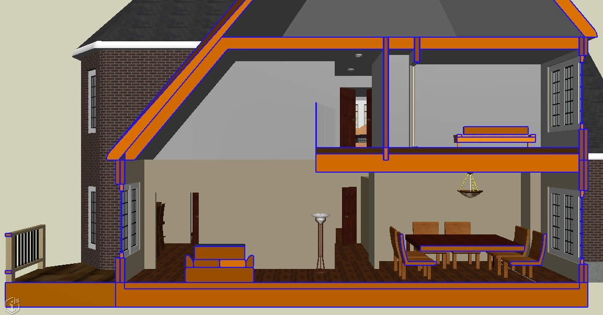

# NextVersion

## Section-cut graphics

A [DisplayStyleState]($frontend) can now be configured to produce section-cut graphics from the view's [ClipVector]($geometry-core). In the image below, a clipping plane has been applied to produce a cross-section view of a house. Note that all of the geometry intersecting the clipping plane appears to be solid, whereas in the real world we'd expect things like walls, floors, and tables to be solid throughout:



Now, every [DisplayStyleSettings]($common) has a [ClipStyle]($common) that specifies how the clipping planes should affect the view. [ClipStyle.produceCutGeometry]($common) specifies that additional graphics should be produced for solid geometry intersecting the clipping planes, causing solid objects to continue to appear solid when sliced by a clipping plane, as shown below:


A [ClipStyle]($common) can also specify:
  - A [CutStyle]($common) controlling how the section-cut geometry is displayed by overriding:
    - Aspects of the [ViewFlags]($common) with which it is drawn;
    - The edge symbology via [HiddenLine.Settings]($common); and
    - The color, transparency, etc of the geometry via [FeatureAppearance]($common).
  - Overrides for the color, line pattern, and locatability of geometry lying inside and/or outside of the clipping planes, via [ClipAppearance]($common).

In the image below, the section-cut graphics are drawn in orange with visible blue edges as specified by the [CutStyle]($common).



## Tile compression

[IModelHostConfiguration.compressCachedTiles]($backend) specifies whether tiles uploaded to blob storage should be compressed using gzip. Previously, it defaulted to `false` if omitted. The default has now been switched to `true`. Compressing tiles conserves bandwidth; the tiles are transparently and efficiently decompressed by the browser.

## Changes to display style excluded elements

[DisplayStyleSettings.excludedElements]($common) allows a display style to specify a set of elements that should not be drawn. Previously, this set was always persisted to the database as an array of element Ids, and represented in JSON and in memory as a `Set<string>`. However, element Ids tend to be long strings (at least 13 characters), and sets of excluded elements can occasionally grow quite large. To reduce the amount of data associated with these sets:
  * They are now always persisted to the database as a [CompressedId64Set]($bentleyjs-core).
  * The type of [DisplayStyleSettingsProps.excludedElements]($common) has changed from `Id64Array` to `Id64Array | CompressedId64Set`.
  * [DisplayStyleSettings.excludedElements]($common) - a `Set<string>` - has been deprecated in favor of [DisplayStyleSettings.excludedElementsIds]($common) - an [OrderedId64Iterable]($bentleyjs-core).
  * [IModelDb.views.getViewStateData]($backend) and [ElementLoadProps]($backend) allow the caller to specify whether the Ids should be returned in compressed (string) form or as an uncompressed array; by default, they are uncompressed.
  * [IModelConnection.views.load]($frontend) will always use the compressed representation of the Ids.

To adjust code that uses [DisplayStyleSettings.excludedElements]($common), given `settings: DisplayStyleSettings`:
```ts
  settings.excludedElements.add(id); // Replace this...
  settings.addExcludedElements(id); // ...with this.

  settings.excludedElements.delete(id); // Replace this...
  settings.dropExcludedElements(id); // ...with this.

  settings.excludedElements.clear(); // Replace this...
  settings.clearExcludedElements(); // ...with this.

  for (const id of settings.excludedElements) { } // Replace this...
  for (const id of settings.excludedElementIds) { } // ...with this.
```

Note that [DisplayStyleSettings.addExcludedElements]($common) and [DisplayStyleSettings.dropExcludedElements]($common) can accept any number of Ids. If you have multiple Ids, prefer to pass them all at once rather than one at a time - it is more efficient.

## Breaking API changes

* The union type [Matrix3dProps]($geometry-core) inadvertently included [Matrix3d]($geometry-core). "Props" types are wire formats and so must be pure JavaScript primitives. To fix compilation errors where you are using `Matrix3d` where a `Matrix3dProps` is expected, simply call [Matrix3d.toJSON]($geometry-core) on your Matrix3d object. Also, since [TransformProps]($geometry-core) includes Matrix3dProps, you may need to call [Transform.toJSON]($geometry-core) on your Transform objects some places too.

* The type of [Texture.data]($backend) has been corrected from `string` to `Uint8Array` to match the type in the BIS schema. If you get compilation errors, simply remove calls to `Buffer.from(texture.data, "base64")` for read, and `texture.data.toString("base64")` if you create texture objects.

## Updated version of Electron

Updated version of electron used from 8.2.1 to 10.1.3. Note that Electron is specified as a peer dependency in the iModel.js stack - so it's recommended but not mandatory that applications migrate to this electron version.

## Globe location tool fixes

The globe location tools now will properly use GCS reprojection when navigating. Previously, navigating to certain cartographic locations within the iModel extents could be slightly inaccurate.

The tools affected are:

* [ViewGlobeSatelliteTool]($frontend)
* [ViewGlobeBirdTool]($frontend)
* [ViewGlobeLocationTool]($frontend)
* [ViewGlobeIModelTool]($frontend)

The [ViewGlobeLocationTool]($frontend) has been further improved to navigate better across long distances when using plane mode.

There is now a method called `lookAtGlobalLocationFromGcs` on [ViewState3d]($frontend). This method behaves exactly like `lookAtGlobalLocation` except that is async and uses the GCS to reproject the location.

[ViewState3d]($frontend) also has GCS versions of these methods:

* `rootToCartographicFromGcs` behaves like `rootToCartographic` except it is async and uses the GCS to reproject the location.
* `cartographicToRootFromGcs` behaves like `cartographicToRoot` except it is async and uses the GCS to reproject the location.

## Presentation

### Formatted property values in ECExpressions

ECExpressions now support formatted property values. `GetFormattedValue` function can be used in ECExpressions to get formatted value of the property. This adds ability to filter instances by some formatted value:
```
GetFormattedValue(this.Length, "Metric") = "10.0 m"
```
