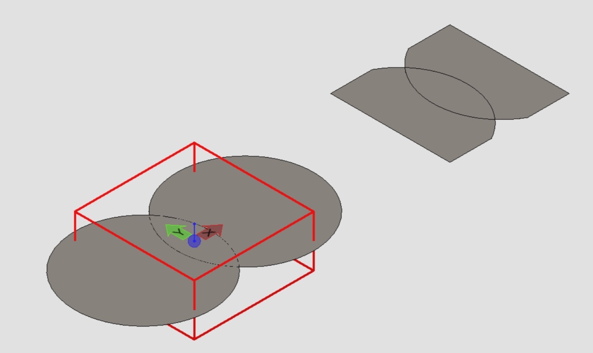
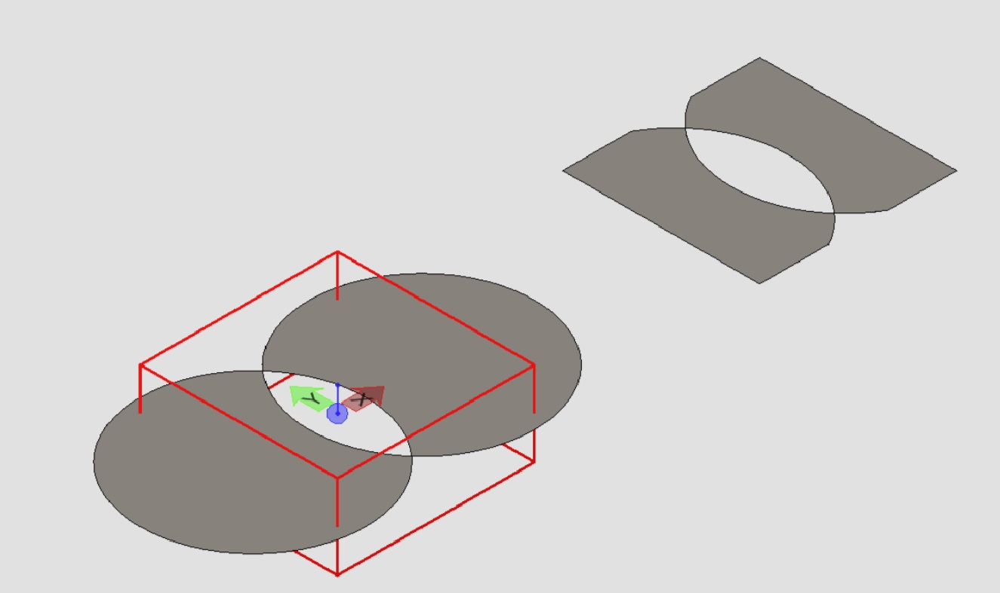

# NextVersion

Table of contents:

- [Geometry](#geometry)
  - [Range Tree Search](#range-tree-search)

## Geometry

### Range tree search

<!-- The new method [ClipUtilities.clipAnyCurve]($core-geometry) clips the input curve or region. One just needs to pass an [AnyCurve]($core-geometry) and a [Clipper]($core-geometry), and the method returns the clipped curves or regions that lie inside the clipper.

Here is an example of clipping a union region:

and an example of clipping a parity region:

### Drape region onto mesh

The new method [PolyfaceClip.drapeRegion]($core-geometry) computes the portion of the input [Polyface]($core-geometry) that lies inside the clipper generated by sweeping the input [AnyRegion]($core-geometry) along a direction. For example, the red polygon below is swept downward onto the white mesh, and the green mesh is returned:

 -->