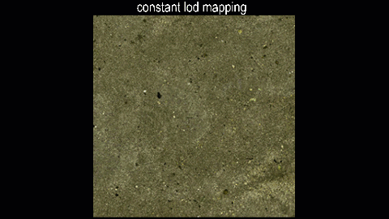

# NextVersion

Table of contents:

- [Updated minimum requirements](#updated-minimum-requirements)
  - [Node.js](#nodejs)
  - [WebGL](#webgl)
  - [Electron](#electron)
- [Geometry](#geometry)
  - [Mesh offset](#mesh-offset)
  - [Mesh intersection with ray](#mesh-intersection-with-ray)
- [Display](#display)
  - [glTF bounding boxes](#gltf-bounding-boxes)
- [Presentation](#presentation)
  - [Active unit system](#active-unit-system)
  - [Hierarchy level filtering and limiting](#hierarchy-level-filtering-and-limiting)
  - [Stopped "eating" errors on the frontend](#stopped-eating-errors-on-the-frontend)
  - [Handling of long-running requests](#handling-of-long-running-requests)
  - [Dependency updates](#dependency-updates)

## Updated minimum requirements

A new major release of iTwin.js affords us the opportunity to update our requirements to continue to provide modern, secure, and featureful libraries. Please visit our [Supported Platforms](../learning/SupportedPlatforms) documentation for a full breakdown.

### Node.js

Node 12 reached [end-of-life](https://github.com/nodejs/release#end-of-life-releases) in 2020, and Node 14 as well as Node 16 will do so shortly. iTwin.js 4.0 requires a minimum of Node 18.12.0, though we recommend using the latest long-term-support version.

### WebGL

Web browsers display 3d graphics using an API called [WebGL](https://en.wikipedia.org/wiki/WebGL), which comes in 2 versions: WebGL 1, released 11 years ago; and WebGL 2, released 6 years ago. WebGL 2 provides many more capabilities than WebGL 1. Because some browsers (chiefly Safari) did not provide support for WebGL 2, iTwin.js has maintained support for both versions, which imposed some limitations on the features and efficiency of its rendering system.

Over a year ago, support for WebGL 2 finally became [available in all major browsers](https://www.khronos.org/blog/webgl-2-achieves-pervasive-support-from-all-major-web-browsers). iTwin.js now **requires** WebGL 2 - WebGL 1 is no longer supported. This change will have no effect on most users, other than to improve their graphics performance. However, users of iOS will need to make sure they have upgraded to iOS 15 or newer to take advantage of WebGL 2 (along with the many other benefits of keeping their operating system up to date).

[IModelApp.queryRenderCompatibility]($frontend) will now produce [WebGLRenderCompatibilityStatus.CannotCreateContext]($webgl-compatibility) for a client that does not support WebGL 2.

### Electron

Electron versions from 14 to 17 reached their end-of-life last year, and for this reason, support for these versions was dropped. To be able to drop Node 16, Electron 22 was also dropped. iTwin.js now supports only Electron 23.

## Geometry

### Mesh offset

The new static method [PolyfaceQuery.cloneOffset]($core-geometry) creates a mesh with facets offset by a given distance. The image below illustrates the basic concepts.

At left is the original box, size 3 x 5 in the large face and 2 deep. The middle is constructed by `cloneOffset` with offset of 0.15 and default options. Note that it maintains the original sharp corners. The right box is constructed with [OffsetMeshOptions.chamferAngleBetweenNormals]($core-geometry) of 80 degrees. This specifies that when the original angle between normals of adjacent facets exceeds 80 degrees the corner should be chamfered, creating the slender chamfer faces along the edges and the triangles at the vertices. The default 120 degree chamfer threshold encourages corners to be extended to intersection rather than chamfered.

The image below illustrates results with a more complex cross section.

The lower left is the original (smaller, inside) mesh with the (transparent) offset mesh around it with all sharp corners. At upper right the offset has chamfers, again due to setting the `chamferAngleBetweenNormals` to 120 degrees.

### Mesh intersection with ray

New functionality computes the intersection(s) of a [Ray3d]($core-geometry) with a [Polyface]($core-geometry). By default, [PolyfaceQuery.intersectRay3d]($core-geometry) returns a [FacetLocationDetail]($core-geometry) for the first found facet that intersects the infinite line parameterized by the ray. A callback can be specified in the optional [FacetIntersectOptions]($core-geometry) parameter to customize intersection processing, e.g., to filter and collect multiple intersections. Other options control whether to populate the returned detail with interpolated auxiliary vertex data: normals, uv parameters, colors, and/or the barycentric scale factors used to interpolate such data.

There is also new support for intersecting a `Ray3d` with a triangle or a polygon. [BarycentricTriangle.intersectRay3d]($core-geometry) and [BarycentricTriangle.intersectSegment]($core-geometry) return a [TriangleLocationDetail]($core-geometry) for the intersection point of the plane of the triangle with the infinite line parameterized by a ray or segment. Similarly, [PolygonOps.intersectRay3d]($core-geometry) returns a [PolygonLocationDetail]($core-geometry) for the intersection point in the plane of the polygon. Both returned detail objects contain properties classifying where the intersection point lies with respect to the triangle/polygon, including `isInsideOrOn` and closest edge data.

## Display

### glTF bounding boxes

The exisiting [readGltfGraphics]($frontend) function returns an opaque [RenderGraphic]($frontend). A new [readGltf]($frontend) function has been added that produces a [GltfGraphic]($frontend) that - in addition to the `RenderGraphic` - includes the bounding boxes of the glTF model in local and world coordinates.

## Presentation

### Active unit system

[PresentationManager]($presentation-frontend) has a way to set active unit system either through props when initializing ([PresentationManagerProps.activeUnitSystem]($presentation-frontend)) or directly through a setter ([PresentationManager.activeUnitSystem]($presentation-frontend)). Both of these ways have been deprecated in favor of using [QuantityFormatter.activeUnitSystem]($core-frontend) (access `QuantityFormatter` through `IModelApp.quantityFormatter`) to avoid asking consumers set the active unit system in two places. For the time being, while we keep the deprecated unit system setters on the presentation manager, they act as an override to [QuantityFormatter.activeUnitSystem]($core-frontend), but the latter is now used by default, so setting active unit system on presentation manager is not necessary any more.

### Constant LOD mapping mode

Constant LOD mapping mode is a technique that dynamically calculates texture cordinates in the GPU to keep the texture near a certain size on the screen, thus preserving the level of detail no matter what the zoom level.  It blends from one size of the texture to another as the view is zoomed in or out so that the change is smooth.

You can create a [RenderMaterial]($common) which uses constant lod mapping on the frontend via [RenderSystem.createRenderMaterial]($frontend) by setting useConstantLod to true in [MaterialTextureMappingProps]($frontend) and optionally specifying its parameters via constantLodParams (see [TextureMapping.ConstantLodParamProps]($frontend)).

You can also have a normal map use constant lod mapping by setting useConstantLod in its properties via [MaterialTextureMappingProps.normalMapParams]($frontend) in your [CreateRenderMaterialArgs.textureMapping]($frontend).

It is thus possible to have a pattern map which uses constant lod mapping and a normal map which uses some other texture mapping mode or visa versa.

To create a [RenderMaterialElement]($backend) with a pattern map which uses constant lod mapping on the backend, use [RenderMaterialElement.insert]($backend) or [RenderMaterialElement.create]($backend). Pass in a patternMap with a [TextureMapProps]($common) which has pattern_useConstantLod set to true and optionally specify any or all of the pattern_constantLod_* properties.

To create a [RenderMaterialElement]($backend) with a normal map which uses constant lod mapping on the backend, use [RenderMaterialElement.insert]($backend) or [RenderMaterialElement.create]($backend). Pass the normal map in [RenderMaterialElementParams.normalMap]($backend) and turn on the useConstantLod flag in its NormalFlags property.

The image below illustrates the effects of constant lod mapping.

     

### Hierarchy level filtering and limiting

Two new features have been made available to help working with very large hierarchies - hierarchy level filtering and limiting. Filtering was already available since `3.6` and has been promoted to `@beta`, limiting has been newly added as `@beta`. See [hierarchy filtering and limiting page](../presentation/hierarchies/FilteringLimiting.md) for more details.

### Stopped "eating" errors on the frontend

The [PresentationManager]($presentation-frontend) used to "eat" errors and return default value instead of re-throwing and exposing them to consumers. This made it impossible for consumer code to know that an error occurred, which could cause it to make wrong decisions. The decision has been re-considered and now Presentation manager lets consumers catch the errors. This affects the following APIs:

- [PresentationManager.getNodes]($presentation-frontend)
- [PresentationManager.getNodesAndCount]($presentation-frontend)
- [PresentationManager.getContent]($presentation-frontend)
- [PresentationManager.getContentAndSize]($presentation-frontend)
- [PresentationManager.getPagedDistinctValues]($presentation-frontend)
- [PresentationManager.getDisplayLabelDefinitions]($presentation-frontend)

Consumers of these APIs should make sure they're wrapped with try/catch blocks and the errors are handled appropriately.

### Handling of long-running requests

The timeouts' strategy used for Presentation RPC has been changed.

Previously, the backend would return a "timeout" status if creating the response took more than 90 seconds (or as configured through [PresentationPropsBase.requestTimeout]($presentation-backend)). The frontend, upon receiving such a status, would repeat the request 5 times before propagating the timeout to the requestor on the frontend. This means that changing the timeout on the backend affects how long in total the frontend waits. By default that was 5 times 90 seconds, so 7.5 minutes in total.

Now, the two timeout configs on the backend and the frontend have been separated. The timeout on the frontend is set through [PresentationManagerProps.requestTimeout]($presentation-frontend) and defaults to 10 minutes. Presentation manager will repeat the RPC request as many times as needed to wait at least 10 minutes until returning the "timeout" response to the requestor. With this change the timeout configuration on the backend becomes less important as it merely affects how often the frontend will have to repeat the request. It can still be changed through [PresentationPropsBase.requestTimeout]($presentation-backend), but the default value has been reduced to 5 seconds.

### Use content modifiers on nested content

Previously, the [calculated](../presentation/content/ContentModifier.md#attribute-calculatedproperties) and [related properties](../presentation/content/ContentModifier.md#attribute-relatedproperties) defined in [content modifiers](../presentation/content/ContentModifier.md) were only applied on directly loaded instances' content. Occasionally, there is a need to request calculated and/or related properties to be loaded for specific instances in all situations, no matter if their content is loaded directly or indirectly. Previously that was only possible by chaining [related properties](../presentation/content/ContentModifier.md#attribute-relatedproperties) and [nested related properties](../presentation/content/RelatedPropertiesSpecification.md#attribute-nestedrelatedproperties) attributes. Now the content modifier rule has an attribute [`applyOnNestedContent`](../presentation/content/ContentModifier.md#attribute-applyonnestedcontent) which indicates if the modifier should be used on nested content. This removes the need to have duplicate [related properties specifications](../presentation/content/RelatedPropertiesSpecification.md) in those situations.

### Dependency updates

In addition to upgrading iTwin.js core dependencies to `4.0`, there are some other notable upgrades:

- Support for React 18 (keep support of React 17 too).
- Upgrade [iTwinUI](https://github.com/iTwin/iTwinUI) from v1 to v2.
- `@itwin/presentation-backend`, `@itwin/presentation-common` and `@itwin/presentation-frontend` have new peer dependency `@itwin/ecschema-metadata`.
