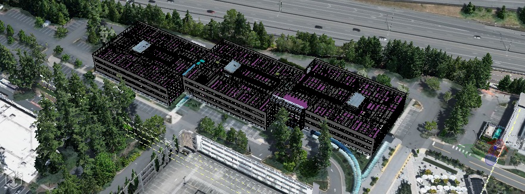
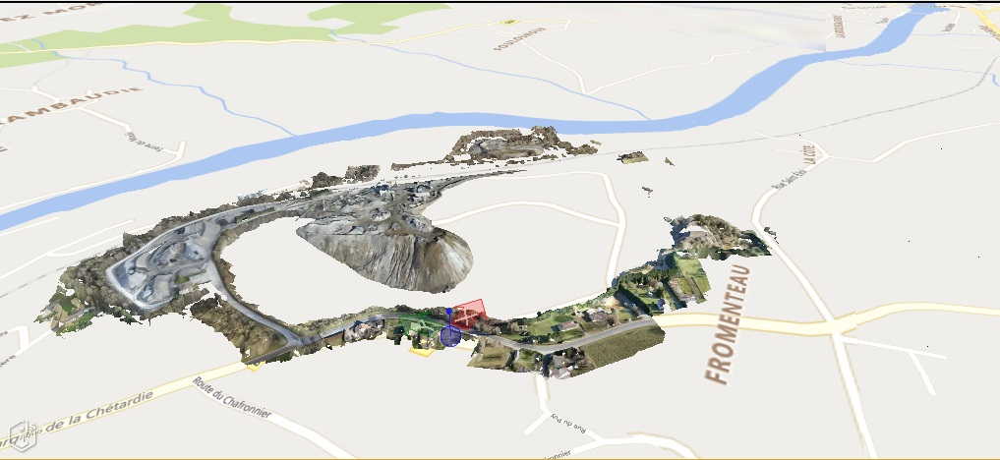
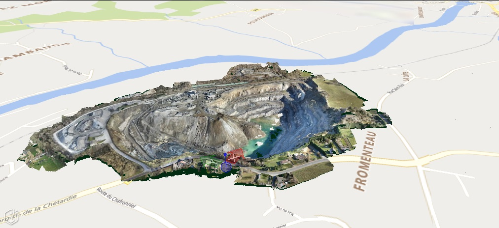

# 2.13.0 Change Notes

## The iModel.js Project Is Renamed iTwin.js

The version begins the process of renaming our project from **iModel.js** to **iTwin.js** to better reflect its purpose as the *platform for infrastructure digital twins*.

iModels are of course a big part of iTwins, so much of the api remains iModel-centric, and many packages within this repository are appropriately named with the `imodeljs` prefix. But, many parts that don't have a direct relationship to iModels will use the term iTwin going forward to avoid confusion.

The full conversion will be made gradually and incrementally, and will likely take several major release cycles to complete. We will not rename packages, classes, methods, etc. unless they are substantially replaced. That may leave some permanent historical vestiges of this transition, but as they say, c'est la vie.

This version begins the process by redirecting `www.imodeljs.org` to `www.itwinjs.org`, and updating references to the project name in markdown files.

## Breaking API Changes

### Quantity package

The alpha interface `ParseResult` has changed to `QuantityParserResult` which can either be a `ParseQuantityError` or a `ParsedQuantity`.
New static type guards `Parser.isParsedQuantity` and `Parser.isParseError` can be used to coerce the result into the appropriate type.

The alpha `UnitConversionSpec` interface now requires a "system" property that can be used during parsing to help determine the unit to parse the value.

### Frontend package

The alpha class `QuantityFormatter` now registers its own standard `QuantityTypeDefinitions` during initialization. `CustomQuantityTypeDefinitions` must now be registered to support additional `QuantityTypes`. This replaces the use of `FormatterParserSpecsProvider` to provide custom quantity types. Removed koq methods that were never implemented.

### IModelHostConfiguration.applicationType

The type of the internal member `IModelHostConfiguration.applicationType` had a redundant declaration in `IModelHost.ts`. It is now correctly declared to be of type `IModelJsNative.ApplicationType`. The names of the members were the same, so this will not likely cause problems.

### IModelTransformer and IModelExporter APIs are now async

The *export* methods of [IModelExporter]($backend) and the *process* methods of [IModelTransformer]($backend) are now `async`. This is a breaking API change.
While exporting and transforming should generally be considered *batch* operations, changing these methods to `async` makes progress reporting and process health monitoring much easier. This is particularly important when processing large iModels.

To react to the changes, add an `await` before each `IModelExporter.export*` and `IModelTransformer.process*` method call and make sure they are called from within an `async` method. No internal logic was changed, so that should be the only changes required.

## GPU memory limits

The [RenderGraphic]($frontend)s used to represent a [Tile]($frontend)'s contents consume WebGL resources - chiefly, GPU memory. If the amount of GPU memory consumed exceeds that available, the WebGL context will be lost, causing an error dialog to be displayed and all rendering to cease. The [TileAdmin]($frontend) can now be configured with a strategy for managing the amount of GPU memory consumed and avoiding context loss. Each strategy defines a maximum amount of GPU memory permitted to be allocated to tile graphics; when that limit is exceeded, graphics for tiles that are not currently being displayed by any [Viewport]($frontend) are discarded one by one until the limit is satisfied or no more tiles remain to be discarded. Graphics are discarded in order from least-recently- to most-recently-displayed, and graphics currently being displayed will not be discarded. The available strategies are:

- "default" - a "reasonable" amount of GPU memory can be consumed.
- "aggressive" - a conservative amount of GPU memory can be consumed.
- "relaxed" - a generous amount of GPU memory can be consumed.
- "none" - an unbounded amount of GPU memory can be consumed - no maximum is imposed.

The precise amount of memory permitted by each strategy varies based on whether or not the client is running on a mobile device; see [TileAdmin.mobileGpuMemoryLimits]($frontend) and [TileAdmin.nonMobileGpuMemoryLimits]($frontend) for precise values. The application can also specify an exact amount in number of bytes instead.

The limit defaults to "default" for mobile devices and "none" for non-mobile devices. To configure the limit when calling [IModelApp.startup]($frontend), specify [TileAdmin.Props.gpuMemoryLimits]($frontend). For example:

```ts
  IModelApp.startup({ tileAdmin: TileAdmin.create({ gpuMemoryLimits: "aggressive" }) });
```

Separate limits for mobile and non-mobile devices can be specified at startup if desired; the appropriate limit will be selected based on the type of device the client is running on:

```ts
  IModelApp.startup({ tileAdmin: TileAdmin.create({
    gpuMemoryLimits: {
      mobile: "default",
      nonMobile: "relaxed",
    }),
  });
```

To adjust the limit after startup, assign to [TileAdmin.gpuMemoryLimit]($frontend).

This feature replaces the `@alpha` `TileAdmin.Props.mobileExpirationMemoryThreshold` option.

## IModelHost and IModelApp Initialization Changes

Initialization processing of iTwin.js applications, and in particular the order of individual steps for frontend and backend classes has been complicated and vague, involving several steps that vary depending on application type and platform. This release attempts to clarify and simplify that process, while maintaining backwards compatibility. In general, if your code uses [IModelHost.startup]($backend) and [IModelApp.startup]($frontend) for web visualization, it will continue to work without changes. However, for native (desktop and mobile) apps, some refactoring may be necessary. See [IModelHost documentation](../learning/backend/IModelHost.md) for appropriate backend initialization, and [IModelApp documentation](../learning/frontend/IModelApp.md) for frontend initialization.

The `@beta` API's for desktop applications to use Electron via the `@bentley/electron-manager` package have been simplified substantially. Existing code will need to be adjusted to work with this version. The class `ElectronManager` has been removed, and it is now replaced with the classes `ElectronHost` and `ElectronApp`.

To create an Electron application, you should initialize your frontend via:

```ts
  import { ElectronApp } from "@bentley/electron-manager/lib/ElectronFrontend";
  ...
  await ElectronApp.startup();
```

And your backend via:

```ts
  import { ElectronHost } from "@bentley/electron-manager/lib/ElectronBackend";
  ...
  await ElectronHost.startup();
```

Likewise, to create an iOS application, you should initialize your frontend via:

```ts
  import { IOSApp } from "@bentley/mobile-manager/lib/MobileFrontend";
  ...
  await IOSApp.startup();
```

And your backend via:

```ts
  import { IOSHost } from "@bentley/mobile-manager/lib/MobileBackend";
  ...
  await IOSHost.startup();
```

Both frontend and backend `startup` methods take optional arguments to customize the App/Host environments.

## ProcessDetector API

It is frequently necessary to detect the type of JavaScript process currently executing. Previously, there were several ways (sometimes redundant, sometimes conflicting) to do that, depending on the subsystem being used. This release attempts to centralize process classification into the class [ProcessDetector]($bentley) in the `@bentleyjs-core` package. All previous methods for detecting process type have been deprecated in favor of `ProcessDetector`. The deprecated methods will likely be removed in version 3.0.

## Common table expression support in ECSQL

CTE are now supported in ECSQL. For more information read [Common Table Expression](../learning/CommonTableExp.md)

## Planar clip masks

Planar clip masks provide a two and a half dimensional method for masking the regions where the background map, reality models and BIM geometry overlap. A planar clip mask is described by [PlanarClipMaskProps]($common).A planar clip mask may be applied to a contexual reality model as a [ContextRealityModelProps.planarClipMask]($common) to the background map as [BackgroundMapProps.planarClipMask]($common) or as an override to attached reality models with the [DisplayStyleSettingsProps.planarClipOvr]($common) array of [DisplayStyleRealityModelPlanarClipMaskProps]($common).   The planar clip mask geometry is not required to be planar as the masks will be generated from their projection to the X-Y plane, therefore any 3D model or reality model can be used to generate a planar clip mask.

The [PlanarClipMaskProps.mode]($common) specifies how the mask geometry is collected.  [PlanarClipMaskMode]$(common) includes collection of masks by models, subcategories, elements (included or excluded) or by a priority scheme that clips against other models with a higher priority.

### By masking a reality model with a BIM model we can display the BIM model without the overlapping reality model




### By masking the background map terrain with the reality model we can display the current state of the quarry without intrusive terrain




### Planar Clip Mask Transparency

Planar clip masks support transparency.  If a mask is not transparent then the masked geometry is omitted completely, if transparency is included then increasing the transparency will decrease the masking and increase a translucent blending of the masked geometry.  A transparency value of 1 would indicate no masking.  If no transparency is included then the transparency value from the mask elements is used.  In the image below a transparent mask is applied to the reality model to show the underground tunnel.


## Presentation

### Highlighting members of GroupInformationElement

Presentation rules used by [HiliteSetProvider]($presentation-frontend) have been modified to return geometric elements grouped by *BisCore.GroupInformationElement* instances.

### Setting up default formats

A new feature was introduced, which allows supplying default unit formats to use for formatting properties that don't have a presentation unit for requested unit system. The formats are set when initializing [Presentation]($presentation-backend) and passing `PresentationManagerProps.defaultFormats`.
Example:

```ts
Presentation.initialize({
  defaultFormats: {
    length: {
      unitSystems: [PresentationUnitSystem.BritishImperial],
      format: MY_DEFAULT_FORMAT_FOR_LENGTHS_IN_BRITISH_IMPERIAL_UNITS,
    },
    area: {
      unitSystems: [PresentationUnitSystem.UsCustomary, PresentationUnitSystem.UsSurvey],
      format: MY_DEFAULT_FORMAT_FOR_AREAS_IN_US_UNITS,
    },
  },
});
```

### Accessing selection in instance filter of content specifications

Added a way to create and filter content that's related to given input through some ID type of property that is not part of a relationship. That can be done by
using [ContentInstancesOfSpecificClasses specification](../learning/presentation/content/ContentInstancesOfSpecificClasses.md) with an instance filter that makes use
of the newly added [SelectedInstanceKeys](../learning/presentation/content/ECExpressions.md#instance=filter) ECExpression symbol. Example:

```json
{
  "ruleType": "Content",
  "condition": "SelectedNode.IsOfClass(\"ECClassDef\", \"ECDbMeta\")",
  "specifications": [
    {
      "specType": "ContentInstancesOfSpecificClasses",
      "classes": {
        "schemaName": "BisCore",
        "classNames": ["Element"]
      },
      "arePolymorphic": true,
      "instanceFilter": "SelectedInstanceKeys.AnyMatches(x => this.IsOfClass(x.ECInstanceId))"
    }
  ]
}
```

The above example creates content for `ECDbMeta.ECClassDef` instances by selecting all `BisCore.Element` instances
that are of given `ECDbMeta.ECClassDef` instances.

Previously this was not possible, because there is no ECRelationship between `ECDbMeta.ECClassDef` and `BisCore.Element`.

### ECInstance ECExpression context method enhancements

Added lambda versions for [ECInstance ECExpression context](../learning/presentation/ECExpressions.md#ecinstance) methods: `GetRelatedInstancesCount`,
`HasRelatedInstance`, `GetRelatedValue`. This allows using those methods without the need of an ECRelationship between "current" ECInstance
and related ECInstance. Example:

```json
{
  "ruleType": "RootNodes",
  "specifications": [
    {
      "specType": "InstanceNodesOfSpecificClasses",
      "classes": {
        "schemaName": "ECDbMeta",
        "classNames": ["ECClassDef"]
      },
      "instanceFilter": "this.HasRelatedInstance(\"BisCore:Element\", el => el.IsOfClass(this.ECInstanceId))",
      "groupByClass": false,
      "groupByLabel": false
    }
  ]
}
```

The above example returns `ECDbMeta:ECClassDef` instances only if there are `BisCore:Elements` of those classes.
