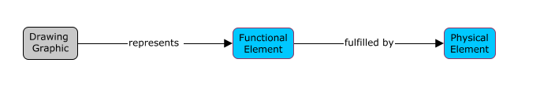
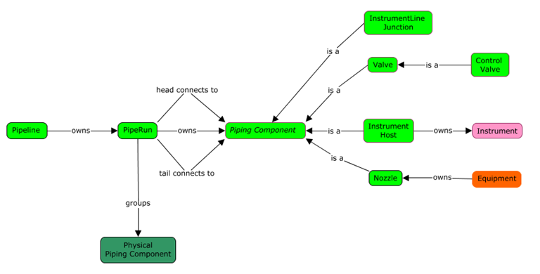

# Functional Models and Elements

## Introduction

The functional domain allows defining objects that represent systems or processes. These objects define the requirements of the objects in a system. For example, a Functional Pump has attributes that define the required fluid flow for a process.

The functional definition of a process is usually defined early in the design of a project. These objects show up in design diagrams and data sheets. The Functional objects eventually will be created in the Physical model. The physical objects will be related to the functional object with a *fulfills* relationship.

## Functional Elements

<!-- TODO: Functional Types ???? -->

All the Functional classes are defined in the Functional schema (which has an alias of `func`).
There are two classes of functional elements, `func:FunctionalBreakdownElement` and `func:FunctionalComponentElement`.
Each of these class inherit from the abstract class `func.FunctionalElement`.

<!-- TODO: Include?
The Functional schema is part of the domain schemas but delivered with DgnPlatform.
-->

FunctionalBreakdownElements are used to defined breakdown structures in a functional model. These elements group other FunctionalBreakdownElements or FunctionComponentElements. For example, a Plant Unit would groups Plant Sub-Units. A Plant Sub-Unit groups Equipment and Pipeline. Or a BuildingRequirement groups BuildingStoryRequirements. BuildingStoryRequirements groups SpaceRequirements.

FunctionalComponent elements are use to represent the individual engineering requirement objects. For example, Pumps, Valves. These classes contain attributes that define the engineering requirements for the component.

## FunctionalModels

The `func:FunctionalModel` class is defined in the functional domain schema.
FunctionalModels contain the FunctionalElements needed to define a system or process.
It would be common to have more then one FunctionalModel, but each would be related to a different process or system.

Currently, Plant and Building create functional models. There has not been a need to sub-class the Functional model because both applications puts all their function object into one model.

### Contents of Functional Models

FunctionalModels contain both FunctionBreakdownElements and FunctionalComponentElements.
These models will contain all the elements needed to describe a system or process.
For example, a building application would typically create one FunctionalModel per building.

### Functional Models in Model Hierarchy

In most cases today, the functional model models a partition related to the root subject.

<!-- TODO: Not sure if there is a workflow for functional models.
## Typical Functional Model Workflows
-->

## Example

In the Plant functional domain there is a complete set of classes that define the functional requirements for the processes in a plant. There are Equipment, Piping and Instrument functional component class. There are functional breakdown classes. These classes can vary per project type. Power plant projects have Units, Sub-Units, Building and Systems. A refinery project has Units, Areas, Services and Systems. The plant applications allow user to define these functional breakdown class to suit their needs. This hierarchy is defined by the groups relationship. The order of the tree is defined in presentation rules. Functional Components maybe grouped in more then one Functional Breakdown hierarchy. For example, a pump could exist in the S1 sub-unit and the NSSS plant System.

Plant does have functional breakdown for pipelines and instrument loops that group functional components and are always the end of the function breakdown hierarchy. They are only configurable by adding properties. There are many non-configurable relations that relate functional components to one another to define the layout of the function model. **See diagram.

> Next: [Information Models and Elements](./information-models-and-elements.md)