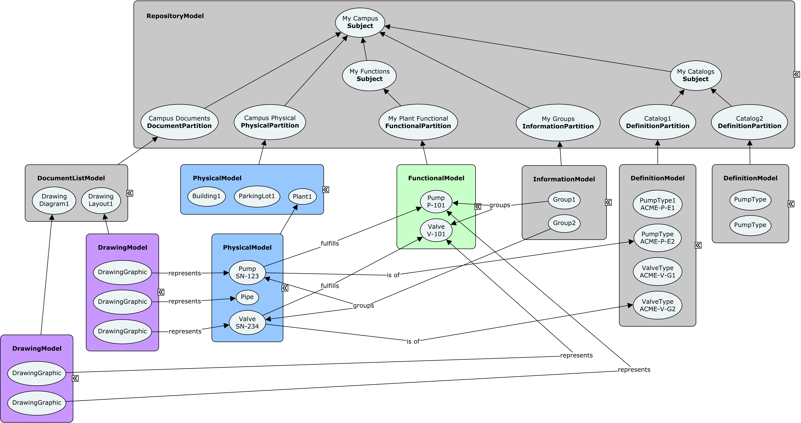

# Information Hierarchy

<!-- TODO: Some of the information in this chapter will likely be moved to [Model Fundamentals](./model-fundamentals.md). It will be natural to have links from this chapter to that one. -->

The information in a BIS repository is arranged in a hierarchy that is governed by rules. Some of the rules are explicitly defined by the schemas, and other rules require the applications that are creating data to follow standards.

The hierarchies in BIS repositories are intended to facilitate both human and software comprehension of the data.

## Hierarchy Constructs

As was explained in [Model Fundamentals](./model-fundamentals.md), there are only three mechanisms available in BIS to create a hierarchy:

* A Model can contain Elements
* An Element can own child Elements
* An Element can be *modeled* by (broken down into more detail by) a *SubModel*

Each of these three mechanism is intended to be used in specific circumstances which are explained in this chapter.

### Model Contains Elements

A Model is a *container* for Elements.
Models are a way to subdivide and organize the overall repository.
Each Element is contained by exactly 1 Model as defined by the `ModelContainsElements` relationship.

### Element Owns Child Elements

An Element can own child Elements.
This is useful for modeling *assembly* relationships or for modeling cases where one Element exclusively controls the lifetime of other Elements.
An Element can have 0 or 1 parent Elements as defined by the `ElementOwnsChildElements` relationship.
An Element without a parent is considered a *top-level* Element.
An Element with a parent is considered a *child* Element.
These hierarchies can go N levels deep, which means that an Element can be both a parent and a child.

### Model Models Element

A Model is more detail about an Element from a higher level in the information hierarchy.
A Model is about exactly 1 Element as defined by the `ModelModelsElement` relationship.
From the Model's perspective, this higher-level Element is known as the *modeled element*.
From the Element's perspective, the lower-level Model is knows as the *SubModel*.
The *SubModel* term is just a way to refer to a relative position in the information hierarchy.
There is no special class for a *SubModel*, only the standard `Model` subclasses.

For example, a `DrawingModel` breaks down a `Drawing` Element and contains the `DrawingGraphic` Elements that are the details of the overall drawing.

<!-- TODO: insert figure -->

## Top of the World

The top of the information hierarchy is strictly controlled and is very similar in all BIS repositories. The top of the hierarchy is made of:

* `RepositoryModel`
* `Subject` Elements
* `InformationPartitionElements`

<!-- TODO
The following figure shows a simple example of a the top of the hierarchy.
TODO: add figure
-->

### RepositoryModel

Every BIS repository has exactly 1 RepositoryModel that defines the top of the hierarchy. Elements can be inserted into to or updated within the RepositoryModel, but the RepositoryModel itself cannot be deleted.

*The RepositoryModel is the only Model is a BIS repository that does not have a ModelModelsElement relationship and an "owning" Element*

### Subjects

Subjects are Elements that are used to identify things that the repository is about. The Subject class cannot be specialized (subclassed). The most important capabilities of Subject are:

* It can have a UserLabel (inherited from Element)
* It can have a Description
* It can have child Subjects
* It can have child InformationPartitionElements

Subjects only exist in the RepositoryModel.

Every BIS repository has exactly 1 *root* Subject that describes what the repository is about.

* The root Subject is contained by the RepositoryModel.
* The root Subject has no parent element as it is the top of the hierarchy.
* The root Subject can be updated, but it cannot be deleted.

Child Subjects (optional) can be introduced to further organize the contents of the repository.

* All child Subjects are contained by the RepositoryModel.
* Each child Subject will have another Subject as its parent.

### InformationPartitionElements

InformationPartitionElements are used to "partition" a Subject into different perspectives. The InformationPartitionElement class is always specialized (subclassed).

InformationPartitionElements exist to record that a Subject is being modeled from a perspective and to be the Element that breaks down into a Model matching the correct perspective. For example a PhysicalPartition breaks down into a PhysicalModel.

A single Subject can be modeled from multiple perspectives (physical, functional, informational, etc.), and hence can have multiple child InformationPartitionElements.

All InformationPartitionElements are contained by the RepositoryModel. They are not used elsewhere in the information hierarchy.

### PhysicalPartitions

The top of a physical hierarchy starts with a `PhysicalModel` that models a `PhysicalPartition`.
It continues when another PhysicalModel breaks down a `PhysicalElement`.
For example, a plant physical layout model can break down a PhysicalElement that represents the overall plant.

See [Physical Models and Elements](./physical-models-and-elements.md) for details of physical modeling.

<!-- TODO
### FunctionalPartitions
TODO: write text
See [Functional Models and Elements](./functional-models-and-elements.md) for details of physical modeling.
-->

<!-- TODO
### AnalysisPartitions
TODO: write text
See [Analysis Models and Elements](./functional-models-and-elements.md) for details of physical modeling.
-->

### DefinitionPartition

The top of a definition hierarchy starts with a `DefinitionModel` that models a `DefinitionPartition`.
This allows `DefinitionElements` to be organized by how they relate to the parent `Subject` of the `DefinitionPartition`.
The can be multiple `DefinitionPartition` Elements and corresponding `DefinitionModel` Models so that definitions (instances of `DefinitionElement`) can be organized by source, discipline, or other criteria.
Each `DefinitionPartition` is identified by its [Code](./glossary.md#code).

### DocumentPartition

The top of a document hierarchy starts with a `DocumentListModel` that models a `DocumentPartition`.
This allows `Document` elements to be organized by how they relate to the parent `Subject` of the `DocumentPartition`.
`Drawing` and `Sheet` are 2 example subclasses of `Document`.
`Drawings` and `Sheets` are further broken down by `DrawingModels` and `SheetModels` which graphically break down the content of the drawing or sheet.

<!-- TODO: We need a chapter on DocumentListModels -->

<!-- TODO:
### More Partitions
TODO: We should list out all the known ones.
TODO: Should we have a chapter on all the known ones?
-->

## Links Between Perspectives

The partitioning strategy provides a clear hierarchical organization of the data by perspective. However, the perspectives are often related. For example, a FunctionalModel may model the processes in a plant while a PhysicalModel may model the actual plant hardware. There are natural associations between the Elements in the different perspectives and those associations often should be modeled.

<!-- TODO: More text here. Probably a diagram also... -->

The term "Physical Backbone" is sometimes used when discussing the organization of BIS repository data. This phrase refers to the pattern that most perspectives have relationships to the physical perspective, but not to other perspectives; this makes the physical perspective a coordinating and organizing structure for all the data in a repository.

## Breaking Down Elements: `IParentElement` and `ISubModeledElement`

A class of Element that can have child Elements implements the IParentElement interface.
A class of Element that can be broken down into more detail by a SubModel implements the ISubModeledElement interface.
Note that an Element class cannot implement both IParentElement and ISubModeledElement.

## Portions

A `Portion` Element is used to construct a breakdown hierarchy.
It identifies a *portion* of something at a higher level that is broken down into more detail by a lower level SubModel.
For example, a Floor is a portion of a Building that is broken down by a SubModel that contains the detail about that floor.
Example BIS Portion subclasses:

* `PhysicalPortion`
* `SpatialLocationPortion`
* `FunctionalPortion`

<!-- TODO
## Typical Repository Organization

Two examples of repository organizations are described below. It should be noted that a single BIS repository may have multiple uses. When that occurs each use (often corresponding to an application) adds the hierarchy; the resulting hierarchy is similar to a union of the uses' hierarchies.

### iModel Bridge Repository Organization

TODO: show organization for an iModel created by both:

* One bridge with two source files
* Another bridge with one source file

### Editing Application Repository Organization

TODO

-->

## Example Information Hierarchy

> Next: [Physical Models and Elements](./physical-models-and-elements.md)
