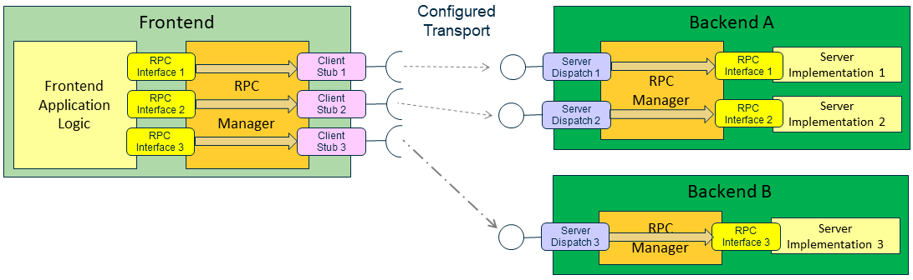

# RpcInterface

As described in the [software architecture overview](./SoftwareArchitecture.md), the functionality of an iModel.js app is typically implemented in separate components, which run in different threads, processes, and/or machines. These components communicate through interfaces, which are called *RpcInterfaces* because they use remote procedure calls, or [RPC](../learning/Glossary.md#RPC).


The diagram above shows an app frontend requesting operations from some backend. The frontend in this case is the client and the backend is the server. In general, the terms *client* and *server* specify the two *roles* in an RpcInterface:

* *client* -- the code that uses an RpcInterface and calls its methods. A client could be the [frontend of an app](./App.md#app-frontend), the [backend of an app](./App.md#app-backend), a [service](./App.md#imodel-services), or an [agent](./App.md#imodel-agents). A client could be [frontend code](../learning/Glossary.md#frontend) or [backend code](../learning/Glossary.md#backend).

* *server* -- the code that implements and exposes an RpcInterface to clients. A server could the [backend of an app](./App.md#app-backend) or a [service](./App.md#imodel-services). A server is always [backend code](../learning/Glossary.md#backend).

As shown, client and server work with the *RpcManager* to use an RpcInterface. RpcManager exposes a client "stub" on the client side. This stub forwards the request. On the other end, RpcManager uses a server dispatch mechanism to rely the request to the implementation in the server. In between the two is a transport mechanism that marshalls calls from the client to the server over an appropriate communications channel. The transport mechanism is encapsulated in a *configuration* that is applied at runtime.

A typical app frontend will use more than one remote component. Likewise, a server can contain and expose more than one component. For example, the app frontend might need two interfaces, Interface 1 and Interface 2. In this example, both are implemented in Backend A.


An app frontend can just as easily work with multiple backends to obtain the services that it needs. One of the configuration parameters for an RpcInterface is the identity of the backend that provides it. For example, suppose that the frontend also needs to use Interface 3, which is is served out by Backend B.



The RPC transport configuration that the frontend uses for Backend B can be different from the configuration it uses for Backend A. In fact, that is the common case. If Backend A is the app's own backend and Backend B is a remote service, then the app will use an RPC configuration that matches its own configuration for A, while it uses a Web configuration for B.

As noted above, the client of an RPC interface can be frontend or backend code. That means that backends can call on the services of other backends. In other words, a backend can be a server and a client at the same time. A backend configures the RpcInterfaces that it *implements* by calling the initializeImpl method on RpcManager, and it configures the RpcInterfaces that it *consumes* by calling initializeClient. For example, suppose Backend B needs the services of Backend C.


## RpcInterfaces are TypeScript Classes

An RpcInterface is a normal TypeScript class. A client requests a server operation by calling an ordinary TypeScript method, passing parameters and getting a result as ordinary TypeScript objects. The client gets the TypeScript interface object from the RpcManager. As noted above, the client  does not deal with communication

Likewise, a server implements and expose operations by writing normal TypeScript classes. A server registers its implementation objects with RcpManager. And, RpcManager dispatches in-coming requests from clients to those implementation objects.

See [learning RpcInterfaces](../learning/RpcInterface.md) for information on how to write, use, and expose RpcInterfaces.

## RPC Configuration

The [architecture comparison](./SoftwareArchitecture.md#comparison) diagram shows the role of RpcInterfaces in supporting portable, resuable app components. A different transport mechanism in each configuration. RpcManager is used by clients and servers to [apply configurations to RpcInterfaces](#rpc-configuration).

### Web RPC configuration

The Web RPC configuration transforms client calls on an [RpcInterface](#RpcInterface) into HTTP requests. Provides endpoint-processing and call dispatching in the server process. The iModel.js cloud RPC configuration is highly parameterized and can be adapted for use in many environments. This configuration is designed to cooperate with routing and authentication infrastructure. See [Web architecture](./SoftwareArchitecture.md#web).

iModel.js comes with an implementation of a Web RPC configuration that works with the Bentley Cloud infrastructure. It is relatively straightforward for developers to write custom Web RPC configurations that works with other infrastructures.

### Desktop RPC configuration

The iModel.js desktop RPC configuration is specific to the Electron framework. It marshalls calls on an [RpcInterface](#RpcInterface) through high-bandwidth, low-latency pipes between cooperating processes on the same computer. It provides endpoint-processing and call dispatching in thebackend process. See [Desktop architecture](./SoftwareArchitecture.md#desktop).

### In-process RPC configuration

The in-process RPC configuration marshalls calls on an [RpcInterface](#RpcInterface) across threads within a single process. It also provides call dispatching in the backend thread. See [Mobile architecture](./SoftwareArchitecture.md#mobile).

## RpcInterface Performance

Apps must be designed with remote communication in mind. In the case where a server or app backend is accessed over the Internet, both bandwidth and latency can vary widely. Therefore, care must be taken to limit number and size of round-trips between clients and servers. RpcInterface methods must be "chunky" and not "chatty".

## Logging and ActivityIds

A request may pass through many communication tiers. A request will generally be carried out by backends running on other machines. Finally, the backends that carry out a request may run asynchronously. Yet, all of those steps make up a single "activity". To make it possible to understand and troubleshoot such distributed and asynchronous activities, RpcInterface associates a unique "ActivityId" with every client request that goes out over the wire. The ActivityId that was assigned the original request then appears in logging messages emitted by downstream communications and backend methods that handle the request. That allows a log browser to correlate all of the operations with the original request, no matter where or when they were carried out.

Frontend methods may also optionally log additional messages that are tagged with the same ActivityId, to provide useful information about the purpose of the activity.

Frontend methods that invoke imodeljs-clients methods directly are responsible for generating or forwarding an ActivityId to them.

A backend method that turns around an invokes another backend's method via RpcInterfaces will propagate the current ActivityId to it.

Briefly, here is how it works:
* Frontend/client
  * iModel.js on the frontend assigns a unique ActivityId value to an RpcIntereface call.
  * It puts this value in the [X-Correlation-ID](https://en.wikipedia.org/wiki/List_of_HTTP_header_fields) HTTP header field, to ensure that it stays with the request as it passes through communication layers.
* Backend
  * iModel.js on the backend gets the ActivityId from the HTTP header.
  * RpcInvocation passes the ActivityId to RpcInterface implementation methods.
  * RpcInvocation and all the async methods in the backend work together to make the ActivityId part of the context in which backend methods are called.
  * Calls to the Logging manager also occur in this context, and so the Logging manager gets the ActivityId from the context and adds to the logging messages as metadata using a Bentley-standard "ActivityId" property id.
* Log Browsers
  * Can filter on the Bentley-standard "ActivityId" property to correlate all messages related to the same request.

See [managing the ActivityLoggingContext](../learning/backend/ManagingActivityLoggingContext.md) for details.# Remote Procedure Call (RPC) Interface

An `RpcInterface` is a set of operations exposed by a server that a client can call, using configurable protocols, in a platform-independent way.

This article uses the terms *client* and *server* to identify the two roles in an `RpcInterface`:

* *client* -- the code that uses an RpcInterface and calls its methods. A client could be the frontend of an app, the backend of an app, a service, or an agent. It could be [frontend code](./Glossary.md#frontend) or [backend code](./Glossary.md#backend).
* *server* -- the code that implements and exposes an RpcInterface to clients. A server could be a deployed, stand-alone service, or the backend of an app. It is always [backend code](./Glossary.md#backend).

See [the RpcInterface overview](..RpcInterface.md) for more information on the purpose of RpcInterfaces in the context of overall [app architecture](..SoftwareArchitecture.md).

An RpcInterface is defined and implemented in TypeScript. Conceptually, the interface has three parts:

* The [definition](#defining-the-interface) - The TypeScript method declarations that represent the operations, along with the types of their arguments.
* The [client stub](#client-stub) - The client-side implementation that forwards requests to the server and passes back the results.
* The [impl](#server-implementation) - The server-side implementation that performs the operations and returns the results.

In practice, two TypeScript classes are needed, as explained below.

Communication between a client and the server is via [RPC](./Glossary.md#RPC). Several RPC mechanisms are [available](..RpcInterface.md#rpc-configuration). Each RPC mechanism is encapsulated in an RpcConfiguration. RpcManager is used by clients and servers to apply configurations to RpcInterfaces, as described below.

RpcInterface methods are always [asynchronous](#asynchronous-nature-of-rpcInterfaces).

## Parameter and Return Types

RpcInterface methods can take and return just about any type. Most JavaScript primitive types are supported, such as number, string, bool, and any.

RpcInterfaces can also use TypeScript/JavaScript classes as parameter and return types. The [interface definition](#defining-the-interface) just has to declare the classes that it uses, so that the configurations can marshall them correctly. That is the purpose of the `types` property.

RpcInterfaces are restricted to using types that are common to both frontends and backends. For example, the [IModelToken]($common) type must be used to specify an iModel. The client that makes a call on the interface must obtain the token from the IModelConnection or IModelDb that it has, and the server that implements the interface must translate the token into an IModelDb when it handles the call.

## Defining the Interface

To define an interface, write a TypeScript class that extends [RpcInterface]($common).

The interface definition class should define a method for each operation that is to be exposed by the server. Each method signature should include the names and types of the input parameters. Each method must return a `Promise` of the appropriate type. These methods and their signatures define the interface.

The definition class must also define two static properties as interface metadata:
* `types`. Specifies any non-primitive types used in the methods of interface.
* `version`. The interface version number.

The definition class must be in a directory or package that is accessible to both frontend and backend code. Note that the RpcInterface base class is defined in `@bentley/imodeljs-common`.

A best practice is that an interface definition class should be marked as `abstract`. That tells the developer of the client that the definition class is never instantiated or used directly. Instead, callers use the [client stub](#client-stub) for the interface when making calls.

*Example:*

```ts
[[include:RpcInterface.definition]]
```

In a real interface definition class, each method and parameter should be commented, in order to provide documentation to client app developers that will try to use the interface.

## Client Stub

The client stub is an implementation of the interface that forwards method calls to the RPC mechanism. Each method in the client stub is exactly the same single line of code: `return this.forward.apply(this, arguments);` The forward property is implemented by the base class, and its forward method sends the call and its arguments through the configured RPC mechanism to the server. As shown in the previous example, the client stub code is incorporated into the interface definition class.


## Server Implementation

The server-side implementation is also known as the "impl". An impl is always [backend code](./Glossary.md#backend).

To write an impl, write a concrete TypeScript class that extends [RpcInterface]($common) and also implements the interface definition class.

The impl must override each method in the interface definition class. Each override must perform the intended operation.

Each impl method must return the operation's result as a Promise.

The impl method must obtain the ActivityLoggingContext by calling [ActivityLoggingContext.current]($bentleyjs-core). It must then follow the [rules of managing the ActivityLoggingContext](./backend/ManagingActivityLoggingContext.md).

As noted above, the methods in the impl may have to transform certain argument types, such as IModelTokens, before they can be used.

A best practice is that an impl should be a thin layer on top of normal classes in the server. Ideally, each method of an impl should be a one-line forwarding call that uses the public backend API of the server. The impl wrapper should be concerned only with transforming types, not with functionality, while backend operation methods should be concerned only with functionality. Backend operation methods should be static, since a server should be stateless. Preferrably, backend operation methods should be [synchronous if possible](#asynchronous-nature-of-rpcInterfaces).

*Example:*

```ts
[[include:RpcInterface.implementation]]
```

Impls must be registered at runtime, as explained next.

## Server-side Configuration

A server must expose the RpcInterfaces that it implements or imports, so that clients can use them.

### 1. Register Impls
The server must call [RpcManager.registerImpl]($common) to register the impl classes for the interfaces that it implements, if any.

*Example:*

```ts
[[include:RpcInterface.registerImpls]]
```

### 2. Choose Interfaces
The server must decide which interfaces it wants to expose. A server can expose multiple interfaces. A server can expose both its own implementations, if any, and imported implementations. The server can decide at run time which interfaces to expose, perhaps based on deployment parameters. A server will often use [FeatureGates]($common) to decide which interfaces to expose.

*Example:*

```ts
[[include:RpcInterface.selectInterfacesToExpose]]
```

### 3. Configure Interfaces
The server must choose the appropriate RPC configuration for the interfaces that it exposes to clients. If the server is an app backend, the RPC configuration must correspond to the app configuration.

|App Configuration|RPC Configuration for App-Specific RpcInterfaces
|---------------|-----------|--------------------
|Mobile app|[in-process RPC configuration](..RpcInterface.md#in-process-rpc-configuration)
|Desktop app|[desktop RPC configuration](..RpcInterface.md#desktop-rpc-configuration)
|Web app|a [Web PRC configuration](..RpcInterface.md#web-rpc-configuration)

A backend should configure its RpcInterfaces in its [configuration-specific main](..AppTailoring.md#configuration-specific-main).

If the server is a [service](..App.md#imodel-services), it must always use a [Web RPC configuration](..RpcInterface.md#web-rpc-configuration) for its interfaces. Each client must use the same configuration.

*Web Example:*
``` ts
[[include:RpcInterface.initializeImplBentleyCloud]]
```

*Desktop Example:*
``` ts
[[include:RpcInterface.initializeImplDesktop]]
```

## 4. Serve the Interfaces

When a backend is configured as a Web app, it must implement a Web server to serve out its interfaces, so that in-coming client requests are forwarded to the implementations. This is always true of all [services](..App.md#imodel-services). Any Web server technology can be used. Normally, a single function call is all that is required to integrate all configured interfaces with the Web server. For example, if a Web server uses express, it would serve its RpcInterfaces like this:
```ts
const webServer = express();
...
webServer.post("*", async (request, response) => {
  rpcConfiguration.protocol.handleOperationPostRequest(request, response);
});
```
It is this simple because the server should be concerned *only* with serving its RpcInterfaces and not with static resources or any other kind of API.

## Client-side Configuration

The client must choose the interfaces that it plans to use.

The client then configures each interface with the correct RPC mechanism. For all interfaces served by the app backend, the RPC configuration must corresponds to the app configuration. A frontend should configure its RpcInterfaces in its [configuration-specific main](..AppTailoring.md#configuration-specific-main).

Clients must always use a [Web RPC configuration](..RpcInterface.md#web-rpc-configuration) for RpcInterfaces provided by a [remote service](..App.md#imodel-services). Client and server must use the same configuration.

*Web Example:*
``` ts
[[include:RpcInterface.initializeClientBentleyCloud]]
```

Note that the client must specify the server URL for a Web configuration.

*Desktop Example:*
``` ts
[[include:RpcInterface.initializeClientDesktop]]
```

For a desktop or mobile configuration, the connection is local and so no URL or authorization token is necessary.

## RpcInterface Performance

In some configurations, client and server may be in separate processes. Some configurations marshall calls over the Internet, where both bandwidth and latency can vary widely. Therefore, care must be taken to limit the number and size of round-trips between clients and servers. In other words, an interface's methods must be "chunky" and not "chatty".

## Asynchronous Nature of RpcInterfaces
