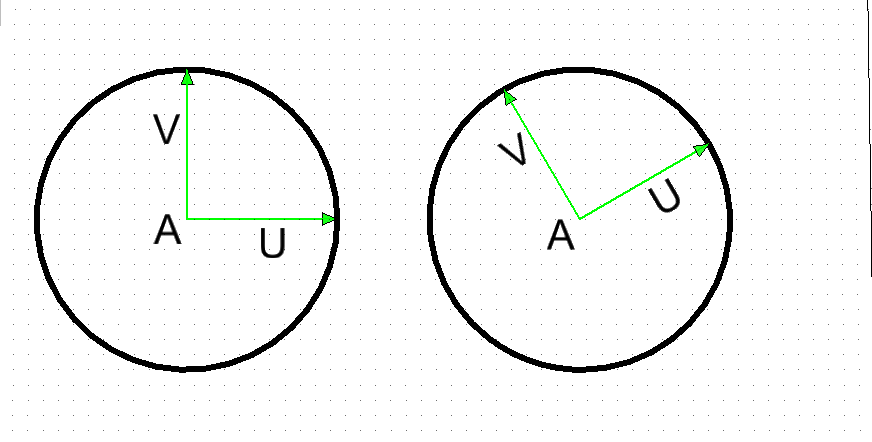
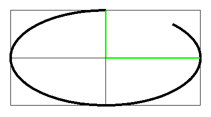

# Curve Primitives

* A CurvePrimitive is a bounded continuous curve.
* Each curve primitive type (LineSegment3d, LineString3d, Arc3d, bsplines, etc) has a _fraction parameterization_ determined by its particular equations.
* The fraction parameterization must have
  * `fraction=0` is the startof the primitive
  * `fraction=1` is the end of the primitive
  * increasing fractions always move forward along the primitive.
* The "forward" _distance_ movement for increasing fraction is _not_ required to be proportional to fraction.
* Fractional and distance-along position are proportional only in very special cases:
  * LineSegment
  * circular arc
  * transition spiral curves.
* Other curve types that have more complicated (non-proportional) fraction-to-distance relations are
  * elliptic arcs
  * bspline curves
  * linestrings
* When movement "by distance" is required, it can be done by
  * Using method calls that explicitly take distance as ain input.
  * Wrap a curve primitive (or chain of curve primitives) in a CurvePrimitiveWithDistanceIndex.
    * The CurvePrimitiveWithDistanceIndex has cached distance data to facilitate repeated queries by distance, and to make "fractional position along" the composite curve act like proportional distance.

## lineSegment

* A line segment is a portion of an infinite line.
* Json Fragment: `[{"lineSegment":[[0,0,0], [3,0,0]]}`
* typescript object:
```
        const myLineSegment = LineSegment.create (Point3d.create (1,2,3), Point3d.create(6,4,2));
```


 * Fractional Parameterization:
```
    A = start point
    B = end point
    f = fraction varying from 0 to 1
    Point X(f) at fractional position f along the lineSegment is
        X(f) = (1-f) * A + f * B
```

## lineString
* A LineString is an array of points that are to be connected by straignt lines.
* Json Fragment:

* Typescript object:
```
        const myLineString = LineString.create ([point0, point1, point2 ....]);
```
* Fractional Parameterization

Having both individual line segments and the composite linestring complicates parameterization.

* * As with all CurvePrimitives, the fractional parameterization for the complete linestring must have `fraction=0` at the start and `fraction=1` at the end.
  * The fractional positions of each inerior vertex are then defined at _equal intervals in the fraction space_.
  * 
  * Hence in the example, with 4 segments the vertex fractions increment by one quarter.
  * Within each segment, the fraction interval is mapped as if it were a line segment.
  * Note that having uniform vertex-to-vertex fraction means that the distance-along-the-linestring is _not proportional to fraction-along-entire-linestring_.   Fraction and distance changes are only proportional within individual segments.

## arcs (circular and elliptic)

An arc primitive is a portion of a circular or ellipticla arc.   The equations for a complete elliptic arc require a center point and two vectors.   The start and end of a partial arc are controlled by two angles.

The equational forms for circular and elliptic cases are identical.  Telling whether a given arc is true circular requires examination of the vector coordinates.

The stroking equation that maps  an angle to a coordinates to points around a (full) elliptic (or circular) arc is
```
    C = center point
    U = vector from center point to 0-degere point
    V = vector from center point to 90-degree point.
    theta = angle
    X(theta) = C + cos (theta * U + sin(theta) * V
```

### True Circles
* If the `U` and `V` vectors are (both) _perpendicular_ and _the same length_, this is a true circle.
* In the both circles below, the `U` and `V`  are identical length and perpendicular to each other.
* For the left circle, `U` and `V` happen to be in the global x and y directions.
* For the right circle, `U` and `V` are still identical length and perpendicular, but are both rotated away from global x and y.  This still traces a circle, but the "0 degree" point is moved around the circle.
* When the circular arc conditions are true, the angle used _in the equations_ is an the actual physical angle between the `U` vector and the vector from the center to `X(theta)`.



### Ellipse

If the `U` and `V` vectors either (a) have different lengths or (b) are not perpendicular, the ellispe is non-circular.

If `U` and `V` are perpendicular, their lengths correspond to the common usage of "major" and "minor" axis lengths.   But the perpendicular condition is not required -- non-perpendicular vectors occur due to transformation and construction history.

### Angular limits
To draw an arc that is not the complete circle or ellipse, simply limit the theta range to something other than 0 to 360 degrees.

```
    theta0 = angular start point
    theta1 = angular and point
    f = fraction varying from 0 to 1
    theta(f) = (1-f) * theta0 + f * theta1
        Point X(f) at fractional position f along the arc is

    X(f) = C + cos (theta(f)) * U + sin(theta(f)) * V
```


* Angles theta0 and theta1 can be negative and can be outside of 360 degrees.
* Anlge theta1 can be less than theta0

Examples of arc sweep
| start and end angles | CCW signed sweep angle | image |
|----|----|---|
| (0 to 360) | 360 |  |
| (0 to 135) | 135 |  |
| (270 to 495) | 225 |  |
| (90 to 270) | 180 |  |
| (90 to 405) | 315 |  |Ex

Examples with json fragments


