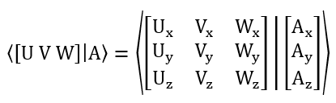

# Transform and RotMatrix operations

* A `RotMatrix` is a 3x3 matrix.    It can be used for 3D rotation and scaling.  (The name "Rot" is derived from Rotation, but the data type is not limited to rotations.)
  * A matrix _alone_ acts on xyz data, but always leaves the origin in place.
  * A matrix must be bundled into a transform (which carries an additional origin/translation term) to cause scaling and rotation around a point other than the origin.
* A `Transform` is a 3x3 matrix with an additional point which is variously called "origin" or "translation".

## Notation

|  |  |
|---|---|
| Indexing for entries in 3x3 matrix | |
| Indexing for matrix, translation parts of transform ||
| Typical (column) vector names | `U,V,W` |
| Typical (row) vector names.  (`T` denotes transpose, which changes the named column to a row) | `UT, VT, WT` |
| Typical point names | `A,B,C`|

## Constructor and full update methods

| category | RotMatrix | |Transform | |
|---|---|---|---|---|---|---|
| create identity | newMatrix = RotMatrix.createIdentity () | | newTransform = Transform.createIdentity () |
| set identity | matrix.setIdentity () | | transform.setIdentity () |
| create by direct list of numeric entries | newMatrix = RotMatrix.createRowValues (qxx, qxy, qxz, qyx, qyy, qyz, qzx, qxy, qzz) ||newMatrix = Transform.createRowValues (qxx, qxy, qxz, ax, qyx, qyy, qyz, ay, qzx, qxy, qzz, az) ||
| Create by rows | newMatrix = RotMatrix.createRows (U, V, W) || | |
| Create by columns | newMatrix = RotMatrix.createColumns (U, V, W) || newTransform = Transform.createOriginAndMatrixColumns(A,U,V,W)| |
| set columns | matrix.setColumns (U, V, W) || transform.setOriginAndMatrixColumns(A,U,V,W)| |
| create by origin and matrix. | | | newTransform = Transform.createOriginAndMatrix (A, Q) |  |
| create by origin and fixed point. | | | newTransform = Transform.createFixedPointAndMatrix (A, Q) | |
