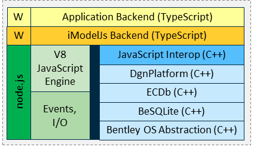

## Table of Content

- [Table of Content](#table-of-content)
- [Introduction](#introduction)
  - [Preface](#preface)
    - [What is a connector](#what-is-a-connector)
  - [Who should read this guide?](#who-should-read-this-guide)
  - [Ways to sync data to an iTwin](#ways-to-sync-data-to-an-itwin)
  - [Preliminary Reading](#preliminary-reading)
  - [Structure of the guide](#structure-of-the-guide)
  - [Foundations](#foundations)
    - [iTwin](#itwin)
    - [iModelHub](#imodelhub)
    - [iModel](#imodel)
    - [Briefcases](#briefcases)
    - [Element](#element)
    - [Changeset](#changeset)
- [The basics of writing a connector](#the-basics-of-writing-a-connector)
  - [Getting started](#getting-started)
    - [Connecting data to an iTwin](#connecting-data-to-an-itwin)
    - [Data Extraction](#data-extraction)
    - [Data alignment](#data-alignment)
    - [Schemas](#schemas)
    - [Dynamic Schemas](#dynamic-schemas)
    - [Display Labels](#display-labels)
    - [CodeValues](#codevalues)
  - [Sync](#sync)
    - [Detecting and pushing changes](#detecting-and-pushing-changes)
    - [Provenance and External Repository](#provenance-and-external-repository)
      - [Case 1 : File metadata](#case-1--file-metadata)
      - [Case 2 : Id mapping](#case-2--id-mapping)
    - [Change detection](#change-detection)
- [Connector SDK](#connector-sdk)
  - [BridgeRunner (2.x) or ConnectorRunner (3.x)](#bridgerunner-2x-or-connectorrunner-3x)
  - [Synchronizer](#synchronizer)
  - [Connector interface methods](#connector-interface-methods)
    - [InitializeJob](#initializejob)
    - [OpenSourceData](#opensourcedata)
    - [ImportDefinitions](#importdefinitions)
    - [ImportDomainSchema](#importdomainschema)
    - [ImportDynamicSchema](#importdynamicschema)
    - [UpdateExistingData](#updateexistingdata)
  - [Execution Sequence](#execution-sequence)
  - [Analyzing the connector output](#analyzing-the-connector-output)
    - [ECSQL](#ecsql)
    - [Visualizing the output](#visualizing-the-output)
  - [Logs](#logs)
  - [Error Messages](#error-messages)
  - [Building a test for a connector](#building-a-test-for-a-connector)
- [Advanced Topics](#advanced-topics)
  - [Job Subjects](#job-subjects)
  - [Schema merging](#schema-merging)
  - [Units and Coordinate systems](#units-and-coordinate-systems)
  - [Dealing with geometry](#dealing-with-geometry)
  - [Authentication](#authentication)
  - [Locks & Codes](#locks--codes)
  - [More information](#more-information)
- [Bentley Authored Connectors](#bentley-authored-connectors)
  - [Civil iModel Connector](#civil-imodel-connector)

## Introduction

### Preface

#### What is a connector

iTwin connectors play an essential role in enabling a wide range of both
Bentley and third-party design applications to contribute to an iTwin.
Bentley iTwin Services provides connectors to support a wide array of
design applications to ensure that all engineering data can be
aggregated into a single digital twin environment inside an iModel.

As explained in the [overview](../learning/imodel-connectors.md), a "connector" is a program that:

1. Reads information from a data source,
2. Aligns the source data with the BIS schema and preferably a domain schema, and
3. Writes BIS data to an iModel.

A complete list of available connectors can be found in [iTwin Services
Community

Wiki](<https://communities.bentley.com/products/digital-twin-cloud-services/itwin-services/w/synchronization-wiki/47595/supported-applications-and-file-formats>)

Examples of iTwin Connector include:


See \[Section on iTwin Synchronization\](#ways-to-sync-data-to-an-itwin)
for more details on existing connectors.

However, in some instances, where a specific format is not covered, one
can develop a new connector using [iModel.js SDK](https://www.itwinjs.org/)



The imodel-bridge package provided as part of the iModel.js SDK makes it
easier to write an iTwin connector backend that brings custom data into
a digital twin. To run this environment with the iModel.js library that
this package depends on requires a JavaScript engine with es2017
support.

Note: Please keep in mind iModelBridge is sometimes used as a synonym
for iTwin Connector since it bridges the gap between input data and a
digital twin.

### Who should read this guide?

This guide explains how to write a new connector for a new format or
data source.

It is not relevant for someone trying to bring in data for which a
connector already exists or is trying to federate data without it being
part of the iTwin.

### Ways to sync data to an iTwin

[The iTwin Synchronizer portal](https://communities.bentley.com/products/digital-twin-cloud-services/itwin-services/w/synchronization-wiki/47606/itwin-synchronizer-portal) and [iTwin Sychronizer client](https://communities.bentley.com/products/digital-twin-cloud-services/itwin-services/w/synchronization-wiki/47597/itwin-synchronizer-client) provides synchronization mechanism to bring data into an iTwin through a connector

The following are the various steps involved in that workflow.


More on synchronization using connectors could be found [here](https://communities.bentley.com/products/digital-twin-cloud-services/itwin-services/w/synchronization-wiki/47596/ways-to-sync-your-data-to-an-itwin)

### Preliminary Reading

The guide assumes that you are somewhat familiar with iModel and iTwin
concepts. A short summary of the releveant topics are provided when relevant.

To understand the APIs, you will need to have an understanding of
typescript.

### Structure of the guide

### Foundations

This guide section is a quick refresher on the basic concepts one needs
to know to write a new connector.

#### iTwin

An iTwin is an infrastructure digital twin. An iTwin incorporates different types of data repositories -- including drawings, specifications, documents, analytical models, photos, reality meshes, IoT feeds, and enterprise resource and enterprise asset management data -- into a living digital twin. This [link](http://www.bentley.com/itwin) contains additional information about iTwins and Bentley iTwin Services

#### iModelHub

iModelHub is the control center for iModels. It is responsible for coordinating concurrent access to iModels and changes made to them in [ChangeSets](https://www.itwinjs.org/learning/glossary/#changeset). iModel connectors interact with iModelHub using the iModel.js API. The Connector SDK provides a framework through which a connector can easily maintain this interaction. For more information about iModelHub, please see <https://www.itwinjs.org/learning/imodelhub/>

#### iModel

An iModel is a specialized information container for exchanging data associated with the lifecycle of infrastructure assets. It contains digital components assembled from many sources. They are self-describing, geometrically precise, open, portable, and secure. The file format is based on open source SQLite relational database format and forms the backbone for iTwins

iModels were created to facilitate the sharing and distribution of information regardless of the source and format of the information. iModels are an essential part of the digital twin world. But a digital twin means a lot more than just an iModel.

An iTwin connector provides a workflow to easily synchronize information from various third-party design applications or data repositories into an iModel.

#### Briefcases

[Briefcases](https://www.itwinjs.org/learning/glossary/#briefcase) are the local copies of iModel that users can acquire to work with the iModel. A connector will download a briefcase locally using the BridgeRunner and change their copy of iModel. Once all the work is done, the results are then pushed into the iModel. Please see the section on Execution sequence on the different steps involved.

For more information, please see

<https://www.itwinjs.org/learning/imodelhub/briefcases/>

#### Element

iModel uses BIS schemas to describe the persistence model of the digital twin. An element represents an instance of a [bis:Element](https://prod.imodeljs.org/bis/intro/element-fundamentals/) class.

#### Changeset

A changeset represents a file containing changes corresponding to an iModel briefcase. For more information on changesets pleases see [ChangeSets](https://www.itwinjs.org/reference/imodelhub-client/imodelhubclient/changeset/)

## The basics of writing a connector

### Getting started

You'll need Node.js version 14.x refer to [Section 1 from iTwin.js Getting Started](https://www.itwinjs.org/getting-started/) for more details.

The node packages and versions you'll need are listed here:

```JSON
    "dependencies": {
        "@bentley/backend-itwin-client": "2.19.3",
        "@bentley/bentleyjs-core": "2.19.3",
        "@bentley/config-loader": "2.19.3",
        "@bentley/ecschema-metadata": "2.19.3",
        "@bentley/frontend-authorization-client": "2.19.3",
        "@bentley/geometry-core": "2.19.3",
        "@bentley/imodel-bridge": "2.19.3",
        "@bentley/imodelhub-client": "2.19.3",
        "@bentley/imodeljs-backend": "2.19.3",
        "@bentley/imodeljs-common": "2.19.3",
        "@bentley/imodeljs-i18n": "2.19.3",
        "@bentley/itwin-client": "2.19.3",
        "@bentley/logger-config": "2.19.3",
        "@bentley/rbac-client": "2.19.3",
        "@bentley/telemetry-client": "2.19.3",
        "@bentley/ecschema-metadata": "2.19.3",
        "@bentley/context-registry-client": "2.19.3",
        "@types/sqlite3": "3.1.7",
        "@types/xmldom": "0.1.31",
        "bunyan": "1.8.15",
        "bunyan-seq": "0.2.0",
        "draco3d": "1.4.1",
        "open": "7.4.2",
        "request": "2.88.2",
        "request-promise": "4.2.6",
        "sqlite": "4.0.23",
        "sqlite3": "5.0.2",
        "three": "0.116.1",
        "username": "5.1.0",
        "xmldom": "0.3.0"
    },
    "devDependencies": {
        "@bentley/build-tools": "2.19.3",
        "@bentley/oidc-signin-tool": "2.19.3",
        "@types/chai": "4.2.21",
        "@types/jquery": "3.5.6",
        "@types/mocha": "5.2.7",
        "@types/node": "10.17.60",
        "@types/object-hash": "1.3.4",
        "babel-cli": "6.26.0",
        "chai": "4.3.4",
        "mocha": "5.2.0",
        "nock": "12.0.3",
        "tslint": "5.20.1",
        "typescript": "3.9.10"
    },
```

#### Connecting data to an iTwin


There are three main steps that a connector needs to undertake to bring data into a digital twin

- Extract data from the input source
- Transform and align the data to the digital twin.
- Generate [changesets](https://github.com/imodeljs/imodeljs/blob/master/docs/learning/iModelHub/index.md#the-timeline-of-changes-to-an-imodel) and load data into an iModel.

The sections below give a high level overview of the various parts that go into creating an iTwin Connector.

#### Data Extraction

Extraction of data from the input depends on the source format and the availablity of a library capable of understanding it. There are two strategies typically employed for data extraction.

1. If the extraction library is compatible with TypeScript, write an extraction module and use that to connect the input data with the alignment phase. This can be called from the [OpenSourceData](#opensourcedata) method in your connector.

2. If a TypeScript binding is not available, extract the data into an intermediary format that can be then ingested by the alignment phase. In this case the intermediate format will be read in the [OpenSourceData](#opensourcedata) method in your connector.

#### Data alignment

An iModel Connector must carefully transform the source data to BIS-based data in the iModel, and hence each connector is written for a specific data source.

- Mappings of data are _from_ source _into_ an iModel.
- Typically, a connector stores enough information about source data to detect the differences in it between job-runs. In this manner tge connector generates _changesets_ that are sent to iModelHub. This is the key difference between a connector and a one-time converter.
- Each job generates data in the iModel that is isolated from all other jobs' data. The resulting combined iModel is partitioned at the Subject level of the iModel; each connector job has its own Subject.

For each iTwin Connector author, there will always be two conflicting goals:

1. To transform the data in such a way that it appears logical and "correct" to the users of the authoring application.
2. To transform the data in such a way that data from disparate authoring applications appear consistent.

The appropriate balancing of these two conflicting goals is not an easy task. However, where clear BIS schema types exist, they should always be used.

#### Schemas

See this article on [Importing a schema and bootstrapping definitions](https://github.com/imodeljs/imodeljs/tree/master/docs/learning/backend/SchemasAndElementsInTypeScript.md#importing-the-schema)

There are roughly three degrees of customizations you may need to employ to connect and align your data to an iModel. These degrees range from no customization at all (i.e. using the out-of-the-box domain schemas used by many of the Bentley authored Connectors) to extending the domain shemas to introduce additional classes (or subclasses) and properties. Finally, the most extreme level of customization which is to add classes and properties programmatically as your data is read (a.k.a "dynamic schema").

#### Domain Schemas

Bentley has authored many "domain" schemas to support connectors for many of its authoring applications. For the most aligned data (i.e. data published from your connector uses the same classes and properties as data published from other connectors), it is best to use a domain schema.

To see what domain schemas are available see [Released Domain Schemas](ReleasedDomainSchemas.md)

Sometimes BIS domain schemas are not adequate to capture all the data in the
authoring application. The flow chart below can be used to assist in deciding
which schema methodology to use.


#### Extending a Schema

#### Dynamic Schemas

When the format for incoming data in the native source is not completely known, it is not possible to map the data to a fixed schema. A solution for this scenario is called Dynamic Schema. To avoid losing data, iTwin Connector may dynamically create application-specific schemas whose classes descend from the most appropriate BIS domain classes.

For example, if the native source allows for user defined classes or user-defined properties, then as the classes and properties are read from the native source, they can be added to an iModel schema in-memory and real-time (a.k.a. dynamically). In effect, each native source file has its own unique schema.

As an iModel Connector always runs multiple times to keep an iModel synchronized, the schemas created by previous executions limit the schemas that can be used by subsequent executions. To provide consistency and enable concise changesets, the Connector adds to the previously-defined schemas (creating new schema versions). This follows the general schema update strategy defined in [Schema Versioning and Generations](https://github.com/imodeljs/imodeljs/tree/master/docs/bis/intro/schema-versioning-and-generations.md)

The `DynamicSchema` custom attribute should be set on customer-specific application schemas. This custom attribute can be found in the standard schema `CoreCustomAttributes` and it enables iModelHub to programmatically detect dynamic schemas. Dynamic schemas require special handling since their name and version are typically duplicated between iModels from different work sets.

#### Display Labels

Wherever practical, the Elements generated from an iModel Connector should be identifiable through an optimal "Display Label".

As discussed in [Element Fundamentals](https://github.com/imodeljs/imodeljs/tree/master/docs/bis/intro/element-fundamentals.md), the Display Labels are created through the following logic:

1. If the UserLabel property is set, it is taken as the Display Label.
2. If the CodeValue is set (and the UserLabel is not set), the CodeValue becomes the Display Label.
3. If neither UserLabel nor CodeValue is set, then a default Display Label is generated from the following data:
   - Class Name
   - Associated Type's Name (if any)

iTwin Connector data transformations should be written considering the Display Label logic; UserLabel is the appropriate property for a connector to set to control the Display Label (CodeValue should never be set for anything other than coding purposes).

_But what value should an iModel connector set UserLabel to?_ There are two goals to consider in the generation of UserLabels. Those goals, in priority order, are:

1. Consistency with source application label usage.
2. Consistency with BIS domain default labeling strategy.

If the source application data has a property that conceptually matches the BIS UserLabel property, that value should always be transformed to UserLabel.

#### CodeValues

Next to the name of the class, CodeValue is the 2nd most important property in an iModel for the purposes of alignment.  Connectors should set CodeValue when a unique, human-readable identifier exists.

A common condition occurs where a property is generally readable and unique, but, an occasional duplicate code value occurs in the source data. Connector developers find that insertions are rejected due to duplicate CodeValues and simply forego setting CodeValue altogether - this practice is highly discouraged. It is strongly recommended that the duplicate code values are dealt with rather than skipping setting of the CodeValues. The duplicate CodeValue could be taken as a cue to clean the source data. For example, are both of these rooms really an "office" or is one "office 301" and the other "office 302" or is one room the "bursar's office" and the other the "registrar's office"? Alternatively, programmatically the connector developer can adjust the corresponding CodeScope and CodeSpec to ensure uniqueness.

For some elements in some models, such an identifier may really not exist. For example, a simple geometric line element w/o additional business data would not have an obvious, unique and human-readable identifier and it would generally be detrimental to generate a CodeValue solely for the purpose of not leaving it blank. Additionally, generated CodeValues have a high chance of violating the “human readable” requirement. In such a case, this section should not be taken as a directive to generate such an identifier when it doesn't exist.

Refer to [Element Codes](https://www.itwinjs.org/bis/intro/codes/) in the "Introduction to BIS" documentation.

### Sync

#### Detecting and pushing changes

Rather than starting over when the source data changes, a connector should be able to detect and convert only the changes. That makes for compact, meaningful changesets, which are added to the iModel's [timeline](https://github.com/imodeljs/imodeljs/blob/master/docs/learning/iModelHub/index.md#the-timeline-of-changes-to-an-imodel).

In the case of source data that was previously converted and has changed, the connector should update the data in the iModel that were the results of the previous conversion. In the case of source data that was previously converted and has been deleted in the source, the connector should delete the results of the previous conversion. Source data that has been added should be inserted.

To do incremental updates, a connector must do Id mapping and change-detection. The following sections describe how this is implemented.

#### Provenance and External Repository

A connector is usually dealing with two levels of provenance

1. What is the identity and metadata of a file or repository synchronized into an iModel?
2. What is the identity of the element within that repository?

##### Case 1 : File metadata

ExternalSource and ExternalSourceAttachments is used to describe the original external file reference hierarchy.

To look up an existing ExternalSource:

```SQL
select ecinstanceid from bis.ExternalSource where repository=?
```

If an ExternalSource is not found, insert one using

```JavaScript
 function insertExternalSource(iModelDb: IModelDb, repository: Id64String, userLabel: string): Id64String {
    const externalSourceProps: ExternalSourceProps = {
      classFullName: ExternalSource.classFullName,
      model: IModel.repositoryModelId,
      code: Code.createEmpty(),
      userLabel,
      repository: new ExternalSourceIsInRepository(repository),
      connectorName: <connectorName>,
      connectorVersion: <connectorVersion>,
    };
    return iModelDb.elements.insertElement(externalSourceProps);
  }
```

After calling Synchronizer.updateIModel, set the source property of the element's ExternalSourceAspect to point to the correct ExternalSource. Here is a code snippet:

```JavaScript
const ids = ExternalSourceAspect.findBySource(imodel, scope, kind, item.id);
const aspect = imodel.elements.getAspect(ids.aspectId) as ExternalSourceAspect;
if (aspect.source === <externalsource.id>)
    return;
aspect.source = {id: <externalsource.id>};
imodel.elements.updateAspect(aspect)
```

At the start of the connector's updateExistingData function, examine all existing elements to ensure their sources are set. The code shown above can be used to update an existing element's ExternalSourceAspect.

A connector must also relate each physical model that it creates to source document(s) that it used to create that model. Specifically, each connector must create a ElementHasLinks ECRelationship from the InformationContentElement element that represents the model to one or more RepositoryLink elements that describe the source document. When you create a physical partition model, link it to the RepositoryLink that corresponds to the source document.

##### Case 2 : Id mapping

Id mapping is a way of looking up the data in the iModel that corresponds to a given piece of source data. If the source data has stable, unique IDs, then Id mapping could be straightforward.

See [updateElementClass](https://github.com/imodeljs/itwin-connector-sample/blob/main/COBie-connector/src/DataAligner.ts) function in the provided sample. When the identifier is provided to the synchronizer, it is stored inside the ExternalSourceAspect class, in the Identifier property.

An iTwin Connector uses the ExternalSourceAspect class defined in the BIS schema to store information about the element.

Note: If the source data does not have stable, unique IDs, then the connector will have to use some other means of identifying pieces of source data in a stable way. A cryptographic hash of the source data itself can work as a stable Id -- that is, it can be used to identify data that has not changed.

#### Change detection

Change-detection is a way of detecting changes in the source data.

If the source data is timestamped in some way, then the change-detection logic should be easy. The connector just has to save the highest timestamp at the end of the conversion and then look for source data with later timestamps the next time it runs.

If the source data is timestamped in some way, then the change-detection logic should be easy. The connector just has to save the highest timestamp at the end of the conversion and then look for source data with later timestamps the next time it runs.

If timestamps are not available, then the connector will have to use some other means of recording and then comparing the state of the source data from run to run. If conversion is cheap, then the source data can be be converted again and the results compared to the previous results, as stored in the iModel. Or, a cryptographic hash of the source data may be used to represent the source data. The hash could be stored along with the mappings and used to detect changes.

The change-detection algorithm implemented is

- For each source data item:
  - add source item's Id to the _source_items_seen_ set
  - Look in the mappings for the corresponding data in the iModel (element, aspect, model)
  - If found,
    - Detect if the source item's current data has changed. If so,
      - Convert the source item to BIS data.
      - Update the corresponding data in the iModel
  - Else,
    - Convert the source data to BIS data
    - Insert the new data into the iModel
    - Add the source data item's Id to the mappings

Infer deletions:

- For each source data item Id previously converted
  - if item Id is not in _source_items_seen_
    - Find the the corresponding data in the iModel
      - Delete the data in the iModel
      - Remove the the source data item's Id from the mappings

## Connector SDK

The connector SDK exposes its functionality through three main clases
BridgeRunner, Synchronizer and iModelBridge Interface.

### BridgeRunner (2.x) or ConnectorRunner (3.x)

Constructor

The ConnectorRunner has a constructor which the takes a BridgeJobDefArgs as its lone parameter. The BridgeJobDefArgs has properties to describe the major pieces to the connector job:

1. sourcePath - your native data (i.e. where the data is coming from) it has nothing to do with source code.
2. outputDir - this is the target for your iModel (i.e where the data is going to)
3. BridgeModule - path to your java script source code. This must extend IModelBridge and implement its methods
4. IsSnapshot - write the iModel to the disk

Methods

The ConnectorRunner has a Synchronize method which runs your bridge module.

```JavaScript
    const bridgeJobDef = new BridgeJobDefArgs();
    bridgeJobDef.sourcePath = "c:\tmp\mynativefile.txt";
    bridgeJobDef.bridgeModule = "./HelloWorldConnector.js";
    bridgeJobDef.outputDir = "c:\tmp\out\";
    bridgeJobDef.isSnapshot = true;

    const runner = new BridgeRunner(bridgeJobDef);
    const status = await runner.synchronize();
```

### Synchronizer

### Connector interface methods

The connectorModule (bridgeModule) assigned to the BridgeJobDefArgs above must extend the IModelBridge class. This class has several methods that must be implemented to customize the behavior of your connector.

```JavaScript
class HelloWorldConnector extends IModelBridge {
```

#### InitializeJob

Use this method to add any models (e.g. physical, definition or group) required by your connector up front to ensure that the models exist when it is time to populate them with their respective elements.

```JavaScript
  public async initializeJob(): Promise<void> {
    if (ItemState.New === this._sourceDataState) {
      this.createGroupModel();
      this.createPhysicalModel();
      this.createDefinitionModel();
    }
  }
```

See also:

- [DefinitionModel.insert](https://www.itwinjs.org/reference/imodeljs-backend/models/definitionmodel/insertstatic/#insert)
- [PhysicalModel.insert](https://www.itwinjs.org/reference/imodeljs-backend/models/physicalmodel/insertstatic/#insert)

#### OpenSourceData

Use this method to read your native source data and assign it to a member property of your connector so that it can be accessed later on when it is time to convert your native object to their counterparts in the iModel.

```JavaScript
  public async openSourceData(sourcePath: string): Promise<void> {
    const json = fs.readFileSync(sourcePath, "utf8");
    this._data = JSON.parse(json);
    this._sourceData = sourcePath;

    const documentStatus = this.getDocumentStatus(); // make sure the repository link is created now, while we are in the repository channel
    this._sourceDataState = documentStatus.itemState;
    this._repositoryLink = documentStatus.element;
  }
```

#### ImportDefinitions

Your source data may have non graphical data best represented as definitions. Typically, this data requires a single instance for each definition and the same singular instance is referenced multiple times. Therefore, it is best to import the definitions up front all at once. Override the ImportDefinitions method for this purpose.

```JavaScript
  // importDefinitions is for definitions that are written to shared models such as DictionaryModel
  public async importDefinitions(): Promise<any> {
    if (this._sourceDataState === ItemState.Unchanged) {
      return;
    }
    this.insertCodeSpecs();
  }
```

#### ImportDomainSchema

Use this method to import any domain schema that is required to publish your data.

```JavaScript
  public async importDomainSchema(_requestContext: AuthorizedClientRequestContext | ClientRequestContext): Promise<any> {
    if (this._sourceDataState === ItemState.Unchanged) {
      return;
    }
    TestBridgeSchema.registerSchema();
    const fileName = TestBridgeSchema.schemaFilePath;
    await this.synchronizer.imodel.importSchemas(_requestContext, [fileName]);
  }
```

#### ImportDynamicSchema

Please refer to [Implement a Dynamic Schema](ImplementADynamicSchema.md#implement-a-dynamic-schema)

For background on when to use a dynamic schema, please checkout [Dynamic Schemas](#dynamic-schemas)

#### UpdateExistingData

This method is the main workhorse of your connector. When this method is called,
models should be created and available for insertion of elements and definitions
should be created (if that is the desired work flow). Note: in the example below
definition elements are being inserted to the definition model at this point as well.
Physical elements and Group elements can now be converted.

```JavaScript
  public async updateExistingData() {
    const groupModelId = this.queryGroupModel();
    const physicalModelId = this.queryPhysicalModel();
    const definitionModelId = this.queryDefinitionModel();
    if (undefined === groupModelId || undefined === physicalModelId || undefined === definitionModelId) {
      const error = `Unable to find model Id for ${undefined === groupModelId ? ModelNames.Group : (undefined === physicalModelId ? ModelNames.Physical : ModelNames.Definition)}`;
      throw new IModelError(IModelStatus.BadArg, error, Logger.logError, loggerCategory);
    }

    if (this._sourceDataState === ItemState.Unchanged) {
      return;
    }

    if (this._sourceDataState === ItemState.New) {
      this.insertCategories();
      this.insertMaterials();
      this.insertGeometryParts();
    }

    this.convertGroupElements(groupModelId);
    this.convertPhysicalElements(physicalModelId, definitionModelId, groupModelId);
    this.synchronizer.imodel.views.setDefaultViewId(this.createView(definitionModelId, physicalModelId, "TestBridgeView"));
  }
```

### Execution Sequence

The ultimate purpose of a connector is to synchronize an iModel with the data in one or more source documents. That involves not only converting data but also authorization, communicating with an iModel server, and concurrency control. iModel.js defines a framework in which the connector itself can focus on the tasks of extraction, alignment, and change-detection. The other tasks are handled by classes provided by iModel.js. The framework is implemented by the BridgeRunner class. A BridgeRunner conducts the overall synchronization process. It loads and calls functions on a connector at the appropriate points in the sequence. The process may be summarized as follows:

- BridgeRunner: [Opens a local briefcase copy](https://github.com/imodeljs/imodeljs/tree/master/docs/learning/backend/IModelDb.md) of the iModel that is to be updated.
- Import or Update Schema
  - Connector: Possibly [import an appropriate BIS schema into the briefcase](https://github.com/imodeljs/imodeljs/tree/master/docs/learning/backend/SchemasAndElementsInTypeScript.md#importing-the-schema) or upgrade an existing schema.
  - BridgeRunner: [Push](https://github.com/imodeljs/imodeljs/tree/master/docs/learning/backend/IModelDbReadwrite.md#pushing-changes-to-imodelhub) the results to the iModelServer.
- Convert Changed Data
  - Connector:
    - Opens to the data source.
    - Detect changes to the source data.
    - [Transform](#data-alignment) the new or changed source data into the target BIS schema.
    - Write the resulting BIS data to the local briefcase.
    - Remove BIS data corresponding to deleted source data.
  - BridgeRunner: Obtain required [Locks and Codes](https://github.com/imodeljs/imodeljs/tree/master/docs/learning/backend/ConcurrencyControl.md) from the iModel server and/or code server.
- BridgeRunner: [Push](https://github.com/imodeljs/imodeljs/tree/master/docs/learning/backend/IModelDbReadwrite.md#pushing-changes-to-imodelhub) changes to the iModel server.

### Analyzing the connector output

As a connector developer, once the data is transformed into an iModel, one needs tools to analyze the validity of the conversion. In the sections below, a few recommended tools are described which allow the developer to query the grpahical as well as non graphical data in an iModel.

#### ECSQL

See this article on [ECSQL](https://www.itwinjs.org/learning/ecsqltutorial/)

<figure>
  <iframe style="height:40vh;width:60vw;" src="https://www.itwinjs.org/console/?imodel=House%20Sample%20Bak&query=SELECT%20Element.Id%20FROM%20bis.ExternalSourceAspect%20WHERE%20Identifier=%27197359%27">
  </iframe>
</figure>

Some sample queries that is helpful to debug connector output

1. Get the iModel Element id from the identifier from a given source file

   ```JavaScript
    SELECT Element.Id FROM bis.ExternalSourceAspect WHERE Identifier='<Element Id from File>'
   ```

2. List of all known repositories (links to files in an iModel)

   ```JavaScript
   SELECT UserLabel, Url FROM bis.repositoryLink
   ```

3. List of all physical partitions present in the iModel

   ```JavaScript
   SELECT ECInstanceId, CodeValue from bis.physicalpartition
   ```

#### Visualizing the output

<https://github.com/imodeljs/imodeljs/blob/master/test-apps/display-test-app/README.md>

### Logs

See this article on [Logging](https://github.com/imodeljs/imodeljs/tree/master/docs/learning/common/Logging.md)

### Error Messages

See [Errors](https://www.itwinjs.org/reference/bentleyjs-core/errors/)

### Building a test for a connector

For examples of connector tests, you can review the standalone and integration tests in the connector framework. These tests use the test framework, [mocha](https://www.npmjs.com/package/mocha) and the assertion library, [chai](https://www.npmjs.com/package/chai/v/4.2.0)

## Advanced Topics

### Job Subjects

A connector is required to create a uniquely named Subject element in the iModel. The job subject element should be a child of the root subject and must have a unique code.

A connector is required to scope all of the subjects and definitions and their models under its job subject element. That is,

- Subjects and partitions that a bridge creates should be children of the job subject element,
- The models and other elements that the bridge creates should be children of those subjects and partitions or in those models.

### Schema merging

Schemas that have been released for production use in end-user workflows evolve over time as new capabilities are added and other improvements are made. To manage and track this schema evolution, schema versioning is used. See Schema Versioning and Generations for details on BIS's schema versioning strategy.

### Units and Coordinate systems

For the basics of coordinate systems in iModels, please see <https://www.itwinjs.org/learning/geolocation/>

All coordinates and distances in an iModel must be stored in meters, and so the connector must transform source data coordinates and distances into meters.

For any iModel, a connector should

1. If the iModel has coordinate system information, reproject the existing data into the coordinate system of the iModel. Similarly, if the iModel has a global origin, the connector must subtract off that global origin from the source data as part of the conversion.

2. If the iModel does not have coordinate system information, initialize the iModel with the coordinate system appropriate to the input data.

As a general rule, for iModels primarily generated from connectors that deal with building data, a coordinate transform with linear transformation like ECEF will be better.

### Dealing with geometry

Please see the section on [GeometryStream](https://www.itwinjs.org/learning/common/geometrystream/) to understand the persistence of iModel geometry. Inside a connector, the input data geometry needs to transformed and persisted as a geometrystream stored with the element. The [geometry library](https://www.itwinjs.org/learning/geometry/) provided as a part of iModel.js will aid in lot of the heavy lifting of complex calculations.

Typical workflow to create iModel geometry is

1. Identify the suitable ECClass to persist your data. Typically this is a PhysicalElement
2. Construct a [GeometryStreamBuilder](https://www.itwinjs.org/reference/imodeljs-common/geometry/geometrystreambuilder/) to help with collecting all the geometric primitive that will be used to create the element.
3. Create and map individual geometric primitives from the input data and feed it into the geometrystream. In order to learn how to create individual primitves that will be fed into the geometrystreambuilder, the [iTwin Geometry sample](https://www.itwinjs.org/sample-showcase/?group=Geometry+Samples&sample=simple-3d-sample) is a good starting point
4. Provide geometry and other details to the element createion logic. Please see [GeometricElement3d](https://www.itwinjs.org/learning/backend/createelements/#geometricelement3d)

### Authentication

See this article on [AccessToken](https://github.com/imodeljs/imodeljs/tree/master/docs/learning/common/AccessToken.md)

### Locks & Codes

The connector SDK takes care of acquiring locks and codes. It sets up the briefcase manager to run in "bulk insert" mode before calling UpdateExistingData. After UpdateExistingData finishes, it then goes to iModelHub to acquire all needed locks and to request all codes used before committing the local txn. The entire conversion will fail and be rolled back if this step fails. Note that this is why it is so crucial that a connector must not call SaveChanges directly.

Models that are created by a connector are exclusively locked by the job (that is, the job's briefcase) during the execution of a job. Likewise, elements created by a connector are exclusively locked as well for the job duration.

As long as the connector writes elements only to models that it creates, then the framework will never fail to get the necessary access to the models and elements that a connector inserts or updates.

A connector is required to scope all of the subjects and definitions and their models under a job-specific ["subject element"](#job-subjects) in the iModel. The only time a connector should write to a common model, such as the dictionary model, is when it creates its job subject.

By following the job-subject scoping rule, many connectors can write data to a single iModel without conflicts or confusion.

Job-subject scoping also prevents problems with locks and codes. The codes used by a connector is scoped by the job subject and there should be no risk of conflicts. The only reasons why reserving codes might fail are:

- On the initial conversion, the job subject itself did not use a unique name. This is a bug in the connector.
- The connector created elements with codes in models or scopes that it does not own. This is a bug in the connector.
- Temporary communications or server-side problems. The job can be retried later.

### More information

For more indepth information please see:

- [BriefcaseManager.create](https://www.itwinjs.org/reference/imodeljs-backend/imodels/briefcasemanager/createstatic/#create)
- [BriefcaseDb.open](https://www.itwinjs.org/reference/imodeljs-backend/imodels/briefcasedb/openstatic/#open)
- [IModelDb.saveChanges](https://www.itwinjs.org/reference/imodeljs-backend/imodels/imodeldb/savechanges/#savechanges)
- [BriefcaseDb.pullAndMergeChanges](https://www.itwinjs.org/reference/imodeljs-backend/imodels/briefcasedb/pullandmergechanges/#pullandmergechanges)
- [BriefcaseDb.pushChanges](https://www.itwinjs.org/reference/imodeljs-backend/imodels/briefcasedb/pushchanges/#pushchanges)
- [ConcurrencyControl](https://github.com/imodeljs/imodeljs/tree/master/docs/learning/backend/ConcurrencyControl.md)
- [Insert a Subject element](https://www.itwinjs.org/learning/backend/createelements/#subject)
- [Insert a ModelSelector element](https://github.com/imodeljs/imodeljs/tree/master/docs/learning/backend/CreateElements.md#ModelSelector)
- [Insert a CategorySelector element](https://github.com/imodeljs/imodeljs/tree/master/docs/learning/backend/CreateElements.md#CategorySelector)
- [Insert a DisplayStyle3d element](https://github.com/imodeljs/imodeljs/tree/master/docs/learning/backend/CreateElements.md#DisplayStyle3d)
- [Insert a OrthographicViewDefinition element](https://github.com/imodeljs/imodeljs/tree/master/docs/learning/backend/CreateElements.md#OrthographicViewDefinition)

## Bentley Authored Connectors

### Civil iModel Connector
