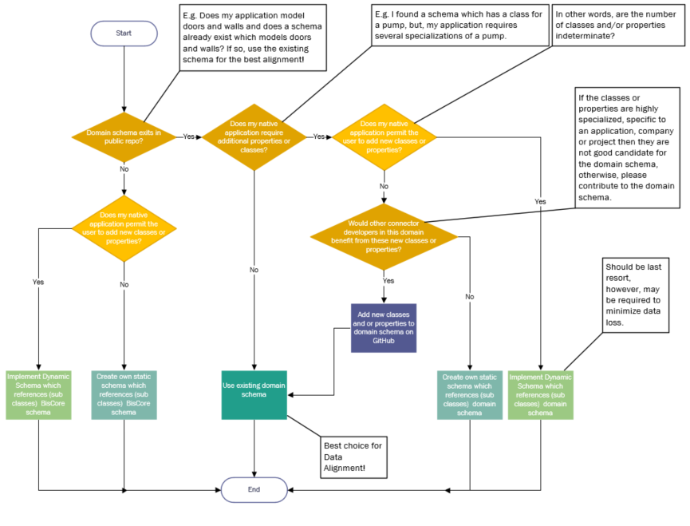

# Write A Connector

## Table of Contents

- [Write A Connector](#write-a-connector)
  - [Table of Contents](#table-of-contents)
  - [Introduction](#introduction)
    - [Preface](#preface)
      - [What is a Connector](#what-is-a-connector)
    - [Who should read this guide?](#who-should-read-this-guide)
    - [Ways to sync data to an iTwin](#ways-to-sync-data-to-an-itwin)
    - [Preliminary Reading](#preliminary-reading)
    - [Structure of the guide](#structure-of-the-guide)
    - [Foundations](#foundations)
      - [iTwin](#itwin)
      - [iModelHub](#imodelhub)
      - [iModel](#imodel)
      - [Briefcases](#briefcases)
      - [Element](#element)
      - [Changeset](#changeset)
  - [The basics of writing a Connector](#the-basics-of-writing-a-connector)
    - [Connecting data to an iTwin](#connecting-data-to-an-itwin)
      - [Data Extraction](#data-extraction)
      - [Data alignment](#data-alignment)
        - [Schemas](#schemas)
          - [Domain Schemas](#domain-schemas)
          - [Dynamic Schemas](#dynamic-schemas)
        - [Display Labels](#display-labels)
        - [CodeValues](#codevalues)
      - [Sync](#sync)
        - [Detecting and pushing changes](#detecting-and-pushing-changes)
        - [Provenance and External Repository](#provenance-and-external-repository)
          - [Case 1 : File metadata](#case-1--file-metadata)
          - [Case 2 : Id mapping](#case-2--id-mapping)
        - [Change detection](#change-detection)
  - [Connector SDK](#connector-sdk)
    - [Getting started](#getting-started)
    - [BridgeRunner](#bridgerunner)
    - [Synchronizer](#synchronizer)
    - [Connector interface methods](#connector-interface-methods)
      - [InitializeJob](#initializejob)
      - [OpenSourceData](#opensourcedata)
      - [ImportDefinitions](#importdefinitions)
      - [ImportDomainSchema](#importdomainschema)
      - [ImportDynamicSchema](#importdynamicschema)
      - [UpdateExistingData](#updateexistingdata)
    - [Execution Sequence](#execution-sequence)
    - [Analyzing the Connector output](#analyzing-the-connector-output)
      - [ECSQL](#ecsql)
      - [Visualizing the output](#visualizing-the-output)
    - [Logs](#logs)
    - [Error Messages](#error-messages)
    - [Building a test for a Connector](#building-a-test-for-a-connector)
  - [Advanced Topics](#advanced-topics)
    - [Job Subjects](#job-subjects)
    - [Schema merging](#schema-merging)
    - [Units and Coordinate systems](#units-and-coordinate-systems)
    - [Dealing with geometry](#dealing-with-geometry)
    - [Authentication](#authentication)
    - [Locks & Codes](#locks--codes)
    - [More information](#more-information)

## Introduction

### Preface

#### What is a Connector

iTwin Connectors play an essential role in enabling a wide range of both Bentley and third-party design applications to contribute to an iTwin. Bentley iTwin Services provides connectors to support a wide array of design applications to ensure that all engineering data can be aggregated into a single digital twin environment inside an iModel.

As explained in the [overview](./imodel-connectors.md), a "Connector" is a program that:

1. Reads information from a data source,
2. Aligns the source data with the BIS schema and preferably a domain schema, and
3. Writes BIS data to an iModel.

A complete list of available connectors can be found in [iTwin Services Community Wiki](https://communities.bentley.com/products/digital-twin-cloud-services/itwin-services/w/synchronization-wiki/47595/supported-applications-and-file-formats)

See [Section on iTwin Synchronization](#ways-to-sync-data-to-an-itwin) for more details on existing connectors.

However, in some instances, where a specific format is not covered, one can start to develop a new Connector using the [iTwin.js SDK](https://github.com/imodeljs/imodeljs)

The imodel-bridge package provided as part of the iTwin.js SDK makes it easier to write an iTwin Connector backend that brings custom data into a digital twin. To run this environment with the iTwin.js library that this package depends on requires a JavaScript engine with es2017 support.

Note: Please keep in mind iModelBridge is sometimes used as a synonym for iTwin Connector since it bridges the gap between input data and a digital twin. When discussing the classes, methods and properties of the SDK and especially in the code examples and snippets provided, this documentation will adhere to the actual names that are published to ensure it is working code. In future versions of the SDK, classes and methods will be renamed from "Bridge" to "Connector" to reflect the latest terminology. This documentation will be updated to match the new names when the new version is released.

### Who should read this guide?

This guide explains how to write a new Connector for a new format or data source.

It is not relevant for someone trying to bring in data for which a Connector already exists or is trying to federate data without it being part of the iTwin.

### Ways to sync data to an iTwin

[The iTwin Synchronizer portal](https://communities.bentley.com/products/digital-twin-cloud-services/itwin-services/w/synchronization-wiki/47606/itwin-synchronizer-portal) and [iTwin Synchronizer client](https://communities.bentley.com/products/digital-twin-cloud-services/itwin-services/w/synchronization-wiki/47597/itwin-synchronizer-client) provide a two different [Ways to sync your data to an iTwin](https://communities.bentley.com/products/digital-twin-cloud-services/itwin-services/w/synchronization-wiki/47596/ways-to-sync-your-data-to-an-itwin#LimPortal) Lastly, the [iTwin Snapshot Application](./tutorials/itwin-snapshot-app) is a free tool for developers to create a read-only, static "snapshot" of an iModel and visualize it.

The following are the various steps involved in that workflow.


More on synchronization using connectors could be found [here](https://communities.bentley.com/products/digital-twin-cloud-services/itwin-services/w/synchronization-wiki/47596/ways-to-sync-your-data-to-an-itwin)

### Preliminary Reading

The guide assumes that you are somewhat familiar with iModel and iTwin concepts. A summary of the relevant topics is provided.
To understand the APIs, you will need to have an understanding of typescript.

Two foundational articles which are highly recommended for background knowledge of building connectors are:

- [Intro to BIS - Information Hierarchy](../bis/intro/information-hierarchy)
- [Intro to BIS - Fabric of the Universe](../bis/intro/fabric-of-the-universe)

### Structure of the guide

### Foundations

This guide section is a quick refresher on the basic concepts one needs to know to write a new Connector.

#### iTwin

An iTwin is an infrastructure digital twin. An iTwin incorporates different types of data repositories -- including drawings, specifications, documents, analytical models, photos, reality meshes, IoT feeds, and enterprise resource and enterprise asset management data -- into a living digital twin. This [link](http://www.bentley.com/itwin) contains additional information about iTwins and Bentley iTwin Services

#### iModelHub

iModelHub is for users who want their iModels hosted by Bentley in Azure. It is responsible for coordinating concurrent access to iModels and changes made to them in [ChangeSets](./glossary#changeset). iTwin Connectors interact with iModelHub using the iTwin.js API. The Connector SDK provides a framework through which a Connector can easily maintain this interaction. For more information about iModelHub, please see [iModelHub](./iModelHub/index)

#### iModel

An iModel is a specialized information container for exchanging data associated with the lifecycle of infrastructure assets. It contains digital components assembled from many sources. They are self-describing, geometrically precise, open, portable, and secure. The file format is based on open source SQLite relational database format and forms the backbone for iTwins

iModels were created to facilitate the sharing and distribution of information regardless of the source and format of the data. iModels are an essential part of the digital twin world. But a digital twin means a lot more than just an iModel.

An iTwin Connector provides a workflow to easily synchronize information from various third-party design applications or data repositories into an iModel.

#### Briefcases

[Briefcases](./glossary#briefcase) are the local copies of iModel that users can acquire to work with the iModel. A Connector will download a briefcase locally using the BridgeRunner and change their copy of iModel. Once all the work is done, the results are then pushed into the iModel. Please see the section on [Execution sequence](#execution-sequence) on the different steps involved.

#### Element

iModel uses BIS schemas to describe the persistence model of the digital twin. An element represents an instance of a [bis:Element](../bis/intro/element-fundamentals) class.

#### Changeset

A changeset represents a file containing changes corresponding to an iModel briefcase. For more information on changesets, please see [ChangeSet]($imodelhub-client)

## The basics of writing a Connector

### Connecting data to an iTwin


There are three main steps that a Connector needs to undertake to bring data into a digital twin

- Extract data from the input source
- Transform and align the data to the digital twin.
- Generate [changesets](./iModelHub/index.md#the-timeline-of-changes-to-an-imodel) and load data into an iModel.

The sections below give a high-level overview of the various parts that go into creating an iTwin Connector.

#### Data Extraction

Extraction of data from the input depends on the source format and a library capable of understanding it. There are two strategies typically employed for data extraction.

1. If the extraction library is compatible with TypeScript, write an extraction module to connect the input data with the alignment phase. The [OpenSourceData](#opensourcedata) method in your Connector typically calls the extraction library.

2. If a TypeScript binding is not available, extract the data into an intermediary format that can be then ingested by the alignment phase. In this case, the intermediate format will be read in the [OpenSourceData](#opensourcedata) method in your Connector.

A two-process architecture may also be employed.

#### Data alignment

An iTwin Connector must carefully transform the source data to BIS-based data in the iModel, and hence each Connector is written for a specific data source.

- Mappings of data are _from_ source _into_ an iModel.
- Typically, a Connector stores enough information about source data to detect the differences in it between runs (connections). In this manner, the Connector generates _changesets_ that are sent to iModelHub. This is the key difference between a Connector and a one-time converter.
- Each connection generates data in the iModel that is isolated from all other connection's data. The resulting combined iModel is partitioned at the Subject level of the iModel; each connection has its own Subject.

For each iTwin Connector author, there will always be two conflicting goals:

1. To transform the data in such a way that it appears logical and "correct" to the users of the authoring application.
2. To transform the data in such a way that data from disparate authoring applications appear consistent.

The appropriate balancing of these two conflicting goals is not an easy task. However, where clear BIS schema types exist, they should always be used.

##### Schemas

See this article on [Importing a schema and bootstrapping definitions](./backend/SchemasAndElementsInTypeScript.md#importing-the-schema)

There are roughly three degrees of customizations you may need to employ to connect and align your data to an iModel. These degrees range from no customization at all (i.e., using the out-of-the-box domain schemas used by many of the Bentley authored Connectors) to extending the domain schemas to introduce additional classes (or subclasses) and properties. Finally, the most extreme level of customization which is to add classes and properties programmatically as your data is read (a.k.a, "dynamic schema").

###### Domain Schemas

Bentley has authored many "domain" schemas to support connectors for many of its authoring applications. For the most aligned data (i.e., data published from your Connector uses the same classes and properties as data published from other connectors), it is best to use a domain schema.

To see what domains exist in BIS, see [Domains](../bis/domains/index#domains)

Sometimes BIS domain schemas are not adequate to capture all the data in the authoring application. The flow chart below can be used to assist in deciding which schema methodology to use.



###### Dynamic Schemas

When the format for incoming data in the native source is not completely known, it is not possible to map the data to a fixed schema. A solution for this scenario is called Dynamic Schema. To avoid losing data, iTwin Connector may dynamically create application-specific schemas whose classes descend from the most appropriate BIS domain classes.

For example, if the native source allows for user-defined classes or properties, then as the classes and properties are read from the native source, they can be added to an iModel schema in-memory and real-time (a.k.a. dynamically). In effect, each native source file has its unique schema.

As an iTwin Connector always runs multiple times to keep an iModel synchronized, the schemas created by previous executions limit the schemas that subsequent executions can use. To provide consistency and enable concise changesets, the Connector adds to the previously-defined schemas (creating new schema versions). This follows the general schema update strategy defined in [Schema Versioning and Generations](../bis/intro/schema-versioning-and-generations.md)

The [DynamicSchema](../bis/domains/corecustomattributes.ecschema/#dynamicschema) custom attribute should be set on customer-specific application schemas. This custom attribute can be found in the standard schema `CoreCustomAttributes,` enabling iModelHub to detect dynamic schemas programmatically. Dynamic schemas require special handling since their name and version are typically duplicated between iModels from different work sets.

##### Display Labels

Wherever practical, the Elements generated from an iTwin Connector should be identifiable through an optimal "Display Label."

As discussed in [Element Fundamentals](../bis/intro/element-fundamentals.md), the Display Labels are created through the following logic:

1. If the UserLabel property is set, it is taken as the Display Label.
2. If the CodeValue is set (and the UserLabel is not set), the CodeValue becomes the Display Label.
3. If neither UserLabel nor CodeValue is set, then a default Display Label is generated from the following data:
   - Class Name
   - Associated Type's Name (if any)

iTwin Connector data transformations should be written considering the Display Label logic; UserLabel is the appropriate property for a Connector to set to control the Display Label (CodeValue should never be set for anything other than coding purposes).

_But what value should an iTwin Connector set UserLabel to?_ There are two goals to consider in the generation of UserLabels. Those goals, in priority order, are:

1. Consistency with source application label usage.
2. Consistency with BIS domain default labeling strategy.

If the source application data has a property that conceptually matches the BIS UserLabel property, that value should always be transformed to UserLabel.

##### CodeValues

Next to the name of the class, CodeValue is the 2nd most important property in an iModel for alignment.  Connectors should set CodeValue when a unique, human-readable identifier exists.

A common condition occurs where a property is generally readable and unique, but an occasional duplicate code value appears in the source data. Connector developers find that insertions are rejected due to duplicate CodeValues and simply forego setting CodeValue altogether - this practice is highly discouraged. It is strongly recommended that the duplicate code values are dealt with rather than skipping the setting of the CodeValues. The duplicate CodeValue could be taken as a cue to clean the source data. For example, are both of these rooms really an "office" or is one "office 301" and the other "office 302" or is one room the "bursar's office" and the other the "registrar's office"? Alternatively, programmatically the Connector developer can adjust the corresponding CodeScope and CodeSpec to ensure uniqueness.

For some elements in some models, such an identifier may really not exist. For example, a simple geometric line element w/o additional business data would not have an obvious, unique, and human-readable identifier, and it would generally be detrimental to generate a CodeValue solely for not leaving it blank. Additionally, generated CodeValues have a high chance of violating the "human-readable" requirement. In such a case, this section should not be taken as a directive to generate such an identifier when it doesn't exist.

Refer to [Element Codes](../bis/intro/codes) in the "Introduction to BIS" documentation.

#### Sync

##### Detecting and pushing changes

Rather than starting over when the source data changes, a Connector should be able to detect and convert only the differences. That makes for compact, meaningful changesets, which are added to the iModel's [timeline](./iModelHub/index.md#the-timeline-of-changes-to-an-imodel).

In the case of source data that was previously converted and has changed, the Connector should update the data in the iModel that were the results of the previous conversion. In the case of source data that was previously converted and has been deleted in the source, the Connector should delete the results of the last conversion. Source data that has been added should be inserted.

To do incremental updates, a Connector must do Id mapping and change detection. The following sections describe how this is implemented.

##### Provenance and External Repository

A Connector is usually dealing with two levels of provenance

1. What is the identity and metadata of a file or repository synchronized into an iModel?
2. What is the identity of the element within that repository?

[RepositoryLink]($core-backend) is a specialization of a UrlLink which has a "Url" property pointing to an external resource or repository and a RepositoryGuid that identifies the external repository.

[ExternalSource]($core-backend) is an information container found in a repository. A few use cases for ExternalSources are listed below:

1. A MicroStation DGN file, for example, may contain multiple models which in turn contain elements. The repository link would point to the DGN file while the ExternalSource would refer the models within the DGN file,
2. In many cases, the external file is not a container for multiple smaller models, so there would be a one-to-one correspondence between an ExternalSource and its RepositoryLink,
3. In the latter case, when there is also no possibility for referencing, layering or otherwise superimposing files and or models, then a common practice is to duplicate elements across one or more files to acheive the effect of reference elements. In this case, one element may refer to multiple ExternalSources and this is done via an [ExternalSourceGroup]($core-backend)

###### Case 1 : File metadata

ExternalSource and ExternalSourceAttachments are used to describe the original external file reference hierarchy.

To look up an existing ExternalSource:

```SQL
select ecinstanceid from bis.ExternalSource where repository=?
```

If an ExternalSource is not found, insert one using

```ts
 function insertExternalSource(iModelDb: IModelDb, repository: Id64String, userLabel: string): Id64String {
    const externalSourceProps: ExternalSourceProps = {
      classFullName: ExternalSource.classFullName,
      model: IModel.repositoryModelId,
      code: Code.createEmpty(),
      userLabel,
      repository: new ExternalSourceIsInRepository(repository),
      connectorName: <connectorName>,
      connectorVersion: <connectorVersion>,
    };
    return iModelDb.elements.insertElement(externalSourceProps);
  }
```

After calling Synchronizer.updateIModel, set the source property of the element's ExternalSourceAspect to point to the correct ExternalSource. Here is a code snippet:

```ts
const ids = ExternalSourceAspect.findBySource(imodel, scope, kind, item.id);
const aspect = imodel.elements.getAspect(ids.aspectId) as ExternalSourceAspect;
if (aspect.source === <externalsource.id>)
    return;
aspect.source = {id: <externalsource.id>};
imodel.elements.updateAspect(aspect)
```

At the start of the Connector's updateExistingData function, examine all existing elements to ensure their sources are set. The code shown above can be used to update an existing element's ExternalSourceAspect.

A Connector must also relate each physical model that it creates to the source document(s) that is used to make that model. Specifically, each Connector must create an ElementHasLinks ECRelationship from the InformationContentElement element representing the model to one or more RepositoryLink elements that describe the source document. When creating a physical partition model, link it to the RepositoryLink that corresponds to the source document. Synchronized.recordDocument in the Connector SDK provides the implementation for the above. Having a stable file identifier is critical to detect changes when the file is processed again by the connector. The connector provides this information in the SourceItem call.

```ts
  public recordDocument(scope: Id64String, sourceItem: SourceItem, kind: string = "DocumentWithBeGuid", knownUrn: string = ""): SynchronizationResults {
    const key = scope + sourceItem.id.toLowerCase();
```

###### Case 2 : Id mapping

Id mapping is a way of looking up the data in the iModel that corresponds to a given piece of source data. If the source data has stable, unique IDs, then Id mapping could be straightforward.

See [updateElementClass](https://github.com/imodeljs/itwin-connector-sample/blob/main/COBie-connector/src/DataAligner.ts) function in the provided sample. When the identifier is provided to the Synchronizer, it is stored inside the ExternalSourceAspect class in the Identifier property.

An iTwin Connector uses the ExternalSourceAspect class defined in the BIS schema to store information about the element.

Note: the [Federation GUID](../bis/intro/element-fundamentals#federationguid) is an optional property available for mapping external ids to elements in the iModel. The Code is also a helpful way of searching for an element based on external data. If the source data does not have stable, unique IDs, then the Connector will have to use some other means of identifying pieces of source data in a stable way. A cryptographic hash of the source data itself can work as a stable Id -- that is, it can be used to identify data that has not changed.

##### Change detection

The connector must use the supplied [Synchronizer](#synchronizer) class to synchronize individual items from the external source with Elements in the iModel. This applies to both definitions and geometric elements.

In its [ImportDefinitions](#importdefinitions) and [UpdateExistingData](#updateexistingdata) functions, the connector must do the following.

For each item found in the external source.

Define a [[SourceItem]] object to capture the identifier, version, and checksum of the item.

```ts
    const sourceItem: SourceItem = {
      id: <<identifies the item in the external source>>,
      version: <<the item’s version number, if available>>,
      checksum: <<the checksum of the item’s content>>,
    };
```

Then, check use [Synchronizer](#synchronizer) to see if the item was previously converted.

```ts
const results = this.synchronizer.detectChanges(scopeId, kind, sourceItem);
```

If so, check to see if the item’s state is unchanged since the previous conversion. In that case, register the fact that the element in the iModel is still required and move on to the next item.

```ts
if (results.state === ItemState.Unchanged) {
  assert(results.id !== undefined);
  this.synchronizer.onElementSeen(results.id);
  return results.id;
}
```

Otherwise, the item is new or if its state has changed. The connector must generate the appropriate BIS element representation of it.

```ts
    const element = convert the item to BIS element …

    if (results.id !== undefined) // in case this is an update
      element.id = results.id;
```

Then ask Synchronizer to write the BIS element to the briefcase. Synchronizer will update the existing element if it exists or insert a new one if not.

```ts
    const sync: SynchronizationResults = {
      element,
      itemState: results.state,
    };
    const status = this.synchronizer.updateIModel(sync, scopeId, sourceItem, kind);

    if (status !== IModelStatus.Success)
      throw new Error(`Failed to write ${sourceItem.id}. Status=${status}`);

    return sync.element.id;

}
```

Note that Synchronizer.updateIModel automatically adds an [[ExternalSourceAspect]] to the element, to keep track of the mapping between it and the external item.

The framework will automatically detect and delete elements and models if the corresponding external items were not updated or declared as seen.

## Connector SDK

### Getting started

You'll need Node.js version ">=12.17.0 <15.0”. Please refer to [Getting Started](../getting-started/index#getting-started) for more details.

The node packages you'll need can be installed using

```Shell
$npm install  @itwin/core-bentley
$npm install  @itwin/ecschema-metadata
$npm install  @itwin/core-geometry
$npm install  @bentley/imodelhub-client
$npm install  @itwin/core-backend
$npm install  @itwin/core-common
$npm install  @bentley/itwin-client
$npm install  @bentley/rbac-client
$npm install  @bentley/telemetry-client

$npm install  --save-dev @itwin/build-tools
$npm install  --save-dev @bentley/config-loader
$npm install  --save-dev @itwin/eslint-plugin
$npm install  --save-dev @itwin/oidc-signin-tool

$npm install  --save-dev chai
$npm install  --save-dev cpx
$npm install  --save-dev eslint
$npm install  --save-dev mocha
$npm install  --save-dev nyc
$npm install  --save-dev rimraf
$npm install  --save-dev typescript
```

Also refer to [Supported Platforms](SupportedPlatforms.md#supported-platforms)

The Connector SDK exposes its functionality through three main classes: BridgeRunner, Synchronizer, and iModelBridge Interface.

### BridgeRunner

Constructor

The BridgeRunner has a constructor which takes a BridgeJobDefArgs as its lone parameter. The BridgeJobDefArgs has properties to describe the significant pieces to the Connector job:

1. sourcePath - your native data (i.e., where the data is coming from) has nothing to do with source code.
2. outputDir - this is the target for your iModel (i.e., where the data is going to)
3. BridgeModule - path to your javascript source code. This must extend IModelBridge and implement its methods
4. IsSnapshot - write the iModel to the disk

Methods

The BridgeRunner has a Synchronize method that runs your bridge module.

```ts
    const bridgeJobDef = new BridgeJobDefArgs();
    bridgeJobDef.sourcePath = "c:\tmp\mynativefile.txt";
    bridgeJobDef.bridgeModule = "./HelloWorldConnector.js";
    bridgeJobDef.outputDir = "c:\tmp\out\";
    bridgeJobDef.isSnapshot = true;

    const runner = new BridgeRunner(bridgeJobDef);
    const status = await runner.synchronize();

```

### Synchronizer

An IModelBridge has a private Synchronizer member which can be gotten or set via the synchronizer accessor. The Synchronizer helps comparing different states of an iModel and updating the iModel based on the results of those comparisons. Several public methods are available to facilitate your connector's interaction with the iModel: recordDocument, detectChanges, updateIModel, setExternalSourceAspect, insertResultsIntoIModel, onElementSeen. Visit the [Change detection](#change-detection) section to see examples of several of the Synchronizer's methods in use.

### Connector interface methods

The bridgeModule assigned to the BridgeJobDefArgs above must extend the IModelBridge class. This class has several methods that must be implemented to customize the behavior of your Connector.

```ts
class HelloWorldConnector extends IModelBridge {

```

#### InitializeJob

Use this method to add any models (e.g., physical, definition, or group) required by your Connector upfront to ensure that the models exist when it is time to populate them with their respective elements.

```ts
  public async initializeJob(): Promise<void> {
    if (ItemState.New === this._sourceDataState) {
      this.createGroupModel();
      this.createPhysicalModel();
      this.createDefinitionModel();
    }
  }

```

See also:

- [DefinitionModel.insert]($core-backend)
- [PhysicalModel.insert]($core-backend)

#### OpenSourceData

Use this method to read your native source data and assign it to a member property of your Connector to be accessed later on when it is time to convert your native object to their counterparts in the iModel.

```ts
  public async openSourceData(sourcePath: string): Promise<void> {
    const json = fs.readFileSync(sourcePath, "utf8");
    this._data = JSON.parse(json);
    this._sourceData = sourcePath;

    const documentStatus = this.getDocumentStatus(); // make sure the repository link is created now, while we are in the repository channel
    this._sourceDataState = documentStatus.itemState;
    this._repositoryLink = documentStatus.element;
  }

```

#### ImportDefinitions

Your source data may have non-graphical data best represented as definitions. Typically, this data requires a single instance for each definition, and the same instance is referenced multiple times. Therefore, it is best to import the definitions upfront all at once. Override the ImportDefinitions method for this purpose.

```ts
  // importDefinitions is for definitions that are written to shared models such as DictionaryModel
  public async importDefinitions(): Promise<any> {
    if (this._sourceDataState === ItemState.Unchanged) {
      return;
    }
    if (this.synchronizer.imodel.codeSpecs.hasName(CodeSpecs.Group)) {
      return;
    }
    const spec = CodeSpec.create(this.synchronizer.imodel, CodeSpecs.Group, CodeScopeSpec.Type.Model);
    this.synchronizer.imodel.codeSpecs.insert(spec);
  }

```

#### ImportDomainSchema

Use this method to import any domain schema that is required to publish your data.

```ts
  public async importDomainSchema(_requestContext: AuthorizedClientRequestContext | ClientRequestContext): Promise<any> {
    if (this._sourceDataState === ItemState.Unchanged) {
      return;
    }
    TestBridgeSchema.registerSchema();
    const fileName = TestBridgeSchema.schemaFilePath;
    await this.synchronizer.imodel.importSchemas(_requestContext, [fileName]);
  }

```

#### ImportDynamicSchema

Please refer to [Implement a Dynamic Schema](ImplementADynamicSchema.md#implement-a-dynamic-schema)

For background on when to use a dynamic schema, please checkout [Dynamic Schemas](#dynamic-schemas)

#### UpdateExistingData

This method is the main workhorse of your Connector. When UpdateExistingData is called, models and definitions should be created and available for insertion of elements (if that is the desired workflow). Note: In the example below, definition elements are being inserted into the definition model at this point as well. Physical elements and Group elements can now be converted.

```ts
  public async updateExistingData() {
    const groupModelId = this.queryGroupModel();
    const physicalModelId = this.queryPhysicalModel();
    const definitionModelId = this.queryDefinitionModel();
    if (undefined === groupModelId || undefined === physicalModelId || undefined === definitionModelId) {
const error =`Unable to find model Id for ${undefined === groupModelId ? ModelNames.Group : (undefined === physicalModelId ? ModelNames.Physical : ModelNames.Definition)}`;
      throw new IModelError(IModelStatus.BadArg, error, Logger.logError, loggerCategory);
    }

    if (this._sourceDataState === ItemState.Unchanged) {
      return;
    }

    if (this._sourceDataState === ItemState.New) {
      this.insertCategories();
      this.insertMaterials();
      this.insertGeometryParts();
    }

    this.convertGroupElements(groupModelId);
    this.convertPhysicalElements(physicalModelId, definitionModelId, groupModelId);
    this.synchronizer.imodel.views.setDefaultViewId(this.createView(definitionModelId, physicalModelId, "TestBridgeView"));
  }

```

### Execution Sequence

The ultimate purpose of a Connector is to synchronize an iModel with the data in one or more source documents. The synchronization step involves authorization, communicating with an iModel server, converting data, and concurrency control. iTwin.js defines a framework in which the Connector itself can focus on the tasks of extraction, alignment, and change-detection. The other functions are handled by classes provided by iTwin.js. The framework is implemented by the BridgeRunner class. A BridgeRunner conducts the overall synchronization process. It loads and calls functions on a Connector at the appropriate points in the sequence. The process may be summarized as follows:

- BridgeRunner: [Opens a local briefcase copy](./backend/IModelDb.md) of the iModel that is to be updated.
- Import or Update Schema
  - Connector: Possibly [import an appropriate BIS schema into the briefcase](./backend/SchemasAndElementsInTypeScript.md#importing-the-schema) or upgrade an existing schema.
  - BridgeRunner: [Push](./backend/IModelDbReadwrite.md#pushing-changes-to-imodelhub) the results to the iModel server.
- Convert Changed Data
  - Connector:
    - Opens to the data source.
    - Detect changes to the source data.
    - [Transform](#data-alignment) the new or changed source data into the target BIS schema.
    - Write the resulting BIS data to the local briefcase.
    - Remove BIS data corresponding to deleted source data.
  - BridgeRunner: Obtain required [Locks and Codes](./backend/ConcurrencyControl.md) from the iModel server and code server.
- BridgeRunner: [Push](./backend/IModelDbReadwrite.md#pushing-changes-to-imodelhub) changes to the iModel server.

### Analyzing the Connector output

As a Connector developer, once the data is transformed into an iModel, one needs tools to analyze the validity of the conversion. The sections below give a summary of the recommended tools which allow a developer to query the graphical and non-graphical data in an iModel.

#### ECSQL

Please see this article on [ECSQL](./ecsqltutorial/index#learning-ecsql) as a prerequisite for this section. The iModelConsole instance below demonstrates how you can use ECSQL to find some of the transformed data in an iModel.

<figure>
  <iframe style="height:40vh;width:60vw;" src="/console/?imodel=House Sample Bak&query=SELECT * FROM bis.Element">
  </iframe>
</figure>

Some sample queries that is helpful to debug Connector output

1. Get the iModel Element id from the identifier from a given source file

   ```sql
    SELECT Element.Id FROM bis.ExternalSourceAspect WHERE Identifier='<Element Id from File>'
   ```

2. List of all known repositories (links to files in an iModel)

   ```sql
   SELECT UserLabel, Url FROM bis.repositoryLink
   ```

3. List of all physical partitions present in the iModel

   ```sql
   SELECT ECInstanceId, CodeValue from bis.physicalpartition
   ```

#### Visualizing the output

To get started, please build it using the instructions provided in the [Tutorials](./tutorials/index#Tutorials)
Once the application is built and running, use the briefcase icon to open the output from the Connector.

### Logs

See this article on [Logging](./common/Logging.md)

### Error Messages

See [BriefcaseStatus]($core-bentley)

### Building a test for a Connector

For examples of Connector tests, you can review the standalone and integration tests in the Connector framework. These tests use the test framework, [mocha](https://www.npmjs.com/package/mocha) and the assertion library, [chai](https://www.npmjs.com/package/chai/v/4.2.0)

## Advanced Topics

### Job Subjects

The Framework will automatically create a uniquely named Subject element in the iModel. The job subject element should be a child of the root subject and must have a unique code.

A Connector is required to scope all of the subjects, definitions, and their models under its job subject element. That is,

- Subjects and partitions that a connector creates should be children of the job subject element,
- The models and other elements that the connector creates should be children of those subjects and partitions or in those models.

### Schema merging

Schemas that have been released for production use in end-user workflows evolve as new capabilities are added, and other improvements are made. To manage and track this schema evolution, schema versioning is used. See Schema Versioning and Generations for details on BIS's schema versioning strategy.

### Units and Coordinate systems

For the basics of coordinate systems in iModels, please see [Geolocation](./geolocation)

All coordinates and distances in an iModel must be stored in meters, and so the Connector must transform source data coordinates and distances into meters.

Before converting any source data, a Connector should account for the presence of an existing coordinate system and/or global origin in the iModel. The following conditions should be considered:

1. If the iModel has coordinate system information, transform the source data into the coordinate system of the iModel. Otherwise, initialize the iModel with the coordinate system appropriate to the source data.

2. If the iModel has a global origin, the Connector must subtract that global origin from the source data as part of the conversion.

Generally, for iModels primarily generated from connectors that deal with building data, a coordinate transform with linear transformation like ECEF will be better.

### Dealing with geometry

Please see the section on [GeometryStream](./common/geometrystream) to understand the persistence of iModel geometry. Inside a Connector, the input data geometry needs to be transformed and persisted as a geometrystream stored with the element. The [geometry library](./geometry/index#the-geometry-library) provided as a part of iTwin.js will aid in the heavy lifting of complex calculations.

Typical workflow to create iModel geometry is

1. Identify the suitable ECClass to persist your data. Typically this is a PhysicalElement
2. Construct a [GeometryStreamBuilder]($core-common) to help with collecting all the geometric primitives that will be used to create the element.
3. Create and map individual geometric primitives from the input data and feed it into the geometrystream. To learn how to create individual primitives that will be fed into the geometrystreambuilder, the [iTwin Geometry sample](/sample-showcase/?group=Geometry+Samples&sample=simple-3d-sample) is a good starting point
4. Provide geometry and other details to the element creation logic. Please see [GeometricElement3d](./backend/createelements#geometricelement3d)

### Authentication

See this article on [AccessToken](./common/AccessToken.md)

### Locks & Codes

The Connector SDK takes care of acquiring locks and codes. It goes to iModelHub to acquire all needed locks and to request all codes used before committing the local transaction. The entire conversion will fail and be rolled back if this step fails. Note that this is why it is so crucial that a Connector must not call SaveChanges directly.

The connector’s channel root element is locked. No elements or models in the channel are locked. As long as the Connector writes elements only to models that it creates, then the framework will never fail to get the necessary access to the models and elements that a Connector inserts or updates.

A Connector is required to scope all of the subjects and definitions and their models under a job-specific ["subject element"](#job-subjects) in the iModel. The only time a Connector should write to a common model, such as the dictionary model, is when it creates its job subject.

By following the job-subject scoping rule, many connectors can write data to a single iModel without conflicts or confusion.

Job-subject scoping also prevents problems with locks and codes. The codes used by a Connector are scoped by the job subject, and there should be no risk of conflicts and hence codes are not reserved.

### More information

For more information please see:

- [BriefcaseDb.open]($core-backend)
- [IModelDb.saveChanges]($core-backend)
- [BriefcaseDb.pullChanges]($core-backend)
- [BriefcaseDb.pushChanges]($core-backend)
- [Insert a Subject element](./backend/createelements#subject)
- [Insert a ModelSelector element](./backend/CreateElements.md#ModelSelector)
- [Insert a CategorySelector element](./backend/CreateElements.md#CategorySelector)
- [Insert a DisplayStyle3d element](./backend/CreateElements.md#DisplayStyle3d)
- [Insert a OrthographicViewDefinition element](./backend/CreateElements.md#OrthographicViewDefinition)
