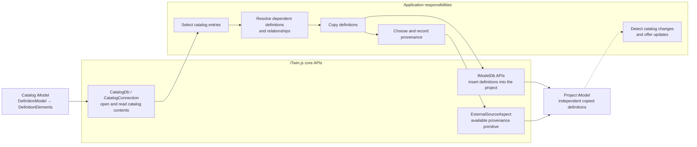

# Catalogs

A **catalog** is an iModel that stores reusable definitions, such as standard component types, templates, and styles. Applications copy the definitions they need into project iModels. On the backend, [CatalogDb]($backend) opens a catalog iModel. [CatalogIModel]($common) contains the types shared by the backend and frontend catalog APIs.

> **New to this topic?** Start with [iModel contents](./IModelContents.md#components-from-catalogs) for guidance on why catalog definitions are copied into a project iModel.

## When to use a catalog

Use a catalog when multiple projects need the same definitions, but each project iModel must retain the definitions it uses. Copying a definition into the project iModel:

- makes the definition available offline,
- tracks changes to the definition with the project,
- allows project elements to reference the definition, and
- preserves the meaning of a placed component if the catalog later changes.

For large catalogs, import only definitions that the project uses or is likely to use. See [Components from Catalogs](./IModelContents.md#components-from-catalogs) for related guidance on what belongs in an iModel.

## Organizing catalog contents

A catalog iModel can contain Models and Elements defined by BIS and domain schemas. Catalog entries are commonly modeled as [DefinitionElement](../../bis/guide/references/glossary.md#definitionelement)s. BIS requires each `DefinitionElement` to belong to a `DefinitionModel`. See [Organizing Definition Elements](../../bis/guide/data-organization/organizing-definition-elements.md).

`CatalogDb` does not require catalog entries to use `DefinitionElement`. The application and its domain schemas choose the element classes and define how to copy them.

Core APIs open the catalog and project iModels, read and write their contents, and provide a primitive for recording [provenance](#provenance-and-identity), which identifies the source of a copied definition. The application must select entries, resolve dependencies, copy definitions, record provenance, and handle updates. The dashed arrow shows that iTwin.js does not detect catalog changes automatically.

Applications use [IModelDb]($backend) APIs to access a catalog's Models and Elements. See [ECSQL](../ECSQL.md) to query catalog contents, [Access Elements](./AccessElements.md) to read individual Elements, and [Create Elements](./CreateElements.md) for inserting copied definitions into a project iModel. Close the `CatalogDb` when finished with it.

## A catalog is a StandaloneDb iModel

On the backend, [CatalogDb]($backend) extends [StandaloneDb]($backend). A catalog iModel therefore has these properties:

- `iTwinId` is always [Guid.empty]($bentley).
- `BriefcaseId` is always [BriefcaseIdValue.Unassigned]($common).
- It has no timeline and cannot apply or generate changesets.
- It does not use an iModelHub checkout.

By contrast, a project iModel uses a [BriefcaseDb]($backend), belongs to an iTwin, and records changes on an iModelHub timeline.

## Copying definitions into a project iModel

`CatalogDb` does not copy definitions into a project iModel. Applications use the standard element-reading and element-creation APIs to implement that operation.

The project owns each copied definition independently of the catalog. The application must decide:

- which definitions to copy,
- what related data must be copied with them,
- how to record their origin, and
- whether and how to offer later updates.

## Provenance and identity

[ExternalSourceAspect](../../bis/domains/Provenance-in-BIS.md#externalsourceaspect) records that an Element originated from an external source. Applications can use it to record the origin of a catalog definition, but `CatalogDb` does not create or manage that relationship.

[FederationGuid](../../bis/guide/fundamentals/federationGuids.md) is not a substitute for provenance. It identifies the real-world entity represented by an Element, not the source from which a definition was copied. Two components placed from the same catalog definition represent different real-world entities and should not share a `FederationGuid`.

## Frontend access

[CatalogConnection]($frontend) opens a catalog iModel from a [NativeApp]($frontend), such as an Electron or mobile application. Its operations use IPC, so it is not available to a purely RPC-based web frontend.

## What remains application-specific

Applications and domain schemas define the parts of the catalog workflow that iTwin.js does not provide:

- deciding which classes and Models comprise a catalog,
- administering and discovering available catalogs,
- copying definitions into project iModels,
- recording provenance,
- detecting and presenting updates, and
- integrating domain-specific definitions.

## Further reading

- **[iModel contents](./IModelContents.md#components-from-catalogs):** guidance on which catalog definitions belong in a project iModel.
- **[Organizing Definition Elements](../../bis/guide/data-organization/organizing-definition-elements.md):** the BIS organization for reusable definitions.
- **[Provenance in BIS](../../bis/domains/Provenance-in-BIS.md):** mechanisms for relating copied data to an external source.
