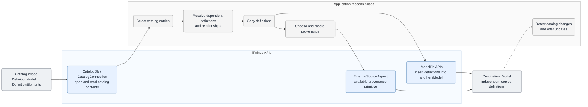

# Catalogs

A **catalog** is an iModel that stores reusable definitions, such as standard component types, templates, and styles. Applications copy the definitions they need into another iModel. On the backend, [CatalogDb]($backend) opens a catalog iModel. The [CatalogIModel]($common) TypeScript namespace defines interfaces and types shared by the backend and frontend catalog APIs.

> **New to this topic?** Start with [iModel contents](./IModelContents.md#components-from-catalogs) for guidance on why catalog definitions are copied into another iModel.

## When to use a catalog

Use a catalog when multiple iModels need the same definitions, but each iModel must retain the definitions it uses. Copying a definition into another iModel:

- makes the definition available offline,
- tracks changes to the definition with that iModel,
- allows other elements in the iModel to reference the definition, and
- preserves the meaning of a placed component if the catalog later changes.

Import only definitions that are used or that the user intends to use. See [Components from Catalogs](./IModelContents.md#components-from-catalogs) for related guidance on what belongs in an iModel.

## Organizing catalog contents

A catalog iModel can contain Models and Elements defined by BIS and domain schemas. Catalog entries are commonly modeled as [DefinitionElement](../../bis/guide/references/glossary.md#definitionelement)s. BIS requires each `DefinitionElement` to belong to a `DefinitionModel`. See [Organizing Definition Elements](../../bis/guide/data-organization/organizing-definition-elements.md).

`CatalogDb` does not require catalog entries to use `DefinitionElement`. The application and its domain schemas choose the element classes and define how to copy them.

The blue boxes are APIs supplied by iTwin.js. The gray boxes are workflow steps that the application must implement, including selecting entries, resolving dependencies, copying definitions, recording [provenance](#provenance-and-identity), and handling updates. The dashed arrow shows that iTwin.js does not detect catalog changes automatically.

Applications use [IModelDb]($backend) APIs to access a catalog's Models and Elements. See [ECSQL](../ECSQL.md) to query catalog contents, [Access Elements](./AccessElements.md) to read individual Elements, and [Create Elements](./CreateElements.md) for inserting copied definitions into another iModel. Close the `CatalogDb` when finished with it.

## A catalog is a StandaloneDb iModel

On the backend, [CatalogDb]($backend) extends [StandaloneDb]($backend). A catalog iModel therefore has these properties:

- `iTwinId` is always [Guid.empty]($bentley).
- `BriefcaseId` is always [BriefcaseIdValue.Unassigned]($common).
- It has no timeline and cannot apply or generate changesets.
- It does not use an iModelHub checkout.

By contrast, an iModel managed by iModelHub uses a [BriefcaseDb]($backend), belongs to an iTwin, and records changes on an iModelHub timeline.

## Copying definitions into another iModel

`CatalogDb` does not copy definitions into another iModel. Applications use the standard element-reading and element-creation APIs to implement that operation.

The destination iModel owns each copied definition independently of the catalog. The application must decide:

- which definitions to copy,
- what related data must be copied with them,
- how to record their origin, and
- whether and how to offer later updates.

## Provenance and identity

[ExternalSourceAspect](../../bis/domains/Provenance-in-BIS.md#externalsourceaspect) records that an Element originated from an external source. Applications can use it to record the origin of a catalog definition, but `CatalogDb` does not create or manage that relationship.

[FederationGuid](../../bis/guide/fundamentals/federationGuids.md) provides stable identity for a definition across iModels. Preserve a catalog definition's `FederationGuid` when copying that definition into another iModel. Assign a different `FederationGuid` when a changed definition becomes a new definition version. A `FederationGuid` identifies the definition version, but not the catalog and catalog version from which it was copied, so applications must record that provenance separately.

## What remains application-specific

Applications and domain schemas define the parts of the catalog workflow that iTwin.js does not provide:

- deciding which classes and Models comprise a catalog,
- administering and discovering available catalogs,
- copying definitions into other iModels,
- recording provenance,
- detecting and presenting updates, and
- integrating domain-specific definitions.

## Further reading

- **[iModel contents](./IModelContents.md#components-from-catalogs):** guidance on which catalog definitions belong in an iModel.
- **[CatalogDb]($backend) and [CatalogConnection]($frontend):** API references for backend and frontend access to a catalog iModel.
- **[Organizing Definition Elements](../../bis/guide/data-organization/organizing-definition-elements.md):** the BIS organization for reusable definitions.
- **[Provenance in BIS](../../bis/domains/Provenance-in-BIS.md):** mechanisms for relating copied data to an external source.
