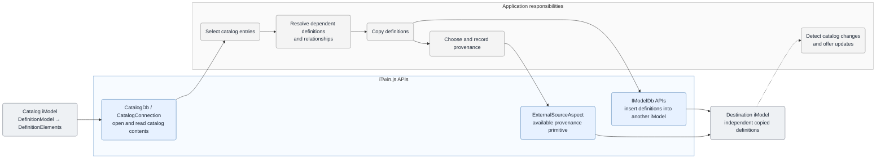

# Catalogs (CatalogDb)

This page covers the backend APIs for working with a **catalog**, a repository of reusable definitions that applications copy into iModels, when that catalog is stored as an iModel. The concepts (what a catalog is, what makes up a component, how cached definitions are organized in an iModel, and how their provenance is recorded) are described in [Catalogs in the BIS Guide](../../bis/guide/data-organization/catalogs.md).

Storing a catalog as an iModel is one possible implementation, not a requirement. A catalog authority may host and serve its definitions any way it chooses; the BIS organization and provenance patterns apply to the *destination* iModel regardless of how the catalog itself is stored.

## A catalog iModel is a StandaloneDb

On the backend, [CatalogDb]($backend) extends [StandaloneDb]($backend) and opens a catalog iModel. The [CatalogIModel]($common) TypeScript namespace defines interfaces and types shared by the backend and frontend catalog APIs; on the frontend, use [CatalogConnection]($frontend).

A catalog iModel has these properties:

- `iTwinId` is always [Guid.empty]($bentley).
- `BriefcaseId` is always [BriefcaseIdValue.Unassigned]($common).
- It has no timeline and cannot apply or generate changesets.
- It does not use an iModelHub checkout.

By contrast, an iModel managed by iModelHub uses a [BriefcaseDb]($backend), belongs to an iTwin, and records changes on an iModelHub timeline.

## Reading catalog contents

A catalog iModel contains Models and Elements defined by BIS and domain schemas, like any other iModel. Applications read it with the standard APIs:

- [ECSQL](../ECSQL.md) to query catalog contents,
- [Access Elements](./AccessElements.md) to read individual Elements.

Close the `CatalogDb` when finished with it.

## Copying definitions into another iModel

`CatalogDb` does not copy definitions into another iModel. Applications implement the import workflow with the standard element-reading and element-creation APIs (see [Create Elements](./CreateElements.md)).

```mermaid
graph LR
    C("Catalog iModel<br/>DefinitionModel → DefinitionElements")
    P("Destination iModel<br/>independent copied definitions")

    subgraph Core["iTwin.js APIs"]
        direction TB
        R("CatalogDb / CatalogConnection<br/>open and read catalog contents")
        E("ExternalSourceAspect<br/>available provenance primitive")
        W("IModelDb APIs<br/>insert definitions into another iModel")
        R ~~~ E
        E ~~~ W
    end

    subgraph App["Application responsibilities"]
        S("Select catalog entries")
        D("Resolve dependent definitions<br/>and relationships")
        X("Copy definitions")
        O("Choose and record provenance")
        U("Detect catalog changes<br/>and offer updates")
        S --> D --> X --> O
    end

    C --> R
    R --> S
    X --> W
    W --> P
    O --> E
    E --> P
    P -.-> U

    classDef data fill:#eef1f4,stroke:#6b7280,color:#1f2937
    classDef core fill:#e7f1ff,stroke:#477db3,color:#1f2937
    classDef app fill:#f4f4f4,stroke:#8a8a8a,color:#1f2937
    class C,P data
    class R,E,W core
    class S,D,X,O,U app
    style Core fill:#f7fbff,stroke:#8fb3d9,stroke-width:1px
    style App fill:#fafafa,stroke:#b8b8b8,stroke-width:1px
```

The blue boxes are APIs supplied by iTwin.js. The gray boxes are workflow steps that the application must implement. The dashed arrow shows that iTwin.js does not detect catalog changes automatically.

The application must decide:

- which definitions to copy: the entry-point `DefinitionElement` plus all of its dependencies (sub-models, geometric elements, categories, materials, aspects, and relationships),
- how to record their origin: follow the [recommended provenance mapping](../../bis/guide/data-organization/catalogs.md#provenance-of-cached-definitions) using [RepositoryLink]($backend), [ExternalSourceAspect]($backend), and `FederationGuid`, and
- whether and how to offer later updates when the catalog publishes a new version.

Copying only the entry-point element produces a broken definition. See [Components and their dependencies](../../bis/guide/data-organization/catalogs.md#components-and-their-dependencies) for what the full set of dependencies contains and why. The destination iModel owns each copied definition independently of the catalog.

## What remains application-specific

Applications and domain schemas define the parts of the catalog workflow that iTwin.js does not provide:

- administering and discovering available catalogs,
- selecting catalog entries; selection UX is application- and context-specific (an application presents domain choices such as "pipe type", not raw definition elements),
- traversing dependencies and copying definitions into other iModels,
- recording provenance,
- detecting and presenting updates, and
- integrating domain-specific definitions.

## Further reading

- **[Catalogs in the BIS Guide](../../bis/guide/data-organization/catalogs.md):** catalog concepts, data organization, and provenance in the destination iModel.
- **[iModel contents](./IModelContents.md#components-from-catalogs):** guidance on which catalog definitions belong in an iModel.
- **[CatalogDb]($backend) and [CatalogConnection]($frontend):** API references for backend and frontend access to a catalog iModel.
- **[Provenance in BIS](../../bis/domains/Provenance-in-BIS.md):** mechanisms for relating copied data to an external source.
