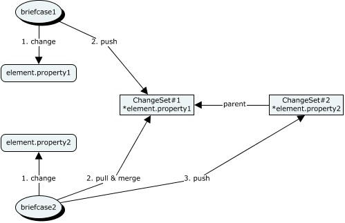

# Concurrency Control

Concurrency control is a way to coordinate simultaneous changes among multiple Briefcases while preserving data integrity. Concurrency control is implemented in the code of an app and is based on the identity of a briefcase. Concurrency control should not to be confused with user access control (the "right" to make changes based on roles). To make coordinated changes, an app must follow 2 basic rules:

1. Optionally lock models and elements before modifying them, depending on the iModel's [concurrency control policy](#concurrency-control-policies)
1. [Pull and merge](./IModelDbSync.md) before pushing.

An iModel has a concurrency control policy that specifies how multiple briefcases may modify elements. The policy may stipulate that locks must be used, forcing transactions to be sequential (pessimistic), or it may specify change-merging with conflict-resolution to combine the results of simultaneous transactions (optimistic).

The concurrency control policy for an iModel is established when it is created in iModelHub via the `noLocks` parameter of [BackendHubAccess.createNewIModel]. If `noLocks` is not specified (the default), iTwin.js will enforce that the appropriate locks must be acquired *before* modifying elements.

An app uses [BriefcaseDb.locks]($backend) to follow concurrency control rules.

Locks are associated with a briefcase while it is making changes and are (optionally) released when it pushes.

## Background

This article assumes that you already know that:

- An iModel is a multi-user database
- An app works with a [briefcase](../Glossary.md#Briefcase) using the [BriefcaseDb]($backend) class.
- A briefcase has a unique [BriefcaseId]($common) that is issued and tracked by [iModelHub]($docs/learning/IModelHub/index.md).
- Changes are captured and distributed in the form of [Changesets]($docs/learning/IModelHub/briefcases.md).
- Changesets are ordered in a sequence that is called the [timeline]($docs/learning/IModelHub/index.md#the-timeline-of-changes-to-an-imodel) of the iModel. A changeset's position on the timeline is indicated by its [ChangesetIndex]($common).
- Changesets are stored in iModelHub

## Concurrency Glossary

| Term                                | Definition                                                                                                                                                                                                                                                          |
| ----------------------------------- | ------------------------------------------------------------------------------------------------------------------------------------------------------------------------------------------------------------------------------------------------------------------- |
| **Base**                            | Changeset B is _based_ on Changeset A if B comes after A in the timeline.                                                                                                                                                                                           |
| **Change-merging**                  | Same as merge.                                                                                                                                                                                                                                                      |
| **Concurrency Control**             | How to coordinate simultaneous transactions while preserving data integrity.                                                                                                                                                                                        |
| **Concurrency Control Policy**      | The rules that apps must follow when changing models and elements. May be [optimistic](#optimistic-concurrency-control) or [pessimistic](#pessimistic-concurrency-control).                                                                                         |
| **Conflict**                        | Arises when two Changesets change the same object in different ways, where neither Changeset is based on the other.                                                                                                                                                 |
| **Conflict-resolution**             | Choosing how to resolve a conflict.                                                                                                                                                                                                                                 |
| **Lock**                            | The right to access an Element and its descendant Elements.                                                                                                                                                                                                         |
| **Merge**                           | Apply a Changeset to a briefcase.                                                                                                                                                                                                                                   |
| **Optimistic Concurrency Control**  | A policy that allows apps to elements without acquiring locks.                                                                                                                                                                                                      |
| **Pessimistic Concurrency Control** | A policy that requires apps to acquire locks before changing elements.                                                                                                                                                                                              |
| **Push**                            | Upload a Changeset to iModelHub                                                                                                                                                                                                                                     |
| **Pull**                            | Download a Changeset from iModelHub. See [IModelDb synchronization](./IModelDbSync.md)                                                                                                                                                                              |
| **Tip**                             | The most recent version of an iModel. Also, the most recent Changeset in the timeline.                                                                                                                                                                              |
| **Transaction**                     | A set of changes that are committed or abandoned atomically, making up a unit of work. A transaction is *committed* by calling [BriefcaseDb.saveChanges]($backend). Multiple transactions to a briefcase are combined into a [Changeset](../Glossary.md#Changeset). |
| **Version**                         | The state of an iModel as of a specific point in its timeline, that is, the result of the Changesets up to that point.                                                                                                                                              |

## Concurrency Control Policies

There are two locking policy options: pessimistic and optimistic. The choice of policy is determined when the iModel is created and cannot be changed. Whenever a [BriefcaseDb]($backend) is opened, the appropriate policy is enforced.

### Pessimistic Concurrency Control

The pessimistic concurrency policy requires that Elements must be locked before changes can be made to them. Locking prevents concurrent changes and forces briefcase transactions affecting the same models and elements to merge without conflicts.

#### Lock Types

Locks apply (only) to Elements and are acquired on behalf of a briefcase by specifying a Lock type and an ElementId.

There are two types of locks:

- Exclusive Lock: Reserves an Element for exclusive access. Only holders of an exclusive lock may modify or delete an Element.
- Shared Lock: Holding a Shared lock on an Element blocks other briefcases from acquiring the Exclusive lock on that Element.

#### Acquiring Locks On Elements

Locks are acquired via the [LockControl]($backend) interface by calling `BriefcaseDb.locks.acquireExclusiveLock` and `BriefcaseDb.locks.acquireSharedLock`, supplying one or more ElementIds.

Rules for acquiring locks:

- Ony one briefcase at a time may hold the Exclusive lock on an Element.
- You may only obtain the Exclusive lock on an Element if your `BriefcaseDb.changeset.index` is equal or greater than the [ChangesetIndex]($common) specified the last time the lock was released. That is, you may only acquire the Exclusive lock on an Element if your briefcase holds its most recent state.
- You cannot obtain a Shared lock on an Element while the Exclusive lock is held by another briefcase.
- An attempt to obtain a lock on an Element (either Exclusive or Shared) requires also obtaining the Shared lock on its Model and its Parent, if it has one. This is both automatic and recursive. That is, a request to obtain a single lock may, in fact, require many locks all the way to the top of the hierarchy, if they are not already held. If any required lock is unavailable, no locks are obtained.

The "root" ElementId is the [IModel.repositoryModelId]($common). For convenience, the Exclusive lock on the root Element is called the **Schema Lock**. From the rules above you can tell that to obtain the Schema Lock of an iModel no other briefcase can be *holding any* locks. Further, while the Schema Lock is held, no other briefcases may *obtain any* locks.

To work with an iModel with pessimistic concurrency control policy, apps must follow the pull -> lock -> change -> push pattern.

For reference, the pessimistic locking rules are as follows:

| Operation      | Locks Required                                      |
| -------------- | --------------------------------------------------- |
| Insert element | Shared lock on Model and Parent Element, if present |
| Modify element | Exclusive Lock                                      |
| Delete element | Exclusive Lock                                      |

Notes:

- these rules only apply to *direct* changes to Elements. *Indirect* changes, made during change propagation from ElementDrivesElement relationships, do *not* require locks.

- the lock on a Model is really a lock on its modeled element, since they have the same Id.

#### Releasing Locks

Locks are normally released when the briefcase pushes its changes via [BriefcaseDb.pushChanges]($backend), though they may optionally be retained via the `retainLocks` option. If locks are acquired and no changes were made, or if all changes were abandoned, locks can be manually released via [BriefcaseDb.locks.releaseAllLocks].

### Optimistic Concurrency Control

An optimistic concurrency policy allows apps to modify elements and models in an iModel without acquiring locks. In this case, the app uses change-merging to reconcile local changes before pushing.

Working without locks opens up the possibility that other apps may add Changesets to the timeline while the local editing session is in progress. The briefcase must then merge before it can push.

Suppose, for example, that two briefcases were editing different properties of the same element at the same time. Suppose that the first briefcase pushed first, creating Changeset#1. Now, the second briefcase must pull and merge before it can push.

#### Conflicts

Working without locks also opens up the possibility that local changes may overlap with in-coming Changesets. When Changesets are merged into the briefcase, the change-merging algorithm checks for conflicts. The algorithm merges changes and checks for conflicts at the level of individual element properties. In the example above, the two briefcases changed different properties of the same element. That is not a conflict. Likewise, it is not a conflict for two briefcases both to set a property to the same value, or for two briefcases both to delete an element. Conflicts arise if the two briefcases set the same property to different values, or if one briefcase modifies a property and the other deletes the element.

If conflicts are found, the change-merging algorithm applies the iModel's conflict-resolution policy.

| Local Change | RemoteChange | Resolution                                  |
| ------------ | ------------ | ------------------------------------------- |
| update       | update       | RejectIncomingChange                        |
| update       | delete       | AcceptIncomingChange (reject not support)   |
| delete       | update       | RejectIncomingChange (accept not supported) |

Property-level change-merging is very fine-grained, and so it allows many kinds of changes to be made simultaneously without conflicts. A schema may also specify rules to check for conflicts on a higher level.

## Changesets and Schema Changes

The Schema Lock must be acquired before importing a schema into a briefcase. Also, schema changes must be isolated in a dedicated Changeset, separate from other kinds of changes. This is true for either concurrency control policy. To import a schema, an app must:

1. Pull and merge to synchronize with the tip.
1. Push any local changes to iModelHub.
1. Obtain the Schema Lock.
1. Perform the schema import in a local transaction.
1. Push the results of the schema import as a Changeset to iModelHub.
1. Release the Schema Lock.
