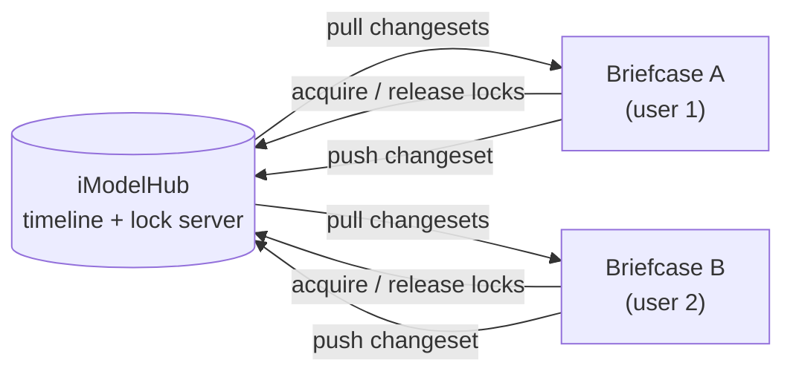
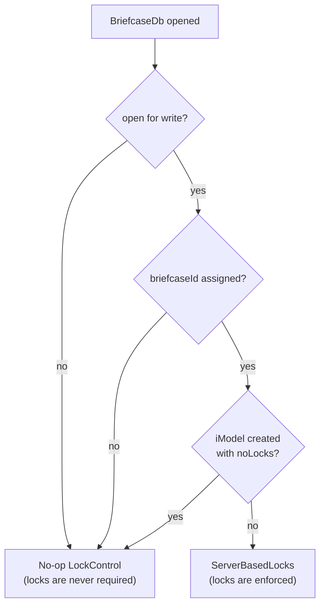
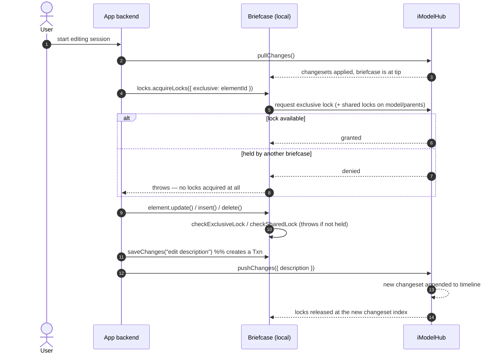
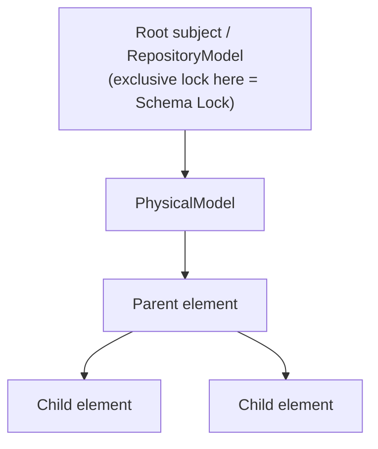
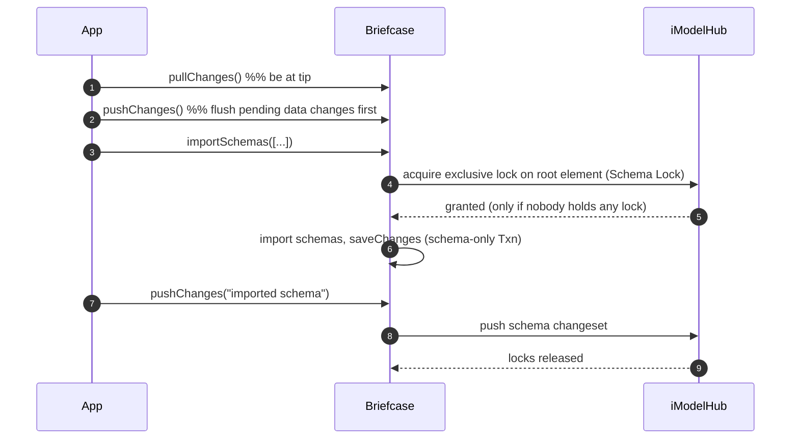
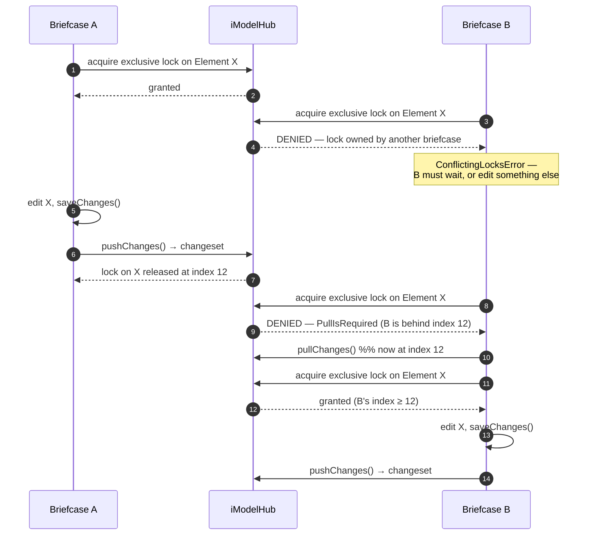

# Concurrency Control

*How iTwin.js coordinates simultaneous edits from many users on the same iModel.*

An iModel is a multi-user database that is edited through *briefcases*. Every user (or agent, or connector) works on their **own local copy** of the iModel, edits it offline, and then publishes their work as a [Changeset](../Glossary.md#changeset) to iModelHub. Concurrency control is the set of rules that make this safe: it decides **who is allowed to change what, and when**, so that everyone's work can be combined into a single, consistent timeline.

Concurrency control is *not* user access control. It says nothing about whether a person is *permitted* to edit; it only coordinates edits that are already permitted.

## Before you start

This article assumes you already know that:

- An app works with a [briefcase](../Glossary.md#briefcase) using the [BriefcaseDb]($backend) class.
- A briefcase has a unique [BriefcaseId]($common) issued and tracked by iModelHub.
- Changes are captured and distributed as [Changesets](../IModelHub/briefcases.md), ordered on the iModel's [timeline](../IModelHub/index.md#the-timeline-of-changes-to-an-imodel). A changeset's position is its [ChangesetIndex]($common).
- Local edits are grouped into transactions ("Txns") by [BriefcaseDb.saveChanges]($backend), and one or more Txns become one Changeset when you push.

Related reading: [Synchronizing with iModelHub](./IModelDbSync.md), [Pull merge & conflict resolution](./PullMerge.md), [EditTxn](./EditTxn.md), [Channels](./Channel.md), [Reserving Codes](./ReserveCodes.md).

## The mental model in one picture


```mermaid
graph LR
    Hub[("iModelHub<br/>timeline + lock server")]
    B1["Briefcase A<br/>(user 1)"]
    B2["Briefcase B<br/>(user 2)"]

    Hub -- "pull changesets" --> B1
    Hub -- "pull changesets" --> B2
    B1 -- "acquire / release locks" --> Hub
    B2 -- "acquire / release locks" --> Hub
    B1 -- "push changeset" --> Hub
    B2 -- "push changeset" --> Hub
```

Two independent services are involved:

- The **timeline** stores changesets in a strict order. You can only push a changeset that is based on the current tip.
- The **lock server** hands out locks on elements. A lock is granted to a *briefcase*, not to a user, and it is remembered along with the changeset index at which it was last released.

## Glossary

| Term | Definition |
| --- | --- |
| **Base** | Changeset B is *based on* changeset A if B comes after A in the timeline. |
| **Conflict** | Two changesets change the same data in incompatible ways, and neither is based on the other. |
| **Lock** | The right of a briefcase to change (Exclusive) or to depend on (Shared) an element. |
| **Merge / Rebase** | Applying incoming changesets to a briefcase that has local changes. See [PullMerge](./PullMerge.md). |
| **Push** | Upload a changeset to iModelHub. |
| **Pull** | Download and apply changesets from iModelHub. |
| **Schema Lock** | The exclusive lock on the root element ([IModel.repositoryModelId]($common)). Effectively locks the whole iModel. |
| **Tip** | The most recent changeset on the timeline; the newest state of the iModel. |
| **Txn** | A local transaction, created by [BriefcaseDb.saveChanges]($backend). Many Txns combine into one changeset. |
| **Indirect change** | A change made by the system during change propagation (for example, driven by `ElementDrivesElement`) rather than directly by app code. |

## Two policies: locking and "no locks"

The policy is fixed when the iModel is created in iModelHub, via the `noLocks` parameter of [BackendHubAccess.createNewIModel]($backend). It cannot be changed afterwards.

| Policy | Behavior |
| --- | --- |
| **Locking (default)** | Locks *must* be held before elements/models are changed. Editing is serialized per element, so low-level conflicts are essentially impossible. |
| **No locks** (`noLocks: true`) | No locks are required or acquired. Simultaneous edits are reconciled by [change merging / rebase](./PullMerge.md). |

Every [BriefcaseDb]($backend) exposes [BriefcaseDb.locks]($backend), a [LockControl]($backend) implementation chosen automatically when the briefcase is opened:


```mermaid
flowchart TD
    A["BriefcaseDb opened"] --> B{"open for write?"}
    B -- no --> N["No-op LockControl<br/>(locks are never required)"]
    B -- yes --> C{"briefcaseId assigned?"}
    C -- no --> N
    C -- yes --> D{"iModel created<br/>with noLocks?"}
    D -- yes --> N
    D -- no --> S["ServerBasedLocks<br/>(locks are enforced)"]
```

You can check which one you got with `briefcase.locks.isServerBased`. The no-op implementation accepts every call and reports that no lock is ever held, so **the same application code works under either policy** — you should always request the locks your edits need.

## The editing lifecycle

Under the locking policy the rule is: **pull → lock → change → save → push → release**.


```mermaid
sequenceDiagram
    autonumber
    actor User
    participant App as App backend
    participant BC as Briefcase (local)
    participant Hub as iModelHub

    User->>App: start editing session
    App->>Hub: pullChanges()
    Hub-->>BC: changesets applied, briefcase is at tip
    App->>BC: locks.acquireLocks({ exclusive: elementId })
    BC->>Hub: request exclusive lock (+ shared locks on model/parents)
    alt lock available
        Hub-->>BC: granted
    else held by another briefcase
        Hub-->>BC: denied
        BC-->>App: throws — no locks acquired at all
    end
    App->>BC: element.update() / insert() / delete()
    BC->>BC: checkExclusiveLock / checkSharedLock (throws if not held)
    App->>BC: saveChanges("edit description")  %% creates a Txn
    App->>Hub: pushChanges({ description })
    Hub-->>Hub: new changeset appended to timeline
    Hub-->>BC: locks released at the new changeset index
```

Key points illustrated above:

- **Locks are checked at the moment of the edit**, not at push time. `Element.onUpdate`, `Element.onDelete`, `Model.onInsert`, aspect handlers, etc. all call [LockControl.checkExclusiveLock]($backend) / [LockControl.checkSharedLock]($backend) and throw `IModelStatus.LockNotHeld` when a required lock is missing.
- **Lock acquisition is all-or-nothing.** If any required lock in the request cannot be granted, none of them are.
- **Failures come in three distinct flavors** — see [Acquiring locks on elements](#acquiring-locks-on-elements).

## Acquiring locks on elements

Locks are requested with [LockControl.acquireLocks]($backend), passing the elements you want a `shared` and/or an `exclusive` lock on. The request goes to the lock server, which grants all of them or none of them.

Acquisition can fail for two reasons, and a third failure happens later at edit time. They are easy to confuse:

| Failure | Raised by | Meaning |
| --- | --- | --- |
| `IModelHubStatus.LockOwnedByAnotherBriefcase` (a `ConflictingLocksError`, see [BackendHubAccess.acquireLocks]($backend)) | The lock server, during acquisition | Someone else holds a conflicting lock. Wait, or edit something else. |
| `IModelHubStatus.PullIsRequired` | The lock server, during acquisition | The lock is free, but your briefcase is behind the changeset index at which it was last released. Pull, then retry. |
| `IModelStatus.LockNotHeld` | Your own briefcase, at the moment of the edit | You attempted an edit without the required lock. This never reaches the server. |

The freshness rule behind `PullIsRequired` is applied per lock:

- To acquire a **shared** lock, your `changeset.index` must be at least the index at which that element's *exclusive* lock was last released.
- To acquire the **exclusive** lock, your index must be at least the greater of the last *exclusive* release index and the last *shared* release index.

In other words, **you must be up to date with an element before you can own it**. Because owner shared locks are requested automatically (see below), a `PullIsRequired` can be triggered by an ancestor you never mentioned in your request. Pulling to tip before locking avoids all of this.

## Lock types and the ownership hierarchy

There are two lock states:

- **Exclusive** — only the holder may modify or delete the element. Only one briefcase at a time.
- **Shared** — prevents any other briefcase from taking the exclusive lock, but many briefcases can hold it simultaneously. This is what protects a model or a parent while you insert children into it.

Locks apply to **elements**. A lock on a *model* is really the lock on the model's *modeled element*, because they share the same Id.

Elements form an ownership hierarchy through their `model` and `parent`, rooted at [IModel.repositoryModelId]($common):


```mermaid
graph TD
    Root["Root subject / RepositoryModel<br/>(exclusive lock here = Schema Lock)"]
    M1["PhysicalModel"]
    P["Parent element"]
    C1["Child element"]
    C2["Child element"]
    Root --> M1 --> P
    P --> C1
    P --> C2
```

Two rules follow from this hierarchy, and they are the source of most "why did I need *that* lock?" questions:

1. **Locking downward is implicit.** Holding the exclusive lock on an element implicitly gives you the exclusive lock on all its children, and holding the exclusive lock on a model's element gives you exclusive control of everything in that model. `holdsExclusiveLock` walks up through models and parents to discover this.
2. **Locking upward is automatic.** Requesting any lock on an element also requires shared locks on its model and parent, recursively, up to the root. [LockControl.acquireLocks]($backend) computes and requests those extra shared locks for you — you don't have to list them.

So this single call:

```ts
await briefcase.locks.acquireLocks({ exclusive: elementId });
```

may actually request the exclusive lock on `elementId` **plus** shared locks on its parent element, its model's element, that model's parent model, and so on.

### Which operations need which locks

| Operation | Locks required |
| --- | --- |
| Insert an element | **Shared** on its model, and on its parent element if it has one |
| Update an element | **Exclusive** on that element |
| Delete an element | **Exclusive** on that element |
| Insert / update / delete an ElementAspect | **Exclusive** on the *owning element* |
| Insert a model | **Shared** on the parent model |
| Update or delete a model | **Exclusive** on the model (i.e. its modeled element) |
| Change an element's parent | **Exclusive** on the element, **shared** on the new parent |
| Change an element's model | **Exclusive** on *every element in the moved subtree*, **shared** on the target model |
| Import a schema, or a profile/domain upgrade that transforms data | **Schema Lock** (see below) |

Because acquiring the exclusive lock on the model's element implicitly covers everything in the model, a bulk editor commonly takes one exclusive lock on the model instead of thousands of element locks.

## Locks you get automatically

Not every lock has to be requested by hand. These are handled for you:

| Situation | What happens |
| --- | --- |
| **Elements you just created** | An element inserted by your briefcase since its last push is *implicitly* exclusively locked — no server round trip is needed to edit or delete it in the same session. This is inferred from a recorded local-Id "high-water mark" (see below), plus an explicit record for the cases the high-water mark can't cover. |
| **Owner locks** | As described above, `acquireLocks` adds the shared locks on models and parents up the hierarchy. |
| **Schema import** | [IModelDb.importSchemas]($backend) acquires the lock it needs (schema lock, or a shared root lock, depending on configuration) before importing. You still control the surrounding pull/push. |
| **Dropping schemas** | `dropSchemas` acquires the schema lock and releases all locks when finished. |
| **Profile & domain schema upgrade** | [BriefcaseDb.upgradeSchemas]($backend) first attempts the upgrade *without* any lock. Only if the upgrade reports that a data transformation is required does it acquire the schema lock and retry, releasing all locks when done. |
| **Indirect changes** | Changes made during change propagation (for example, from `ElementDrivesElement` dependency handlers) run in "indirect" Txn mode, where lock checks are suspended. Only *direct* edits by app code require locks. |
| **Push** | [BriefcaseDb.pushChanges]($backend) releases all locks afterwards unless you pass `retainLocks: true`. |

## The Schema Lock

The schema lock is simply *the exclusive lock on the root element*, [IModel.repositoryModelId]($common). Because of the hierarchy rules, that has dramatic consequences:

- To acquire it, **no other briefcase may hold any lock at all**.
- While it is held, **no other briefcase can acquire any lock**.

It is, in effect, an exclusive lock on the entire iModel. Use [IModelDb.acquireSchemaLock]($backend) and [IModelDb.holdsSchemaLock]($backend).

Schema changes should also be isolated in their own changeset, separate from data changes. `importSchemas` acquires the lock for you, but **the surrounding pull/push sequence is the application's responsibility**:


```mermaid
sequenceDiagram
    autonumber
    participant App
    participant BC as Briefcase
    participant Hub as iModelHub

    App->>BC: pullChanges()   %% be at tip
    App->>BC: pushChanges()   %% flush pending data changes first
    App->>BC: importSchemas([...])
    BC->>Hub: acquire exclusive lock on root element (Schema Lock)
    Hub-->>BC: granted (only if nobody holds any lock)
    BC->>BC: import schemas, saveChanges (schema-only Txn)
    App->>BC: pushChanges("imported schema")
    BC->>Hub: push schema changeset
    Hub-->>BC: locks released
```

Two variations relax this bottleneck:

- **Schema Sync.** When schema sync is enabled, the import is first attempted against a shared schema-sync container *without* the schema lock. Only if the native importer reports that a data transformation is required does it fall back to acquiring the full schema lock and retrying.
- **Semantic rebase** (`IModelHost.useSemanticRebase`). Schema imports take a *shared* lock on the root element instead of the exclusive one, allowing concurrent schema imports that are later reconciled semantically.

Under a `noLocks` iModel, `acquireSchemaLock` is a no-op — the same code path still works, but nothing is actually reserved.

### Profile and domain schema upgrades

[BriefcaseDb.upgradeSchemas]($backend) follows the same "only lock if you must" strategy. It upgrades the profile, then the domain schemas, each with the briefcase closed and reopened, pushing a changeset after each phase that produced changes. It takes **no lock at all** in the common case. Only when an upgrade fails with `BE_SQLITE_ERROR_DataTransformRequired` — meaning existing data must be rewritten — does it acquire the schema lock, retry the upgrade with the lock held, and release all locks in a `finally` block. When schema sync is enabled, the upgrade is applied through the schema-sync container instead.

The practical consequence: an upgrade that only adds schema definitions will not block other briefcases, while a data-transforming upgrade will lock the whole iModel for its duration.

## Two users editing at the same time

### Under the locking policy


```mermaid
sequenceDiagram
    autonumber
    participant A as Briefcase A
    participant Hub as iModelHub
    participant B as Briefcase B

    A->>Hub: acquire exclusive lock on Element X
    Hub-->>A: granted
    B->>Hub: acquire exclusive lock on Element X
    Hub-->>B: DENIED — lock owned by another briefcase
    Note over B: ConflictingLocksError —<br/>B must wait, or edit something else

    A->>A: edit X, saveChanges()
    A->>Hub: pushChanges()  → changeset #12
    Hub-->>A: lock on X released at index 12

    B->>Hub: acquire exclusive lock on Element X
    Hub-->>B: DENIED — PullIsRequired (B is behind index 12)
    B->>Hub: pullChanges()   %% now at index 12
    B->>Hub: acquire exclusive lock on Element X
    Hub-->>B: granted (B's index ≥ 12)
    B->>B: edit X, saveChanges()
    B->>Hub: pushChanges()  → changeset #13
```

Note the crucial middle step: B is refused the lock even *after* A pushes, until B has pulled up to A's changeset. This is what guarantees that B's edit is applied to the state A produced, never to a stale copy.

Meanwhile, edits to *different* elements proceed in full parallel; the locks only serialize the overlapping parts.

### Under `noLocks`

Nothing blocks either briefcase. Whoever pushes first wins the timeline; the other must pull and merge, and the [rebase](./PullMerge.md) machinery reconciles the changes (rolling back local Txns, applying the incoming changesets, and replaying local changes on top). Merging happens at the level of SQLite rows, so changes that touch independent columns of the same row can often be combined without a data conflict — but database constraints (uniqueness, checks, foreign keys) mean this is not a guarantee. See [Pull merge & conflict resolution](./PullMerge.md) for the authoritative conflict and resolution rules.

## Releasing locks

| API | When to use |
| --- | --- |
| [BriefcaseDb.pushChanges]($backend) | Normal path. Releases all locks after a successful push, recording the new changeset index against each. Pass `retainLocks: true` to keep them for the next edit round. |
| [LockControl.releaseAllLocks]($backend) | Manual release. **Fails if the briefcase still has local changes** — release only after pushing or abandoning. |
| [LockControl.abandonAllLocks]($backend) *(beta)* | Release locks for elements you locked but never actually edited. Unlike `releaseAllLocks`, this does *not* bump the changeset index recorded with the lock, so other briefcases are not forced to pull first. |
| [BriefcaseDb.discardChanges]($backend) *(preview)* | Throws away local changes and releases locks (unless `retainLocks`). |

Note that [BriefcaseDb.pullChanges]($backend) does **not** release locks — pulling only brings your briefcase up to date. Locks are released on push, or explicitly.

There is also a set of **beta, Txn-level** APIs for undo/redo-style workflows, where you want the locks to follow the reversal and reinstatement of individual transactions: [LockControl.abandonLocksForReversedTxn]($backend), [LockControl.abandonLocksForCurrentUnsavedTxn]($backend), [LockControl.acquireLocksForReinstatingTxn]($backend), [LockControl.holdsNecessaryLocksForReinstatingTxn]($backend), and [LockControl.clearTxnLockRecords]($backend). Use `holdsNecessaryLocksForReinstatingTxn` before [TxnManager.reinstateTxn]($backend), or use `TxnManager.reinstateTxnAsync`, which re-acquires the locks for you.

Note that re-acquiring an abandoned lock can fail: another briefcase may have taken it in the meantime.

## How the briefcase tracks locks locally

`ServerBasedLocks` keeps a small SQLite database alongside the briefcase (`<briefcase temp base>-locks`) so that lock checks during editing are local and fast:

- a `locks` table of currently-held locks, each tagged with its *origin*: `Acquired` (from the server), `NewElement` (implicit, because we created it), or `Discovered` (cached conclusion that an owner's exclusive lock covers this element);
- a `txn_locks` table recording which locks each Txn needed, which is what makes the reverse/reinstate APIs possible;
- a `metadata` table holding the `highWaterLocalId` — the value of the briefcase's local element-Id sequence as of the last push, refreshed on every push. Any element carrying this briefcase's Id with a local Id *above* that mark was created since the last push, so it is treated as implicitly, exclusively locked. (The mark is a sequence value, not necessarily the Id of a pushed element: Ids allocated and then abandoned are covered too, which is conservative and safe.)

`Discovered` rows are a pure cache — they never grant rights the server didn't already give you — and are cleared when the locks they were inferred from are given up, for example when Txn locks are abandoned or re-acquired. A full release clears every local lock row.

## Related, but not the same thing

- **Codes.** Uniqueness of element codes is coordinated separately by reserving codes — see [Reserving Codes](./ReserveCodes.md) and [CodeService](./CodeService.md). Holding a lock does not reserve a code.
- **Channels.** [Channels](./Channel.md) restrict *which* parts of an iModel a given application is allowed to write, which is an orthogonal (and additional) check to locks.
- **Access control.** Whether a user may edit at all is decided by iTwin permissions, not by this document.

## Practical guidance

- **Always pull before you lock.** This is the safe workflow: the server checks freshness per lock, so a stale briefcase is refused with `PullIsRequired` — sometimes because of an ancestor element you never asked about.
- **Lock at the right granularity.** For bulk edits, take the exclusive lock on the model rather than on each element; for adding many elements to a model, one shared lock on the model covers them all.
- **Acquire locks in one call where possible.** `acquireLocks({ shared: [...], exclusive: [...] })` is atomic, so a batch either fully succeeds or leaves you holding nothing new — which avoids partially-locked states and reduces deadlock-like stalls between briefcases.
- **Keep the schema lock for as short a time as possible.** While you hold it, every other briefcase in the iModel is blocked from acquiring anything. Push and release immediately after the import.
- **Push often.** Locks are released on push; long-held locks are the main source of "another user is blocking me" complaints.
- **Don't assume `isServerBased`.** Write code that requests locks unconditionally; under a `noLocks` iModel the calls are harmless no-ops.
- **Treat lock failures as expected outcomes**, not as bugs. Distinguish them for the user: `LockOwnedByAnotherBriefcase` means "someone else is editing this", `PullIsRequired` means "sync first, then retry", and `LockNotHeld` means your own code forgot to acquire a lock.
