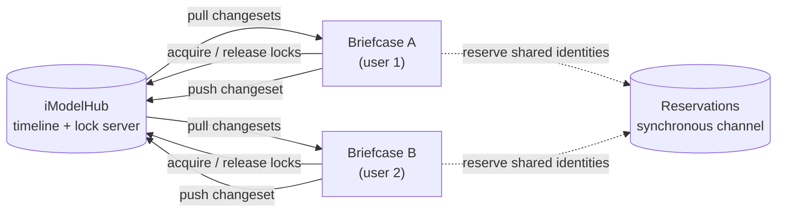
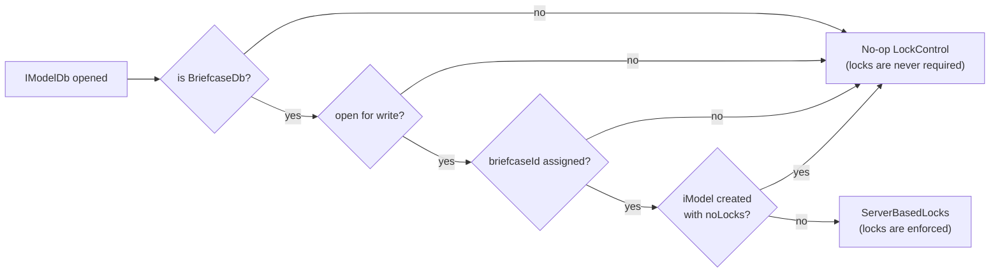
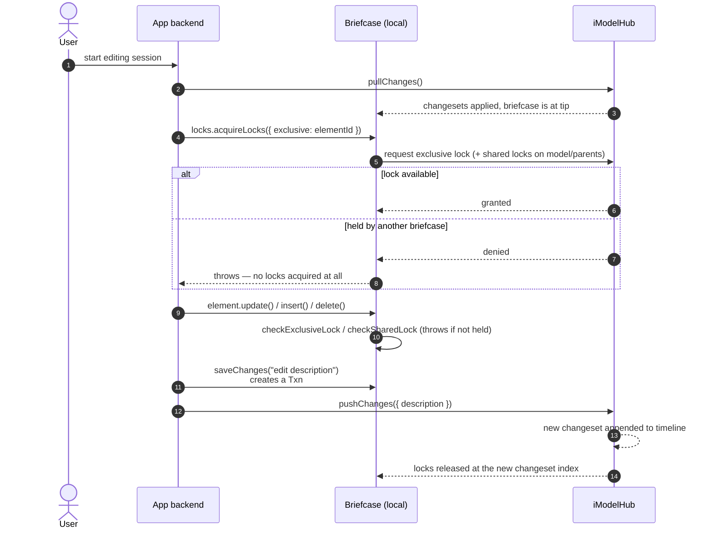
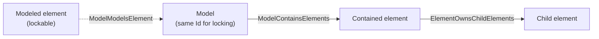
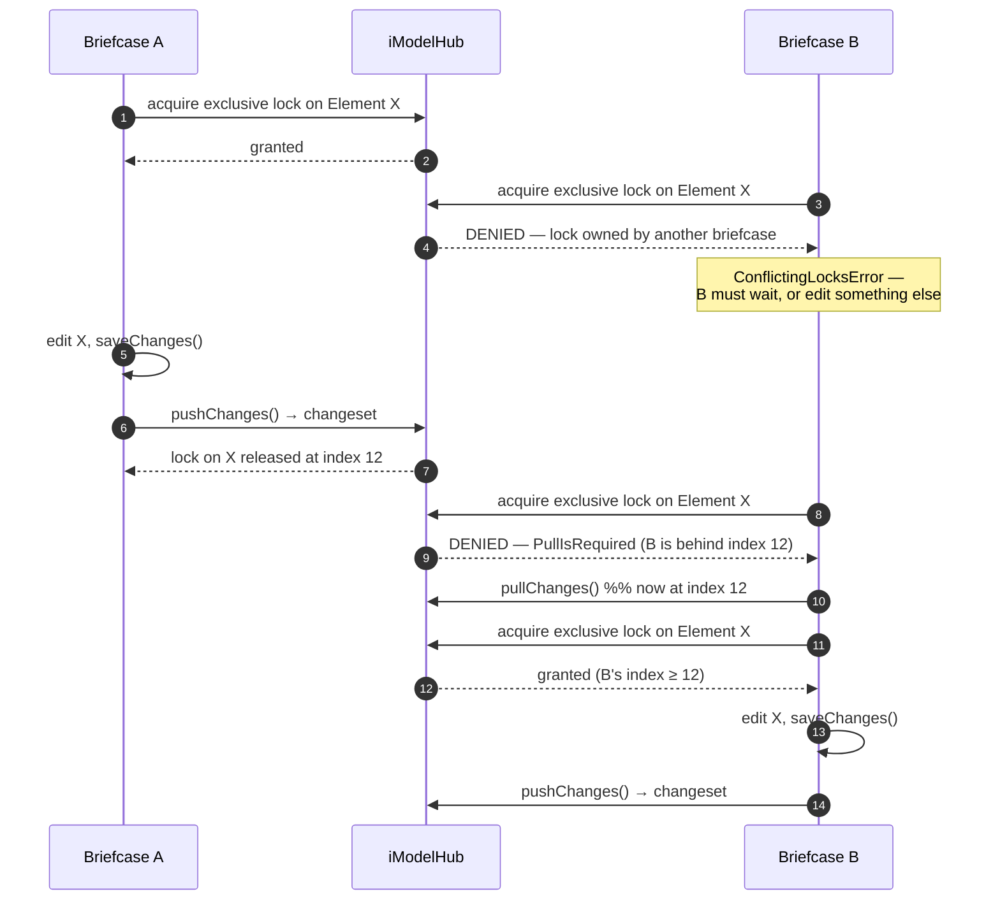

# Concurrency Control

*How iTwin.js coordinates simultaneous edits from many users on the same iModel.*

An iModel is a multi-user database that is edited through *briefcases*. Every user (or agent, or connector) works on their **own local copy** of the iModel, edits it offline, and then pushes their work as a [Changeset](../Glossary.md#changeset) to iModelHub. Concurrency control is the set of rules that make this safe: it decides **who is allowed to change what, and when**, so that everyone's work can be combined into a single, consistent timeline.

Concurrency control is *not* user access control. It says nothing about whether a person is *permitted* to edit; it only coordinates edits that are already permitted.

iTwin.js provides two complementary coordination mechanisms:

- **Locks** protect existing models and elements from conflicting concurrent modification.
- **Reservations** coordinate concurrent creation of elements that share an identity across briefcases. When reservations are enabled, any element inserted with an explicit `federationGuid` must first be reserved.

Locks serialize changes to established data; reservations allow many briefcases to create the same shared building block without producing duplicate elements or conflicting identities.

## Before you start

This article assumes you already know that:

- An app works with a [briefcase](../Glossary.md#briefcase) using the [BriefcaseDb]($backend) class.
- A briefcase has a unique [BriefcaseId]($common) issued and tracked by iModelHub.
- Changes are captured and distributed as [Changesets](../IModelHub/briefcases.md), ordered on the iModel's [timeline](../IModelHub/index.md#the-timeline-of-changes-to-an-imodel). A changeset's position is its [ChangesetIndex]($common).
- Local edits are grouped into transactions ("Txns") by [BriefcaseDb.saveChanges]($backend), and one or more Txns become one Changeset when you push.

Related reading: [Synchronizing with iModelHub](./IModelDbSync.md), [Pull merge & conflict resolution](./PullMerge.md), [EditTxn](./EditTxn.md), [Channels](./Channel.md), [Reserving Codes](./ReserveCodes.md).

## The mental model in one picture


```mermaid
graph LR
    Hub[("iModelHub<br/>timeline + lock server")]
    Sync[("Reservations<br/>synchronous channel")]
    B1["Briefcase A<br/>(user 1)"]
    B2["Briefcase B<br/>(user 2)"]

    Hub -- "pull changesets" --> B1
    Hub -- "pull changesets" --> B2
    B1 -- "acquire / release locks" --> Hub
    B2 -- "acquire / release locks" --> Hub
    B1 -- "push changeset" --> Hub
    B2 -- "push changeset" --> Hub
    B1 -. "reserve shared identities" .-> Sync
    B2 -. "reserve shared identities" .-> Sync
```

Three independent services can be involved:

- The **timeline** stores changesets in a strict order. You can only push a changeset that is based on the current tip.
- The **lock server** hands out locks on elements. A lock is granted to a *briefcase*, not to a user, and it is remembered along with the changeset index at which it was last released.
- The optional **reservations synchronous channel** pre-allocates element Ids for explicitly assigned federation GUIDs so concurrent creators converge on the same identity.

## Glossary

| Term | Definition |
| --- | --- |
| **Base** | Changeset B is *based on* changeset A if B comes immediately after A in the timeline. |
| **Conflict** | Two changesets change the same data in incompatible ways, and neither is based on the other. |
| **DefinitionElement** | A reusable [DefinitionElement]($backend), such as a category, line style, or material, that is commonly shared by many other elements. Definition elements are a common use case for reservations, but reservations apply to any element with an explicit federation GUID. |
| **Federation GUID** | A globally unique identifier that stably identifies an element across briefcases and iModels. Reservations associate an explicitly assigned federation GUID with a pre-allocated element Id. |
| **Lock** | The right of a briefcase to change (Exclusive) or to depend on (Shared) an element. |
| **Merge / Rebase** | Applying incoming changesets to a briefcase that has local changes. See [PullMerge](./PullMerge.md). |
| **Push** | Upload a changeset to iModelHub. |
| **Pull** | Download and apply changesets from iModelHub. |
| **Reservation** | An agreement, coordinated through a synchronous channel, that pre-allocates an element Id for an explicitly assigned federation GUID so multiple briefcases can create the same element concurrently. |
| **Schema Lock** | The exclusive lock on the root element ([IModel.repositoryModelId]($common)). Effectively locks the whole iModel. |
| **Tip** | The most recent changeset on the timeline; the newest state of the iModel. |
| **Txn** | A local transaction, created by [BriefcaseDb.saveChanges]($backend). Many Txns combine into one changeset. |
| **Direct change** | A change explicitly initiated by application code through an editing API. |
| **Indirect change** | A consequential change produced while [TxnManager]($backend) propagates direct changes, for example through an `ElementDrivesElement` dependency. |

## Two policies: locking and "no locks"

The policy is fixed when the iModel is created in iModelHub, via the `noLocks` parameter of [BackendHubAccess.createNewIModel]($backend). It cannot be changed afterwards.

| Policy | Behavior |
| --- | --- |
| **Locking (default)** | Locks *must* be held before elements/models are changed. The editing APIs check locks as each change is made, so two briefcases cannot concurrently change the same element. |
| **No locks** (`noLocks: true`) | No locks are required or acquired. Simultaneous edits are reconciled by [change merging / rebase](./PullMerge.md). |

> ⚠️ **`noLocks` is experimental.** Its conflict-resolution behavior is not yet a complete replacement for the default locking policy. **Do NOT use this in production applications.** Reservations—not `noLocks`—are the mechanism for concurrent creation of shared definitions and component elements.

Every [IModelDb]($backend) exposes [IModelDb.locks]($backend), a [LockControl]($backend) implementation chosen automatically when the iModel is opened:


```mermaid
flowchart LR
    X["IModelDb opened"] --> A{"is BriefcaseDb?"}
    A -- no --> N["No-op LockControl<br/>(locks are never required)"]
    A -- yes --> B{"open for write?"}
    B -- no --> N
    B -- yes --> C{"briefcaseId assigned?"}
    C -- no --> N
    C -- yes --> D{"iModel created<br/>with noLocks?"}
    D -- yes --> N
    D -- no --> S["ServerBasedLocks<br/>(locks are enforced)"]
```

You can check which one you got with `iModel.locks.isServerBased`. The no-op implementation accepts every acquisition and check, but its `holdsExclusiveLock` and `holdsSharedLock` queries return `false` because no lock is actually held. Therefore, **the same application code works under either policy** — always request the locks your edits need.

## The editing lifecycle

Under the locking policy the rule is: **pull → lock → change → save → push → release**.


```mermaid
sequenceDiagram
    autonumber
    actor User
    participant App as App backend
    participant BC as Briefcase (local)
    participant Hub as iModelHub

    User->>App: start editing session
    App->>Hub: pullChanges()
    Hub-->>BC: changesets applied, briefcase is at tip
    App->>BC: locks.acquireLocks({ exclusive: elementId })
    BC->>Hub: request exclusive lock (+ shared locks on model/parents)
    alt lock available
        Hub-->>BC: granted
    else held by another briefcase
        Hub-->>BC: denied
        BC-->>App: throws — no locks acquired at all
    end
    App->>BC: element.update() / insert() / delete()
    BC->>BC: checkExclusiveLock / checkSharedLock (throws if not held)
    App->>BC: saveChanges("edit description")<br/>creates a Txn
    App->>Hub: pushChanges({ description })
    Hub-->>Hub: new changeset appended to timeline
    Hub-->>BC: locks released at the new changeset index
```

Key points illustrated above:

- **Locks are checked at the moment of the edit**, not at push time. The normal element, model, and aspect editing APIs call [LockControl.checkExclusiveLock]($backend) / [LockControl.checkSharedLock]($backend) and throw `IModelStatus.LockNotHeld` when a required lock is missing.
- **Lock acquisition is all-or-nothing.** If any required lock in the request cannot be granted, none of them are.
- **Failures come in three distinct flavors** — see [Acquiring locks on elements](#acquiring-locks-on-elements).

## Lock types and the ownership hierarchy

There are two lock states:

- **Exclusive** — only the holder may modify or delete the element. Only one briefcase at a time.
- **Shared** — prevents any other briefcase from taking the exclusive lock, but many briefcases can hold it simultaneously. This is what protects a model or a parent while you insert children into it.

An exclusive lock is stricter than a shared lock, so it also satisfies a shared-lock requirement.

Locks apply to **elements** and implicitly to the [ElementAspect]($backend)s they own. A lock on a *model* is really the lock on the model's *modeled element*, because they share the same Id.

The lock hierarchy follows the three owning relationships described by the [BIS information hierarchy](../../bis/guide/data-organization/information-hierarchy.md): `ModelContainsElements`, `ModelModelsElement`, and `ElementOwnsChildElements`.


```mermaid
graph LR
    ME["Modeled element<br/>(lockable)"]
    M["Model<br/>(same Id for locking)"]
    E["Contained element"]
    C["Child element"]
    ME -. "ModelModelsElement" .-> M
    M -- "ModelContainsElements" --> E
    E -- "ElementOwnsChildElements" --> C
```

Following those relationships recursively produces an ownership hierarchy rooted at [IModel.repositoryModelId]($common).

Two rules follow from this hierarchy, and they are the source of most "why did I need *that* lock?" questions:

1. **Exclusive locking downward is implicit.** Holding the exclusive lock on an element implicitly gives you the exclusive lock on all its children, and holding the exclusive lock on a model's element gives you exclusive control of everything in that model. `holdsExclusiveLock` and `checkExclusiveLock` each walk up through models and parents to discover this.
2. **Shared locking upward is automatic.** Requesting any lock on an element also requires shared locks on its model and parent, recursively, up to the root. [LockControl.acquireLocks]($backend) computes and requests those extra shared locks for you — you don't have to list them.

So this single call:

```ts
await briefcase.locks.acquireLocks({ exclusive: elementId });
```

may actually request the exclusive lock on `elementId` **plus** shared locks on its parent element, its model's element, that model's parent model, and so on.

### Which operations need which locks

| Operation | Locks required |
| --- | --- |
| Insert an element | **Shared** on its model, and on its parent element if it has one |
| Update an element | **Exclusive** on that element |
| Delete an element | **Exclusive** on that element |
| Insert / update / delete an ElementAspect | **Exclusive** on the *owning element* |
| Insert a model | **Shared** on the parent model |
| Update or delete a model | **Exclusive** on the model (i.e. its modeled element) |
| Change an element's parent | **Exclusive** on the element, **shared** on the new parent |
| Change an element's model | **Exclusive** on *every element in the moved subtree*, **shared** on the target model |
| Import a schema, or a profile/domain upgrade that transforms data | **Schema Lock** (see [The Schema Lock](#the-schema-lock)) |

Because acquiring the exclusive lock on the model's element implicitly covers everything in the model, a bulk editor commonly takes one exclusive lock on the model instead of thousands of element locks.

### Direct and indirect changes

A single Txn can contain both direct and indirect changes. Direct changes are the edits explicitly requested by application code; the normal editing APIs check their required locks. Indirect changes are consequences produced while propagating those direct changes, such as updates caused by an `ElementDrivesElement` dependency. Lock checks are suspended while those indirect changes are applied.

Some bulk APIs also bypass the normal per-element checks. For example, [EditTxn.deleteElements]($backend) *(beta)* deletes through the native layer for performance. Before calling it, the application must hold exclusive locks on everything in the batch, either individually or through a covering model lock.

## Acquiring locks on elements

Locks are requested with [LockControl.acquireLocks]($backend), passing the elements you want a `shared` and/or an `exclusive` lock on. The request goes to the lock server, which grants all of them or none of them.

Acquisition can fail for two reasons, and a third failure happens later at edit time. They are easy to confuse:

| Failure | Raised by | Meaning |
| --- | --- | --- |
| `IModelHubStatus.LockOwnedByAnotherBriefcase` (a `ConflictingLocksError`, see [BackendHubAccess.acquireLocks]($backend)) | The lock server, during acquisition | Someone else holds a conflicting lock. Wait, or edit something else. |
| `IModelHubStatus.PullIsRequired` | The lock server, during acquisition | The lock is free, but your briefcase is behind the changeset index at which it was last released. Pull, then retry. |
| `IModelStatus.LockNotHeld` | Your own briefcase, at the moment of the edit | You attempted an edit without the required lock. This never reaches the server. |

The freshness rule behind `PullIsRequired` is applied per lock:

- To acquire a **shared** lock, your `changeset.index` must be at least the index at which that element's *exclusive* lock was last released.
- To acquire the **exclusive** lock, your index must be at least the greater of the last *exclusive* release index and the last *shared* release index.

In other words, **you must be up to date with an element before you can own it**. Because owner shared locks are requested automatically (see [Locks you get automatically](#locks-you-get-automatically)), a `PullIsRequired` can be triggered by an ancestor you never mentioned in your request. Pulling to tip before locking avoids all of this.

## Locks you get automatically

Not every lock has to be requested by hand. These are handled for you:

| Situation | What happens |
| --- | --- |
| **Elements you just created** | An element inserted by your briefcase since its last push is *implicitly* exclusively locked — no server round trip is needed to edit or delete it in the same session. |
| **Owner locks** | `acquireLocks` adds the shared locks on models and parents up the hierarchy — see [Acquiring locks on elements](#acquiring-locks-on-elements). |
| **Schema import** | [IModelDb.importSchemas]($backend) and `importSchemaStrings` acquire the schema lock in the default workflow. With Schema Sync, an import may proceed without it. Channel-upgrade and pre-import callbacks run *before* lock acquisition and must acquire the locks needed by their own edits. A post-import callback must not assume the schema lock is held when Schema Sync is enabled. You still control the surrounding pull/push. |
| **Profile & domain schema upgrade** | [BriefcaseDb.upgradeSchemas]($backend) first attempts the upgrade *without* any lock. Only if the upgrade reports that a data transformation is required does it acquire the schema lock and retry, releasing all locks when done. |
| **Reverting pushed changesets** | [BriefcaseDb.revertAndPushChanges]($backend) pulls to the tip, acquires the schema lock, creates the revert changeset, and pushes it. The push releases the lock unless `retainLocks` is set. |
| **Embedding or allocating fonts** | [IModelDbFonts.embedFontFile]($backend) and [IModelDbFonts.acquireId]($backend) use the configured [CodeService](./CodeService.md) without locking when possible. Without that service, they acquire the schema lock to allocate collision-free identifiers; the caller must later push or abandon the changes and locks. |
| **Push** | [BriefcaseDb.pushChanges]($backend) releases all locks afterwards unless you pass `retainLocks: true`. |

## Reservations

> Reservations are a beta feature. See [IModelDb.reservations]($backend) and [SynchronousChannel.Reservations]($backend).

Reservations are currently provided by Schema Sync, a beta feature that is enabled per iModel. Enable it when creating the iModel by passing `containersEnabled: 1` to the [iModels API create operation](https://developer.bentley.com/apis/imodels-v2/operations/create-imodel/).

Locks solve concurrent edits to existing data, but they do not establish that two briefcases creating a new element mean to create the *same* element. For example, two users may both need a `"Steel"` material, a `"Hidden"` line style, or the same component template from a catalog. Without coordination, each briefcase can allocate a different element Id for the same logical definition, producing duplicates or a Code conflict when their changesets merge.

A reservation agrees on one caller-supplied federation GUID and one pre-allocated element Id before insertion. Every briefcase that inserts that reserved identity receives the same Id.

The rule is deliberately broader than definition elements: **when reservations are enabled, any [Element]($backend) inserted with an explicitly assigned `federationGuid` must first be reserved**, unless the briefcase holds the Schema Lock. Elements that leave `federationGuid` unset are unaffected.

### Reservations and locks are complementary

| | Locks | Reservations |
| --- | --- | --- |
| Protect against | Conflicting modification of existing elements | Conflicting creation of elements with a shared identity |
| Coordination model | Serialize competing writers | Let many briefcases create the same thing |
| Applies to | Models and elements | Elements inserted with an explicit `federationGuid` |
| Enabled by | The default locking policy | A reservations-enabled synchronous channel |
| API | [IModelDb.locks]($backend) | [IModelDb.reservations]($backend) |

Inserting a reserved element still follows the normal locking rules. For example, inserting a shared definition into the dictionary model requires a shared lock on [IModel.dictionaryId]($common). The reservation prevents an identity conflict; the lock protects the containing model while it changes.

### Schema Sync behavior

Reservations are stored in the Schema Sync cloud database. Its write lock serializes reservation requests so Id allocation and non-empty [Code]($common) uniqueness are enforced atomically across briefcases.

- Without Schema Sync, `IModelDb.reservations` is a no-op. `needsElementReservation` returns `false`, `reserveElements` does nothing, and inserts behave as before.
- With Schema Sync, insertion of an element with an explicit `federationGuid` validates and applies its reservation.
- The reservation control is reinitialized automatically if a pull or push changes whether Schema Sync is enabled for the briefcase.

### Reserving and inserting elements

Call [SynchronousChannel.Reservations.reserveElements]($backend) before insertion. The batch succeeds or fails as a unit. Each entry requires a valid `federationGuid` and `classFullName`; `code` is optional. A non-empty Code is stored with the reservation and must be unique across reservations.

```ts
const federationGuid = Guid.createValue();
const code = LineStyle.createCode(briefcase, IModel.dictionaryId, "Hidden");

await briefcase.reservations.reserveElements({
  elements: [{
    federationGuid,
    classFullName: LineStyle.classFullName,
    code,
  }],
});

await briefcase.locks.acquireLocks({ shared: IModel.dictionaryId });
const id = briefcase.elements.insertElement({
  classFullName: LineStyle.classFullName,
  model: IModel.dictionaryId,
  code,
  federationGuid,
});
```

Reservation is idempotent: concurrent requests with the same federation GUID, class, and Code converge on one reservation. Reusing a non-empty Code for a different federation GUID, or changing the class or Code associated with a GUID, produces a conflict.

[SynchronousChannel.Reservations.needsElementReservation]($backend) consults a local cache. A `false` result means the reservation was observed as of the most recent `reserveElements` call; the Schema Sync container remains the authority when another briefcase may be reserving concurrently.

During insertion, the element hook looks up the explicit federation GUID, verifies the class and Code, and assigns the reserved Id. If no reservation exists, insertion throws an [ElementReservationError]($common) with the `reservation-not-found` key. Holding the Schema Lock bypasses reservation checks because it already serializes all briefcases.

### Reservation errors

| Key | Meaning |
| --- | --- |
| `invalid-reservation` | The federation GUID, Code, or class is invalid. |
| `reservation-conflict` | The requested or inserted element disagrees with an existing reservation. |
| `reservation-not-found` | No reservation exists for the explicitly assigned federation GUID. |
| `container-has-local-changes` | The Schema Sync container has unpublished local changes, so its reservations cannot yet be trusted. |
| `id-sequence-exhausted` | The reserved element Id range is exhausted. |
| `corrupt-reservation-data` | The persisted reservation data is corrupt. |

Use [ElementReservationError.isError]($common) to identify these errors and, optionally, a specific key.

### Combined workflow

For an editing session that creates shared elements and modifies existing data:

1. Pull and merge to synchronize with the tip.
1. Reserve every new element that will carry an explicit federation GUID.
1. Acquire the model and element locks required by the changes.
1. Insert the reserved elements and make the other edits.
1. Save and push. The elements use their agreed Ids and the push releases locks unless `retainLocks` is set.

## The Schema Lock

The schema lock is simply *the exclusive lock on the root element*, [IModel.repositoryModelId]($common). Because of the hierarchy rules, that has dramatic consequences:

- To acquire it, **no other briefcase may hold any lock at all**.
- While it is held, **no other briefcase can acquire any lock**.

It is, in effect, an exclusive lock on the entire iModel. Use [IModelDb.acquireSchemaLock]($backend) and [IModelDb.holdsSchemaLock]($backend).

In the default schema-lock workflow, `importSchemas` acquires the lock for you, but the surrounding synchronization remains the application's responsibility:

1. Call `pullChanges` to bring the briefcase to the tip.
1. Call `pushChanges` to publish any pending data changes.
1. Call `importSchemas` or `importSchemaStrings`. The import acquires the schema lock and saves its changes.
1. Call `pushChanges` to publish the schema changes and release the lock.

The beta schema-import extension points require additional care. A `channelUpgrade` callback and
`preSchemaImportCallback` run before the import acquires its lock, so their editing APIs must acquire
the normal element/model locks themselves. A `postSchemaImportCallback` runs after the import. It is
covered by the schema lock in the default workflow, but Schema Sync may import without that lock. A post-import callback that changes data should therefore
request the locks for those changes explicitly; those requests are harmless when an exclusive schema
lock already covers them.

Schema Sync relaxes this bottleneck. When it is enabled, the import is first attempted against the shared synchronous channel *without* the schema lock. Only if the native importer reports that a data transformation is required does it fall back to acquiring the full schema lock and retrying.

Under a `noLocks` iModel, `acquireSchemaLock` is a no-op — the same code path still works, but nothing is actually locked.

### Profile and domain schema upgrades

([Domain schemas and profile schemas](./IModelDb.md#upgrading-schemas-in-an-imodel) explains what each of these is.)

[BriefcaseDb.upgradeSchemas]($backend) follows the same "only lock if you must" strategy, but it behaves this way on every iModel with no configuration. It upgrades the profile, then the domain schemas, each with the briefcase closed and reopened, pushing a changeset after each phase that produced changes. It takes **no lock at all** in the common case. Only when an upgrade fails with `BE_SQLITE_ERROR_DataTransformRequired` — meaning existing data must be rewritten — does it acquire the schema lock, retry the upgrade with the lock held, and release all locks in a `finally` block. When Schema Sync is enabled, each upgrade phase is additionally applied through the synchronous channel.

The practical consequence: an upgrade that only adds schema definitions will not block other briefcases, while a data-transforming upgrade will lock the whole iModel for its duration.

## Two users editing at the same time

### Under the locking policy


```mermaid
sequenceDiagram
    autonumber
    participant A as Briefcase A
    participant Hub as iModelHub
    participant B as Briefcase B

    A->>Hub: acquire exclusive lock on Element X
    Hub-->>A: granted
    B->>Hub: acquire exclusive lock on Element X
    Hub-->>B: DENIED — lock owned by another briefcase
    Note over B: ConflictingLocksError —<br/>B must wait, or edit something else

    A->>A: edit X, saveChanges()
    A->>Hub: pushChanges()  → changeset #12
    Hub-->>A: lock on X released at index 12

    B->>Hub: acquire exclusive lock on Element X
    Hub-->>B: DENIED — PullIsRequired (B is behind index 12)
    B->>Hub: pullChanges()   %% now at index 12
    B->>Hub: acquire exclusive lock on Element X
    Hub-->>B: granted (B's index ≥ 12)
    B->>B: edit X, saveChanges()
    B->>Hub: pushChanges()  → changeset #13
```

Note the crucial middle step: B is refused the lock even *after* A pushes, until B has pulled up to A's changeset. This is what guarantees that B's edit is applied to the state A produced, never to a stale copy.

Meanwhile, edits to *different* elements proceed in full parallel; the locks only serialize the overlapping parts.

### Under `noLocks`

Nothing blocks either briefcase. Whoever pushes first wins the timeline; the other must pull and merge, and the [rebase](./PullMerge.md) machinery reconciles the changes (rolling back local Txns, applying the incoming changesets, and replaying local changes on top). Merging happens at the level of SQLite rows, so changes that touch independent columns of the same row can often be combined without a data conflict — but database constraints (uniqueness, checks, foreign keys) mean this is not a guarantee. See [Pull merge & conflict resolution](./PullMerge.md) for the authoritative conflict and resolution rules.

## Releasing locks

| API | When to use |
| --- | --- |
| [BriefcaseDb.pushChanges]($backend) | Normal path. Releases all locks after a successful push, recording the new changeset index against each. Pass `retainLocks: true` to keep them for the next edit round. |
| [LockControl.releaseAllLocks]($backend) | Rarely needed directly. Use it to end a lock-retaining session after the protected work was published with `pushChanges({ retainLocks: true })`. **It fails if the briefcase has local changes.** |
| [LockControl.abandonAllLocks]($backend) *(beta)* | A low-level option when locks were acquired but no protected edits remain—for example, no edit was made or every protected edit was independently reversed. If local changes remain, use `discardChanges` instead. |
| [BriefcaseDb.discardChanges]($backend) *(preview)* | Throws away local changes and calls `abandonAllLocks` unless `retainLocks` is set. |

Note that [BriefcaseDb.pullChanges]($backend) does **not** release locks — pulling only brings your briefcase up to date. Locks are released on push, or explicitly.

For lock-aware undo, prefer the beta async APIs [TxnManager.reverseTxnsAsync]($backend), [TxnManager.reverseSingleTxnAsync]($backend), [TxnManager.reverseAllTxnsAsync]($backend), [TxnManager.reverseToTxnAsync]($backend), and [TxnManager.cancelToTxnAsync]($backend). They abandon the locks belonging to the reversed Txns by default; pass `retainLocks: true` only when you intentionally want to keep them. For redo, prefer [TxnManager.reinstateTxnAsync]($backend), which re-acquires abandoned locks before reinstating the Txn.

Note that re-acquiring an abandoned lock can fail: another briefcase may have taken it in the meantime.

`ServerBasedLocks` maintains a local cache of held locks so lock checks during editing are local and fast.

## Related, but not the same thing

- **Codes.** General element-code uniqueness is coordinated separately by reserving codes — see [Reserving Codes](./ReserveCodes.md) and [CodeService](./CodeService.md). A reservation also checks the non-empty Code attached to a reserved identity, but holding a lock alone does not reserve a code.
- **Channels.** [Channels](./Channel.md) restrict *which* parts of an iModel a given application is allowed to write, which is an orthogonal (and additional) check to locks.
- **Access control.** Whether a user may edit at all is decided by [iModel permissions](https://developer.bentley.com/apis/imodels-v2/operations/get-imodel-permissions/), not by anything in this document.

## Practical guidance

- **Prefer pulling before locking.** Starting an editing session at the tip avoids `PullIsRequired`, which can sometimes be triggered by an ancestor element you did not request explicitly.
- **Reserve before inserting an explicit federation GUID.** When reservations are enabled, batch reservations before acquiring locks and starting the editing transaction.
- **Lock at the right granularity.** For bulk edits, take the exclusive lock on a model or common parent rather than on each element; for adding many elements to a model, one shared lock on the model covers them all.
- **Acquire locks in one call where possible.** `acquireLocks({ shared: [...], exclusive: [...] })` is atomic, so a batch either fully succeeds or leaves you holding nothing new — which avoids partially-locked states and reduces deadlock-like stalls between briefcases.
- **Keep the schema lock for as short a time as possible.** While you hold it, every other briefcase in the iModel is blocked from acquiring anything. Push and release immediately after the import.
- **Push often.** Locks are released on push; long-held locks are the main source of "another user is blocking me" complaints.
- **Write code that requests locks unconditionally.** Don't branch on `locks.isServerBased`; under a `noLocks` iModel the calls are harmless no-ops.
- **Treat lock failures as expected outcomes**, not as bugs. Distinguish them for the user: `LockOwnedByAnotherBriefcase` means "someone else is editing this", `PullIsRequired` means "sync first, then retry", and `LockNotHeld` means your own code forgot to acquire a lock.
