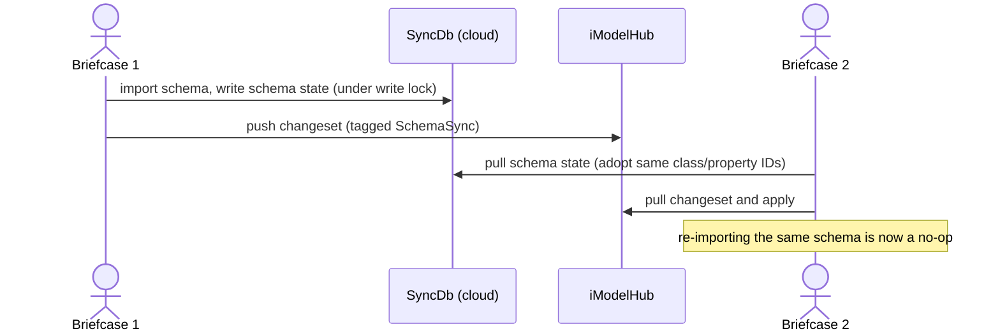

# Schema Synchronization

Schema Synchronization ("Schema Sync") is a mechanism that lets the briefcases of an iModel coordinate their EC schema state through a shared cloud database, rather than relying solely on changesets and a file-wide schema lock. Its goals are:

- to let a briefcase import or upgrade a schema **without acquiring the exclusive schema lock** in the common case, so other users can keep editing while the import happens, and
- to ensure that when different briefcases import the *same* schema, they agree on the identities (class IDs, property IDs) assigned to it, so the schemas do not diverge by identity even though they are textually identical.

> **API status:** The `SchemaSync` namespace in `@itwin/core-backend` is marked `@internal`. It is not part of the supported public API: it is omitted from the API reference, may change or be removed without notice, and referencing it triggers the `@itwin/no-internal` lint rule. The examples below reflect the current implementation rather than a stable contract.

## The problem Schema Sync addresses

In a multi-user iModel, schema changes have historically been serialized with an **exclusive schema lock**. While one briefcase holds that lock to import a schema, no other briefcase can import a schema (and, depending on the workflow, may be blocked from other work). For products that ship schema changes frequently, this lock is disruptive.

There is also a more subtle problem. EC class IDs and property IDs are briefcase-local 8-byte identifiers assigned at import time. If two briefcases independently import the same schema, they can assign **different IDs to the same class or property**. The schemas are then identical as text but divergent by identity, which forces ID remapping when the briefcases' changesets are later merged.

Schema Sync attacks both problems by introducing a single shared authority for schema state that all briefcases consult.

## How it works

Schema Sync stores the iModel's schema-related state (the EC metadata tables and profile information) in a separate **CloudSqlite database**, referred to as the *SyncDb*, which lives in a cloud storage container. Each briefcase that has Schema Sync enabled is connected to that container.

- When a briefcase imports a schema, it first takes a write lock on the SyncDb, then imports and writes the resulting schema/metadata state into the SyncDb.
- When another briefcase next pulls, it reads the schema state from the SyncDb. If the schema is already present there, the import on that briefcase becomes a no-op, and it adopts the same class/property IDs that the first briefcase recorded.

Because every briefcase derives its schema identities from the same authoritative SyncDb, the class-ID/property-ID divergence problem is *prevented* rather than repaired after the fact.

The SyncDb is a `CloudSqlite` database (`SchemaSync.SchemaSyncDb`), so it benefits from CloudSqlite's local caching: reads are served from a local cache and do not block other briefcases, while writes are serialized by a container write lock.

The following sequence shows how two briefcases stay aligned. Briefcase 1 imports a schema and records it in the SyncDb; Briefcase 2 picks up that schema state from the SyncDb during its pull, so its own import of the same schema is a no-op and it reuses the identities Briefcase 1 assigned:



### Relationship to the schema lock

Enabling Schema Sync does **not** unconditionally eliminate the schema lock. The import path tries the lock-free route first and falls back only when it must:

1. The import is attempted **without** the schema lock, writing through the SyncDb.
2. If the schema change requires transforming existing data (for example, a column remap caused by adding a property that widens an existing property's scope - see [Data Transformation During Schema Import](./SchemaEvolutionCallbacks.md)), the native layer reports that a data transform is required.
3. In that case the briefcase abandons the attempt, acquires the exclusive schema lock, and retries the import with the lock held.

So the rule is: **additive, non-transforming schema changes import without the schema lock; schema changes that must transform data still take the exclusive lock.**

## Enabling Schema Sync

Setting up Schema Sync for an iModel is a two-stage process: provision and seed the cloud container, then connect the iModel to it. Neither stage is tied to iModel creation - an existing iModel can be enabled at any time.

### 1. Provision and seed the container

The cloud storage container itself must first be created through your storage provider's API (for example, an Azure or AWS blob container). Once the empty container exists, obtain a write-capable access token and seed an empty SyncDb into it:

```ts
// containerProps describes the already-provisioned cloud container
const containerProps = {
  baseUri,        // storage account / endpoint
  containerId,    // the provisioned container's id
  storageType,    // e.g. "azure"
};

const accessToken = await CloudSqlite.requestToken(containerProps);

// Uploads an empty SchemaSyncDb into the container.
// NOTE: this deletes any existing content in the container.
await SchemaSync.CloudAccess.initializeDb({ ...containerProps, accessToken });
```

### 2. Connect the iModel to the container

With the SyncDb seeded, connect a briefcase to it. This records the container's connection information persistently in the iModel and pushes a changeset that marks the iModel as using Schema Sync:

```ts
await SchemaSync.initializeForIModel({ iModel, containerProps });
```

`initializeForIModel` acquires the schema lock, requires the briefcase to have no unsaved or un-pushed local changes (it throws otherwise), brings the briefcase to tip, enables Schema Sync, and pushes the change. Pass `overrideContainer: true` to repoint an iModel at a different container.

> **All-or-nothing per iModel.** Once an iModel uses Schema Sync, every briefcase that edits it must use Schema Sync as well. A briefcase that opts out and imports a schema the old way produces changesets that the Schema-Sync briefcases cannot merge. Plan the rollout for an iModel as a single switch, not a per-user opt-in.

## Working with a Schema-Sync-enabled iModel

Once enabled, Schema Sync participates automatically in the normal schema-import and synchronization flow; applications generally do not call the Schema Sync API directly during editing.

- **Importing schemas** through [`IModelDb.importSchemas`]($backend) automatically routes through the SyncDb when Schema Sync is enabled, using the lock-free-with-fallback behavior described above.
- **Pulling and pushing changes** automatically synchronizes schema state with the SyncDb. Schema changes recorded in the SyncDb are reflected on pull; the changeset that carries a Schema-Sync schema change is tagged with the `SchemaSync` value of [ChangesetType]($common).

To check whether an iModel uses Schema Sync, or to force a synchronization of local schema state with the cloud:

```ts
if (SchemaSync.isEnabled(iModel)) {
  await SchemaSync.pull(iModel); // bring local schema state up to date with the SyncDb
}
```

## Constraints and considerations

- **Online requirement.** Importing a schema with Schema Sync enabled requires a network connection to consult and update the SyncDb. This is the trade for avoiding divergence: coordination happens at import time rather than being reconciled later.
- **Schema definitions propagate immediately.** Because schema state flows through the shared SyncDb, importing a schema makes it visible to every other briefcase on their next pull, independent of whether the importing user has pushed their *data* changes. Schema additions effectively cannot be "undone" by an individual user without an exclusive-lock operation.
- **Data-transforming imports still lock.** As described above, a schema change that requires remapping or otherwise transforming existing data still acquires the exclusive schema lock.
- **Mutually exclusive with semantic rebase.** Schema Sync and the `IModelHost.useSemanticRebase` code path cannot both be active for the same import. With `useSemanticRebase` enabled, importing into a Schema-Sync-enabled iModel is rejected. The two are alternative strategies for the same multi-user-schema problem.
- **All-or-nothing rollout.** Every briefcase of the iModel must use Schema Sync once it is enabled (see the note under [Enabling Schema Sync](#2-connect-the-imodel-to-the-container)).

## Related topics

- [Data Transformation During Schema Import](./SchemaEvolutionCallbacks.md) - the pre/post-import callbacks and the data-transform cases that still require the schema lock.
- [Working with Schemas and Elements in TypeScript](./SchemasAndElementsInTypeScript.md) - importing schemas and authoring elements against them.
- [iTwin.js Code Service](./CodeService.md) - a related CloudSqlite-backed coordination channel, for Code uniqueness across briefcases.
- [Synchronizing with iModelHub](./IModelDbSync.md) - the changeset pull/push model that Schema Sync complements.
