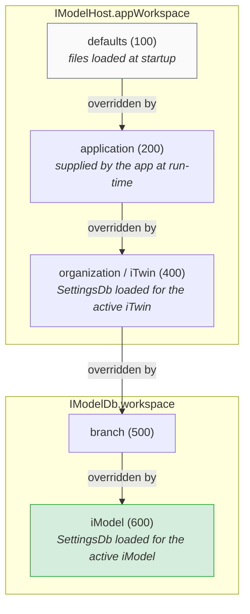
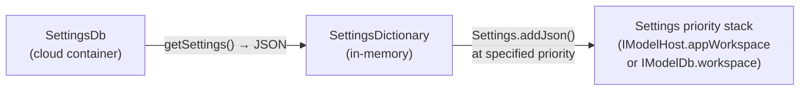

# Settings

[Settings]($backend) are how administrators configure an iTwin.js application for end-users. A setting is a named value — a `string`, `number`, `boolean`, object, or array — that controls application behavior at run-time.

> **New to this topic?** Start with the [Workspaces and Settings overview](./WorkspacesAndSettings.md) to understand how `Settings`, [SettingsDb]($backend), and [WorkspaceDb]($backend) relate before diving in here.

## What is a setting?

Be careful to avoid confusing **settings** with **user preferences**, which are configured by individual users. For example, an application might provide a check box to toggle "dark mode". Each individual user can make their own choice — it is a user preference, not a setting. But an administrator may define a setting that controls whether users can see that check box in the first place.

A [Setting]($backend) is a name-value pair. The value can be:

- A `string`, `number`, or `boolean`;
- An `object` containing properties of any of these types; or
- An `array` containing elements of one of these types.

A [SettingName]($backend) must be unique, 1 to 1024 characters long with no leading nor trailing whitespace, and should begin with the schema prefix of the [schema](#settings-schemas) that defines it. For example, LandscapePro might define:

```
  "landscapePro/ui/defaultToolId"
  "landscapePro/ui/availableTools"
  "landscapePro/flora/preferredStyle"
  "landscapePro/flora/treeDbs"
  "landscapePro/hardinessRange"
```

Each name begins with the "landscapePro" schema prefix followed by a forward slash. Forward slashes create logical groupings, similar to file paths.

## Settings schemas

The metadata describing a group of related [Setting]($backend)s is defined in a [SettingGroupSchema]($backend). The schema is based on [JSON Schema](https://json-schema.org/), with the following additions:

- `schemaPrefix` (required) — a unique name for the schema. All names in the schema inherit this prefix.
- `description` (required) — a description appropriate for displaying to a user.
- `settingDefs` — an object of [SettingSchema]($backend)s describing individual settings, indexed by name.
- `typeDefs` — an object of [SettingSchema]($backend)s describing reusable types that can be referenced by other schemas.
- `order` — an optional integer used to sort schemas in a user interface.

We can define the LandscapePro schema programmatically as follows:

```ts
[[include:WorkspaceExamples.SettingGroupSchema]]
```

This schema defines 5 `settingDefs` and 1 `typeDef`. The "landscapePro" prefix is implicitly included in each name — for example, the full name of "hardinessRange" is "landscapePro/hardinessRange".

The "hardinessZone" typeDef represents a [USDA hardiness zone](https://en.wikipedia.org/wiki/Hardiness_zone) as an integer between 0 and 13. The "hardinessRange" settingDef reuses it for both "minimum" and "maximum" via `extends`. Note that `extends` requires the schema prefix, even within the same schema.

The "flora/treeDbs" settingDef `extends` "workspaceDbList" from the [workspace schema](https://github.com/iTwin/itwinjs-core/blob/master/core/backend/src/assets/Settings/Schemas/Workspace.Schema.json), with prefix "itwin/core/workspace".

### Registering schemas

The set of currently-registered schemas can be accessed via [IModelHost.settingsSchemas]($backend). Register new ones using [SettingsSchemas.addFile]($backend), [SettingsSchemas.addDirectory]($backend), or — for programmatic schemas — [SettingsSchemas.addGroup]($backend):

```ts
[[include:WorkspaceExamples.RegisterSchema]]
```

Register schemas shortly after invoking [IModelHost.startup]($backend), using the [IModelHost.onAfterStartup]($backend) event:

```ts
IModelHost.onAfterStartup.addListener(() => {
  IModelHost.settingsSchemas.addGroup(landscapeProSchema);
});
```

All schemas are unregistered when [IModelHost.shutdown]($backend) is invoked.

### Schema validation behavior

Validation occurs lazily when you **retrieve** a setting value — not when the value is stored. When you call methods like [Settings.getString]($backend), [Settings.getObject]($backend), or [Settings.getBoolean]($backend), the value is validated against the registered schema for that setting name:

- If **no schema** is registered for the setting name, the value passes through unchecked.
- If a schema **is** registered, type mismatches throw an error — for example, if the schema declares a setting to be a `string` but the dictionary supplies a `number`.
- For `object` types, `required` fields are enforced and `extends` references are resolved recursively.

Because validation happens on retrieval, register your schemas early — ideally via [IModelHost.onAfterStartup]($backend) — so that type errors are caught as soon as the setting is first accessed.

## Settings dictionaries

The values of [Setting]($backend)s are provided by [SettingsDictionary]($backend)s. The [Settings]($backend) for the current session can be accessed via the `settings` property of [IModelHost.appWorkspace]($backend).

> **Dictionary structure tips:** Prefix all setting names with the [schemaPrefix](#settings-schemas) of the schema that defines them to avoid collisions. Use forward-slash grouping (e.g., `"landscapePro/ui/"`, `"landscapePro/flora/"`) to organize related settings — prefer flat keys over deeply nested objects. Keep individual dictionary files focused on a single concern so administrators can override only what they need at a particular [SettingsPriority]($backend).

Let's load a settings dictionary that provides values for some of the LandscapePro settings:

```ts
[[include:WorkspaceExamples.AddDictionary]]
```

Now access the values via `IModelHost.appWorkspace.settings`:

```ts
[[include:WorkspaceExamples.GetSettings]]
```

Note that `getString` returns `undefined` for "landscapePro/preferredStyle" because our dictionary didn't provide a value for it. The overloads of that function (and similar functions like [Settings.getBoolean]($backend) and [Settings.getObject]($backend)) allow specifying a default value.

> Note: In general, avoid caching setting values — just query them each time you need them, because they can change at any time. If you must cache (for example, when populating a user interface), listen for the [Settings.onSettingsChanged]($backend) event.

Any number of dictionaries can be added to [Workspace.settings]($backend). Let's add another:

```ts
[[include:WorkspaceExamples.AddSecondDictionary]]
```

This dictionary adds a value for "landscapePro/flora/preferredStyle", and defines new values for two settings already defined in the previous dictionary. When we look up those settings again:

```ts
[[include:WorkspaceExamples.GetMergedSettings]]
```

"landscapePro/flora/preferredStyle" is no longer `undefined`. The value of "landscapePro/ui/defaultTool" has been overwritten. And "landscapePro/ui/availableTools" contains the merged contents of both dictionaries — because the `settingDef` has [SettingSchema.combineArray]($backend) set to `true`.

### Settings priorities

Configurations are often layered. [SettingsPriority]($backend) defines which dictionaries take precedence — the highest-priority dictionary that provides a value for a given setting name wins.



Specific values:

- [SettingsPriority.defaults]($backend) (100) — settings loaded automatically at startup.
- [SettingsPriority.application]($backend) (200) — settings supplied by the application to override or supplement defaults.
- [SettingsPriority.organization]($backend) (300) — settings applying to all iTwins in an organization.
- [SettingsPriority.iTwin]($backend) (400) — settings applying to a particular iTwin and all its iModels.
- [SettingsPriority.branch]($backend) (500) — settings applying to all branches of a particular iModel.
- [SettingsPriority.iModel]($backend) (600) — settings applying to one specific iModel.

[SettingsDictionary]($backend)s of `application` priority or lower reside in [IModelHost.appWorkspace]($backend). iTwin-scoped settings are loaded into the workspace returned by [IModelHost.getITwinWorkspace]($backend) — see [iTwin settings](#itwin-settings). Settings of even higher priority (branch and iModel) are stored in an [IModelDb.workspace]($backend) — see [iModel settings](#imodel-settings).

In practice, an organization admin can set org-wide defaults at `organization` priority. An iTwin-level admin can selectively override settings for their iTwin at `iTwin` priority without affecting other iTwins. For example, to add a dictionary at iTwin priority:

```ts
[[include:Settings.addITwinDictionary]]
```

When that iTwin's settings are no longer needed, drop the dictionary:

```ts
[[include:Settings.dropITwinDictionary]]
```

> Note: The examples above use [Settings.addDictionary]($backend), which loads dictionaries into memory for the current session only. For cloud-backed iTwin and organization settings — where dictionaries are fetched from `SettingsDb` containers on demand — see [SettingsDb](#settingsdb) below.

What about "landscapePro/ui/availableTools"? In the LandscapePro schema, the corresponding `settingDef` has [SettingSchema.combineArray]($backend) set to `true`, meaning that when multiple dictionaries provide a value for the setting, they are merged into a single array, eliminating duplicates, and sorted in descending order by dictionary priority.

### How settings are stored

The sections below cover three progressively richer ways to work with settings:

- **Session-only (in-memory):** [Settings.addDictionary]($backend) loads a dictionary for the current session. Good for testing, app defaults, and short-lived overrides.
- **iTwin / iModel persisted:** [IModelHost.saveSettingDictionary]($backend) writes named dictionaries to cloud storage scoped to an iTwin or iModel. Changes persist across sessions and are shared with other users.
- **SettingsDb (cloud-managed storage):** A [SettingsDb]($backend) stores individual settings as key-value pairs in a dedicated container with its own versioning and access control — see [SettingsDb](#settingsdb).

## iTwin settings

Each iTwin has its own workspace with its own [Settings]($backend) that can override and/or supplement the application workspace's settings. These settings are stored as named [SettingsDictionary]($backend)s in a [SettingsDb]($backend) (a settings-formatted [WorkspaceDb]($backend)) scoped to that iTwin. Whenever [IModelHost.getITwinWorkspace]($backend) is called, all named dictionaries in the container are loaded into the returned [Workspace.settings]($backend) at [SettingsPriority.iTwin]($backend). An application working in the context of a particular iTwin should resolve setting values by asking [IModelHost.getITwinWorkspace]($backend), which will fall back to [IModelHost.appWorkspace]($backend) if the iTwin's setting dictionaries don't provide a value for the requested setting.

Before using iTwin settings, ensure two services are configured:

- [IModelHost.authorizationClient]($backend) — so the backend can acquire user tokens.
- [BlobContainer.service]($backend) — so settings containers can be discovered and opened.

With those in place, load the iTwin workspace scope:

```ts
[[include:WorkspaceExamples.GetITwinWorkspace]]
```

The returned [Workspace]($backend) gives you access to all settings and resources associated with the iTwin.

### Saving iTwin settings

To save a named settings dictionary for an iTwin, call [IModelHost.saveSettingDictionary]($backend) with a dictionary name and a [SettingsContainer]($backend) of key-value pairs:

```ts
[[include:WorkspaceExamples.SaveITwinSettings]]
```

If no settings container exists for the specified iTwin yet, one is created automatically. The dictionary name becomes the resource name in the [SettingsDb]($backend). Multiple named dictionaries can coexist in the same container.

### Deleting iTwin settings

To remove an entire named dictionary, use [IModelHost.deleteSettingDictionary]($backend):

```ts
[[include:WorkspaceExamples.DeleteITwinSetting]]
```

### Reading iTwin settings

To read iTwin settings, query the `settings` of the [Workspace]($backend) returned by [IModelHost.getITwinWorkspace]($backend):

```ts
[[include:WorkspaceExamples.ReadITwinSettings]]
```

iTwin settings are loaded with [SettingsPriority.iTwin]($backend) priority.

## iModel settings

> **⚠️ Caution — prefer SettingsDb for new work.** Storing settings directly in an iModel (via [IModelDb.saveSettingDictionary]($backend)) ties configuration to a single iModel file. Settings cannot be discovered without opening the iModel, cannot be versioned independently, and require an exclusive write lock on the entire iModel to modify. For new projects, store settings in a cloud-hosted [SettingsDb](#settingsdb) instead — it is discoverable by iTwinId, versioned independently, and does not require an iModel to be open.

Each [IModelDb]($backend) has its own [Workspace]($backend), accessible via [IModelDb.workspace]($backend). This workspace inherits all app-level and iTwin-level settings, and layers on settings stored inside the iModel itself. Because these iModel-level dictionaries are loaded at [SettingsPriority.iModel]($backend) — the highest built-in priority — they override any lower-priority setting with the same name.

Use iModel settings when a particular iModel needs configuration that differs from the rest of its iTwin, or when you want to persist metadata (like an iTwin settings container reference) inside the iModel so it is available in future sessions.

### Persisted vs session-only dictionaries

There are two ways to supply settings dictionaries to an iModel's workspace scope:

| Method | Scope | Persistence |
|--------|-------|-------------|
| [Settings.addDictionary]($backend) | Current session only | Values exist in memory only and are lost when the iModel is closed. |
| [IModelDb.saveSettingDictionary]($backend) | All future sessions | Values are written to the iModel's `be_Props` table and automatically reloaded every time the iModel is opened. |

Use `addDictionary` for transient overrides — for example, to inject ephemeral configuration while a particular tool is active. Use `saveSettingDictionary` only if you need settings to persist as part of an iModel's permanent record and cannot use a `SettingsDb` instead.

### Saving iModel settings

To save settings into an iModel, call [IModelDb.saveSettingDictionary]($backend) with a dictionary name and a [SettingsContainer]($backend) of key-value pairs:

```ts
[[include:WorkspaceExamples.saveSettingDictionary]]
```

The dictionary name (e.g. `"landscapePro/iModelSettings"`) identifies the dictionary within the iModel. If a dictionary with that name already exists, it is replaced; otherwise a new one is created. You can save multiple dictionaries under different names.

Note that modifying iModel settings requires an exclusive write lock on the entire iModel — ordinary users should never do this.

### Deleting iModel settings

To remove an entire settings dictionary from an iModel, use [IModelDb.deleteSettingDictionary]($backend):

```ts
iModel.deleteSettingDictionary("landscapePro/iModelSettings");
```

### Reading iModel settings

Settings saved into the iModel are automatically loaded into [IModelDb.workspace]($backend). Read them the same way you read any other settings — the priority stack resolves the effective value:

```ts
[[include:WorkspaceExamples.QuerySettingDictionary]]
```

In the example above, `landscapePro/hardinessRange` was saved into the iModel, so it is returned from the iModel's dictionary. But `landscapePro/ui/defaultTool` was not saved at the iModel level, so it falls through to the app-level dictionary that defined it earlier.

### Overriding iTwin settings per iModel

Because [SettingsPriority.iModel]($backend) is higher than [SettingsPriority.iTwin]($backend), any setting saved at the iModel level takes precedence over the same setting at the iTwin level.

For example, suppose the iTwin setting `landscapePro/flora/preferredStyle` is `"naturalistic"` for the entire iTwin, but one particular iModel represents a formal garden:

```ts
[[include:WorkspaceExamples.OverrideITwinSettingAtIModelLevel]]
```

Now when the application reads `landscapePro/flora/preferredStyle` from this iModel's workspace scope, it gets `"formal"`. All other iModels in the iTwin continue to use the iTwin-level value.

### Referencing iTwin settings from an iModel

An iModel doesn't inherently know which iTwin settings container it should use. By saving the container's identity as an iModel-level setting, the iTwin settings become part of the iModel's workspace — so [IModelDb.workspace]($backend) becomes the single place to resolve all settings and resources the iModel uses.

```ts
[[include:WorkspaceExamples.SaveITwinSettingsReferenceInIModel]]
```

The next time the iModel is opened, your app reads `landscapePro/itwinSettingsRef` and uses it to load the same iTwin settings container. By default this resolves to the latest version of those settings.

### Pinning iTwin settings versions

If you need to pin the iModel to a specific version of the iTwin settings — so that its configuration does not change even when the iTwin settings are updated — save the version alongside the container props:

```ts
[[include:WorkspaceExamples.VersionAndPinITwinSettings]]
```

## SettingsDb

For production deployments, settings should be stored in the cloud — versionable, discoverable without opening an iModel, and manageable independently of any resource containers. That is the role of [SettingsDb]($backend).

A `SettingsDb` is a dedicated [CloudSqlite]($backend) database that stores settings as a flat JSON object — [SettingName]($backend) keys mapped to [Setting]($backend) values. Its containers are tagged with `containerType: "settings"`, making them discoverable by iTwinId through [WorkspaceEditor.queryContainers]($backend) without needing an iModel open.



This is what distinguishes a `SettingsDb` from a `WorkspaceDb`: a `SettingsDb` is where you **start**. You load settings from a `SettingsDb`, and those settings tell your application which `WorkspaceDb`s hold the binary resources it needs.

### Reading settings

A [SettingsDb]($backend) provides two read methods:

- [WorkspaceDb.getString]($backend) — returns the value of a specific setting resource by name, or `undefined` if it does not exist.
- [WorkspaceDb.getString]($backend) — returns the raw JSON of all settings as a string, which can be parsed into a [SettingsContainer]($backend).

Both methods work on the underlying [WorkspaceDb]($backend). For batches of reads, load the `SettingsDb` once via [Workspace.loadSettingsDictionary]($backend) to avoid repeated open/close overhead.

### How SettingsDb fits the priority system

When a `SettingsDb` is loaded into the runtime via [Workspace.loadSettingsDictionary]($backend), its contents become **one** [SettingsDictionary]($backend) in the [Settings]($backend) priority stack. The data flow is:

`SettingsDb` → JSON → `Settings.addJson()` → one `SettingsDictionary` in the priority stack

Each `SettingsDb` occupies a single slot in the [priority system](#settings-priorities). The priority is **explicitly specified** by the caller via [WorkspaceDbSettingsProps.priority]($backend) — it is not automatically derived from the container's scope. Multiple `SettingsDb`s loaded at different priorities become separate dictionaries; the runtime resolves conflicts using the standard priority rules.

> Note: The container must already be loaded via [Workspace.getContainer]($backend) or [Workspace.getContainerAsync]($backend) before calling [Workspace.loadSettingsDictionary]($backend).

### Discovering settings containers

You can find all settings containers for a given iTwin by using [WorkspaceEditor.queryContainers]($backend):

```ts
[[include:SettingsDb.discoverContainers]]
```

This is useful when building an admin UI that lets users choose which settings profile to load, without hardcoding container IDs.

To open matching containers for editing in a single call, use [WorkspaceEditor.findContainers]($backend). It queries the service, requests write tokens, and opens each matching container:

```ts
[[include:SettingsDb.findContainers]]
```

### Creating a SettingsDb and writing settings

> Note: Creating and managing `SettingsDb` data is a task for administrators. End-users consume settings through the [Settings]($backend) runtime API.

The example below creates a new cloud container, writes some initial settings, and publishes them:

```ts
[[include:SettingsDb.createLocal]]
```

The key steps are:

1. **Create an editor** — call [WorkspaceEditor.construct]($backend). The caller is responsible for calling `close()` when finished.
2. **Create a container** — [WorkspaceEditor.createNewCloudContainer]($backend) creates a container automatically tagged with `containerType: "settings"`.
3. **Acquire the write lock** — [EditableWorkspaceContainer.acquireWriteLock]($backend). Only one user can hold the lock at a time.
4. **Open an EditableWorkspaceDb** — [EditableWorkspaceContainer.getEditableDb]($backend) returns an [EditableWorkspaceDb]($backend).
5. **Write settings** — use [EditableWorkspaceDb.updateSettingsResource]($backend) to replace all settings in the resource.
6. **Release the lock** — [EditableWorkspaceContainer.releaseWriteLock]($backend) publishes your changes. Alternatively, [EditableWorkspaceContainer.abandonChanges]($backend) discards them.

> **Important**: Always release the write lock when you are done. Failing to release it will prevent other administrators from modifying the container until the lock expires.

> Note: Settings containers have their own write lock independent of workspace containers. Editing settings does not block workspace resource editing, and vice versa.

### Updating individual settings

Often you need to change a single setting without touching the rest. [EditableWorkspaceDb.updateSettingsResource]($backend) reads the existing settings, updates the specified entry, and writes the result back — other settings are preserved:

```ts
[[include:SettingsDb.updateSetting]]
```

To remove a setting entirely, use [EditableWorkspaceDb.removeString]($backend).

To inspect all settings in a `SettingsDb`, use [WorkspaceDb.getString]($backend):

```ts
[[include:SettingsDb.getSettings]]
```

### Versioning

Like [WorkspaceDb]($backend)s, each `SettingsDb` uses [semantic versioning](https://semver.org/). Once a version is published to cloud storage it becomes immutable. To evolve settings, create a new version via [EditableWorkspaceContainer.createNewWorkspaceDbVersion]($backend), make changes, and release the write lock. The versioning workflow is the same as described in [creating workspace resources](./Workspace.md#creating-workspace-resources).

### Putting it together: settings that point to resources

In a typical deployment, the end-to-end flow looks like this:

1. **Admin creates a settings container** for the iTwin and writes settings like `"landscapePro/flora/treeDbs"` that point to [WorkspaceDb]($backend)s holding binary resources.
2. **Admin creates workspace containers** holding the versioned [WorkspaceDb]($backend)s (fonts, textures, templates, etc.).
3. **At runtime**, the application discovers the settings container via [WorkspaceEditor.queryContainers]($backend), loads it with [Workspace.loadSettingsDictionary]($backend), which adds a [SettingsDictionary]($backend) to the [Settings]($backend) priority stack.
4. **The application reads settings** — for example, `settings.getObject("landscapePro/flora/treeDbs")` — and uses them to load the appropriate `WorkspaceDb`s.

This two-layer design keeps settings and resources in separate containers with independent access control, versioning, and write locks. See [Workspace resources](./Workspace.md) for how to create and access `WorkspaceDb`s.
