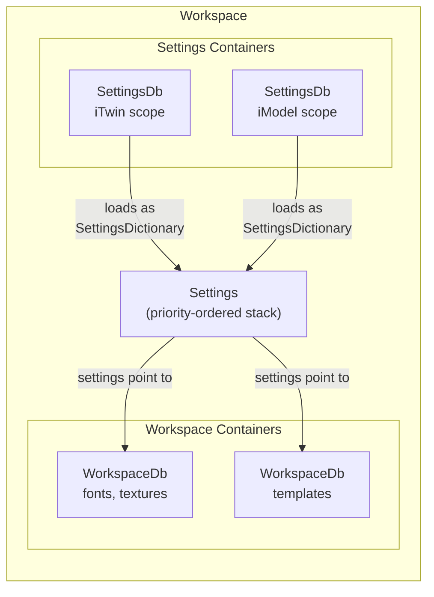

# Workspaces and Settings

Every non-trivial application requires some level of configuration to customize its run-time behavior and help it locate data resources required for it to perform its functions. An iTwin.js [Workspace]($backend) comprises the [Settings]($backend) that supply this configuration and the [WorkspaceContainer]($backend)s that provide those resources. Settings inside of [Workspace.settings]($backend) provide values for individual [SettingName]($backend)s, some of which point to one or more [WorkspaceDb]($backend)s that provide binary resources for particular purposes. The anatomy of a `Workspace` is illustrated below:



Settings are stored in [SettingsDb]($backend) containers (cloud-hosted, versioned, and discoverable by `containerType: "settings"`). Binary resources like fonts, textures, and images are stored in [WorkspaceDb]($backend) containers. At runtime, each `SettingsDb` becomes one [SettingsDictionary]($backend) in the [Settings]($backend) priority stack, and those settings tell the application where to find the `WorkspaceDb`s it needs.

To explore [Workspace]($backend) concepts, let's take the example of an imaginary application called "LandscapePro" that allows users to decorate an iModel by adding landscaping features like trees, shrubs, flower beds, and patio furniture.

## Settings

[Settings]($backend) are how administrators of an application or project configure the workspace for end-users. Be careful to avoid confusing them with "user preferences", which can be configured by individual users. For example, an application might provide a check box to toggle "dark mode" on or off. Each individual user can make their own choice as to whether they want to use this mode - it is a user preference, not a setting. But an administrator may define a setting that controls whether users can see that check box in the first place.

A [Setting]($backend) is simply a name-value pair. The value can be of one of the following types:

- A `string`, `number`, or `boolean`;
- An `object` containing properties of any of these types; or
- An `array` containing elements of one of these types.

A [SettingName]($backend) must be unique, 1 to 1024 characters long with no leading nor trailing whitespace, and should begin with the schema prefix of the [schema](#settings-schemas) that defines the setting. For example, LandscapePro might define the following settings:

```
  "landscapePro/ui/defaultToolId"
  "landscapePro/ui/availableTools"
  "landscapePro/flora/preferredStyle"
  "landscapePro/flora/treeDbs"
  "landscapePro/hardinessRange"
```

Each setting's name begins with the "landscapePro" schema prefix followed by a forward slash. Forward slashes are used to create logical groupings of settings, similar to how file paths group files into directories. In the above example, "ui" and "flora" are two separate groups containing two settings each, while "hardinessRange" is a top-level setting. An application user interface that permits the user to view or edit settings would probably present these groups as individual nodes in a tree view, or as tabs.

## Settings schemas

The metadata describing a group of related [Setting]($backend)s is defined in a [SettingGroupSchema]($backend). The schema is based on [JSON Schema](https://json-schema.org/), with the following additions:

- `schemaPrefix` (required) - a unique name for the schema. All of the names in the schema inherit this prefix.
- `description` (required) - a description of the schema appropriate for displaying to a user.
- `settingDefs` - an object consisting of [SettingSchema]($backend)s describing individual [Setting]($backend)s, indexed by their [SettingName]($backend)s.
- `typeDefs` - an object consisting of [SettingSchema]($backend)s describing reusable *types* of [Setting]($backend)s that can be referenced by [SettingSchema]($backend)s in this or any other schema.
- `order` - an optional integer used to sort the schema in a user interface that lists multiple schemas, where schemas of lower order sort before those with higher order.

We can define the LandscapePro schema programmatically as follows:

```ts
[[include:WorkspaceExamples.SettingGroupSchema]]
```

This schema defines 5 settingDefs and 1 typeDef. Note the "landscapePro" schema prefix, which is implicitly included in the name of each settingDef and typeDef in the schema - for example, the full name of the "hardinessRange" setting is "landscapePro/hardinessRange".

The "hardinessZone" typeDef represents a [USDA hardiness zone](https://en.wikipedia.org/wiki/Hardiness_zone) as an integer between 0 and 13. The "hardinessRange" settingDef reuses that typeDef for both its "minimum" and "maximum" properties by declaring that each `extends` that type. Note that `extends` requires the schema prefix to be specified, even within the same schema that defines the typeDef.

The "flora/treeDbs" settingDef `extends` the "workspaceDbList" typeDef from a different schema - the [workspace schema](https://github.com/iTwin/itwinjs-core/blob/master/core/backend/src/assets/Settings/Schemas/Workspace.Schema.json) delivered with the application, with the "itwin/core/workspace" schema prefix.

### Registering schemas

Schemas enable the application to validate that the setting values loaded at run-time match the expected types - for example, if we try to retrieve the value of the "landscapePro/ui/defaultToolId" setting and discover a number where we expect a string, an exception will be thrown. They can also be used by user interfaces that allow administrators to configure settings by enforcing types and other constraints like the one that requires "hardinessZone" to be an integer between 0 and 13. To do this, the schema must first be registered.

The set of currently-registered schemas can be accessed via [IModelHost.settingsSchemas]($backend). You can register new ones in a variety of ways. Most commonly, applications will deliver their schemas in JSON files, in which case they can use [SettingsSchemas.addFile]($backend) to supply a single JSON file or [SettingsSchemas.addDirectory]($backend) to supply a directory full of them. In our case, however, we've defined the schema programmatically, so we'll register it using [SettingsSchemas.addGroup]($backend):

```ts
[[include:WorkspaceExamples.RegisterSchema]]
```

Your application should register its schemas shortly after invoking [IModelHost.startup]($backend). A convenient way to do this is to listen for the [IModelHost.onAfterStartup]($backend) event:

```ts
IModelHost.onAfterStartup.addListener(() => {
  IModelHost.settingsSchemas.addGroup(landscapeProSchema);
});
```

Registering a schema adds its typeDefs and settingDefs to [SettingsSchemas.typeDefs]($backend) and [SettingsSchemas.settingDefs]($backend), respectively. It also raises the [SettingsSchemas.onSchemaChanged]($backend) event. All schemas are unregistered when [IModelHost.shutdown]($backend) is invoked.

### Schema validation behavior

Validation occurs lazily when you retrieve a setting value — not when the value is stored. When you call methods like [Settings.getString]($backend), [Settings.getObject]($backend), or [Settings.getBoolean]($backend), the value is validated against the registered schema for that setting name. The following rules apply:

- If **no schema** is registered for the setting name, the value passes through unchecked — no validation is performed.
- If a schema **is** registered, type mismatches will throw an error. For example, if the schema declares a setting to be a `string` but the dictionary supplies a `number`, an exception will be thrown at retrieval time.
- For `object` types, `required` fields are enforced and `extends` references are expanded recursively to resolve the full set of constraints.

Because validation happens on retrieval, a dictionary containing an invalid value will not cause problems until the application actually reads that setting. This means that you should register your schemas early — ideally via [IModelHost.onAfterStartup]($backend) — so that type errors are caught as soon as the setting is first accessed.

## Settings dictionaries

The values of [Setting]($backend)s are provided by [SettingsDictionary]($backend)s. The [Settings]($backend) for the current session can be accessed via the `settings` property of [IModelHost.appWorkspace]($backend). You can add new dictionaries to provide settings values at any time during the session, although most dictionaries will be loaded shortly after [IModelHost.startup]($backend).

> **Dictionary structure tips:** Prefix all setting names with the [schemaPrefix](#settings-schemas) of the schema that defines them to avoid collisions. Use forward-slash grouping (e.g., `"landscapePro/ui/"`, `"landscapePro/flora/"`) to organize related settings — prefer flat keys over deeply nested objects. Keep individual dictionary files focused on a single concern so administrators can override only what they need at a particular [SettingsPriority]($backend).

Let's load a settings dictionary that provides values for some of the settings in the LandscapePro schema:

```ts
[[include:WorkspaceExamples.AddDictionary]]
```

Now you can access the setting values defined in the dictionary via `IModelHost.appWorkspace.settings`:

```ts
[[include:WorkspaceExamples.GetSettings]]
```

Note that `getString` returns `undefined` for "landscapePro/preferredStyle" because our dictionary didn't provide a value for it. The overload of that function (and similar functions like [Settings.getBoolean]($backend) and [Settings.getObject]($backend)) allows you to specify a default value to use if the value is not defined.

> Note: In general, avoid caching the values of individual settings - just query them each time you need them, because they can change at any time. If you must cache (for example, if you are populating a user interface from the setting values), listen for and react to the [Settings.onSettingsChanged]($backend) event.

Any number of dictionaries can be added to [Workspace.settings]($backend). Let's add another one:

```ts
[[include:WorkspaceExamples.AddSecondDictionary]]
```

This dictionary adds a value for "landscapePro/flora/preferredStyle", and defines new values for the two settings that were also defined in the previous dictionary. See what happens when we look up those settings' values again:

```ts
[[include:WorkspaceExamples.GetMergedSettings]]
```

Now, as expected, "landscapePro/flora/preferredStyle" is no longer `undefined`. The value of "landscapePro/ui/defaultTool" has been overwritten with the value specified by the new dictionary. And the "landscapePro/ui/availableTools" array now has the merged contents of the arrays defined in *both* dictionaries. What rules determine how the value of a setting is resolved when multiple dictionaries provide a value for it? The answer lies in the dictionaries' [SettingsPriority]($backend)s.

### Settings priorities

Configurations are often layered: an application may ship with built-in default settings, that an administrator may selectively override for all users of the application. Beyond that, additional configuration may be needed on a per-organization, per-iTwin, and/or per-iModel level. [SettingsPriority]($backend) defines which dictionaries' settings take precedence over others - the dictionary with the highest priority overrides any other dictionaries that provide a value for a given setting.

A [SettingsPriority]($backend) is just a number, but specific values carry semantics:

- [SettingsPriority.defaults]($backend) describes settings from settings dictionaries loaded from files automatically at the start of a session.
- [SettingsPriority.application]($backend) describes settings supplied by the application at run-time to override or supplement the defaults.
- [SettingsPriority.organization]($backend) describes settings that apply to all iTwins belonging to a particular organization.
- [SettingsPriority.iTwin]($backend) describes settings that apply to all of the contents (including iModels) of a particular iTwin.
- [SettingsPriority.branch]($backend) describes settings that apply to all branches of a particular iModel.
- [SettingsPriority.iModel]($backend) describes settings that apply to one specific iModel.

[SettingsDictionary]($backend)s of `application` priority or lower reside in [IModelHost.appWorkspace]($backend). Those of higher priority are stored in an [IModelDb.workspace]($backend) - more on those [shortly](#imodel-settings).

In practice, this layering means that an organization admin can set org-wide defaults (at `organization` priority) that apply to all iTwins and iModels in the org. An iTwin-level admin can then selectively override specific settings for their iTwin (at `iTwin` priority) without affecting other iTwins in the same org. For example, to add a dictionary at iTwin priority that overrides the default tool for a particular iTwin:

```ts
[[include:Settings.addITwinDictionary]]
```

When that iTwin's settings are no longer needed (for example, when the user switches to a different iTwin), the dictionary can be dropped:

```ts
[[include:Settings.dropITwinDictionary]]
```

> Note: The examples above use [Settings.addDictionary]($backend), which loads dictionaries into memory for the current session only. For fully cloud-backed iTwin and organization settings — where dictionaries are fetched from cloud containers on demand — see the Container Discovery API (forthcoming).

What about the "landscapePro/ui/availableTools" array? In the [LandscapePro schema](#settings-schemas), the corresponding `settingDef` has [SettingSchema.combineArray]($backend) set to `true`, meaning that - when multiple dictionaries provide a value for the setting - instead of being overridden, they are merged together to form a single array, eliminating duplicates, and sorted in descending order by dictionary priority.

## iModel settings

So far, we have been working with [IModelHost.appWorkspace]($backend). But - as [mentioned above](#settings-priorities) - each [IModelDb]($backend) has its own workspace as well, with its own [Settings]($backend) that can override and/or supplement the application workspace's settings. These settings are stored as [SettingsDictionary]($backend)s in the iModel's `be_Props` table. When the iModel is opened, its [Workspace.settings]($backend) are populated from those dictionaries. So, an application is working in the context of a particular iModel, it should resolve setting values by asking [IModelDb.workspace]($backend), which will fall back to [IModelHost.appWorkspace]($backend) if the iModel's settings dictionaries don't provide a value for the requested setting.

### Persisted vs session-only dictionaries

There are two ways to supply settings dictionaries to an iModel's workspace, and they differ in how long the values survive:

| Method | Scope | Persistence |
|--------|-------|-------------|
| [Settings.addDictionary]($backend) | Current session only | Values exist in memory only and are lost when the iModel is closed. |
| [IModelDb.saveSettingDictionary]($backend) | All future sessions | Values are written to the iModel's `be_Props` table and automatically reloaded every time the iModel is opened. |

Use `addDictionary` for transient overrides — for example, to inject ephemeral configuration while a particular tool is active. Use `saveSettingDictionary` when an administrator intends the settings to persist as part of the iModel's permanent configuration.

Since an iModel is located in a specific geographic region, LandscapePro wants to limit the selection of foliage based on the USDA hardiness zone(s) in which the iModel resides. An administrator could configure the hardiness zone of an iModel as follows:

```ts
[[include:WorkspaceExamples.saveSettingDictionary]]
```

Note that modifying the iModel settings requires obtaining an exclusive write lock on the entire iModel. Ordinary users should never perform this kind of operation - only administrators.

The next time we open the iModel, the new settings dictionary will automatically be loaded, and we can query its settings:

```ts
[[include:WorkspaceExamples.QuerySettingDictionary]]
```

The "hardinessRange" setting is obtained from the iModel's settings dictionary, while the "defaultTool" falls back to the value defined in `IModelHost.appWorkspace.settings`.

## SettingsDb

So far, we have loaded [SettingsDictionary]($backend)s directly at run-time — building them in code and adding them to [Workspace.settings]($backend). This works for small-scale configuration and testing, but real-world deployments need a way to **store settings in the cloud**, version them over time, and discover them without opening an iModel. That is the role of [SettingsDb]($backend).

A `SettingsDb` is a dedicated [CloudSqlite]($backend) database that stores settings as a flat JSON object — [SettingName]($backend) keys mapped to [Setting]($backend) values, with no binary resources. Its containers are tagged with `containerType: "settings"` in their cloud metadata, making them discoverable independently of any iModel. This is what distinguishes a `SettingsDb` from a [WorkspaceDb]($backend): a `SettingsDb` is where you **start**. You load settings from a `SettingsDb`, and those settings tell your application which [WorkspaceDb]($backend)s hold the binary resources it needs.

### Reading settings

A [SettingsDb]($backend) provides two read methods:

- [SettingsDb.getSetting]($backend) — returns the value of a specific setting by name, or `undefined` if it does not exist.
- [SettingsDb.getSettings]($backend) — returns a deep copy of all settings as a [SettingsContainer]($backend).

Both methods auto-open and auto-close the underlying database if it is not already open. For batches of reads, call [SettingsDb.open]($backend) before the operations and [SettingsDb.close]($backend) afterwards to avoid repeated open/close overhead.

### How SettingsDb fits the priority system

When a `SettingsDb` is loaded into the runtime via [Workspace.getSettingsDb]($backend), its contents become **one** [SettingsDictionary]($backend) in the [Settings]($backend) priority stack. The data flow is:

`SettingsDb` → JSON → `Settings.addJson()` → one `SettingsDictionary` in the priority stack

Each `SettingsDb` occupies a single slot in the [priority system](#settings-priorities). Multiple `SettingsDb`s — for example, one scoped to an iTwin at [SettingsPriority.iTwin]($backend) and one scoped to an iModel at [SettingsPriority.iModel]($backend) — become separate dictionaries with separate priorities. The runtime resolves conflicts using the standard priority rules: the highest-priority dictionary that provides a value for a given setting name wins.

### Discovering settings containers

You can find all settings containers for a given iTwin by using [SettingsEditor.queryContainers]($backend) to query by iTwinId (and optionally iModelId):

```ts
[[include:SettingsDb.discoverContainers]]
```

This is useful when your application needs to enumerate available settings — for example, building an admin UI that lets users choose which settings profile to load — without hardcoding container IDs.

If you want to open the matching containers for editing in a single call, use [SettingsEditor.findContainers]($backend). It queries the service, requests write tokens, and opens each matching container:

```ts
[[include:SettingsDb.findContainers]]
```

### Creating a SettingsDb and writing settings

> Note: Creating and managing `SettingsDb` data is a task for administrators. End-users consume settings through the [Settings]($backend) runtime API. The following walkthrough shows the admin-side workflow.

The example below creates a new cloud container, writes some initial settings, and publishes them:

```ts
[[include:SettingsDb.createLocal]]
```

The key steps are:

1. **Create an editor** — call [SettingsEditor.construct]($backend). The caller is responsible for calling `close()` when finished.
2. **Create a container** — [SettingsEditor.createNewCloudContainer]($backend) creates a container automatically tagged with `containerType: "settings"`.
3. **Acquire the write lock** — [EditableSettingsCloudContainer.acquireWriteLock]($backend). Only one user can hold the lock at a time.
4. **Open an EditableSettingsDb** — [EditableSettingsCloudContainer.getEditableDb]($backend) returns an [EditableSettingsDb]($backend).
5. **Write settings** — use [EditableSettingsDb.updateSettings]($backend) to replace all settings, or [EditableSettingsDb.updateSetting]($backend) to update a single setting entry.
6. **Release the lock** — [EditableSettingsCloudContainer.releaseWriteLock]($backend) publishes your changes. Alternatively, [EditableSettingsCloudContainer.abandonChanges]($backend) discards them.

> **Important**: Always release the write lock when you are done. Failing to release it will prevent other administrators from modifying the container until the lock expires.

### Updating individual settings

Often you need to change a single setting without touching the rest. [EditableSettingsDb.updateSetting]($backend) reads the existing settings, updates the specified entry, and writes the result back — other settings are preserved:

```ts
[[include:SettingsDb.updateSetting]]
```

To remove a setting entirely, use [EditableSettingsDb.removeSetting]($backend).

To inspect all settings in a `SettingsDb`, use [SettingsDb.getSettings]($backend), which returns a deep copy:

```ts
[[include:SettingsDb.getSettings]]
```

### Versioning

Like [WorkspaceDb]($backend)s, each `SettingsDb` uses [semantic versioning](https://semver.org/). Once a version is published to cloud storage it becomes immutable. To evolve settings, create a new version via [EditableSettingsCloudContainer.createNewSettingsDbVersion]($backend), make changes, and release the write lock. The versioning workflow is the same as described in [creating workspace resources](#creating-workspace-resources).

### Putting it together: settings that point to resources

In a typical deployment, the end-to-end flow looks like this:

1. **Admin creates a settings container** for the iTwin and writes settings like `"landscapePro/flora/treeDbs"` that point to [WorkspaceDb]($backend)s holding binary resources.
2. **Admin creates workspace containers** holding the versioned [WorkspaceDb]($backend)s (fonts, textures, templates, etc.).
3. **At runtime**, the application discovers and loads the settings container via [Workspace.getSettingsDb]($backend), which adds a [SettingsDictionary]($backend) to the [Settings]($backend) priority stack.
4. **The application reads settings** — for example, `settings.getSetting("landscapePro/flora/treeDbs")` — and uses them to load the appropriate `WorkspaceDb`s.

This two-layer design keeps settings and resources in separate containers with independent access control, versioning, and write locks. The [workspace resources](#workspace-resources) section below shows how to create and access `WorkspaceDb`s, and the [accessing workspace resources](#accessing-workspace-resources) section shows how settings point to them.

## Workspace resources

"Resources" are bits of data that an application depends on at run-time to perform its functions. The kinds of resources can vary widely from one application to another, but some common examples include:

- [GeographicCRS]($common)es used to specify an iModel's spatial coordinate system.
- Images that can be used as pattern maps for [Texture]($backend)s.

It might be technically possible to store resources in [Setting]($backend)s, but doing so would present significant disadvantages:

- Some resources, like images and fonts, may be defined in a binary format that is inefficient to represent using JSON.
- Some resources, like geographic coordinate system definitions, must be extracted to files on the local file system before they can be used.
- Some resources may be large, in size and/or quantity.
- Resources can often be reused across many projects, organizations, and iModels.
- Administrators often desire for resources to be versioned.
- Administrators often want to restrict who can read or create resources.

To address these requirements, workspace resources are stored in immutable, versioned [CloudSqlite]($backend) databases called [WorkspaceDb]($backend)s, and [Setting]($backend)s are configured to enable the application to locate those resources in the context of a session and - if relevant - an iModel.

A [WorkspaceDb]($backend) can contain any number of resources of any kind, where "kind" refers to the purpose for which it is intended to be used. For example, fonts, text styles, and images are different kinds of resources. Each resource must have a unique name, between 1 and 1024 characters in length and containing no leading or trailing whitespace. A resource name should incorporate a [schemaPrefix](#settings-schemas) and an additional qualifier to distinguish between different kinds of resources stored inside the same `WorkspaceDb`. For example, a database might include text styles named "itwin/textStyles/*styleName*" and images named "itwin/patternMaps/*imageName*". Prefixes in resource names are essential unless you are creating a `WorkspaceDb` that will only ever hold a single kind of resource.

Ultimately, each resource is stored as one of three underlying types:

- A string, which quite often is interpreted as a serialized JSON object. Examples include text styles and settings dictionaries.
- A binary blob, such as an image.
- An embedded file, like a PDF file that users can view in a separate application.

String and blob resources can be accessed directly using [WorkspaceDb.getString]($backend) and [WorkspaceDb.getBlob]($backend). File resources must first be copied onto the local file system using [WorkspaceDb.getFile]($backend), and should be avoided unless they must be used with software that requires them to be accessed from disk.

[WorkspaceDb]($backend)s are stored in access-controlled [WorkspaceContainer]($backend)s backed by cloud storage. So, the structure of a [Workspace]($backend) is a hierarchy: a `Workspace` contains any number of `WorkspaceContainer`s, each of which contains any number of `WorkspaceDb`s, each of which contains any number of resources. The container is the unit of access control - anyone who has read access to the container can read the contents of any `WorkspaceDb` inside it, and anyone with write access to the container can modify its contents.

### Creating workspace resources

> Note: Creating and managing data in workspaces is a task for administrators, not end-users. Administrators will typically use a specialized application with a user interface designed for this task. For the purposes of illustration, the following examples will use the `WorkspaceEditor` API directly.

LandscapePro allows users to decorate a landscape with a variety of trees and other flora. So, trees are one of the kinds of resources the application needs to access to perform its functions. Naturally, they should be stored in the [Workspace]($backend). Let's create a [WorkspaceDb]($backend) to hold trees of the genus *Cornus*.

Since every [WorkspaceDb]($backend) must reside inside a [WorkspaceContainer]($backend), we must first create a container. Creating a container also creates a default `WorkspaceDb`. In the `createTreeDb` function below, we will set up the container's default `WorkspaceDb` to be an as-yet empty tree database.

```ts
[[include:WorkspaceExamples.CreateWorkspaceDb]]
```

Now, let's define what a "tree" resource looks like, and add some of them to a new `WorkspaceDb`. To do so, we'll need to make a new version of the empty "cornus" `WorkspaceDb` we created above. `WorkspaceDb`s use [semantic versioning](https://semver.org/), starting with a pre-release version (0.0.0). Each version of a given `WorkspaceDb` becomes immutable once published to cloud storage, with the exception of pre-release versions. The process for creating a new version of a `WorkspaceDb` is as follows:

1. Acquire the container's write lock. Only one person - the current holder of the lock - can make changes to the contents of a given container at any given time.
1. Create a new version of an existing `WorkspaceDb`.
1. Open the new version of the db for writing.
1. Modify the contents of the db.
1. Close the db.
1. (Optionally, create more new versions of `WorkspaceDb`s in the same container).
1. Release the container's write lock.

Once the write lock is released, the new versions of the `WorkspaceDb`s are published to cloud storage and become immutable. Alternatively, you can discard all of your changes via [EditableWorkspaceContainer.abandonChanges]($backend) - this also releases the write lock.

> Semantic versioning and immutability of published versions are core features of Workspaces. Newly created `WorkspaceDb`s start with a pre-release version that bypasses these features. Therefore, after creating a `WorkspaceDb`, administrators should load it with the desired resources and then publish version 1.0.0. Pre-release versions are useful when making work-in-progress adjustments or sharing changes prior to publishing a new version.

```ts
[[include:WorkspaceExamples.AddTrees]]
```

In the example above, we created version 1.1.0 of the "cornus" `WorkspaceDb`, added two species of dogwood tree to it, and uploaded it. Later, we might create a patched version 1.1.1 that includes a species of dogwood that we forgot in version 1.1.0, and add a second `WorkspaceDb` to hold trees of the genus *abies*:

```ts
[[include:WorkspaceExamples.CreatePatch]]
```

Note that we created one `WorkspaceContainer` to hold versions of the "cornus" `WorkspaceDb`, and a separate container for the "abies" `WorkspaceDb`. Alternatively, we could have put both `WorkspaceDb`s into the same container. However, because access control is enforced at the container level, maintaining a 1:1 mapping between containers and `WorkspaceDb`s simplifies things and reduces contention for the container's write lock.

### Accessing workspace resources

Now that we have some [WorkspaceDb]($backend)s, we can configure our [Settings]($backend) to use them. The [LandscapePro schema](#settings-schemas) defines a "landscapePro/flora/treeDbs" setting that `extends` the type [itwin/core/workspace/workspaceDbList](https://github.com/iTwin/itwinjs-core/blob/master/core/backend/src/assets/Settings/Schemas/Workspace.Schema.json). This type defines an array of [WorkspaceDbProps]($backend), and overrides the `combineArray` property to `true`. So, a setting of this type can be resolved to a list of [WorkspaceDb]($backend)s, sorted by [SettingsPriority]($backend), from which you can obtain resources.

Let's write a function that produces a list of all of the available trees that can survive in a specified USDA hardiness zone:

```ts
[[include:WorkspaceExamples.getAvailableTrees]]
```

Now, let's configure the "landscapePro/flora/treeDbs" setting to point to the two `WorkspaceDb`s we created, and use the `getAvailableTrees` function to retrieve `TreeResource`s from it:

```ts
[[include:WorkspaceExamples.QueryResources]]
```

In the example above, `allTrees` includes all five tree species from the two genuses, because they all fall within the hardiness range (0, 13). `iModelTrees` excludes the Roughleaf Dogwood and Pacific Silver Fir, because their hardiness ranges of (9, 9) and (5, 5) do not intersect the iModel's hardiness range (6, 8).

Note that we configured the setting to point to the patch 1.1.1 version of the cornus `WorkspaceDb` that added the Northern Swamp Dogwood. If we had omitted the [WorkspaceDbProps.version]($backend) property, it would have defaulted to the latest version - in this case, 1.1.1 again, but if in the future we created a new version, that would become the new "latest" version and automatically get picked up for use.

If we configure the setting to use version 1.1.0, then `allTrees` will not include the Northern Swamp Dogwood added in 1.1.1:

```ts
[[include:WorkspaceExamples.QuerySpecificVersion]]
```

We could also configure the version more precisely using [semantic versioning](https://semver.org) rules to specify a range of acceptable versions. When compatible new versions of a `WorkspaceDb` are published, the workspace would automatically consume them without requiring any explicit changes to its [Settings]($backend).

It may be tempting to "optimize" by calling `getAvailableTrees` once when your application starts up and caching the result to reuse throughout the session, but remember that the list of trees is determined by a setting, and settings can change at any time during the session. If you must cache, make sure you listen for the [Settings.onSettingsChanged]($backend) event to be notified when your cache may have become stale.
