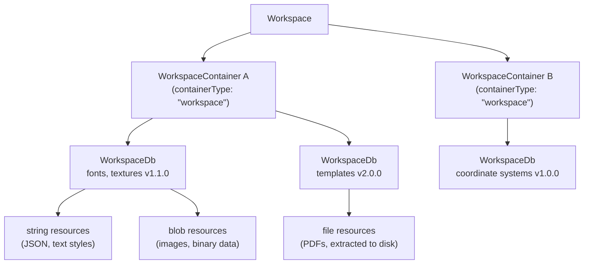

# Workspace Resources

A [Workspace]($backend) provides the binary resources an iTwin.js application needs at run-time — things like fonts, textures, geographic coordinate system definitions, and other named data assets. These resources are stored in versioned, cloud-hosted [WorkspaceDb]($backend) databases.

> **New to this topic?** Start with the [Workspaces and Settings overview](./WorkspacesAndSettings.md) to understand how `WorkspaceDb`, [SettingsDb]($backend), and the [Settings]($backend) priority stack relate before diving in here.

Settings tell the application *which* `WorkspaceDb`s to load; this file explains how those databases are structured, created, and accessed. For everything about settings — schemas, dictionaries, priorities, and the cloud-hosted `SettingsDb` — see [Settings](./Settings.md).

## Structure of a workspace



The container is the unit of access control — anyone with read access to a container can read any `WorkspaceDb` inside it, and anyone with write access can modify its contents. Maintaining a 1:1 mapping between containers and `WorkspaceDb`s simplifies access control and reduces write lock contention.

## Workspace resources

"Resources" are bits of data that an application depends on at run-time to perform its functions. Some common examples include:

- [GeographicCRS]($common)es used to specify an iModel's spatial coordinate system.
- Images that can be used as pattern maps for [Texture]($backend)s.

It might be technically possible to store resources in [Setting]($backend)s, but doing so would present significant disadvantages:

- Some resources, like images and fonts, may be defined in a binary format that is inefficient to represent using JSON.
- Some resources, like geographic coordinate system definitions, must be extracted to files on the local file system before they can be used.
- Some resources may be large, in size and/or quantity.
- Resources can often be reused across many projects, organizations, and iModels.
- Administrators often desire for resources to be versioned.
- Administrators often want to restrict who can read or create resources.

To address these requirements, workspace resources are stored in immutable, versioned [CloudSqlite]($backend) databases called [WorkspaceDb]($backend)s, and [Setting]($backend)s are configured to enable the application to locate those resources in the context of a session and - if relevant - an iModel.

A [WorkspaceDb]($backend) can contain any number of resources of any kind, where "kind" refers to the purpose for which it is intended to be used. For example, fonts, text styles, and images are different kinds of resources. Each resource must have a unique name, between 1 and 1024 characters in length and containing no leading or trailing whitespace. A resource name should incorporate a [schemaPrefix](./Settings.md#settings-schemas) and an additional qualifier to distinguish between different kinds of resources stored inside the same `WorkspaceDb`. For example, a database might include text styles named "itwin/textStyles/*styleName*" and images named "itwin/patternMaps/*imageName*". Prefixes in resource names are essential unless you are creating a `WorkspaceDb` that will only ever hold a single kind of resource.

Ultimately, each resource is stored as one of three underlying types:

- A string, which quite often is interpreted as a serialized JSON object. Examples include text styles and settings dictionaries.
- A binary blob, such as an image.
- An embedded file, like a PDF file that users can view in a separate application.

String and blob resources can be accessed directly using [WorkspaceDb.getString]($backend) and [WorkspaceDb.getBlob]($backend). File resources must first be copied onto the local file system using [WorkspaceDb.getFile]($backend), and should be avoided unless they must be used with software that requires them to be accessed from disk.

[WorkspaceDb]($backend)s are stored in access-controlled [WorkspaceContainer]($backend)s backed by cloud storage. So, the structure of a [Workspace]($backend) is a hierarchy: a `Workspace` contains any number of `WorkspaceContainer`s, each of which contains any number of `WorkspaceDb`s, each of which contains any number of resources. The container is the unit of access control - anyone who has read access to the container can read the contents of any `WorkspaceDb` inside it, and anyone with write access to the container can modify its contents.

### Creating workspace resources

> Note: Creating and managing data in workspaces is a task for administrators, not end-users. Administrators will typically use a specialized application with a user interface designed for this task. For the purposes of illustration, the following examples will use the `WorkspaceEditor` API directly.

LandscapePro allows users to decorate a landscape with a variety of trees and other flora. So, trees are one of the kinds of resources the application needs to access to perform its functions. Naturally, they should be stored in the [Workspace]($backend). Let's create a [WorkspaceDb]($backend) to hold trees of the genus *Cornus*.

Since every [WorkspaceDb]($backend) must reside inside a [WorkspaceContainer]($backend), we must first create a container. Creating a container also creates a default `WorkspaceDb`. In the `createTreeDb` function below, we will set up the container's default `WorkspaceDb` to be an as-yet empty tree database.

```ts
[[include:WorkspaceExamples.CreateWorkspaceDb]]
```

Now, let's define what a "tree" resource looks like, and add some of them to a new `WorkspaceDb`. To do so, we'll need to make a new version of the empty "cornus" `WorkspaceDb` we created above. `WorkspaceDb`s use [semantic versioning](https://semver.org/), starting with a pre-release version (0.0.0). Each version of a given `WorkspaceDb` becomes immutable once published to cloud storage, with the exception of pre-release versions. The process for creating a new version of a `WorkspaceDb` is as follows:

1. Acquire the container's write lock. Only one person — the current holder of the lock — can make changes to the contents of a given container at any given time.
1. Create a new version of an existing `WorkspaceDb`.
1. Open the new version of the db for writing.
1. Modify the contents of the db.
1. Close the db.
1. (Optionally, create more new versions of `WorkspaceDb`s in the same container).
1. Release the container's write lock.

Once the write lock is released, the new versions of the `WorkspaceDb`s are published to cloud storage and become immutable. Alternatively, you can discard all of your changes via [EditableWorkspaceContainer.abandonChanges]($backend) — this also releases the write lock.

> Semantic versioning and immutability of published versions are core features of Workspaces. Newly created `WorkspaceDb`s start with a pre-release version that bypasses these features. Therefore, after creating a `WorkspaceDb`, administrators should load it with the desired resources and then publish version 1.0.0. Pre-release versions are useful when making work-in-progress adjustments or sharing changes prior to publishing a new version.

```ts
[[include:WorkspaceExamples.AddTrees]]
```

In the example above, we created version 1.1.0 of the "cornus" `WorkspaceDb`, added two species of dogwood tree to it, and uploaded it. Later, we might create a patched version 1.1.1 that includes a species of dogwood that we forgot in version 1.1.0, and add a second `WorkspaceDb` to hold trees of the genus *abies*:

```ts
[[include:WorkspaceExamples.CreatePatch]]
```

Note that we created one `WorkspaceContainer` to hold versions of the "cornus" `WorkspaceDb`, and a separate container for the "abies" `WorkspaceDb`. Alternatively, we could have put both `WorkspaceDb`s into the same container. However, because access control is enforced at the container level, maintaining a 1:1 mapping between containers and `WorkspaceDb`s simplifies things and reduces contention for the container's write lock.

### Accessing workspace resources

Now that we have some [WorkspaceDb]($backend)s, we can configure our [Settings]($backend) to use them. The [LandscapePro schema](./Settings.md#settings-schemas) defines a "landscapePro/flora/treeDbs" setting that `extends` the type [itwin/core/workspace/workspaceDbList](https://github.com/iTwin/itwinjs-core/blob/master/core/backend/src/assets/Settings/Schemas/Workspace.Schema.json). This type defines an array of [WorkspaceDbProps]($backend), and overrides the `combineArray` property to `true`. So, a setting of this type can be resolved to a list of [WorkspaceDb]($backend)s, sorted by [SettingsPriority]($backend), from which you can obtain resources.

Let's write a function that produces a list of all of the available trees that can survive in a specified USDA hardiness zone:

```ts
[[include:WorkspaceExamples.getAvailableTrees]]
```

Now, let's configure the "landscapePro/flora/treeDbs" setting to point to the two `WorkspaceDb`s we created, and use the `getAvailableTrees` function to retrieve `TreeResource`s from it:

```ts
[[include:WorkspaceExamples.QueryResources]]
```

In the example above, `allTrees` includes all five tree species from the two genuses, because they all fall within the hardiness range (0, 13). `iModelTrees` excludes the Roughleaf Dogwood and Pacific Silver Fir, because their hardiness ranges of (9, 9) and (5, 5) do not intersect the iModel's hardiness range (6, 8).

Note that we configured the setting to point to the patch 1.1.1 version of the cornus `WorkspaceDb` that added the Northern Swamp Dogwood. If we had omitted the [WorkspaceDbProps.version]($backend) property, it would have defaulted to the latest version — in this case, 1.1.1 again, but if in the future we created a new version, that would become the new "latest" version and automatically get picked up for use.

If we configure the setting to use version 1.1.0, then `allTrees` will not include the Northern Swamp Dogwood added in 1.1.1:

```ts
[[include:WorkspaceExamples.QuerySpecificVersion]]
```

We could also configure the version more precisely using [semantic versioning](https://semver.org) rules to specify a range of acceptable versions. When compatible new versions of a `WorkspaceDb` are published, the workspace would automatically consume them without requiring any explicit changes to its [Settings]($backend).

It may be tempting to "optimize" by calling `getAvailableTrees` once when your application starts up and caching the result to reuse throughout the session, but remember that the list of trees is determined by a setting, and settings can change at any time during the session. If you must cache, make sure you listen for the [Settings.onSettingsChanged]($backend) event to be notified when your cache may have become stale.
