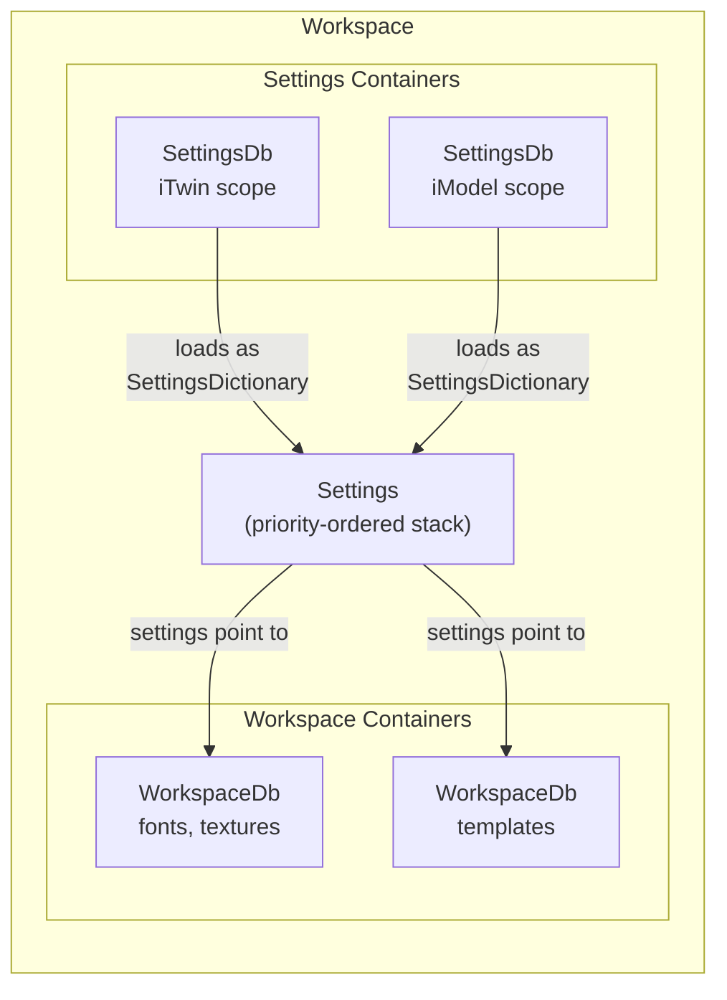

# Workspaces and Settings

Every non-trivial application requires some level of configuration to customize its run-time behavior and help it locate data resources required for it to perform its functions. An iTwin.js [Workspace]($backend) comprises the [Settings]($backend) that supply this configuration and the [WorkspaceContainer]($backend)s that provide those resources. Settings inside of [Workspace.settings]($backend) provide values for individual [SettingName]($backend)s, some of which point to one or more [WorkspaceDb]($backend)s that provide binary resources for particular purposes. The anatomy of a `Workspace` is illustrated below:



Settings are stored in [SettingsDb]($backend) containers (cloud-hosted, versioned, and discoverable by `containerType: "settings"`). Binary resources like fonts, textures, and images are stored in [WorkspaceDb]($backend) containers. At runtime, each `SettingsDb` becomes one [SettingsDictionary]($backend) in the [Settings]($backend) priority stack, and those settings tell the application where to find the `WorkspaceDb`s it needs.

To explore [Workspace]($backend) concepts, let's take the example of an imaginary application called "LandscapePro" that allows users to decorate an iModel by adding landscaping features like trees, shrubs, flower beds, and patio furniture.

## Settings

[Settings]($backend) are how administrators of an application or project configure the workspace for end-users. Be careful to avoid confusing them with "user preferences", which can be configured by individual users. For example, an application might provide a check box to toggle "dark mode" on or off. Each individual user can make their own choice as to whether they want to use this mode - it is a user preference, not a setting. But an administrator may define a setting that controls whether users can see that check box in the first place.

A [Setting]($backend) is simply a name-value pair. The value can be of one of the following types:

- A `string`, `number`, or `boolean`;
- An `object` containing properties of any of these types; or
- An `array` containing elements of one of these types.

A [SettingName]($backend) must be unique, 1 to 1024 characters long with no leading nor trailing whitespace, and should begin with the schema prefix of the [schema](#settings-schemas) that defines the setting. For example, LandscapePro might define the following settings:

```
  "landscapePro/ui/defaultToolId"
  "landscapePro/ui/availableTools"
  "landscapePro/flora/preferredStyle"
  "landscapePro/flora/treeDbs"
  "landscapePro/hardinessRange"
```

Each setting's name begins with the "landscapePro" schema prefix followed by a forward slash. Forward slashes are used to create logical groupings of settings, similar to how file paths group files into directories. In the above example, "ui" and "flora" are two separate groups containing two settings each, while "hardinessRange" is a top-level setting. An application user interface that permits the user to view or edit settings would probably present these groups as individual nodes in a tree view, or as tabs.

## Settings schemas

The metadata describing a group of related [Setting]($backend)s is defined in a [SettingGroupSchema]($backend). The schema is based on [JSON Schema](https://json-schema.org/), with the following additions:

- `schemaPrefix` (required) - a unique name for the schema. All of the names in the schema inherit this prefix.
- `description` (required) - a description of the schema appropriate for displaying to a user.
- `settingDefs` - an object consisting of [SettingSchema]($backend)s describing individual [Setting]($backend)s, indexed by their [SettingName]($backend)s.
- `typeDefs` - an object consisting of [SettingSchema]($backend)s describing reusable *types* of [Setting]($backend)s that can be referenced by [SettingSchema]($backend)s in this or any other schema.
- `order` - an optional integer used to sort the schema in a user interface that lists multiple schemas, where schemas of lower order sort before those with higher order.

We can define the LandscapePro schema programmatically as follows:

```ts
[[include:WorkspaceExamples.SettingGroupSchema]]
```

This schema defines 5 settingDefs and 1 typeDef. Note the "landscapePro" schema prefix, which is implicitly included in the name of each settingDef and typeDef in the schema - for example, the full name of the "hardinessRange" setting is "landscapePro/hardinessRange".

The "hardinessZone" typeDef represents a [USDA hardiness zone](https://en.wikipedia.org/wiki/Hardiness_zone) as an integer between 0 and 13. The "hardinessRange" settingDef reuses that typeDef for both its "minimum" and "maximum" properties by declaring that each `extends` that type. Note that `extends` requires the schema prefix to be specified, even within the same schema that defines the typeDef.

The "flora/treeDbs" settingDef `extends` the "workspaceDbList" typeDef from a different schema - the [workspace schema](https://github.com/iTwin/itwinjs-core/blob/master/core/backend/src/assets/Settings/Schemas/Workspace.Schema.json) delivered with the application, with the "itwin/core/workspace" schema prefix.

### Registering schemas

Schemas enable the application to validate that the setting values loaded at run-time match the expected types - for example, if we try to retrieve the value of the "landscapePro/ui/defaultToolId" setting and discover a number where we expect a string, an exception will be thrown. They can also be used by user interfaces that allow administrators to configure settings by enforcing types and other constraints like the one that requires "hardinessZone" to be an integer between 0 and 13. To do this, the schema must first be registered.

The set of currently-registered schemas can be accessed via [IModelHost.settingsSchemas]($backend). You can register new ones in a variety of ways. Most commonly, applications will deliver their schemas in JSON files, in which case they can use [SettingsSchemas.addFile]($backend) to supply a single JSON file or [SettingsSchemas.addDirectory]($backend) to supply a directory full of them. In our case, however, we've defined the schema programmatically, so we'll register it using [SettingsSchemas.addGroup]($backend):

```ts
[[include:WorkspaceExamples.RegisterSchema]]
```

Your application should register its schemas shortly after invoking [IModelHost.startup]($backend). Registering a schema adds its typeDefs and settingDefs to [SettingsSchemas.typeDefs]($backend) and [SettingsSchemas.settingDefs]($backend), respectively. It also raises the [SettingsSchemas.onSchemaChanged]($backend) event. All schemas are unregistered when [IModelHost.shutdown]($backend) is invoked.

## Settings dictionaries

The values of [Setting]($backend)s are provided by [SettingsDictionary]($backend)s. The [Settings]($backend) for the current session can be accessed via the `settings` property of [IModelHost.appWorkspace]($backend). You can add new dictionaries to provide settings values at any time during the session, although most dictionaries will be loaded shortly after [IModelHost.startup]($backend).

Let's load a settings dictionary that provides values for some of the settings in the LandscapePro schema:

```ts
[[include:WorkspaceExamples.AddDictionary]]
```

Now you can access the setting values defined in the dictionary via `IModelHost.appWorkspace.settings`:

```ts
[[include:WorkspaceExamples.GetSettings]]
```

Note that `getString` returns `undefined` for "landscapePro/preferredStyle" because our dictionary didn't provide a value for it. The overload of that function (and similar functions like [Settings.getBoolean]($backend) and [Settings.getObject]($backend)) allows you to specify a default value to use if the value is not defined.

> Note: In general, avoid caching the values of individual settings - just query them each time you need them, because they can change at any time. If you must cache (for example, if you are populating a user interface from the setting values), listen for and react to the [Settings.onSettingsChanged]($backend) event.

Any number of dictionaries can be added to [Workspace.settings]($backend). Let's add another one:

```ts
[[include:WorkspaceExamples.AddSecondDictionary]]
```

This dictionary adds a value for "landscapePro/flora/preferredStyle", and defines new values for the two settings that were also defined in the previous dictionary. See what happens when we look up those settings' values again:

```ts
[[include:WorkspaceExamples.GetMergedSettings]]
```

Now, as expected, "landscapePro/flora/preferredStyle" is no longer `undefined`. The value of "landscapePro/ui/defaultTool" has been overwritten with the value specified by the new dictionary. And the "landscapePro/ui/availableTools" array now has the merged contents of the arrays defined in *both* dictionaries. What rules determine how the value of a setting is resolved when multiple dictionaries provide a value for it? The answer lies in the dictionaries' [SettingsPriority]($backend)s.

### Settings priorities

Configurations are often layered: an application may ship with built-in default settings, that an administrator may selectively override for all users of the application. Beyond that, additional configuration may be needed on a per-organization, per-iTwin, and/or per-iModel level. [SettingsPriority]($backend) defines which dictionaries' settings take precedence over others - the dictionary with the highest priority overrides any other dictionaries that provide a value for a given setting.

A [SettingsPriority]($backend) is just a number, but specific values carry semantics:

- [SettingsPriority.defaults]($backend) describes settings from settings dictionaries loaded from files automatically at the start of a session.
- [SettingsPriority.application]($backend) describes settings supplied by the application at run-time to override or supplement the defaults.
- [SettingsPriority.organization]($backend) describes settings that apply to all iTwins belonging to a particular organization.
- [SettingsPriority.iTwin]($backend) describes settings that apply to all of the contents (including iModels) of a particular iTwin.
- [SettingsPriority.branch]($backend) describes settings that apply to all branches of a particular iModel.
- [SettingsPriority.iModel]($backend) describes settings that apply to one specific iModel.

[SettingsDictionary]($backend)s of `application` priority or lower reside in [IModelHost.appWorkspace]($backend). iTwin-scoped settings are loaded into the workspace returned by [IModelHost.getITwinWorkspace]($backend) — see [iTwin settings](#itwin-settings). Settings of even higher priority (branch and iModel) are stored in an [IModelDb.workspace]($backend) — see [iModel settings](#imodel-settings).

## iTwin settings

So far, we have been working with [IModelHost.appWorkspace]($backend). But - as [mentioned above](#settings-priorities) - each iTwin has its own workspace as well, with its own [Settings]($backend) that can override and/or supplement the application workspace's settings. These settings are stored as named [SettingsDictionary]($backend)s in a [WorkspaceDb]($backend) scoped to that iTwin. Whenever [IModelHost.getITwinWorkspace]($backend) is called, all named dictionaries in the container are loaded into the returned [Workspace.settings]($backend) at [SettingsPriority.iTwin]($backend). An application working in the context of a particular iTwin should resolve setting values by asking [IModelHost.getITwinWorkspace]($backend), which will fall back to [IModelHost.appWorkspace]($backend) if the iTwin's setting dictionaries don't provide a value for the requested setting.

Before using iTwin settings, ensure two services are configured:

- [IModelHost.authorizationClient]($backend) — so the backend can acquire user tokens.
- [BlobContainer.service]($backend) — so settings containers can be discovered and opened.

With those in place, load the iTwin workspace:

```ts
[[include:WorkspaceExamples.GetITwinWorkspace]]
```

The returned [Workspace]($backend) gives you access to all settings and resources associated with the iTwin.

### Saving iTwin settings

To save a named settings dictionary for an iTwin, call [IModelHost.saveSettingDictionary]($backend) with a dictionary name and a [SettingsContainer]($backend) of key-value pairs:

```ts
[[include:WorkspaceExamples.SaveITwinSettings]]
```

If no settings container exists for the specified iTwin yet, one is created automatically. The dictionary name becomes the resource name in the [WorkspaceDb]($backend). Multiple named dictionaries can coexist in the same container.

### Deleting iTwin settings

To remove an entire named dictionary, use [IModelHost.deleteSettingDictionary]($backend):

```ts
[[include:WorkspaceExamples.DeleteITwinSetting]]
```

### Reading iTwin settings

To read iTwin settings, query the `settings` of the [Workspace]($backend) returned by [IModelHost.getITwinWorkspace]($backend):

```ts
[[include:WorkspaceExamples.ReadITwinSettings]]
```

iTwin settings are loaded with [SettingsPriority.iTwin]($backend) priority.

## iModel settings

Each [IModelDb]($backend) has its own [Workspace]($backend), accessible via [IModelDb.workspace]($backend). This workspace inherits all app-level and iTwin-level settings, and layers on settings stored inside the iModel itself. Because these iModel-level dictionaries are loaded at [SettingsPriority.iModel]($backend) — the highest built-in priority — they override any lower-priority setting with the same name.

Use iModel settings when a particular iModel needs configuration that differs from the rest of its iTwin, or when you want to persist metadata (like an iTwin settings container reference) inside the iModel so it is available in future sessions.

### Saving iModel settings

To save settings into an iModel, call [IModelDb.saveSettingDictionary]($backend) with a dictionary name and a [SettingsContainer]($backend) of key-value pairs:

```ts
[[include:WorkspaceExamples.saveSettingDictionary]]
```

The dictionary name (e.g. `"landscapePro/iModelSettings"`) identifies the dictionary within the iModel. If a dictionary with that name already exists, it is replaced; otherwise a new one is created. You can save multiple dictionaries under different names.

### Deleting iModel settings

To remove an entire settings dictionary from an iModel, use [IModelDb.deleteSettingDictionary]($backend):

```ts
iModel.deleteSettingDictionary("landscapePro/iModelSettings");
```

### Reading iModel settings

Settings saved into the iModel are automatically loaded into [IModelDb.workspace]($backend). Read them the same way you read any other settings — the priority stack resolves the effective value:

```ts
[[include:WorkspaceExamples.QuerySettingDictionary]]
```

In the example above, `landscapePro/hardinessRange` was saved into the iModel, so it is returned from the iModel's dictionary. But `landscapePro/ui/defaultTool` was not saved at the iModel level, so it falls through to the app-level dictionary that defined it earlier.

### Overriding iTwin settings per iModel

Because [SettingsPriority.iModel]($backend) is higher than [SettingsPriority.iTwin]($backend), any setting saved at the iModel level takes precedence over the same setting at the iTwin level.

For example, suppose the iTwin setting `landscapePro/flora/preferredStyle` is `"naturalistic"` for the entire iTwin, but one particular iModel represents a formal garden:

```ts
[[include:WorkspaceExamples.OverrideITwinSettingAtIModelLevel]]
```

Now when the application reads `landscapePro/flora/preferredStyle` from this iModel's workspace, it gets `"formal"`. All other iModels in the iTwin continue to use the iTwin-level value.

### Referencing iTwin settings from an iModel

An iModel doesn't inherently know which iTwin settings container it should use. By saving the container's identity as an iModel-level setting, the iTwin settings become part of the iModel's workspace — so [IModelDb.workspace]($backend) becomes the single place to resolve all settings and resources the iModel uses.

```ts
[[include:WorkspaceExamples.SaveITwinSettingsReferenceInIModel]]
```

The next time the iModel is opened, your app reads `landscapePro/itwinSettingsRef` and uses it to load the same iTwin settings container. By default this resolves to the latest version of those settings.

### Pinning iTwin settings versions

If you need to pin the iModel to a specific version of the iTwin settings — so that its configuration does not change even when the iTwin settings are updated — save the version alongside the container props:

```ts
[[include:WorkspaceExamples.VersionAndPinITwinSettings]]
```


## Workspace resources

We've now covered settings — the name-value pairs that configure an application's behavior. But applications also depend on **resources**: binary data files like fonts, textures, images, and templates. This section explains how resources are stored and accessed.

The kinds of resources vary widely, but common examples include:

- [GeographicCRS]($common)es used to specify an iModel's spatial coordinate system.
- Images that can be used as pattern maps for [Texture]($backend)s.

While you could technically store resources as [Setting]($backend) values, doing so would present significant disadvantages:

- Some resources, like images and fonts, may be defined in a binary format that is inefficient to represent using JSON.
- Some resources, like geographic coordinate system definitions, must be extracted to files on the local file system before they can be used.
- Some resources may be large, in size and/or quantity.
- Resources can often be reused across many projects, organizations, and iModels.
- Administrators often desire for resources to be versioned.
- Administrators often want to restrict who can read or create resources.

To address these requirements, workspace resources are stored in immutable, versioned [CloudSqlite]($backend) databases called [WorkspaceDb]($backend)s, and [Setting]($backend)s are configured to enable the application to locate those resources in the context of a session and - if relevant - an iModel.

A [WorkspaceDb]($backend) can contain any number of resources of any kind, where "kind" refers to the purpose for which it is intended to be used. For example, fonts, text styles, and images are different kinds of resources. Each resource must have a unique name, between 1 and 1024 characters in length and containing no leading or trailing whitespace. A resource name should incorporate a [schemaPrefix](#settings-schemas) and an additional qualifier to distinguish between different kinds of resources stored inside the same `WorkspaceDb`. For example, a database might include text styles named "itwin/textStyles/*styleName*" and images named "itwin/patternMaps/*imageName*". Prefixes in resource names are essential unless you are creating a `WorkspaceDb` that will only ever hold a single kind of resource.

Ultimately, each resource is stored as one of three underlying types:

- A string, which quite often is interpreted as a serialized JSON object. Examples include text styles and settings dictionaries.
- A binary blob, such as an image.
- An embedded file, like a PDF file that users can view in a separate application.

String and blob resources can be accessed directly using [WorkspaceDb.getString]($backend) and [WorkspaceDb.getBlob]($backend). File resources must first be copied onto the local file system using [WorkspaceDb.getFile]($backend), and should be avoided unless they must be used with software that requires them to be accessed from disk.

[WorkspaceDb]($backend)s are stored in access-controlled [WorkspaceContainer]($backend)s backed by cloud storage. So, the structure of a [Workspace]($backend) is a hierarchy: a `Workspace` contains any number of `WorkspaceContainer`s, each of which contains any number of `WorkspaceDb`s, each of which contains any number of resources. The container is the unit of access control - anyone who has read access to the container can read the contents of any `WorkspaceDb` inside it, and anyone with write access to the container can modify its contents.

### Creating workspace resources

> Note: Creating and managing data in workspaces is a task for administrators, not end-users. Administrators will typically use a specialized application with a user interface designed for this task. For the purposes of illustration, the following examples will use the `WorkspaceEditor` API directly.

LandscapePro allows users to decorate a landscape with a variety of trees and other flora. So, trees are one of the kinds of resources the application needs to access to perform its functions. Naturally, they should be stored in the [Workspace]($backend). Let's create a [WorkspaceDb]($backend) to hold trees of the genus *Cornus*.

Since every [WorkspaceDb]($backend) must reside inside a [WorkspaceContainer]($backend), we must first create a container. Creating a container also creates a default `WorkspaceDb`. In the `createTreeDb` function below, we will set up the container's default `WorkspaceDb` to be an as-yet empty tree database.

```ts
[[include:WorkspaceExamples.CreateWorkspaceDb]]
```

Now, let's define what a "tree" resource looks like, and add some of them to a new `WorkspaceDb`. To do so, we'll need to make a new version of the empty "cornus" `WorkspaceDb` we created above. `WorkspaceDb`s use [semantic versioning](https://semver.org/), starting with a pre-release version (0.0.0). Each version of a given `WorkspaceDb` becomes immutable once published to cloud storage, with the exception of pre-release versions. The process for creating a new version of a `WorkspaceDb` is as follows:

1. Acquire the container's write lock. Only one person - the current holder of the lock - can make changes to the contents of a given container at any given time.
1. Create a new version of an existing `WorkspaceDb`.
1. Open the new version of the db for writing.
1. Modify the contents of the db.
1. Close the db.
1. (Optionally, create more new versions of `WorkspaceDb`s in the same container).
1. Release the container's write lock.

Once the write lock is released, the new versions of the `WorkspaceDb`s are published to cloud storage and become immutable. Alternatively, you can discard all of your changes via [EditableWorkspaceContainer.abandonChanges]($backend) - this also releases the write lock.

> Semantic versioning and immutability of published versions are core features of Workspaces. Newly created `WorkspaceDb`s start with a pre-release version that bypasses these features. Therefore, after creating a `WorkspaceDb`, administrators should load it with the desired resources and then publish version 1.0.0. Pre-release versions are useful when making work-in-progress adjustments or sharing changes prior to publishing a new version.

```ts
[[include:WorkspaceExamples.AddTrees]]
```

In the example above, we created version 1.1.0 of the "cornus" `WorkspaceDb`, added two species of dogwood tree to it, and uploaded it. Later, we might create a patched version 1.1.1 that includes a species of dogwood that we forgot in version 1.1.0, and add a second `WorkspaceDb` to hold trees of the genus *abies*:

```ts
[[include:WorkspaceExamples.CreatePatch]]
```

Note that we created one `WorkspaceContainer` to hold versions of the "cornus" `WorkspaceDb`, and a separate container for the "abies" `WorkspaceDb`. Alternatively, we could have put both `WorkspaceDb`s into the same container. However, because access control is enforced at the container level, maintaining a 1:1 mapping between containers and `WorkspaceDb`s simplifies things and reduces contention for the container's write lock.

### Accessing workspace resources

Now that we have some [WorkspaceDb]($backend)s, we can configure our [Settings]($backend) to use them. The [LandscapePro schema](#settings-schemas) defines a "landscapePro/flora/treeDbs" setting that `extends` the type [itwin/core/workspace/workspaceDbList](https://github.com/iTwin/itwinjs-core/blob/master/core/backend/src/assets/Settings/Schemas/Workspace.Schema.json). This type defines an array of [WorkspaceDbProps]($backend), and overrides the `combineArray` property to `true`.

In the iTwin-scoped workflow, administrators persist this setting through [IModelHost.saveSettingDictionary]($backend) so every iModel in the iTwin resolves the same tree databases:

```ts
[[include:WorkspaceExamples.SaveTreeDbsToITwin]]
```

With that setting in place, let's write a function that queries the resolved tree databases and returns every tree that can survive in a specified USDA hardiness zone:

```ts
[[include:WorkspaceExamples.getAvailableTrees]]
```

Because the setting is stored at the iTwin scope, every iModel in the iTwin resolves the same tree resource list. When you publish a new version of a tree `WorkspaceDb`, update the iTwin setting so all iModels pick up the change:

```ts
[[include:WorkspaceExamples.UpdateTreeDbVersionAtITwin]]
```

In this example, the setting explicitly references version 1.1.1 of the cornus `WorkspaceDb` — the patch that added the Northern Swamp Dogwood. If we had omitted the [WorkspaceDbProps.version]($backend) property, it would have defaulted to the latest available version. In this case the result would be the same (1.1.1), but in the future, if a newer version were published, it would be picked up automatically. When you need **deterministic, reproducible** behavior — for example, in a regulated workflow — set `version` to a specific value to pin it. We could also configure the version more precisely using [semantic versioning](https://semver.org) rules to specify a range of acceptable versions. When compatible new versions of a `WorkspaceDb` are published, the workspace would automatically consume them without requiring any explicit changes to its [Settings]($backend).

