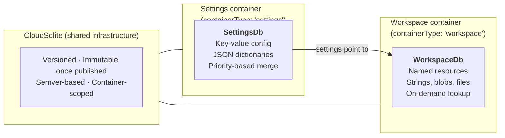
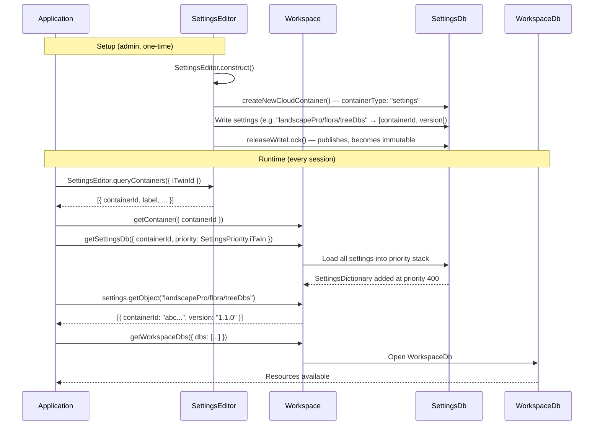
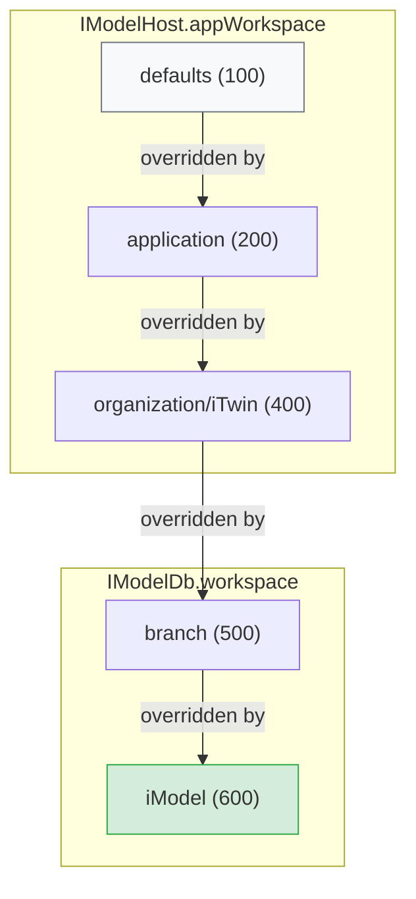
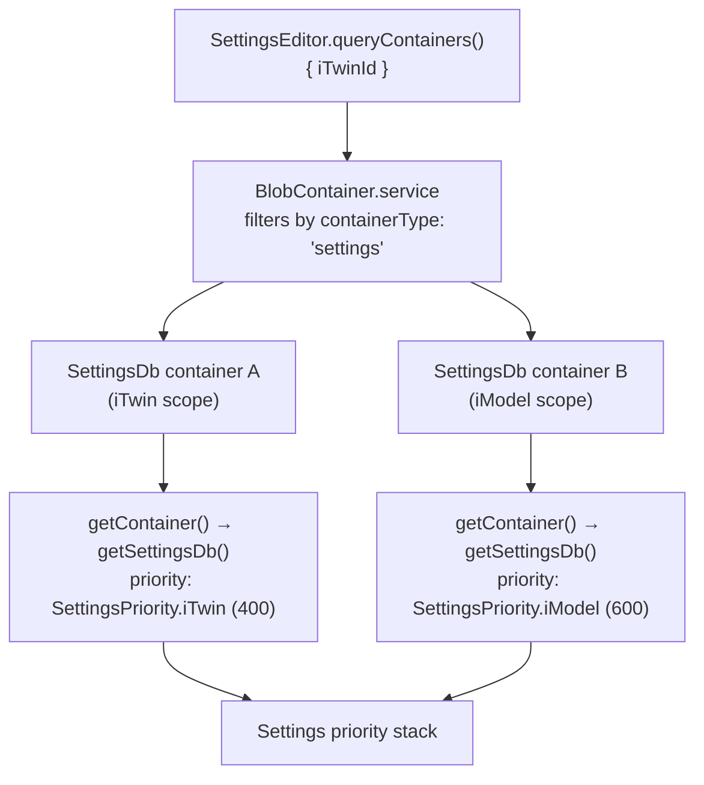

# Workspaces and Settings

Every non-trivial iTwin.js application needs two things at run-time: **configuration** (which tools are available, what units to use, which data sources are active) and **resources** (binary assets like fonts, textures, and templates). iTwin.js provides two complementary systems to address these needs:

- **[Settings]($backend)** — a priority-ordered stack of key-value configuration pairs. Configuration flows from cloud-hosted [SettingsDb]($backend) containers into the active [Settings]($backend) runtime, where values can be read by name.
- **[Workspace resources](./Workspace.md)** — versioned binary assets stored in [WorkspaceDb]($backend) containers. Settings tell the application *which* `WorkspaceDb`s to load; the application then retrieves resources from them.

These two systems are deliberately separate. `SettingsDb` containers are discoverable without opening an iModel. `WorkspaceDb` containers are referenced *by* settings. This separation eliminates the circular dependency that would arise if settings had to be loaded from a `WorkspaceDb` just to discover which `WorkspaceDb` to open.

## The two database types

| | **SettingsDb** | **WorkspaceDb** |
|---|---|---|
| **Purpose** | Application configuration | Data resources |
| **Content** | JSON key-value dictionaries | Strings, blobs, embedded files |
| **Container type** | `"settings"` | `"workspace"` |
| **Discovery** | Via `SettingsEditor.queryContainers()` — no iModel needed | Referenced from settings values |
| **Resolution order** | Loaded first | Loaded second, via settings pointers |
| **Write API** | [SettingsEditor]($backend) | [WorkspaceEditor]($backend) |
| **Versioning** | Semver — immutable once published | Semver — immutable once published |

## How settings and resources connect

The flow at runtime always starts from settings:

Key points:
- The `SettingsDb` is discovered **by iTwinId** using `SettingsEditor.queryContainers()` — no iModel is required at this stage.
- The caller explicitly provides the [SettingsPriority]($backend) when loading a `SettingsDb`. There is no automatic mapping from container scope to priority.
- Once the `SettingsDb` is loaded, its settings tell the application which `WorkspaceDb` containers to open.

## Scope and priority

Settings from multiple sources are merged using a priority stack. A higher-priority dictionary overrides a lower-priority one for any given setting name.

In practice:
- **Organization-wide defaults** are stored in a `SettingsDb` and loaded at [SettingsPriority.iTwin]($backend) (400).
- **iModel-specific overrides** are loaded at [SettingsPriority.iModel]($backend) (600) — iModel wins over iTwin.
- **Application defaults** are loaded at [SettingsPriority.application]($backend) (200) — overrideable by any cloud-backed settings.

`IModelHost.appWorkspace` holds dictionaries at `application` priority or lower. `IModelDb.workspace` holds higher-priority dictionaries and falls back to `appWorkspace` when a setting is not found.

## Container discovery

Settings containers are tagged with `containerType: "settings"` in their cloud metadata, making them independently discoverable without opening an iModel:

This is in contrast to [WorkspaceDb]($backend) containers, which use `containerType: "workspace"` and are discovered *indirectly* — by reading settings values that point to them.

## Learn more

- **[Settings](./Settings.md)** — how to define settings schemas, load dictionaries, read values, and create/manage [SettingsDb]($backend) containers in the cloud.
- **[Workspace resources](./Workspace.md)** — how to create, version, and access binary resources stored in [WorkspaceDb]($backend) containers.
