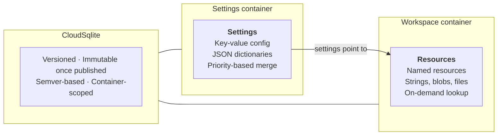
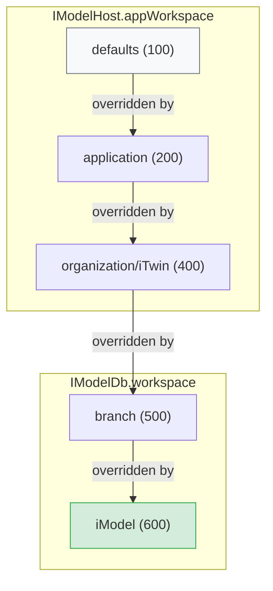

# Workspaces and Settings

Every non-trivial iTwin.js application needs two things at run-time: **configuration** (which tools are available, what units to use, which data sources are active) and **resources** (binary assets like fonts, textures, and templates). iTwin.js provides two complementary systems to address these needs:

- **[Settings]($backend)** — a priority-ordered stack of key-value configuration pairs. Configuration flows from cloud-hosted settings containers into the active [Settings]($backend) runtime, where values can be read by name.
- **[Workspace resources](./Workspace.md)** — versioned binary assets stored in [WorkspaceDb]($backend) containers. Settings tell the application *which* `WorkspaceDb`s to load; the application then retrieves resources from them.

These two systems are deliberately separate. Settings containers are discoverable without opening an iModel. `WorkspaceDb` containers are referenced *by* settings. This separation eliminates the circular dependency that would arise if settings had to be loaded from a `WorkspaceDb` just to discover which `WorkspaceDb` to open.

At runtime, settings and resources are accessed through one of three workspace scopes:

| Workspace | Scope | Access |
|---|---|---|
| [IModelHost.appWorkspace]($backend) | Application-wide defaults and configuration | Available immediately after [IModelHost.startup]($backend) |
| [IModelHost.getITwinWorkspace]($backend) | iTwin-scoped settings shared across all iModels in an iTwin | Requires an iTwinId; no iModel needed |
| [IModelDb.workspace]($backend) | iModel-specific overrides; falls back to `appWorkspace` for unresolved settings. Does **not** automatically include iTwin-scoped settings | Available when an iModel is open |

Each scope layers on top of the previous one through the [Settings priority stack](./Settings.md#settings-priorities). See [Choosing the right workspace](./Workspace.md#choosing-the-right-workspace) for guidance on when to use each scope.

## The two container types

Both container types are built on [CloudSqlite]($backend) with [WorkspaceDb]($backend) as the underlying database, but they serve different roles and are discovered differently.

| | **Settings container** | **Workspace container** |
|---|---|---|
| **Purpose** | Application configuration | Data resources |
| **Content** | JSON key-value dictionaries | Strings, blobs, embedded files |
| **Container type** | `"settings"` | `"workspace"` |
| **Discovery** | Automatic via [IModelHost.getITwinWorkspace]($backend) — no iModel needed | Referenced from settings values |
| **Resolution order** | Loaded first | Loaded second, via settings pointers |
| **Write API** | [WorkspaceEditor]($backend) with `containerType: "settings"` | [WorkspaceEditor]($backend) |
| **Versioning** | Semver — immutable once published | Semver — immutable once published |

## How settings and resources connect

At runtime the flow always starts from settings:

1. **Discover and load** — call [IModelHost.getITwinWorkspace]($backend) with an iTwinId. This automatically discovers settings containers for the iTwin, loads their dictionaries into the [Settings priority stack](./Settings.md#settings-priorities), and returns a [Workspace]($backend) ready to use. No iModel is required.
2. **Resolve resources** — read settings values that point to [WorkspaceDb]($backend) containers, then open those containers to access resources.

> For advanced scenarios (admin tooling, custom discovery logic), [WorkspaceEditor.queryContainers]($backend) provides lower-level access to enumerate containers by iTwinId and `containerType`.

## Scope and priority

Settings from multiple sources are merged using a priority stack. A higher-priority dictionary overrides a lower-priority one for any given setting name.

In practice:
- **Organization-wide defaults** are stored in a settings container and loaded at [SettingsPriority.iTwin]($backend) (400).
- **iModel-specific overrides** are loaded at [SettingsPriority.iModel]($backend) (600) — iModel wins over iTwin.
- **Application defaults** are loaded at [SettingsPriority.application]($backend) (200) — overrideable by any cloud-backed settings.

> **Note:** The diagram above simplifies organization and iTwin into one level. The full priority stack includes a separate [SettingsPriority.organization]($backend) (300) level — see [Settings priorities](./Settings.md#settings-priorities) for details.

`IModelHost.appWorkspace` holds dictionaries at `application` priority or lower. `IModelDb.workspace` holds higher-priority dictionaries and falls back to `appWorkspace` when a setting is not found.

## Container discovery

[IModelHost.getITwinWorkspace]($backend) handles settings container discovery automatically — it queries for containers tagged with `containerType: "settings"`, loads their dictionaries, and returns a ready-to-use [Workspace]($backend). Most application code does not need to interact with the discovery layer directly.

[WorkspaceDb]($backend) containers (`containerType: "workspace"`) are discovered *indirectly* — by reading settings values that point to them. See [Workspace resources](./Workspace.md) for details.

> For admin tooling or custom workflows, [WorkspaceEditor.queryContainers]($backend) provides direct access to enumerate containers by iTwinId and `containerType`. See [Settings containers](./Settings.md#settings-containers) for examples.

## Recommended reading order

1. **This overview** — understand the two systems and three workspace scopes.
2. **[Settings](./Settings.md)** — how to define settings schemas, load dictionaries, read values, and create/manage settings containers in the cloud.
3. **[Workspace resources](./Workspace.md)** — how to create, version, and access binary resources stored in [WorkspaceDb]($backend) containers.
