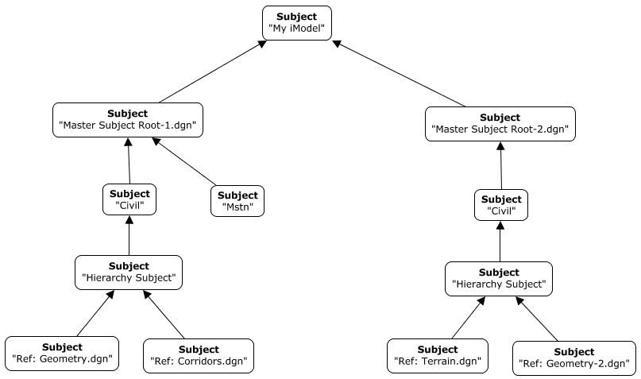
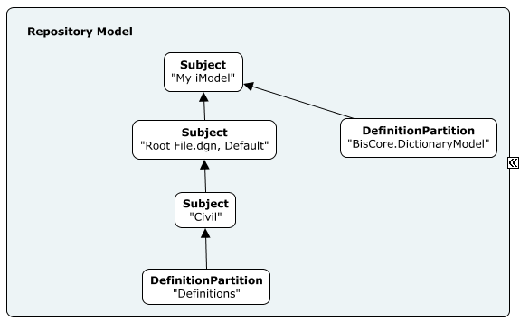
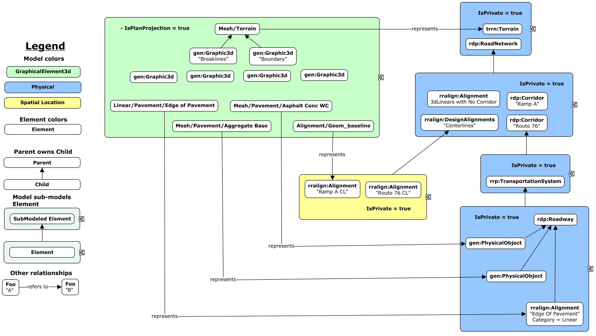
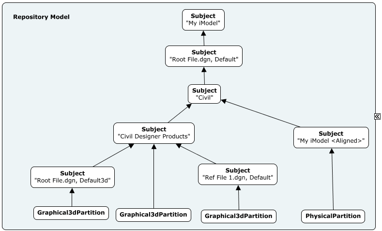
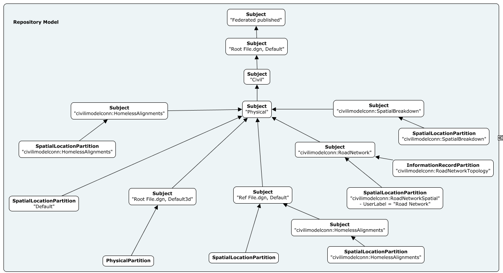

## Table of Content

- [Introduction](#introduction)
- [General Topics](#general-topics)
  - [Spatial root model identification](#spatial-root-model-identification)
  - [Subject hierarchy](#subject-hierarchy)
  - [Definition Elements](#definition-elements)
  - [Presentation properties from Civil Designer applications](#presentation-properties-from-civil-designer-applications)
  - [Quantity Takeoff mappings](#quantity-takeoff-mappings)
- [V1 approach](#v1-approach)
  - [Target BIS schemas](#target-bis-schemas---v1-approach)
  - [Subject hierarchy](#subject-hierarchy---v1-approach)
  - [Definition Elements](#definition-elements---v1-approach)
  - [Quantity Takeoff mappings](#quantity-takeoff-mappings---v1-approach)
  - [Linear Referencing](#linear-referencing---v1-approach)
- [V2 approach](#v2-approach)
  - [Target BIS schemas](#target-bis-schemas---v2-approach)
  - [Subject hierarchy](#subject-hierarchy---v2-approach)
  - [Definition Elements](#definition-elements---v2-approach)
  - [Type Definitions](#type-definitions)
  - [Quantity Takeoff mappings](#quantity-takeoff-mappings---v2-approach)
  - [Linear Referencing](#linear-referencing---v2-approach)
  - [Spatial Composition](#spatial-composition)
  - [Road Network](#road-network)
  - [Rail Network](#rail-network)

## Introduction

The Civil iModel Connector synchronizes iModels from data authored by Bentley's Civil Designer applications, namely:

* OpenRoads Designer
* OpenRail Designer
* OpenBridge Modeler
* OpenSite Designer

It supports two behaviors, or approaches, when it comes to element-organization and supported semantics. They are referred to as the "V1" and "V2" approaches.

The "V1" approach was introduced since the very first version of the Civil iModel Connector, while the "V2" approach was developed more recently based on evolutions in IFC 4x3, Bentley's Civil Designer applications and BIS in general.

Both approaches will be supported in parallel for the foreseable future, but the "V2" approach is recommended since it offers the richest data for downstream services in the cloud.

The Civil iModel Connector supports dgn datasets authored by CONNECT editions (version 10.07 and later) of the aforementioned Bentley Civil Designer applications.

## General Topics

### Spatial root model identification

Most dgn-files generated from Bentley's Civil Designer applications have a two-model setup:

1) A 2D model capturing the plan/top view of the project, and
2) A 3D model containing the full rendering of the data with elevation.

Most user-provided data is stored in the 2D model, while data in the 3D model is mostly generated from the 2D model. Additionally, the 2D model typically references its corresponding 3D model.

As a result, these 2D models are very important in light of the Civil iModel Connector's ability to reach all data contained in dgn-files generated from Bentley's Civil Designer applications. Furthermore, since these 2D models generally captured geographically-located data, the Civil iModel Connector treats them as spatially-located models instead of Drawing models.

Based on these reasons, the Civil iModel Connector always aims to start publishing a dataset starting at the 2D model of the provided root or container dgn file. Therefore, a container dgn file shall be setup in such a way that it ensures all the reference-attachments are reachable and visible accordingly.

It highly is recommended that the root or container dgn for a dataset to be used to synchronize an iModel by the Civil Connector follows the [Best Practices for Creating a Civil iModel](<https://communities.bentley.com/products/road___site_design/w/road_and_site_design__wiki/50786/best-practices-for-creating-a-civil-imodel>).

### Subject hierarchy

Most of the elements in the subject hierarchy generated by the Civil iModel Connector does not change with the approach used. The following table describes the different levels of `bis:Subject` instances that it creates as well as the helper tag stored in their JsonProperties attribute.

| Subject level | Multiplicity | Helper JsonProperties tag |
| ------------- | ------------ | ------------------------- |
| Root | One instance per iModel | |
| Master | One instance per container / root dgn file | ```{"Subject":{"Model":{"Type":"SourceMasterModel"} } }``` |
| Job | One instance per iModel Connector publishing from the same container / root dgn - e.g. "Civil" | ```{"Subject":{"Job":{ } } }``` |
| Hierarchy | One instance for each Job Subject | ```{"Subject":{"Model":{"Type":"Hierarchy"} } }``` |
| Reference | One instance for each reference-attachment in the dgn dataset | ```{"Subject":{"Model":{"Type":"References" } } }``` |

The following instance diagram shows an example of the multiple levels of subjects in an iModel published by the Civil iModel Connector:



The approach version used in a Job subject is captured in its JsonProperties as:
```{"Subject":{"Job":{"Properties":{"CifConverterVersion": x} } } }```.

With x = 1 for the V1 approach and x = 2 for the V2 approach. If such Json attribute is missing, V1 approach is assumed.

### Definition Elements

In general, Definition elements are stored in one of two models in an iModel, depending on the case. Those models are:

1) The global iModel's Dictionary model.
2) The job's "Definitions" model.

The following instance diagram depicts the location of the `bis:DefinitionPartition`s, leading those definition models, in light of an iModel's subject hierarchy:



The following table depicts the default mappings used with respect to Definition Elements while publishing a dgn file:

| dgn-file concept | iModel concept | Target model |
|----------------- | -------------- | ------------ |
| Annotation style | bis:AnnotationTextStyle | Job's "Definitions" model |
| Level | bis:SpatialCategory or bis:DrawingCategory | DictionaryModel or Job's "Definitions" model |
| Line style | bis:LineStyle | DictionaryModel |
| Material | bis:RenderMaterial and bis:Texture | DictionaryModel |
| Shared-cell | bis.GeometryPart | Job's "Definitions" model |
| View | bis:DrawingViewDefinition or bis:SpatialViewDefinition or bis:SheetViewDefinition, with supporting bis:ModelSelector, bis:DisplayStyle2d or bis:DisplayStyle3d | Job's "Definitions" model |

### Presentation properties from Civil Designer applications

All properties shown in the supported Civil Designer applications are mapped to a corresponding `bis:ElementUniqueAspect` class from one of the CifXXX BIS schemas. They are [Grade C](https://www.itwinjs.org/bis/intro/bis-organization/#bis-compatibility-grades-for-schemas) schemas meant to provide a similar experience to the originating application. These aspects are attached to the appropiate `bis:GeometricElement` instance.

### Quantity Takeoff mappings

The Civil iModel Connector also publishes Quantity Takeoff values, including volume, surface area, top-surface area and material name, in terms of the `QuantityTakeoffsAspects` schema. In general, note that this leads to duplication of data since it is also published in terms of the corresponding CifXXX schema. This behavior is intentional since the former schema is of a higher grade than the latter, and therefore, considered aligned for generic services downstream.

## V1 approach

The "V1" approach is currently the default output from the Civil iModel Connector. Since it was developed before the introduction of the SpatialComposition schema in BIS and richer-semantics in the Civil Designer Products, it mostly aims at achieving visual fidelity and synchronizing presentation properties from them.

Without the semantics-oriented enhancements recently introduced in the Civil Designer Products, the Civil iModel Connector truly only understands `Alignments`, `Corridors`, `Corridor Surfaces` and `Digital Terrain Models`. Since datasets from Civil Designer Products typically contain many other elements whose semantics the software does not understand without human intervention, the Civil iModel Connector "V1 approach" creates two branches in the subject hierarchy of its iModels:

* Branch #1, aimed at visual fidelity, treats all elements as graphics - that is, subclasses of `bis:GraphicalElement3d`.
* Branch #2, captures the semantics the Civil iModel Connector is able to understand from a dataset. Elements in this branch are published in terms of the relevant BIS schemas such as `RoadRailAlignment` or `RoadRailPhysical`.

A model in branch #1 is created for each model in a dgn file. If a model in a dgn file is normal 2D, the `IsPlanProjection` property of the mapped model in the iModel will be set to `true`. Otherwise, such property will be left as `false` (default value).

Models in branch #2 are created by following the expected hierarchy in the corresponding [BIS schemas](#Target-BIS-schemas) being target. This model hierarchy take advantage of the sub-modeling capabilities in BIS. These models are marked as private (that is, their `IsPrivate` model-property is set to `true`), preventing them from being displayed by default, in order to avoid visual confusion with models in branch #1. Furthermore, elements in branch #2 are typically associated with graphical elements in branch #1 via `bis:GraphicalElement3dRepresentsElement` relationships, as depicted in the following instance diagram.



### Target BIS schemas - V1 approach

#### Core:
* [BisCore](https://www.itwinjs.org/bis/domains/biscore.ecschema/)
* [Generic](https://www.itwinjs.org/bis/domains/generic.ecschema/)

#### Linear Referencing:
* [LinearReferencing](https://www.itwinjs.org/bis/domains/linearreferencing.ecschema/)
* [RoadRailAlignment](https://www.itwinjs.org/bis/domains/roadrailalignment.ecschema/)

#### Physical-modeling
* [RoadRailPhysical](https://www.itwinjs.org/bis/domains/roadrailphysical.ecschema/)
* [RoadPhysical](https://www.itwinjs.org/bis/domains/roadphysical.ecschema/)
* [RailPhysical](https://www.itwinjs.org/bis/domains/railphysical.ecschema/)
* [StructuralPhysical](https://www.itwinjs.org/bis/domains/structuralphysical.ecschema/)
* [BridgeStructuralPhysical](https://www.itwinjs.org/bis/domains/bridgestructuralphysical.ecschema/)
* Terrain

#### Properties from Bentley's Civil Designer applications
* [CifCommon](https://www.itwinjs.org/bis/domains/cifcommon.ecschema/)
* [CifGeometricRules](https://www.itwinjs.org/bis/domains/cifgeometricrules.ecschema/)
* [CifBridge](https://www.itwinjs.org/bis/domains/cifbridge.ecschema/)
* [CifRoads](https://www.itwinjs.org/bis/domains/cifroads.ecschema/)
* [CifRail](https://www.itwinjs.org/bis/domains/cifrail.ecschema/)
* [CifHydraulicAnalysis](https://www.itwinjs.org/bis/domains/cifhydraulicanalysis.ecschema/)
* [CifHydraulicResults](https://www.itwinjs.org/bis/domains/cifhydraulicresults.ecschema/)
* [CifSubsurface](https://www.itwinjs.org/bis/domains/cifsubsurface.ecschema/)
* [CifSubsurfaceConflictAnalysis](https://www.itwinjs.org/bis/domains/cifsubsurfaceconflictanalysis.ecschema/)

#### Quantity Takeoffs
* [QuantityTakeoffsAspects](https://www.itwinjs.org/bis/domains/quantitytakeoffsaspects.ecschema/)
* [CifQuantityTakeoffs](https://www.itwinjs.org/bis/domains/cifquantitytakeoffs.ecschema/)

#### Units & formats
* [RoadRailUnits](https://www.itwinjs.org/bis/domains/roadrailunits.ecschema/)
* [CifUnits](https://www.itwinjs.org/bis/domains/cifunits.ecschema/)

#### Dynamic schemas
* CivilDesignerProductsDynamic: Dynamic schema generated at runtime by the Civil iModel Connector based on the Feature Definitions used in a particular dataset. The generated dynamic classes subclass `bis:GraphicalElement3d`.
* DgnCustomItemTypes_XXX: Dynamic schemas generated at runtime by the Civil iModel Connector for each Item-Type schema in a particular dataset.

### Subject hierarchy - V1 approach

As introduced [earlier](#subject-hierarchy), the "V1 approach" creates two branches in the subject hierarchy of its iModels:

* Branch #1, aimed at visual fidelity, treats all elements as graphics. That translates into a single `bis:GraphicalPartition3d` instance per leaf-`Subject` in the subject-hierarchy, starting at its "Hierarchy Subject".
* Branch #2, captures the semantics the Civil iModel Connector is able to understand from a dataset. That translates into a single `bis:Subject` instance under the "Job Subject", whose code ends with "< Aligned >", plus a single `bis:PhysicalPartition` instance under it.

The following diagram depicts the two branches for a particular job:



### Definition Elements - V1 approach

### Quantity Takeoff mappings - V1 approach

Under the V1 approach, `bis:ElementUniqueAspect`s from the `QuantityTakeoffsAspects` schema are only attached to the `bis:GraphicalElement3d` instances.

### Linear Referencing - V1 approach

## V2 approach

### Target BIS schemas - V2 approach

#### Core:
* [BisCore](https://www.itwinjs.org/bis/domains/biscore.ecschema/)
* [Generic](https://www.itwinjs.org/bis/domains/generic.ecschema/)

#### Linear Referencing:
* [LinearReferencing](https://www.itwinjs.org/bis/domains/linearreferencing.ecschema/)
* [RoadRailAlignment](https://www.itwinjs.org/bis/domains/roadrailalignment.ecschema/)

#### Physical-modeling
* CivilPhysical
* Earthwork
* [StructuralPhysical](https://www.itwinjs.org/bis/domains/structuralphysical.ecschema/)
* Terrain

#### Spatial Composition
* [SpatialComposition](https://www.itwinjs.org/bis/domains/spatialcomposition.ecschema/)
* BridgeSpatial
* RoadSpatial

#### Networks
* NetworkTopology
* RailNetwork
* RoadNetwork

#### Properties from Bentley's Civil Designer applications
* [CifCommon](https://www.itwinjs.org/bis/domains/cifcommon.ecschema/)
* [CifGeometricRules](https://www.itwinjs.org/bis/domains/cifgeometricrules.ecschema/)
* [CifBridge](https://www.itwinjs.org/bis/domains/cifbridge.ecschema/)
* [CifRoads](https://www.itwinjs.org/bis/domains/cifroads.ecschema/)
* [CifRail](https://www.itwinjs.org/bis/domains/cifrail.ecschema/)
* [CifHydraulicAnalysis](https://www.itwinjs.org/bis/domains/cifhydraulicanalysis.ecschema/)
* [CifHydraulicResults](https://www.itwinjs.org/bis/domains/cifhydraulicresults.ecschema/)
* [CifSubsurface](https://www.itwinjs.org/bis/domains/cifsubsurface.ecschema/)
* [CifSubsurfaceConflictAnalysis](https://www.itwinjs.org/bis/domains/cifsubsurfaceconflictanalysis.ecschema/)

#### Quantity Takeoffs
* [QuantityTakeoffsAspects](https://www.itwinjs.org/bis/domains/quantitytakeoffsaspects.ecschema/)
* [CifQuantityTakeoffs](https://www.itwinjs.org/bis/domains/cifquantitytakeoffs.ecschema/)

#### Units & formats
* [RoadRailUnits](https://www.itwinjs.org/bis/domains/roadrailunits.ecschema/)
* [CifUnits](https://www.itwinjs.org/bis/domains/cifunits.ecschema/)

#### Dynamic schemas
* DgnCustomItemTypes_XXX: Dynamic schemas generated at runtime by the Civil iModel Connector for each Item-Type schema in a particular dataset.

### Subject hierarchy - V2 approach

The V2 approach includes additional `bis:Subject`s with respect to the base hierarchy, organizing network elements, spatial composition elements and `rralign:Alignment`s identified as incomplete in the source data.

The following table and instance diagram depict the generated organization.

| Subject's CodeValue | Partition's CodeValue | Parent Subject | Purpose |
| ------------------- | --------------------- | -------------- | ------- |
| civilimodelconn:SpatialBreakdown | civilimodelconn:SpatialBreakdown | "Physical" / Hierarchy subject for a Job | Elements describing the Spatial Breakdown or Structure for the current Job |
| civilimodelconn:RoadNetwork | civilimodelconn:RoadNetworkTopology and civilimodelconn:RoadNetworkSpatial | "Physical" / Hierarchy subject for a Job | Elements describing the Spatial Breakdown or Structure for the current Job |
| civilimodelconn:HomelessAlignments | civilimodelconn:HomelessAlignments | Equivalent subject for the mapped dgn file | `rralign:Alignment`s mapped to incomplete Alignments in the Civil Designer applications, that is, without a 3D representation |



### Definition Elements - V2 approach

### Type Definitions

The Civil iModel Connector, under the V2 approach, strongly relies on `bis:TypeDefinitionElement` instances in order to provide more granular classifications than the ones captured by the BIS class of an element.

To achieve this, the Civil iModel Connector creates Type-definition instances of the appropriate class, depending on the case. For example, `cp:CourseType`s for instances of `cp:Course`, `ew:FillType` for instances of `ew:Fill` or `gen:PhysicalType` for instances of `gen:PhysicalObject`.

The Civil iModel Connector generally creates a Type-definition instance for each Feature-Definition in a Civil Designer dataset. These type-definition instances are stored in the Job's "Definitions" model. It also creates a Code-spec for each supported type-definition class, ensuring code-uniquess per Job.

### Quantity Takeoff mappings - V2 approach

Under the V2 approach, `bis:ElementUniqueAspect`s from the `QuantityTakeoffsAspects` schema are attached to the `bis:SpatialElement` instances.

Regarding material information, the Civil iModel Connector also creates instances of `bis:PhysicalMaterial` and associate them with the corresponding `bis:PhysicalElement` or `bis:PhysicalType` accordingly.

### Linear Referencing - V2 approach

### Spatial Composition

### Road Network

### Rail Network
