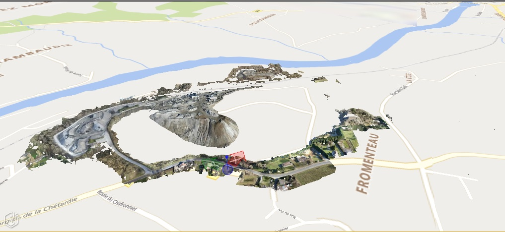

# Classification and Masking

Spatial classification and planar clip masking are related ways of using one set of models to customize the visualization and/or behavior of another set of models. They are particularly applicable to reality models.

## Spatial classification

Spatial classification uses one or more design models to contextualize a reality model by associating portions of the reality model with elements in the design models. Two types of classification are supported:

- Planar classification: The design models are projected onto a plane. The region of the reality model that intersects the volume extruded from an element's footprint become classified by that element.
- Volume classification: Regions of the reality model that intersect the 3d volume of an element become classified by that element.  Geometry used for volume classification must be fully closed, non-intersecting volumes.

The classified and unclassified portions of the reality model can be displayed as normal, hidden, or dimmed. The classified portions can additionally be recolored using the color of the classifying element, or hilited.

Tools interact with classified regions of the reality model as if they were interacting with the classifying element. For example, hovering over a classified region will display a tooltip containing information about the classifying element, and selecting it can display the properties of that element.

[This sample](https://www.itwinjs.org/sample-showcase/?group=Viewer+Features&sample=classifier-sample&context=Metrostation+Sample&imodel=Philadelphia) demonstrates planar classification.

## Planar clip masks

As with planar classification, the design models are projected onto a plane to create a mask. The mask can then be used to clip out portions of a reality model, terrain, and/or map imagery. By default the portions that intersect the mask are clipped out, but this behavior can be inverted. The geometry used to construct the mask can be filtered based on model, subcategory, and element Id.

A reality model of a quarry displayed with the background map - observe how the map obscures the excavated portions of the quarry:

The same quarry model, with the reality model fully masking the background map, revealing the excavation:

A design model of an underground metro station and tunnels, combined with a reality model of the surrounding city. The design model is masked by the reality model such that the underground portions are displayed as semi-transparent:

