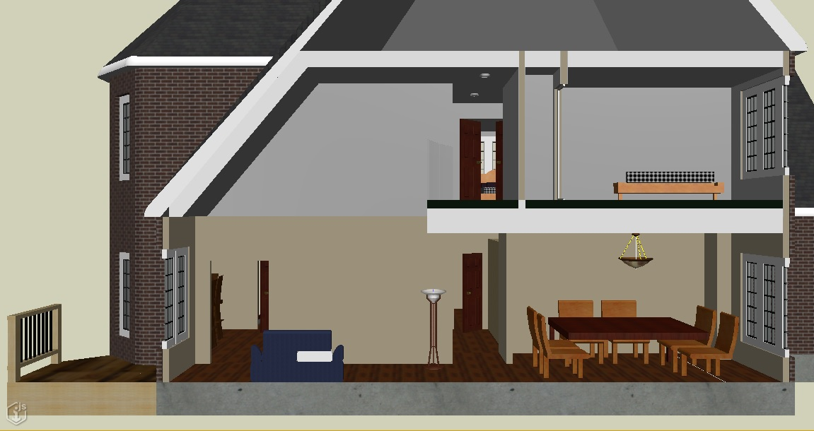

# Clipping and Section-cut Graphics

The [iTwin.js renderer](./index.md) supports clipping out portions of the geometry in a view using [ClipVector]($geometry)s. This is useful for isolating regions of interest within an iModel, visualization of [section drawings](./DrawingsAndSheets.md), and [hyper-modeling](./HyperModeling.md), among other use cases.

# Clipping

A clip vector can be constructed of any number of convex or concave shapes. Clipping can be applied at any level of the scene graph - for example, one clip may be applied to the contents of the view, another to a specific model within the view, and a third to a group of graphics within that model; the innermost clip will be intersected with the outer clips to produce the final clip.

By default, only geometry inside of the clip will be displayed. A [ClipStyle]($common) can override this behavior by specifying a color to be applied to geometry inside and/or outside the clip.

[This sample](https://www.itwinjs.org/sample-showcase/?group=Viewer+Features&sample=view-clip-sample&imodel=Retail+Building+Sample) demonstrates basic clipping.

The image below shows a clip plane applied to a house model to reveal the interior.

## Section-cut graphics

By default, geometry that intersects a clipping plane is simply truncated at the intersection. For example, if you slice a wall in half, an outline of the wall will display at the clip plane permitting you to see "inside" the wall, as can be observed in the image above. A display style's [CutStyle]($common) can produce section-cut geometry at clip plane intersections, such that a wall sliced in half will continue to display as a solid object. The CutStyle can optionally override aspects of the geometry's appearance at the clip intersections as well, including display of visible edges.

The clipped house model from above, with section-cut graphics produced at the clip plane intersections:

Section-cut graphics with visible edges, styled according to the CutStyle:

