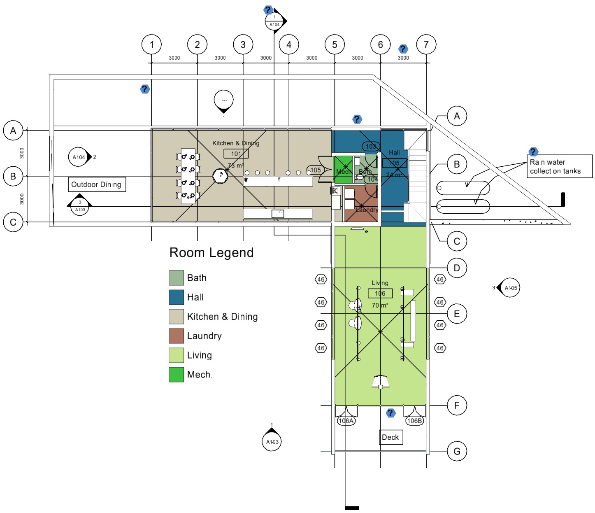
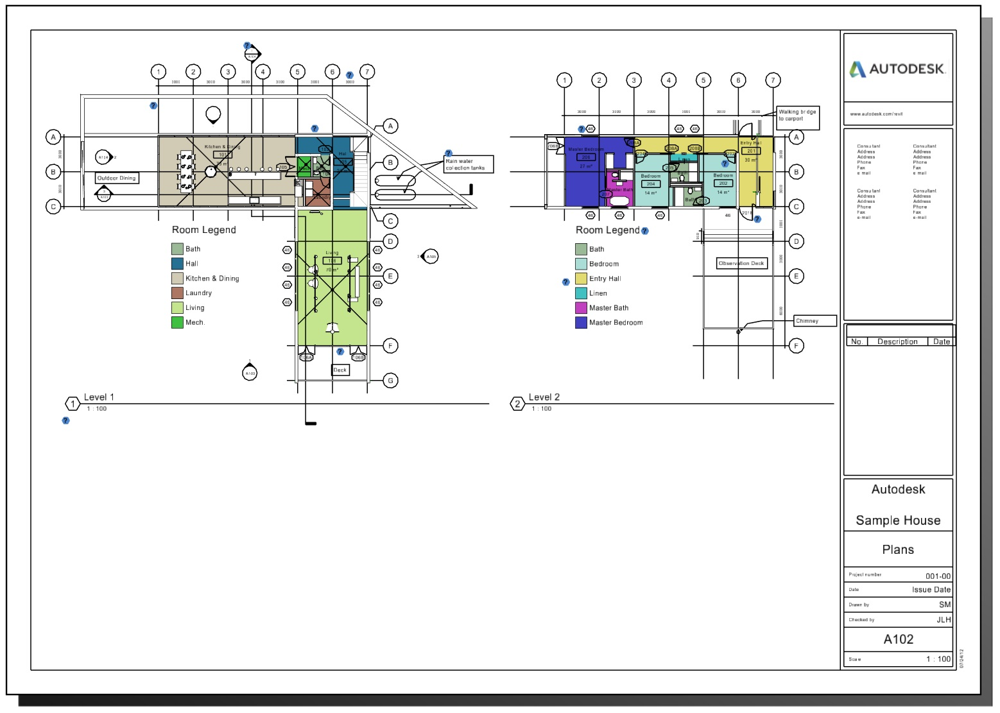

# 2d Views

iTwin.js supports two types of 2d models - [Drawing]($backend)s and [Sheet]($backend)s - which can be visualized using a [DrawingViewState]($frontend) or [SheetViewState]($frontend) respectively.

[This sample](https://www.itwinjs.org/sample-showcase/?group=Viewer&sample=viewer-only-2d-sample&imodel=House+Sample) demonstrates display of drawings and sheets.

## Drawings

A drawing is often used to provide a 2d representation of a subset of the spatial model - for example, floor plans, sections, and elevations. They are often automatically generated by slicing a spatial view with one or more clipping planes to produce 2d cut geometry. The cut geometry typically retains a relationship with the original 3d geometry from which it was generated. Subsequently, the drawing may be annotated with text, callouts, and measurements. In the special case of a [SectionDrawing]($backend), 2d geometry is produced for only a small subset of the 3d geometry (e.g., hatch lines, door swings, etc), or none at all. In this case the contents of the spatial view are rendered directly into the 2d drawing view with clipping planes applied.

Other types of drawings may have no correlation to spatial coordinates - for example, schematics or sketches.

An annotated floor plan drawing generated from a spatial view:

## Sheets

Sheets represent real-world sheets of paper of precise physical dimensions, intended to be printed onto actual paper - though digital-only workflows involving sheets are becoming increasingly common. Most sheets are drawn with a border representing their physical dimensions. Within that border they may embed any number of (scaled-down) drawings and/or spatial views, along with annotations like schedules and title blocks. Applications like MicroStation can automatically generate large quantities of sheets to serve as project documentation.

A sheet with a title block and two embedded floor plan drawings:

