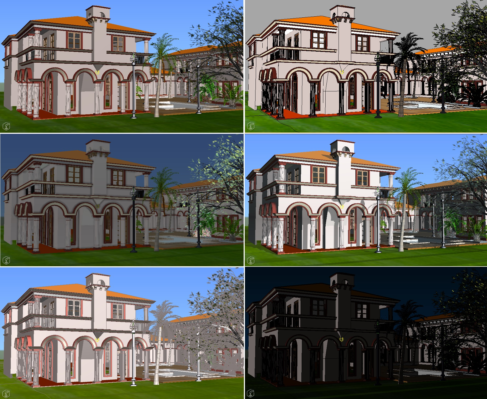

# Lighting, materials, and environment

The [iTwin.js renderer](./index.md) is designed for efficient visualization of large infrastructure digital twins in a constrained browser environment. Photorealistic rendering is **not** part of that design - many of the techniques required for producing more lifelike images are unsupported or impractically expensive using WebGL. However, the renderer does provide a wide variety of options for customizing the look of your iTwin.

## Lighting and environment

The lighting and environment of a [view](../frontend/Views.md) can be customized via the view's [DisplayStyleState]($frontend).

- [LightSettings]($common) can define directional, portrait, ambient, and hemisphere light sources; as well as control over specular, cel-shading, and Fresnel effects.
- [SolarShadowSettings]($common) produce shadows based on the real-world sun position at a given location and date.
- [AmbientOcclusion]($common) can simulate shadows.
- An [Environment]($common) can provide a decorative sky box or sky sphere.

[This sample](https://www.itwinjs.org/sample-showcase/?group=Viewer+Features&sample=display-styles-sample&imodel=Villa) provides examples of various display styles utilizing a variety of these settings.

The images below illustrate the effects of different lighting and environment settings upon the same view.

## Materials

[RenderMaterialElement]($backend)s in an iModel can store many [RenderMaterial]($common) properties for use by a renderer. However, the WebGL-based renderer currently supports only a small subset of these properties:

- Diffuse color and weight
- Transparency
- Specular color, exponent, and weight
- Texture mapping and weight
