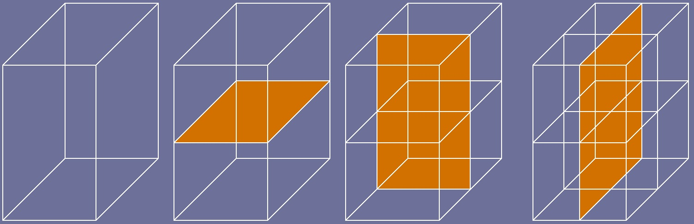

# iModel tiles

iTwin.js is fully capable of streaming and rendering [tiles](./Tiles.md) in any of the [standard 3d tile formats](https://github.com/CesiumGS/3d-tiles/tree/main/specification) - that is how it displays reality models and terrain. However, the tiles produced by the iTwin.js backend to visualize the contents of [GeometricModel]($backend)s use a non-standard format referred to as "iMdl" (for "iModel"), optimized for the unique features provided by iTwin.js.

## Level of detail

Each tile contains graphics of a level of detail appropriate only for a particular size on screen. For example, the root (lowest resolution) tile for a simple iModel representing a house could look like this:

As long as the tile is displayed at roughly the intended size in screen pixels, the level of detail presented will be appropriate. But if we were to zoom in such that it occupies more of the screen, we would notice the seemingly-circular windows and doorknob no longer appear very circular:

The level of detail of a tile is expressed as the tile's "chord tolerance" - that is, the maximum [chord](https://en.wikipedia.org/wiki/Chord_(geometry)) length that can be used to approximate a curve. Generally we want the chord length (in meters) to correspond to roughly the size of one pixel in screen-space. When we zoom in, the chords become larger than a pixel and therefore perceptible, so we must request new tiles of a higher level of detail (i.e., smaller chord tolerance). In the image below, the green and blue rectangles represent the higher-resolution tiles that are direct children of the root tile:

The circles in these tiles appear much more circular than those in the root tile:

In some cases, entire elements may be smaller than a pixel, in which case they may be entirely omitted from that tile. To illustrate this, let's produce a neighborhood of identical houses, with a root tile that looks like this:

If we enlarge one of the doors in this tile, we'll notice that - in addition to some decidedly non-circular circles - the doorknob is entirely missing!

This is fine, as long as we only display this tile at the appropriate screen size - in fact, it is an important optimization limiting the number of triangles in each tile. But if we zoom in, the renderer will request higher-resolution child tiles that include the doorknob:

The key to level of detail is that tiles encompassing a larger volume of space provide a lower level of detail, so each tile should contain approximately the same number of triangles. And because the number of tiles displayed on screen should remain relatively constant, the number of triangles displayed at any given time should also remain relatively constant, regardless of which portion of the model is currently being viewed. When the user is zoomed out to view the entire model, tiny details can be omitted or simplified, because they would not be discernible. Constraining the number of triangles allows us to visualize models of any scale without over-taxing the GPU.

## Batching

In addition to constraining the number of triangles submitted to the GPU, tiles also minimize the number of "draw calls". A draw call is a discrete command sent to the GPU - e.g., "draw this bunch of triangles". For example, imagine we want to draw a scene consisting of 1000 triangles. We could submit 10 draw calls consisting of 100 triangles each, or 1 draw call consisting of 1000 triangles. Modern graphics hardware performs much more efficiently in the latter case.

iModels are composed of [Element]($backend)s. In the example house iModel above, each window, door, wall, doorknob, and section of roof is an individual element. Traditional renderers would produce a triangle mesh for each element and submit each as a separate draw call. In a real iModel consisting of thousands or millions of elements, this would produce far too many draw calls to sustain an interactive framerate.

The iTwin.js renderer does not render elements - it renders tiles. Given the set of elements intersecting the tile's volume, we endeavor to batch them all into as few meshes as possible - ideally, one. This is achieved by merging the element meshes and then differentiating the vertices within the merged mesh through a handful of strategies, including:

- Color tables: A lookup table of each unique color in the mesh is produced. Each vertex, instead of specifying its RGBA color, simply specifies its 8- or 16-bit integer index in the table.
- Material atlases: A lookup table of each unique [RenderMaterial]($common) in the mesh is produced. Instead of producing a separate mesh per material, each vertex specifies the 8-bit integer index of the corresponding material in the table.

Unfortunately, producing a single mesh per tile is not always possible. For example, meshes that use different [RenderTexture]($common)s cannot be batched together; and opaque meshes cannot be batched with transparent meshes, because they must be rendered in separate passes.

### Feature tables

If iTwin.js doesn't render elements, how is it possible to select individual elements by clicking with the mouse? Each tile embeds a [FeatureTable]($common) describing each unique [Feature]($common) - that is, combination of element Id, [SubCategory]($backend) Id, and [GeometryClass]($common) - present in the tile. Each vertex in the tile specifies the 24-bit integer index of the feature from which it originated. When the renderer wants to query which feature(s) are visible in a given region - say, at the mouse cursor location - it renders the tiles intersecting that region, outputting the feature Ids, and then queries the feature table to obtain the corresponding features.

Feature tables also enable efficient [resymbolization](./SymbologyOverrides.md). A lookup table is constructed from the current [FeatureOverrides]($common). The vertex shader indexes into this table using its feature Id and applies the corresponding overrides.

## Tile tree structure

Standard 3d tilesets are typically static: they consist of a finite set of prepublished tiles organized by a known hierarchy. For example, [Bentley ContextCapture](https://www.bentley.com/en/products/product-line/reality-modeling-software/contextcapture) publishes a set of tiles and a JSON file describing their structure; displaying such a tileset simply requires consulting the JSON file and downloading the appropriate tiles.

iModel tiles are different. Because a user can zoom in arbitrarily closely in a [Viewport]($frontend), the set of tiles is theoretically infinite. It would be entirely impractical to produce an exhaustive set of tiles for a model. Instead, an iModel tile doesn't exist until someone requests it, at which point it is generated by the iTwin.js backend (and then optionally [cached](./TileCache.md) for subsequent reuse).

Moreover, the structure of the tile tree cannot be known in full - it can only be dynamically discovered during tile generation. For example, a particular tile's volume of space may be entirely devoid of elements - that tile is therefore empty, and it has no child tiles. Or, the tile's volume may include only uncurved geometry, in which case it may be unnecessary to produce child tiles to refine it as no higher level of detail would be attained. These and other features of the tile tree structure can only be determined by actually generating the tiles (or their parent tiles - more on that below).

### Refinement strategies

Given a tile encompassing some volume, we want to obtain a higher-resolution representation of the geometry intersecting that volume. This is referred to as "refining" the tile. Tiles adhere to "spatial coherence" - that is, the volume(s) of a tile's child tiles must be entirely contained within the parent tile's volume. iTwin.js employs two tile refinement strategies:

- Subdivision: this is by far the most common strategy for 3d tiles in general, with a variety of approaches including [quad trees](https://en.wikipedia.org/wiki/Quadtree), [oct trees](https://en.wikipedia.org/wiki/Octree), and [k-d trees](https://en.wikipedia.org/wiki/K-d_tree). All of them take the parent tile's volume and sub-divide it into smaller sub-volumes. For 3d models, iTwin.js applies subdivision to produce 8 sub-volumes. The parent tile's volume is split in half across its longest axis; then the resulting halves are split across their longest axes; and finally the 4 resulting sub-volumes are split once more across their longest axes. This process is illustrated below. (For 2d models, only four instead of eight sub-volumes are produced).

- Magnification: instead of sub-dividing a tile's volume to produce multiple, smaller child tiles, magnification produces a single child tile of the same size as the parent tile, but with twice the level of detail. This strategy can help to mitigate depth complexity, wherein as the user zooms in, more tiles must be requested to display geometry extending into the screen. However, it must be applied judiciously, as increasing the level of detail too much without also reducing the tile volume can introduce floating-point precision errors resulting in graphical artifacts.

### Determining the structure

To generate a tile, the iTwin.js backend must query for all geometric elements whose bounding volumes intersect the tile's volume. Then, it traverses the [GeometryStream](../common/GeometryStream.md) of each element. Any element or geometric primitive that is sufficiently small relative to the tile's chord tolerance is omitted. Otherwise, the geometry is converted to triangle meshes (or polylines, or point strings) and added to the tile's batched mesh(es). Finally the feature table and some metadata are embedded into the tile. (**Note**: this is an extremely simplified description of the tile generation process - many details and nuances have been omitted).

The metadata produced by the tile generation process is key to discovering the structure of the tile tree. Among other information, each tile's metadata records:

- Whether any sufficiently small elements or bits of geometry were omitted from the tile's graphics;
- Whether any curved or decimated geometry was encountered within the tile's volume;
- A tight bounding box encompassing all of the geometry within the tile's volume; and
- A bitfield indicating which sub-volumes of the tile's volume were determined to be entirely empty.

Where practical, sub-volumes are tested for intersection with individual facets and line segments rather than with bounding boxes; this improves the accuracy of the empty sub-volume detection.

If any geometry was omitted or any curved or decimated geometry exists within the tile's volume, we know that the tile requires refinement (i.e., it has child tiles); otherwise, refinement will produce no actual improvement in level of detail.

The content volume allows us to perform tighter intersection tests against the viewing frustum, to avoid drawing tiles that aren't actually visible. In the image below, the green and blue rectangles represent each tile's content volume, which is generally smaller (and never larger) than the tile's bounding volume:

The information about empty sub-volumes enables us to elide requests for child tiles which we know would produce no graphics. In the images below, the green rectangles represent tiles that require refinement and the blue rectangles represent tiles requiring no refinement. Missing rectangles indicate volumes that were identified as being entirely empty, therefore resulting in no tile requests for those volumes. Note that all of the green rectangles contain curved geometry, and all of the blue rectangles contain only uncurved geometry:

Tiles - depth 1:

Tiles - depth 2:

## Optimizations

iModel tiles employ a number of optimizations aimed at reducing tile size (and by extension, GPU memory usage and download time) and improving framerate, including:

- Extensive use of lookup tables: typically, vertex data like position, color, normal vector, and so on are submitted to the GPU as vertex attributes. iModel tiles instead embed all vertex data into a single texture used as a lookup table; the only vertex attributes are the 24-bit indices into that table of each triangle vertex. Similarly, another lookup table contains information about each visible edge in a mesh. This drastically reduces redundancy resulting in smaller tiles.

- Purpose-built tiles: iTwin.js supports [displaying the edges](./EdgeDisplay.md) of meshes. This requires information about the edges to be included in each tile, which can substantially increase the size of each tile. If edges are not currently being displayed, iTwin.js will request tiles that omit the edge information, avoiding the unnecessary overhead at the expense of requiring new tiles to be requested if edge display is later enabled. Similarly, special tiles are produced for [section-cut graphics](./Clipping.md#section-cut-graphics), [timeline animation](./TimelineAnimation.md), and other purposes.

- Compression: various strategies are employed to minimize a tile's memory footprint, including [quantization of positions](https://www.itwinjs.org/reference/imodeljs-common/geometry/qpoint3d/), [oct-encoding of normal vectors](https://www.itwinjs.org/reference/imodeljs-common/rendering/octencodednormal/), and the use of 24-bit integers as indices.
