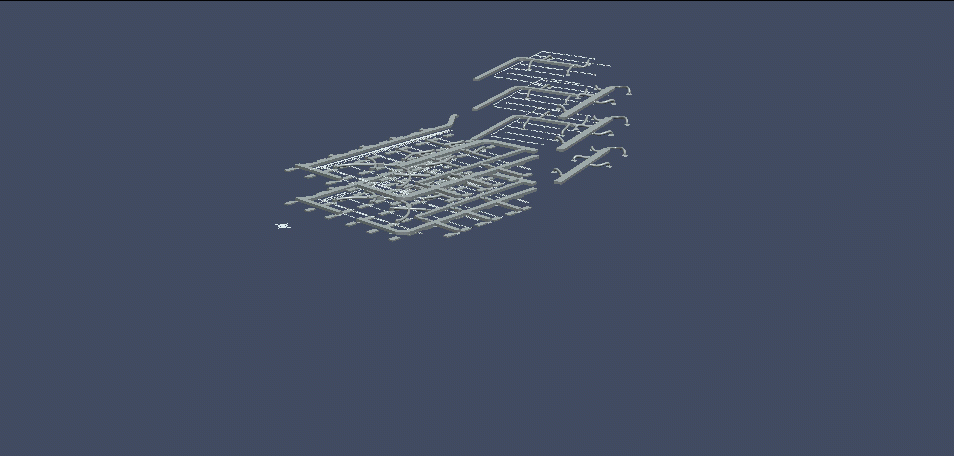

# Tiles

The [iTwin.js display system](./index.md) is responsible for visualizing vast amounts of data from a wide variety of sources, within the constraints of a web browser. It achieves this primarily through the use of [Tile]($frontend)s - a mechanism by which the geometry of a large model is partitioned into a hierarchy of sub-volumes, with each sub-volume representing a portion of the model's geometry at a particular level of detail. The result is a [TileTree]($frontend) that can be efficiently queried for the set of tiles required to render only the portion of the model corresponding to the volume of space the user is currently looking at, at a level of detail appropriate for the current viewing [Frustum]($common) and [Viewport]($frontend) resolution.

The display system can aggregate different types of tiles from a broad variety of sources, including:

- iModels, in the form of [tiles produced by the iTwin.js backend](./TileFormat.md);
- Reality meshes and point clouds in standard [3d tile formats](https://github.com/CesiumGS/3d-tiles) such as those produced by [Bentley ContextCapture](https://www.bentley.com/en/products/product-line/reality-modeling-software/contextcapture);
- Point clouds in [OrbitGT](https://orbitgt.com/) format;
- Map imagery from a wide variety of sources including [Bing](https://www.microsoft.com/en-us/maps) and [MapBox](https://www.mapbox.com/);
- 3d world-wide terrain meshes from [Cesium ION](https://cesium.com/platform/cesium-ion/content/cesium-world-terrain/);
- World-wide building meshes supplied by [OpenStreetMap](https://osmbuildings.org/);
- 3d tiles of any format supplied by an application via [TiledGraphicsProvider](./TiledGraphicsProvider.md)s;

Cesium's [3d tiles reference card](https://github.com/CesiumGS/3d-tiles/blob/main/3d-tiles-reference-card.pdf) provides a good overview of general concepts, along with some details specific to the standard 3d tile formats.

Tiles produced by the iTwin.js backend use the [iModel tile format](./TileFormat.md), which differs from other formats in many ways.

## Scene creation

A spatial view can aggregate any number of spatial models, as specified by its [ModelSelector]($backend). Each model is associated with one [TileTree]($frontend) which supplies the graphics for that model. The animated GIF below illustrates how a spatial view of an office building can be composed from four separate models: one supplying the ductwork, another the structural elements, a third the architectural components, and finally the landscaping.



Views may also incorporate tile trees associated with reality models, or maps, or terrain, or [custom providers](./TiledGraphicsProvider.md). Assembling the scene entails traversing each tile tree, selecting the tiles most appropriate for display, possibly enqueuing requests to load more appropriate tiles, and finally rendering the tiles to the screen.

This process is primarily implemented by [TileTreeReference.addToScene]($frontend). While the details will differ between different implementations of [TileTreeReference]($frontend), it typically looks something like the following, beginning with the root tile:

```
If the tile intersects the viewed volume and any clip volumes applied to the view or model:
  If the tile is of appropriate level of detail for the current view:
    If the tile's graphics are loaded:
      Select the tile for display.
    Otherwise:
      Select the tile for loading.
      If the graphics of the tile's direct descendants are loaded:
        Select the descendant tiles for display.
      Otherwise, if the graphics of the tile's direct ancestor are loaded:
        Select the parent tile for display.
  Otherwise:
    Repeat the process for each of the tile's direct descendants.
```

The graphics for all tiles selected for display are added to the scene graph. The renderer then deconstructs the graph into an ordered sequence of render commands organized into several render passes. For example, opaque geometry is drawn in one pass, and transparent geometry in a subsequent pass. Finally, these commands are submitted to the GPU and the new image is blitted to the screen.

## Tile loading

A tile typically comes into existence with no graphics - its graphics are only loaded when (if) the tile is selected for display during scene creation. The [TileAdmin]($frontend) maintains a queue of tile content requests. At any given time, a maximum of N content requests may be "in flight"; the rest reside on a priority queue. The precise maximum depends on the application configuration; for web apps, it defaults to 10 to account for limitations of HTTP/1.1; for desktop and mobile apps, it is based on the hardware concurrency of the client device. Pending requests are removed from the queue upon cancellation - e.g., if the viewing frustum changes such that the tile's graphics are no longer required for display in any viewport.

## Resource management

Tile graphics consume graphics memory, and the tiles themselves consume JavaScript heap memory. Tiles are routinely discarded after a configurable period of disuse, along with their WebGL resources and all of their descendants. Entire tile trees are likewise discarded after a (usually longer) period of disuse.

Each tile keeps track of the total amount of memory it has requested from WebGL. [TileAdmin.gpuMemoryLimit]($frontend) can be configured to impose limits on the amount of graphics memory consumed; if the total amount of memory consumed by tiles exceeds this limit, the graphics of the least-recently-used tiles are discarded until the limit has been satisfied. The tiles themselves are not discarded; nor are the graphics of any tile that is currently selected for display in any viewport. This limit requires careful balancing: a limit too low may cause excessive repeated requests for the same tile content, while a limit too high risks exceeding the client's available graphics memory, typically resulting in context loss.

