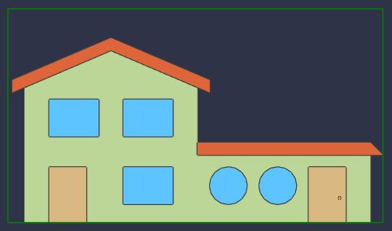
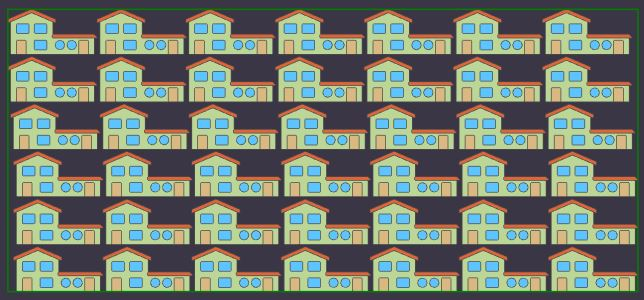
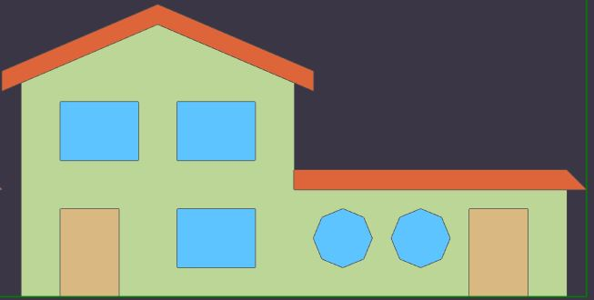

# Tiles

The [iTwin.js display system](./overview.md) is responsible for visualizing vast amounts of data from a wide variety of sources, within the constraints of a web browser. It achieves this primarily through the use of [Tile]($frontend)s - a mechanism by which the geometry of a large model is partitioned into a hierarchy of sub-volumes, with each sub-volume representing a portion of the model's geometry at a particular level of detail. The result is a [TileTree]($frontend) that can be efficiently queried for the set of tiles required to render only the portion of the model corresponding to the volume of space the user is currently looking at, at a level of detail appropriate for the currently viewing [Frustum]($common) and [Viewport]($frontend) resolution.

The display system can aggregate different types of tiles from a broad variety of sources, including:

- iModels, in the form of tiles produced by the backend [tile generator](./backend-overview.md);
- Reality meshes and point clouds in standard [3d tile formats](https://github.com/CesiumGS/3d-tiles) such as those produced by [Bentley ContextCapture](https://www.bentley.com/en/products/product-line/reality-modeling-software/contextcapture);
- Point clouds in [OrbitGT](https://orbitgt.com/) format;
- Map imagery from a wide variety of sources including [Bing](https://www.microsoft.com/en-us/maps) and [MapBox](https://www.mapbox.com/);
- 3d world-wide terrain meshes from [Cesium ION](https://cesium.com/platform/cesium-ion/content/cesium-world-terrain/);
- World-wide building meshes supplied by [OpenStreetMap](https://osmbuildings.org/);
- 3d tiles of any format supplied by an application via @[TiledGraphicsProvider]($frontend)s;

## iModel tiles

Cesium's [3d tiles reference card](https://github.com/CesiumGS/3d-tiles/blob/main/3d-tiles-reference-card.pdf) provides a good overview of general concepts, along with some details specific to the standard 3d tile formats. iTwin.js is fully capable of streaming and rendering tile in any of the standard formats - that is how it displays reality models and terrain. However, the tiles produced by the iTwin.js backend to visualize the contents of [GeometricModel]($backend)s use a non-standard format referred to as "iMdl" (for "iModel"), optimized for the unique features provided by iTwin.js.

Every spatial view can aggregate any number of spatial models, as specified by its [ModelSelector]($backend). Each model is associated with one [TileTree]($frontend) which supplies the graphics for that model. The animated GIF below illustrates how a spatial view of an office building can be composed from four separate models: one supplying the ductwork, another the structural elements, a third the architectural components, and finally the landscaping.

### Level of detail

Each tile contains graphics of a level of detail appropriate only for a particular size on screen. For example, the root (lowest resolution) tile for a simple iModel representing a house could look like this:

As long as the tile is displayed at roughly the intended size in screen pixels, the level of detail presented will be appropriate. But if we were to zoom in such that it occupies more of the screen, we would notice the seemingly-circular windows and doorknob no longer appear very circular:

The level of detail of a tile is expressed as the tile's "chord tolerance" - that is, the maximum [chord](https://en.wikipedia.org/wiki/Chord_(geometry)) length that can be used to approximate a curve. Generally we want the chord length (in meters) to correspond to roughly the size of one pixel in screen-space. When we zoom in, the chords become larger than a pixel and therefore perceptible, so we must request new tiles of a higher level of detail (i.e., smaller chord tolerance). In the image below, the green and blue rectangles represent the higher-resolution tiles that are direct children of the root tile:

The circles in these tiles appear much more circular than those in the root tile:

In some cases, entire elements may be smaller than a pixel, in which case they may be entirely omitted from that tile. To illustrate this, let's produce a neighborhood of identical houses, with a root tile that looks like this:

If we enlarge one of the doors in this tile, we'll notice the doorknob is entirely missing!

This is fine, as long as we only display this tile at the appropriate screen size - in fact, it is an important optimization limiting the number of triangles in each tile. But if we zoom in, the renderer will request higher-resolution child tiles that include the doorknob:

The key to level of detail is that tiles encompassing a larger volume of space provide a lower level of detail, so each tile should contain approximately the same number of triangles. And because the number of tiles displayed on screen should remain relatively constant, the number of triangles displayed at any given time should also remain relatively constant, regardless of which portion of the model is currently being viewed. When the user is zoomed out to view the entire model, tiny details can be omitted or simplified, because they would not be discernible.

### Tile tree structure

#### Refinement strategies

