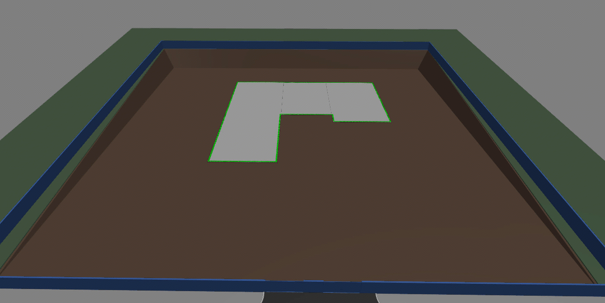

# Timeline Animation

Timeline animation permits the visualization of change within an iModel over a period of time. For example, construction projects often wish to visualize the state of the model at a given point during its construction schedule. To this end, a [RenderSchedule.Script]($common) can be associated with a display style describing this visualization by assigning it to [DisplayStyleState.scheduleScript]($frontend).

A schedule script partitions sets of elements within the scene into animation nodes. Each node has a corresponding timeline that describes how to animate the elements over time by:

- Changing their color, transparency, and/or visibility;
- Applying a [clipping plane](./Clipping.md); and/or
- Applying a transform.

As time advances during script playback, the timelines are consulted for their values at the current time point. These values can be linearly interpolated between time points or quantized to discrete time points. [Appearance overrides](./SymbologyOverrides.md) are applied to adjust color and transparency according to the script.

The GIF below illustrates the animation of the construction of a model according to its render timeline:

