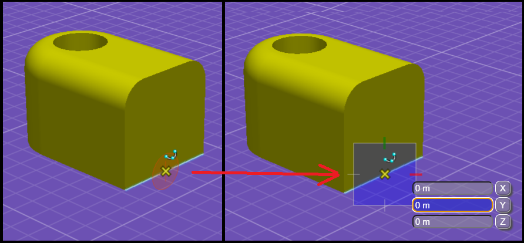
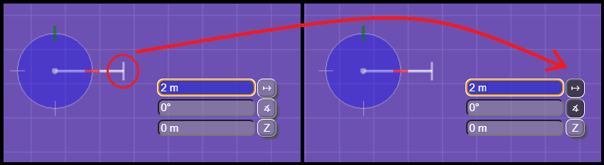
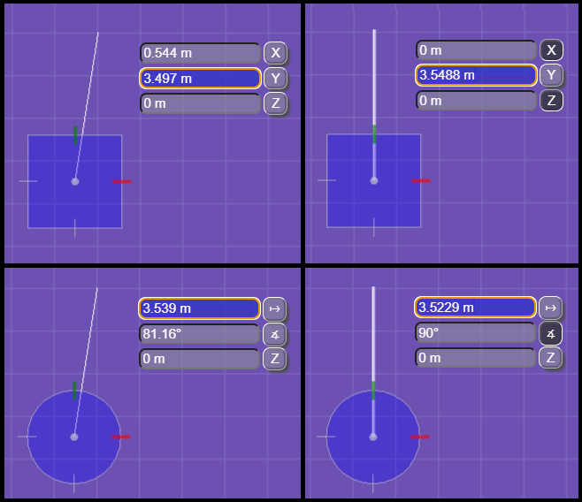
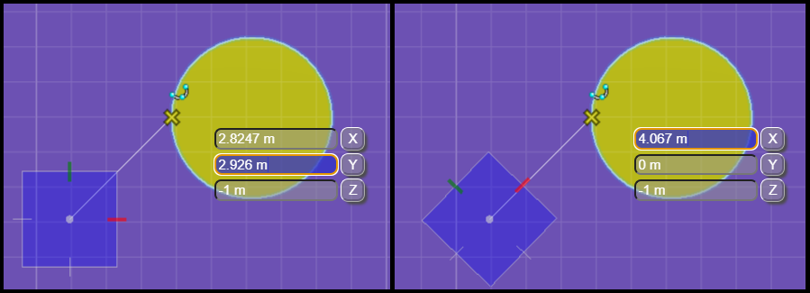
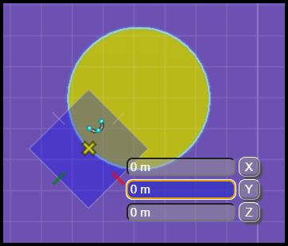
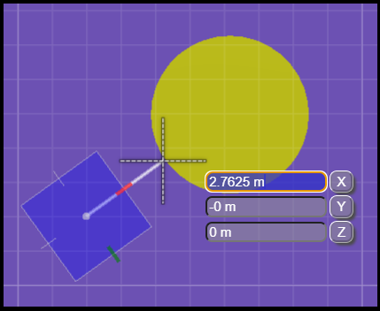

# AccuDraw Shortcuts

[AccuDrawShortcuts]($frontend) provides a variety of means for controlling AccuDraw that applications may wish to make available through keyboard shortcuts. Some of the more common and recommended shortcuts are described below.

- [AccuDraw Shortcuts](#accudraw-shortcuts)
  - [General](#general)
  - [Compass Origin and Mode](#compass-origin-and-mode)
  - [Locks and Indexing](#locks-and-indexing)
  - [Compass Orientation](#compass-orientation)
  - [Auxiliary Coordinate Systems (ACS)](#auxiliary-coordinate-systems-acs)

## General

- [AccuDrawShortcuts.sessionToggle]($frontend) -  Enable/Disable AccuDraw for the current session.
  - Use to add a UI control that lets the user turn AccuDraw on/off.
- [AccuDrawShortcuts.suspendToggle]($frontend) - Suspend/Unsuspend AccuDraw for the next data point.
  - Useful when you want to prevent AccuDraw from adjusting the next data point.
- [AccuDrawShortcuts.requestInputFocus]($frontend) - Move focus from Home to AccuDraw.
  - A Tentative point (middle mouse button click) will also move focus to AccuDraw and is focus independent.

## Compass Origin and Mode

- [AccuDrawShortcuts.setOrigin]($frontend) - Activate and position the AccuDraw compass.
  - Enables AccuDraw if not currently active. Use before the first data point to start drawing at an offset location.
  - When either an AccuSnap or Tentative snap is active, the compass origin is set to snap location (adjusted for any locks).
  - When NOT already enabled, AccuDraw is enabled at its location from the last data point.
  - When already enabled, the compass origin is set to the current point.

- [AccuDrawShortcuts.changeCompassMode]($frontend) - Switch input mode between Polar and Rectangular.

 Rectangular (Right)")

## Locks and Indexing

- [AccuDrawShortcuts.distance]($frontend) - Change mode to Polar, toggle Distance lock, if locked focus Distance field.
- [AccuDrawShortcuts.angle]($frontend) - Change mode to Polar, toggle Angle lock. if locked focus Angle field.
- [AccuDrawShortcuts.lockX]($frontend) - Change mode to Rectangular, toggle X lock, if locked focus Y otherwise focus closest axis.
- [AccuDrawShortcuts.lockY]($frontend) - Change mode to Rectangular. toggle Y lock, if locked focus X otherwise focus closest axis.
- [AccuDrawShortcuts.lockZ]($frontend) - Toggle Z lock, if locked focus Z.
- [AccuDrawShortcuts.lockIndex]($frontend) - If axis and/or distance indexing active, lock corresponding fields. If axis and/or distance indexing inactive, disable for the next data point.

- [AccuDrawShortcuts.lockSmart]($frontend) - Toggle axis or angle locks based on cursor position.

## Compass Orientation

- [AccuDrawShortcuts.setStandardRotation]($frontend) - Set compass orientation to a standard rotation.
  - Only Top and View are valid if the view is 2d.

, Front (Upper Right),  Side (Lower Left), View (Lower Right)")

> NOTE: When [IModelApp.toolAdmin.acsContextLock]($frontend) is true, standard rotations are relative to the view's ACS and not design coordinates. This makes it easier to work in rotated coordinate systems.

- [AccuDrawShortcuts.rotate90]($frontend) - Rotate the compass 90° about the supplied axis.
  - Present as three separate shortcuts, ex. "RX", "RY", and "RZ".
  - Only rotation about Z (axis number 2) is valid if the view is 2d.

- [AccuDrawShortcuts.rotateCycle]($frontend) - Cycle between Top, Front, and Side orientations (3d only).
- [AccuDrawShortcuts.rotateAxes]($frontend) - Set X axis rotation from a point.
  - When AccuSnap or Tentative snap is active, no further input is required. When not snapped there is a prompt to identify a point.

- [AccuDrawShortcuts.rotateToElement]($frontend) - Set compass orientation from a snapped element.

> Uses the information from AccuSnap or Tentative snap, such as surface normal and edge tangent to try to fully define the compass orientation.

- [AccuDrawShortcuts.rotatePerpendicular]($frontend) - Rotate compass perpendicular to snapped element.

## Auxiliary Coordinate Systems (ACS)

- [AccuDrawShortcuts.rotateToACS]($frontend) - Set compass orientation to match the view's ACS.
- [AccuDrawShortcuts.defineACSByPoints]($frontend) - Define a new view ACS from points.
- [AccuDrawShortcuts.defineACSByElement]($frontend) - Define a new view ACS from a snapped element.
