# AccuDraw User Interface

[AccuDrawViewportUI]($frontend) is provided as an in viewport user interface for AccuDraw that is implemented using HTMLElement. It is currently @beta while gathering feedback.

Applications can choose between a vertical or horizontal layout as well as whether the controls follow the cursor or display at a fixed location at the bottom middle of the view.

> Example showing vertical layout that follows the cursor.

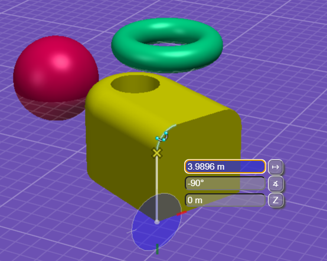

> Example showing horizontal layout with a fixed location.

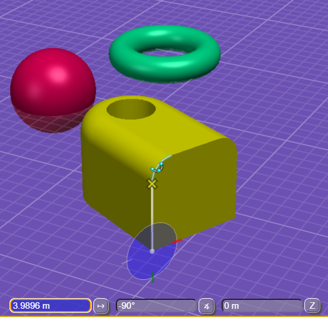

- [AccuDraw User Interface](#accudraw-user-interface)
  - [How to Use](#how-to-use)
    - [Explaining Focus](#explaining-focus)
    - [Moving Focus](#moving-focus)
    - [Entering New Value](#entering-new-value)
    - [Expression Support](#expression-support)
    - [Accepting New Value](#accepting-new-value)
    - [Choosing a Previous Value](#choosing-a-previous-value)
    - [Interaction with Snapping](#interaction-with-snapping)
      - [Nearest Snap](#nearest-snap)
      - [Snap Indexing/Alignment](#snap-indexingalignment)
  - [Application Support](#application-support)
    - [Initial Setup](#initial-setup)
    - [Configuration Options](#configuration-options)
    - [User Preferences and Settings](#user-preferences-and-settings)
      - [Unit Round Off](#unit-round-off)
      - [Notable Settings](#notable-settings)
    - [Keyboard Shortcuts](#keyboard-shortcuts)
    - [Known Issues](#known-issues)
      - [AccuDrawKeyboardShortcuts](#accudrawkeyboardshortcuts)
      - [Other Popups](#other-popups)
      - [Touch Input](#touch-input)

> NOTE: When referencing shortcuts a description will be used, ex. *Set Origin*, as specific keys and availability is application dependent.

## How to Use

AccuDraw supports two modes for coordinate input, Polar and Rectangular. The current mode can be switched using the *Change Mode* shortcut.

> Polar Mode:

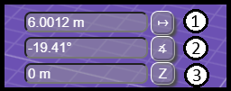

1. Distance input field is the distance from the compass origin.
2. Angle input field can be either an angle or bearing direction.
   - Angle - rotation around compass Z axis measured from compass X axis.
   - Bearing Direction - setting controls whether relative to compass or design axes.
3. Z input field is delta distance from compass origin in Z axis direction (3d only).

> Rectangular Mode:

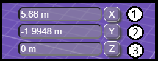

1. X input field is delta distance from compass origin in X axis direction.
2. Y input field is delta distance from compass origin in Y axis direction.
3. Z input field is delta distance from compass origin in Z axis direction (3d only).

### Explaining Focus

In order to effectively use AccuDraw it is important to first understand input focus and the visual clues that are used to communicate what currently has focus.

> Example showing focus on AccuDraw.

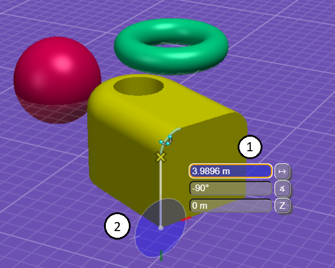

1. Distance field currently has input focus. New input will replace the current value and lock the field when not already locked.
2. AccuDraw compass displays in color when any input field has focus.

> Example showing focus on Home.

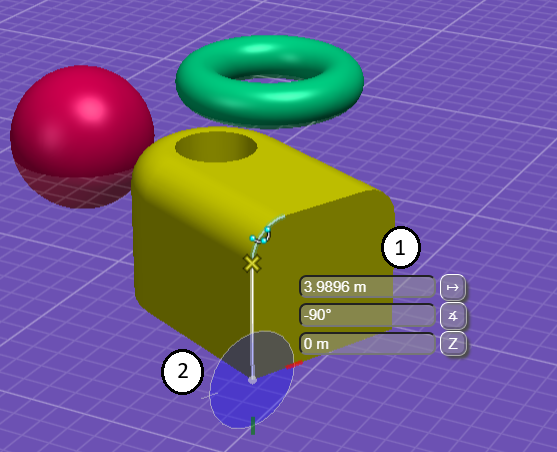

1. New input can not be entering as no field currently has focus.
2. AccuDraw compass still displays in color when focus is at home to indicate that keyboard shortcuts can be used. Using an AccuDraw shortcut, ex. *Set Origin*, also moves focus to the last active or default input field.

> Example showing focus on tool settings.

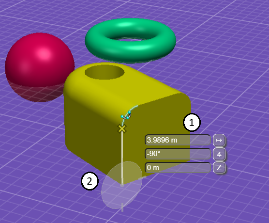

1. New input can not be entering as no field currently has focus.
2. AccuDraw compass displays in monochrome to indicate that focus is not on AccuDraw or Home and keyboard shortcuts can NOT be used. AccuDraw can be given focus by using a [TentativePoint]($frontend) (middle mouse button click) or by moving focus to Home and using a keyboard shortcut.

### Moving Focus

When AccuDraw has input focus, the following keys will move focus:

- Escape to move focus to Home.
- Tab (Down Arrow) to move focus to the next input field.
- Shift+Tab (Up Arrow) to move focus to the previous input field.

In Rectangular mode when neither X or Y is locked, focus automatically moves between them based on the closest axis to the cursor position. This pairs well with the *Smart lock* shortcut and facilitates entering values more quickly as it eliminates the need to check the current compass orientation before choosing between the *Lock X* or *Lock Y* shortcuts.

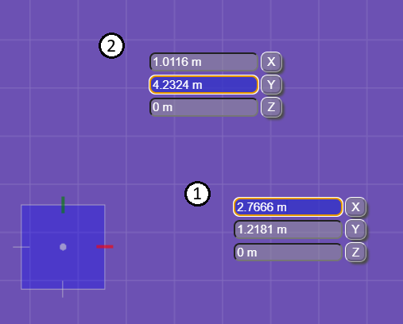

1. Cursor closer to X axis (red), focus moved to X input field.
2. Cursor closer to Y axis (green), focus moved to Y input field.

AccuDraw keyboard shortcuts can also be used to move focus.

- *Lock Distance* - Change mode to Polar, toggle Distance lock, if locked focus Distance field.
- *Lock Angle* - Change mode to Polar, toggle Angle lock. if locked focus Angle field.
- *Lock X* - Change mode to Rectangular, toggle X lock, if locked focus Y otherwise focus closest axis.
- *Lock Y* - Change mode to Rectangular. toggle Y lock, if locked focus X otherwise focus closest axis.
- *Lock Z* - Toggle Z lock, if locked focus Z.

### Entering New Value

New input will either replace or insert based on whether the text insertion cursor is present.

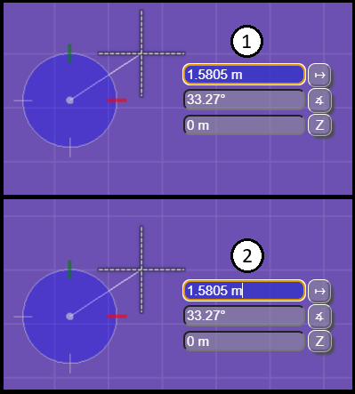

1. New input replaces the current value (text insertion cursor is positioned at end afterwards).
2. New input inserted at location of text insertion cursor.

The location of the text insertion cursor can be managed with the standard keys.

- Home/Insert to position text insertion cursor before first character
- End to position text insertion cursor after last character
- Left Arrow/Right Arrow to move text insertion cursor move left/right.
- Backspace to delete character before text insertion cursor.
- Delete to delete character after text insertion cursor.

Letter input is treated as a potential shortcut key. The exception is when focus is on the Angle field and it is set to show bearing directions. In this case "N", "S", "E", and "W" are accepted and will prevent any shortcut that starts with these characters from being used.

> When defining shortcuts, it is recommended to avoid starting with "N", "S", "E", or "W". Using "Escape" to move focus to Home before using the shortcut is also an option.

When a non-letter key is pressed the value of the currently focused field is replaced and its value locked. As you continue to type, intermediate results are previewed by the active tool using the adjusted point location. The current value is not formatted until accepted.

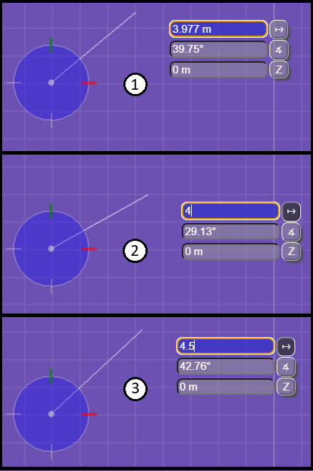

1. Distance field is unlocked and has focus showing a dynamic distance from the compass origin to the cursor.
2. After "4" is pressed, it replaces the current value, locks the field, and adjusts the current point.
3. Additional keys are pressed changing the current value to "4.5" and adjusting the current point.

> When entering angles and directions, the "^" and ";" keys will be replaced by "°" for easier entry.

### Expression Support

Simple expressions using +, -, \*, and / can be written when entering values. For + and - the characters after the operator are treated as a quantity value, and for \* and / are treated as a real number.
To use an expression, first enter a space before the desired operator. This avoids any ambiguity with entering a formatted quantity value such as 20'-6 1/2". The space is not required before entering \* or / when the text insertion cursor is not present. The space is always required for + or - as they can be used to specify the sign of a new quantity value.

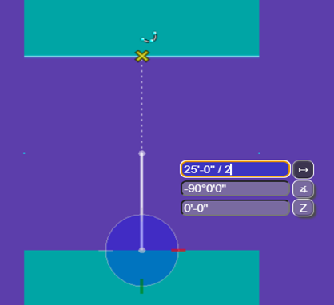

### Accepting New Value

After entering a new value it can be accepted as follows:

- Enter - Accepts current value. Does not move focus in Polar mode, Rectangular mode automatically changes focus between X and Y.
- Tab (Down Arrow), Shift+Tab (Up Arrow) - Accepts current value. Move focus to next or previous input field.
- Data point (Left Mouse Button) - Accepts current value. Does not move focus.

Once a value is accepted, it is processed by the active formatter for that field and the displayed value is updated with the formatted value.

### Choosing a Previous Value

A history of the last few distance and angle values is automatically created from locked/accepted input fields when using AccuDraw. Saved values from history can be used as follows:

- Distance Indexing - Move the cursor near to the previous Polar distance or Rectangular X/Y delta.
- Page Up (Shift+Up Arrow) - set and lock the previous value while cycling backwards through history.
- Page Down (Shift+Down Arrow) - set and lock the previous value while cycling forwards through history.

In the example below, segments have been drawn with lengths 1m, 2m, and 3m.

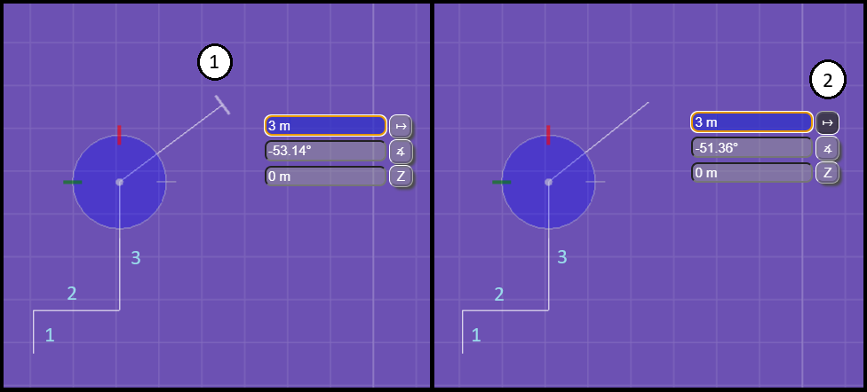

1. With the cursor close to the previous distance of 3m, the indexing tick mark appears and the current point is adjusted to the previous value.
   - To disable distance (and/or axis) indexing for the next point, the *Lock Index* shortcut can be used with the cursor at a location where the undesirable indexing is NOT active.
   - Conversely, using *Lock Index* with indexing active, locks the appropriate fields.
2. Using Page Up/Page Down set and locked the previous distance of 3m.
   - Repeatedly using Page Up will set the current value to 3m, 2m, 1m, and repeat.
   - Repeatedly using Page Down will set the current current value to 3m, 1m, 2m, and repeat.

### Interaction with Snapping

#### Nearest Snap

You can combine AccuDraw's distance and axis locks with [SnapMode.Nearest]($frontend) to adjust the current point to the intersection with the snapped geometry.

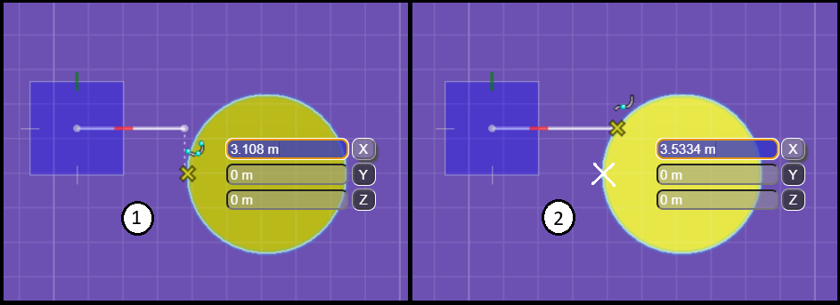

1. Keypoint snap projects the closest keypoint on the snapped geometry to the locked axis
2. Nearest snap finds the intersection of the locked axis and the snapped geometry

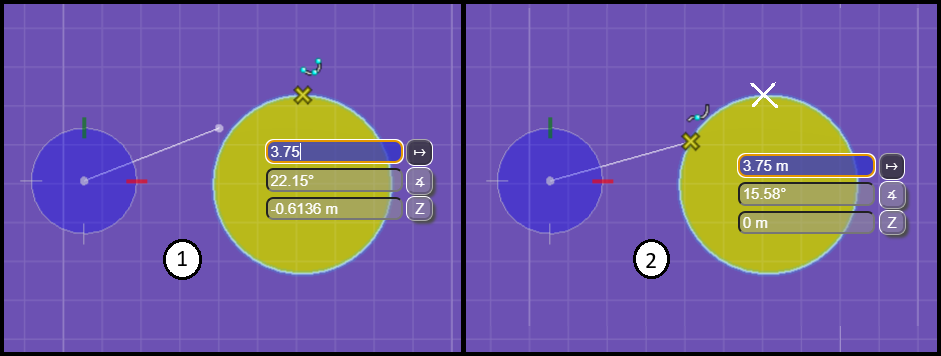

1. Keypoint snap sets the current point at the locked distance along the vector from the compass origin to closest keypoint.
2. Nearest snap finds the intersection between the circle defined by the locked distance and the snapped geometry.

#### Snap Indexing/Alignment

Similar to how the current point can be adjusted to AccuDraw's X or Y axes when within a close tolerance, after identifying a snap location, the current point can also be adjusted to axes derived from the snapped geometry. For curves this will be the tangent and binormal directions.

This location is automatically cleared on every data button, but it can also be explicitly cleared by snapping again to that same location or using the *Lock Index* shortcut.

> [AccuDraw.snapIndexing]($frontend) can be changed to disable this feature.

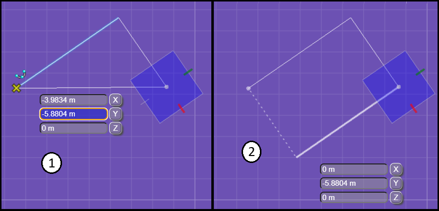

1. Identifying a location to index off of using AccuSnap at start point.
2. Showing current point adjusted to both the compass axis and snap w/o using *Smart Lock* to lock an axis.

> Tentative snap can be used to hold a location for indexing. This can be useful in a busy drawing to prevent inadvertent changes to the index location by AccuSnap. Use reset to clear the Tentative and start indexing to that location.

## Application Support

### Initial Setup

In order to begin using [AccuDrawViewportUI]($frontend) in your application it needs to be set to [IModelAppOptions.accuDraw]($frontend) during startup.

```ts
iModelApp: {
  accuDraw: new AccuDrawViewportUI(),
},
```

### Configuration Options

By default [AccuDrawViewportUI]($frontend) uses a vertical layout that follows the cursor. Applications that wish to use the fixed horizontal layout can call [AccuDrawViewportUI.setHorizontalFixedLayout]($frontend).

```ts
function createAccuDrawUI(): AccuDraw {
  const accuDraw = new AccuDrawViewportUI();
  accuDraw.setHorizontalFixedLayout();
  // NOTE: Set any other non-default options here...
  return accuDraw;
}
iModelApp: {
  accuDraw: createAccuDrawUI(),
},
```

For applications that wish to include a settings dialog for the user, a helper method [AccuDrawViewportUI.refreshControls]($frontend) is provided which will update the currently displayed controls after changes have been made to settings.

### User Preferences and Settings

#### Unit Round Off

Enabling unit round off allows dynamic distance and angle values to be rounded to the nearest increment of the specified units value(s). Rounding can also be configured to account for the current view zoom level, i.e. round distances to larger increment values as you zoom out. Applications should consider including a settings dialog for unit round off.

- [AccuDraw.distanceRoundOff]($frontend) Settings for rounding distances.
- [AccuDraw.angleRoundOff]($frontend) Settings for rounding angles.

Example code showing how to enable both angle and distance round off:

```ts
  const accudraw = IModelApp.accuDraw;

  // Enable rounding angles to 10° increments...
  accuDraw.angleRoundOff.units.clear();
  accuDraw.angleRoundOff.units.add(Angle.createDegrees(10).radians);
  accuDraw.angleRoundOff.active = true;

  // Enable rounding distances to 10cm, 1m, or 10m based on view zoom level...
  accuDraw.distanceRoundOff.units.clear();
  accuDraw.distanceRoundOff.units.add(0.1);
  accuDraw.distanceRoundOff.units.add(1.0);
  accuDraw.distanceRoundOff.units.add(10.0);
  accuDraw.distanceRoundOff.active = true;
```

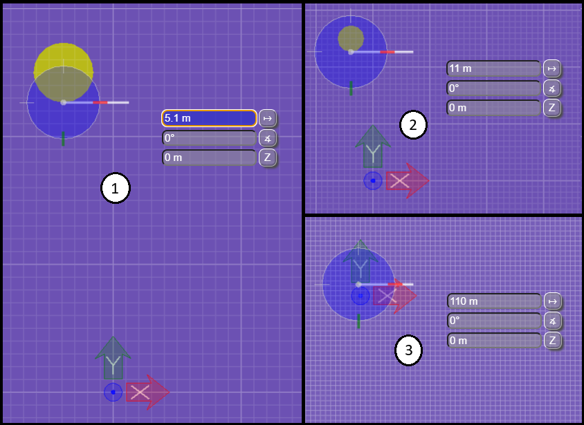

1. Initial view showing dynamic distance value being rounded to nearest multiple of 10cm.
2. Slightly zoomed out view showing dynamic distance value being rounded to nearest multiple of 1m.
3. More zoomed out view showing dynamic distance value being rounded to nearest multiple of 10m.

#### Notable Settings

- [AccuDraw.stickyZLock]($frontend) When enabled, the z input field will remain locked with it's current value after a data button.
- [AccuDraw.autoPointPlacement]($frontend) When enabled, fully specifying a point by entering both distance and angle in polar mode or XY in rectangular mode, automatically sends a data button event without needing to click the left mouse button to accept.

### Keyboard Shortcuts

Keyboard shortcuts are essential to using AccuDraw effectively and efficiently. Refer [here](./AccuDrawShortcuts) for information regarding available shortcuts and what they do.

When AccuDraw has input focus and does not handle a KeyboardEvent, the event will be propagated first to the active interactive tool, and then to [ToolAdmin.processShortcutKey]($frontend). This is where applications should test for and run their desired keyboard shortcuts.

> NOTE: When using keyboard shortcuts from the appui package, they currently require focus on Home and as such will not work out of the box with [AccuDrawViewportUI]($frontend) when AccuDraw has input focus. To work around this limitation in the appui package, applications should override the implementation of [ToolAdmin.processShortcutKey] from the appui package to remove the focus location check.

```ts
export class MyToolAdmin extends FrameworkToolAdmin {
  public override async processShortcutKey(e: KeyboardEvent, wentDown: boolean): Promise<boolean> {
    if (!wentDown || UiFramework.isContextMenuOpen || "Escape" === e.key)
      return false;
    UiFramework.keyboardShortcuts.processKey(e.key, e.altKey, e.ctrlKey, e.shiftKey);
    return true;
  }
}

iModelApp: {
  accuDraw: new AccuDrawViewportUI(),
  toolAdmin: new MyToolAdmin(),
},
```

### Known Issues

#### AccuDrawKeyboardShortcuts

Using the keyboard shortcut utilities from the appui package isn't allowing shortcuts like *Set Origin* and *Rotate Axes* that can make use of a current AccuSnap to work as intended. Currently opening the popup menu is clearing the current AccuSnap (unless the shortcut is entered VERY quickly). Until this gets resolved it is recommended to use a Tentative snap with these shortcuts to avoid inconsistent behavior.

The various lock shortcuts such as *Lock X* and *Lock Distance* have an erroneous compass mode check that is preventing the intended behavior of these shortcuts to automatically switch the current compass mode if necessary before enabling the corresponding lock.

#### Other Popups

There is currently a conflict when using the cursor layout with the option to show the tool assistance prompt at the cursor, they overlap. For now it is recommended that you disable the cursor prompt when testing the AccuDraw cursor UI. The following methods have been provided to allow for a popup management strategy that can better coordinate with the cursor layout.

- [AccuDrawViewportUI.currentControlRect]($frontend)
- [AccuDrawViewportUI.modifyControlRect]($frontend)

#### Touch Input

Additional evaluation is required for touch input. Currently the touch cursor doesn't interfere with the cursor layout, but a means of entering values and using shortcuts is necessary to fully support touch workflows requiring precision input beyond just using AccuSnap.
