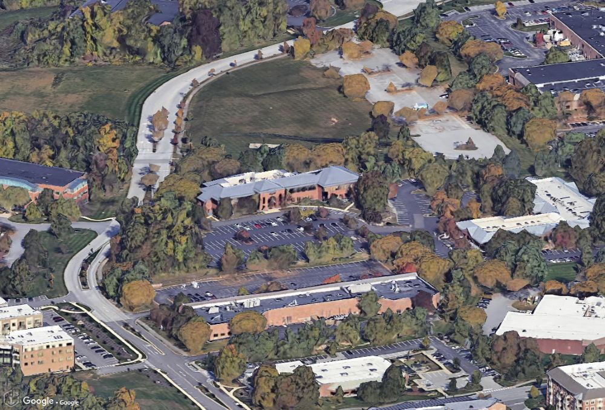

# Google Photorealistic 3D Tiles in iTwin.js

iTwin.js supports displaying Google Photorealistic 3D Tiles (GP3DT) via the class [RealityDataSourceGP3DTProvider]($frontend). This provider handles authentication, tile loading, and attribution display for GP3DT.

Here is an example of how to use the new provider by supplying an API key:

```ts
[[include:GooglePhotorealistic3DTiles_providerApiKey]]
```

Instead of an API key, you can also supply a `getAuthToken` function:

```ts
[[include:GooglePhotorealistic3DTiles_providerGetAuthToken]]
```

You can also use the [RealityDataSourceGP3DTProviderOptions.showCreditsOnScreen]($frontend) flag to control the display of the data attributions on-screen. It is set to `true` by default.




