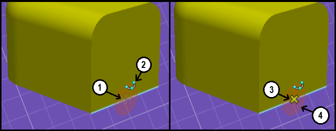
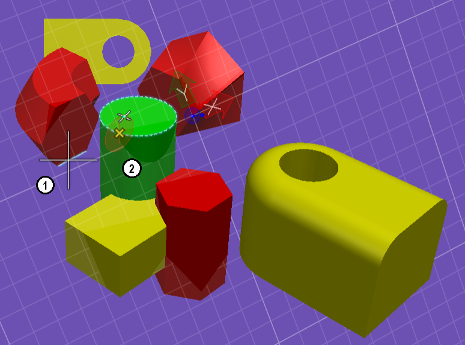
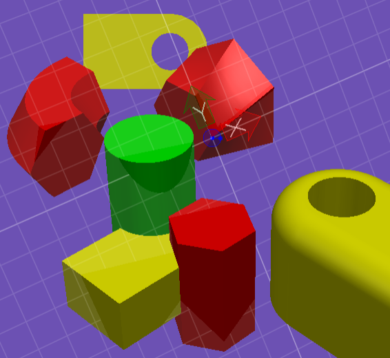
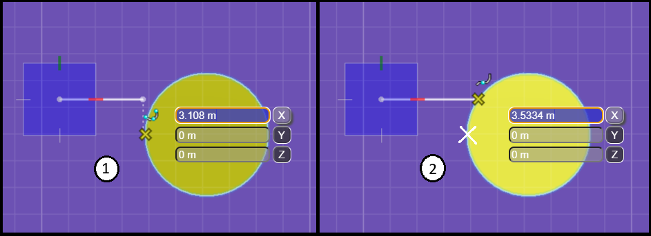
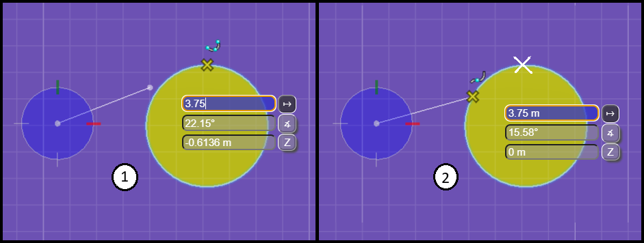

# Writing a PrimitiveTool

The [PrimitiveTool]($frontend) class serves as the base class for tools that need to create or modify geometric elements. An application's Primitive tools are often very specialized with each serving a single and specific purpose. Understanding of PrimitiveTool methods and what is expected from sub-classes is necessary for creating tools that conform to user expectations and exhibit consistent behavior.

## Running the tool

Because Primitive tools often target a specific type of element, it may be undesirable to install a given Primitive tool as the *active* tool without first checking if all required conditions are being met.

When [ToolRegistry.run]($frontend) is called for a Primitive tool, the following sequence of tool methods are called:

- [isCompatibleViewport](#iscompatibleviewport)
- [onInstall](#oninstall)
- [onPostInstall](#onpostinstall)

```ts
[[include:PrimitiveTool_Run]]
```

## isCompatibleViewport

The very first decision the tool must make is whether to continue the install or leave the current tool active given a viewport identifying the target for graphical interaction. By default [ViewManager.selectedView]($frontend) is supplied as the target viewport by [PrimitiveTool.run]($frontend).

The tool is responsible for checking the viewport's compatibility with the tool operation, some examples below:

- Target isn't readonly. Checks [PrimitiveTool.requireWriteableTarget]($frontend), defaults to true; assumption is that *most* Primitive tools will insert/update elements.
- Only applicable to spatial views.
- Requires a specific GeometricModel be included in the view's [ModelSelectorState]($frontend).

If [InteractiveTool.isCompatibleViewport]($frontend) rejects the view, then the current tool remains active and installation of the new tool stops, if the view is accepted, then we proceed to the [onInstall](#oninstall) step.

> For applications that support multiple views, [InteractiveTool.onSelectedViewportChanged]($frontend) will also call isCompatibleViewport to provide tools an opportunity to decide if they should remain active or must exit depending on their compatibility with the new selected view. The *isSelectedViewChange* parameter will be true in this situation.

```ts
[[include:PrimitiveTool_SelectedViewport]]
```

> Prior to sending a button or motion event to the active tool, isCompatibleViewport is also called. If the tool rejects the view of the would-be motion event, it still remains active and the user is presented with an *incompatible* view cursor. A data button in an incompatible view will either be ignored (not sent to the tool), or trigger a change of the selected view. The data button behavior is controlled by the state of [PrimitiveTool.targetIsLocked]($frontend). Ideally a placement tool should allow the selected view to be freely changed by the first data button as long as the new view is compatible, afterwards the target view/model will be considered locked for the tool duration, see [PrimitiveTool.autoLockTarget]($frontend).

## onInstall

Now that a target view has been accepted for the tool operation, [InteractiveTool.onInstall]($frontend) provides one last chance before being set as the active tool to check any remaining requirements. The type of checks to consider for onInstall as opposed to isCompatibleViewport would be one time only initial conditions that would not be appropriate or necessary to test on a motion event, such as:

- Tool requires an pre-defined [SelectionSet]($frontend) of existing elements.

> Most tools don't need to override onInstall, as long as it returns true, the new tool is set as the active tool, after which [onPostInstall](#onpostinstall) will be called.

## onPostInstall

After becoming the active tool, [InteractiveTool.onPostInstall]($frontend) is used to establish the initial tool state. This may include enabling [AccuSnap]($frontend), sending AccuDraw hints using [AccuDrawHintBuilder]($frontend), and showing user prompts. Because onPostInstall is paired with [InteractiveTool.onCleanup]($frontend), it's also a good place to register listeners for events.

Refer to [AccuSnap](#accusnap) and [AccuDraw](#accudraw) for examples showing how different types of Primitive tools can leverage these drawing aides.

## onRestartTool

A Primitive tool is required to provide an implementation for [PrimitiveTool.onRestartTool]($frontend). This method will be called to notify the tool after iModel changes made outside of the tool's purview have occurred which *may* have invalidated the current tool state.

- For example, the user requests an undo of their previous action, an element the tool is currently modifying was created in the last transaction and as such no longer exists. The tool is expected to either install a new tool instance, or exit in response to this event.

Example of typical implementation for onRestartTool:

```ts
[[include:PrimitiveTool_Restart]]
```

> The default implementation of [InteractiveTool.onSelectedViewportChanged]($frontend) also calls onRestartTool to handle [isCompatibleViewport](#iscompatibleviewport) returning false. It's expected that the tool will restart with target from the new viewport if compatible, and call [InteractiveTool.exitTool]($frontend) otherwise.

## AccuSnap

[AccuSnap]($frontend) is a aide for identifying elements and pickable decorations under the cursor. A tool can choose to enable locate, snapping, or both.

### Snapping

An interactive tool that requires the user to identity a specific point on geometry can enable snapping.


Tools that override [InteractiveTool.onDataButtonDown]($frontend) or [InteractiveTool.onDataButtonUp]($frontend) and use [BeButtonEvent.point]($frontend) directly, in particular those that create new or modify existing elements, should call [AccuSnap.enableSnap]($frontend) with true to enable snapping. Snapping allows the user to identity locations of interest to them on existing elements or pickable decorations by choosing a [SnapMode]($frontend) and snap divisor. Snapping is used to identify points, *not* elements.

> To be considered active, both tool and user must enable snapping; [AccuSnap.isSnapEnabled]($frontend) and [AccuSnap.isSnapEnabledByUser]($frontend) must both return true. The user that disables snapping through AccuSnap is choosing to identify snap locations using [TentativePoint]($frontend) instead. The default [IdleTool]($frontend) behavior of a middle mouse button click is to perform a tentative snap.


Information about the current snap is presented using several on screen indicators detailed below.



  1. Tentative snap preview
  2. The snap mode used to compute the point
  3. Hot snap location
  4. The snap normal

A tentative snap preview (shown with a dotted black and white plus symbol) is used as an alternative to forcing a hot snap and having the current point jump around wildly (to potentially off screen locations). [SnapMode.NearestKeypoint]($frontend) will show a tentative snap preview when the closest keypoint is too far from the cursor to be considered "hot". The user can accept the tentative snap location either by using a [TentativePoint]($frontend) or by moving the cursor closer to the previewed location. The hot distance is based on the settings for [AccuSnap.Settings.hotDistanceFactor]($frontend) and [ElementLocateManager.apertureInches]($frontend).

> When a tentative point preview is displayed but not accepted, [BeButtonEvent.point]($frontend) will be set to the hit point on the geometry under the cursor (not the location of the tentative point preview) as opposed to being treated as unsnapped and projected to the view's [ACS](#auxiliary-coordinate-system).

Unlike the tentative snap preview, a hot snap (shown by a yellow X symbol) indicates an accepted snap location that will be reflected in [BeButtonEvent.point]($frontend). Using [SnapMode.Center]($frontend) will always force a hot snap regardless of distance from the cursor to facilitate being able to easily locate arc centers.

The snap normal (shown with a filled in-plane disc) indicates the surface normal of a solid/sheet or well defined normal for other planar geometry at the snap location. In the case of an edge snap, the snap normal combined with the edge tangent will fully define a rotation.

You can combine a [TentativePoint]($frontend) snap with [AccuSnap]($frontend) when using [SnapMode.Intersection]($frontend) to identify extended intersections.



1. First use a [TentativePoint]($frontend) to snap to a curve or edge
2. AccuSnap finds the intersection with the geometry identified by the tentative with any curve/edge under the cursor

> A tool with an understanding of connection points and how things fit together *should not* enable AccuSnap. For example, a tool to place a valve on a pipe knows to only choose pipe end points of a given diameter, it should not require the user to choose an appropriate snap point at the end of a correct pipe or try to influence AccuSnap to only generative *key points* it deems appropriate. This is case where [locate](#locate) should be enabled instead.

Example from a simple sketching tool that uses AccuSnap to create and show a linestring in dynamics:

```ts
[[include:PrimitiveTool_Snap]]
```

> PrimitiveTool has a button event filter that becomes active when snapping is enabled. The range of physical geometry created or modified by tools should always be fully contained within the bounds defined by [IModel.projectExtents]($common). The purpose of [InteractiveTool.isValidLocation]($frontend) is to reject button events that would result in geometry that exceeds the project extents. When isValidLocation returns false, the user is presented with an *invalid location* cursor and the button event is not sent to the tool. The default implementation of isValidLocation only checks that [BeButtonEvent.point]($frontend) is inside the project extents, tools should override isValidLocation to implement a more robust check based on the range of the geometry they create.

### Locate


A tool that only needs to identify elements and does not use [BeButtonEvent.point]($frontend) should not enable snapping. Instead the tool should call [AccuSnap.enableLocate]($frontend) with true to begin locating elements as the cursor moves over them. Enabling locate for AccuSnap provides the user with feedback regarding the element under the cursor in the form of a tooltip. Element's will also glow to highlight when they are of the type the tool is looking for.

> When not snapping be aware that [BeButtonEvent.point]($frontend) is not set to [HitDetail.hitPoint]($frontend) since this represents an approximate world location based on the displayed facetted/stroked graphics. The point will instead be projected to the view's [ACS](#auxiliary-coordinate-system). In cases where enabling snapping is not desirable but an exact hit point on the geometry is required, calling [AccuSnap.doSnapRequest]($frontend) with [SnapMode.Nearest]($frontend) may provide an easy alternative to getting the element geometry.

When either locate with AccuSnap is enabled, or the tool requests a new locate by calling [ElementLocateManager.doLocate]($frontend) on a button event, [InteractiveTool.filterHit]($frontend) will be called to give the tool an opportunity to accept or reject the element or pickable decoration identified by a supplied [HitDetail]($frontend). When overriding filterHit and rejecting a hit, the tool should set [LocateResponse.reason]($frontend) to explain why the hit is being rejected; this message will be displayed on motion stop in a tooltip when an implementation for [NotificationManager._showToolTip]($frontend) is provided.

A tool can also customize the tooltip for accepted elements in order to include tool specific details by overriding [InteractiveTool.getToolTip]($frontend).

> Unlike snapping, only the tool needs to enable locate to make it active. By giving the user feedback about the element under the cursor *before* they click on it, tools are able to complete with less clicks as the need for an explicit accept/reject step after identifying the element through a button event is eliminated.

In addition to enabling AccuSnap locate, the tool should set an appropriate view cursor as well as enable the display of the locate circle. A convenient helper method is provided to set up everything a tool needs to begin locating elements, [InteractiveTool.initLocateElements]($frontend).

Example from a simple tool that locates elements and makes them the current selection set:

```ts
[[include:PrimitiveTool_Locate]]
```

## Auxiliary Coordinate System

An auxiliary coordinate system or ACS defines a working plane for a view that can differ from the global coordinate system. By default every view has an ACS that is aligned with the global system. Display of the ACS triad showing the location of ACS origin and direction of the X and Y axes is enabled by setting [ViewFlags.acsTriad]($common). The drawing grid can also help visualize the working plane by using [GridOrientationType.AuxCoord]($common) and enabling [ViewFlags.grid]($common).



Setting [ToolAdmin.acsContextLock]($frontend) makes it easier to work in a rotated coordinate system as tools like [StandardViewTool]($frontend) will use rotations relative to the view's ACS instead of the global system. Use [AccuDrawHintBuilder.getContextRotation]($frontend) when writing an interactive tool to properly support this setting.

Setting [ToolAdmin.acsPlaneSnapLock]($frontend) makes it easier to work on the ACS plane by projecting snap points into the ACS plane. Unsnapped points are always projected to the ACS plane when AccuDraw is not active.

## AccuDraw


[AccuDrawHintBuilder]($frontend) is an aide for entering coordinate data. By using *shortcuts* to position and orient the AccuDraw compass, locking a direction, or entering distance and angle values, the user is able to accurately enter points. AccuDraw isn't strictly controlled by the user however, the tool is also able to provide additional context to AccuDraw in the form of *hints* to make the tool easier to use.

> When [ToolAdmin.acsContextLock]($frontend) is enabled the AccuDraw shortcuts for orienting the compass to top, front, or side will be relative to the view's ACS instead of the global system. Additionally, when AccuDraw first becomes active when using an interactive tool it will orient itself to the view's ACS.

Some examples of AccuDraw tool hints:

- Send AccuDraw hint to use polar mode when defining a sweep angle.
- Send AccuDraw hint to set origin to opposite end point of line segment being modified and orient to segment direction, a new line length can be now easily specified.

Upon installing a new Primitive tool as the active tool, AccuDraw's default state is initialized to *inactive*. AccuDraw will upgrade its internal state to *active* automatically if the tool calls [InteractiveTool.beginDynamics]($frontend). Tools that won't start dynamics (might only use view decorations) but still wish to support AccuDraw can explicitly enable it using [AccuDrawHintBuilder.activate]($frontend) or [AccuDrawHintBuilder.sendHints]($frontend). Conversely, tools that show dynamics, but do not want AccuDraw, are required to explicitly disable it by calling [AccuDrawHintBuilder.deactivate]($frontend).

> Using the example of a tool that places a valve on a pipe again, the tool doesn't require the user to orient the valve on the closest pipe end point, it can get this information from the pipe element. As AccuDraw doesn't need to be enabled by the tool in this situation, but the tool does wish to preview the valve placement using dynamics, it should disable AccuDraw's automatic activation.

[AccuDrawHintBuilder]($frontend) is a helper class tools can use to send hints to AccuDraw. A tool will typically send hints from [InteractiveTool.onDataButtonDown]($frontend), the hints are often accompanied by new tool prompts explaining what input is expected next.

> Tools that enable AccuDraw, either through automatic or explicit activation, should still not rely on AccuDraw or its hints for point adjustment. The user may choose to disable AccuDraw completely, set a preference to ignore tool hints in favor of manually controlling the AccuDraw compass, or use shortcuts to override the tool's hints. If for example a tool requires the input point be projected to a particular plane in the view, even after enabling AccuDraw and sending hints to set the compass origin and rotation to define the plane, it must still correct [BeButtonEvent.point]($frontend) to ensure it lies on the plane for the reasons previously mentioned.

[AccuDrawHintBuilder]($frontend) provides several utility methods to help interactive tools with point adjustment.

- [AccuDrawHintBuilder.projectPointToPlaneInView]($frontend)
- [AccuDrawHintBuilder.projectPointToLineInView]($frontend)
- [AccuDrawHintBuilder.getBoresite]($frontend)

Example from a simple sketching tool that uses AccuDrawHintBuilder to facilitate drawing orthogonal segments:

```ts
[[include:PrimitiveTool_PointsTool]]
```

### Getting the Current AccuDraw Rotation

An interactive tool might want to allow the user to use AccuDraw to define the orientation of the geometry it is creating or modifying. For example using AccuDraw to define the rotation when sketching a planar shape or placing a symbol.

Tools should use [AccuDrawHintBuilder.getCurrentRotation]($frontend) to get the current AccuDraw rotation when it is active and to fallback to either the view or ACS rotation when not active. When calling [AccuDrawHintBuilder.getCurrentRotation]($frontend) with true for checking both AccuDraw and the view's ACS, the priority for what rotation is returned is a follows.

1. Current AccuDraw rotation when active
2. Current view ACS rotation when [ToolAdmin.acsContextLock]($frontend) is enabled
3. Current view rotation

> By calling [AccuDrawHintBuilder.getCurrentRotation]($frontend) the interactive tool doesn't need to consider if AccuDraw is active or not.

### AccuDraw and Nearest Snap

You can combine AccuDraw's distance and axis locks with [SnapMode.Nearest]($frontend) to adjust the current point to the intersection with the snapped geometry.



1. Keypoint snap projects the closest keypoint on the snapped geometry to the locked axis
2. Nearest snap finds the intersection of the locked axis and the snapped geometry



1. Keypoint snap sets the current point at the locked distance along the vector from the compass origin to closest keypoint.
2. Nearest snap finds the intersection between the circle defined by the locked distance and the snapped geometry.
