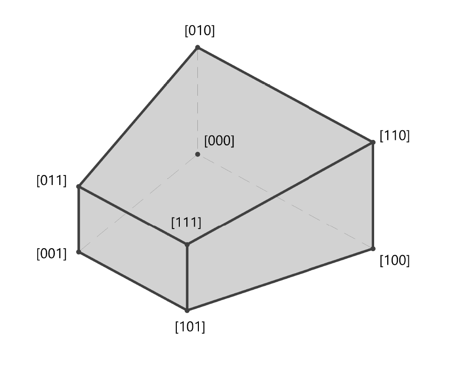

# Using Views in iTwin.js

A *View* renders geometry from one or more [Models]($docs/bis/intro/model-fundamentals) of an iModel in a web browser. iTwin.js applications can embed and interact with Views anywhere on a web page via an `HTMLDivElement`.

Views are managed by the [ViewManager]($frontend) class, using [IModelApp.viewManager]($frontend).

Multiple Views may be simultaneously visible on the same web page, each with their own HTMLDivElement, and are coordinated by the ViewManager.

## ViewDefinition Elements

A *View* is saved in an iModel as an element of the [ViewDefinition]($backend) class. ViewDefinitions hold all the information necessary to show the same content across sessions.
This includes the camera position, the model(s) displayed, the CategorySelector, the DisplayStyle to use, plus any additional view-specific settings.

## The ViewState Class

The `ViewDefinition` classes (in fact all [Element]($backend) classes) exist only on the backend, because their purpose is to read and write those elements to/from the iModel.
On the frontend, access to the elements needed to display views is provided by the [ElementState]($frontend) classes. The ElementState classes only hold the *state* of elements, not
the methods to read and write elements from the database.

Views are opened by loading a ViewDefinition into a [ViewState]($frontend) object. They begin showing the content as it was saved in the iModel, but users may
modify what they're seeing using [Viewing tools](#viewing-tools). These changes are only temporary (in-memory) unless they are saved back to the iModel
via [IModelDb.Elements.updateElement]($backend).

An instance of a `ViewState` in memory holds references to several other objects, including a [CategorySelectorState]($frontend), a [DisplayStyle3dState]($frontend),
and a [ModelSelectorState]($frontend) (for `SpatialViews`). Since each of these objects must be loaded in the frontend asynchronously, there is an
async method called [IModelConnection.Views.load]($frontend) that returns a promise when the `ViewState` and all other State objects required to display a
View are ready. The [Viewport]($frontend) class expects loaded ViewState objects.

## Types of ViewDefinitions

There are subclasses of `ViewDefinition` to show different types of Models in various ways.

Here are several significant subclasses:

- `ViewDefinition`
  - `SpatialViewDefinition` - shows a view of one or more 3d SpatialModels
  - `DrawingViewDefinition` - shows a view of a *single* 2d DrawingModel
  - `SheetViewDefinition` - shows a view of a *single* 2d SheetModel

For each subclass of `xxxViewDefinition`, there is a corresponding `xxxViewState` class in the frontend.

## Using Viewports

[ViewState]($frontend) objects hold the state of a [ViewDefinition]($backend) (*what* is shown in a View) in the frontend.

[Viewport]($frontend) is an abstract class that connects a ViewState to a [RenderTarget]($frontend).

To connect a ViewState to a rectangular region on a web page, create instances of the [ScreenViewport]($frontend) class. The method [ScreenViewport.create]($frontend) takes an `HTMLDivElement` and a
(fully loaded) ViewState. In this manner, ScreenViewport forms the connection between a rectangular region on your web page (a "div") and a set of
Models in an iModel, a display [Frustum]($common), a DisplayStyle, and the rendering system.

> Note: before creating a ScreenViewport, be sure to call [IModelApp.startup]($frontend).

## Loading Views from an iModel

There is a method called [IModelConnection.Views.getViewList]($frontend) that returns an array of [IModelConnection.ViewSpec]($frontend)s in a convenient
format for User Interfaces. This can be used to present a list of possible views by name in a List.

For example, to get a list of all spatial views:

``` ts
[[include:IModelConnection.Views.getSpatialViewList]]
```

To get a list of all drawing views:

``` ts
[[include:IModelConnection.Views.getDrawingViewList]]
```

Once a view is selected from the list, it may be loaded with:

``` ts
[[include:IModelConnection.Views.load]]
```

Then, you may wish to change one of the existing views to show the contents of the now-loaded view. For example, to switch the
[ViewManager.selectedView]($frontend) to show it, use code like:

``` ts
[[include:ScreenViewport.changeView]]
```

> Note that in the examples above, `getSpatialViews`, `loadOneView`, and `showOneView` are `async`, and you must `await` them.

## Changing the Model displayed by a 2d view

Viewports always display one ViewState. If that ViewState happens to be a ViewState2d, we sometimes call that a "2d view". Since ViewState2d shows one and only one 2d Model, it is sometimes is desireable to "switch the Model" of an existing 2d view, versus loading a new ViewState2d. This will sometimes
be appropriate if you *know* that a set of 2d Models use a common coordinate system and categories, etc.

The [Viewport.changeViewedModel2d]($frontend) method can be used to accomplish this:

``` ts
[[include:ScreenViewport.changeViewedModel2d]]
```

## ViewManager

The Viewport class is responsible for displaying a View, as defined by its ViewState. However, typically the objective of showing a View is to allow users
to modify the View itself, or to interact with its contents.

To facilitate that, you need to connect the event system of the browser with Viewports via [IModelApp.viewManager]($frontend).

``` ts
[[include:ViewManager.addViewport]]
```

After the viewport is added to the [ViewManager]($frontend), all HTML events for its canvas are directed to the active `Tool` class by the [ToolAdmin]($frontend).

### The "Selected" View

It is sometimes necessary to chose a Viewport from inside code that reacts to user input. Absent some other way of determining which Viewport to use, iTwin.js applications often default to [ViewManager.selectedView]($frontend). This will be the last [ScreenViewport]($frontend) in which the user clicked. [ViewManager.selectedView]($frontend) is often the target Viewport for [Tools]($frontend:Tools).

> Note: If there is only one Viewport visible, that Viewport will always be the [ViewManager.selectedView]($frontend). If there are no Viewports visible, [ViewManager.selectedView]($frontend) can be undefined.

## Viewing Tools

The iTwin.js library supplies controls that allow users to modify what is shown in Views via the [ViewTool]($frontend) classes. You can create instances of the
supplied classes (e.g. [WindowAreaTool]($frontend), [FitViewTool]($frontend), [WalkViewTool]($frontend), [RotateViewTool]($frontend), etc.) or create your own subclasses for
special viewing operations.

## View Decorators

The Viewport class is responsible for displaying the *persistent* data (e.g. Models, reality data, maps, etc.) in your view. Often, however, Tools wish to show
additional, non-persistent, information to convey context or call attention to items or areas of interest. That is accomplished via [View Decorators](./ViewDecorations)

## DisplayStyles

DisplayStyles describe the *styling* that should be applied to the contents of a View.

This includes the:

- [ViewFlags]($common)
- [SubCategoryAppearance]($common) visibility and overrides
- Background color
- [RenderMode]($common)
- [Environment]($frontend)
- Other view-specific parameters

They are loaded in memory in the frontend with the [DisplayStyleState]($frontend) class.

DisplayStyles can be named and shared among many ViewDefinitions.

## ModelSelectors

ModelSelectors apply only to SpatialViews. They determine the set of [SpatialModel]($backend)s that are displayed. The Geometry for elements in SpatialModels are always
stored in the iModel's Spatial Coordinate System. They are loaded in memory in the frontend with the [ModelSelectorState]($frontend) class.

Since each 2d Model has its own coordinate system, 2d Views always only show a single Model and therefore don't use ModelSelectors.

ModelSelectors can be named and shared among many ViewDefinitions.

## CategorySelectors

A [CategorySelectorState]($frontend) determines the set of [Category]($backend) that are displayed in a View. They are loaded in memory in the frontend with the [CategorySelectorState]($frontend) class.

CategorySelectors can be named and shared among many ViewDefinitions.

## Auxiliary Coordinate Systems

Views may reference an [AuxCoordSystemState]($frontend) to display coordinate data and distances in different units and orientations.

Auxiliary Coordinate Systems can be named and shared among many ViewDefinitions.

## Reality Data

Reality Data (e.g. [ContextCapture](https://www.bentley.com/en/products/brands/contextcapture) models, Point Cloud models, Maps, etc.) are stored external to iModels, and are accessed via Reality Data Servers. However, in an iModel
you can create `RealityDataModel`s that hold the URL of the Reality Data.

These models are subclasses of [SpatialModel]($backend), and can therefore be included in a `ModelSelector` and can easily be made visible in any SpatialView.

## View Thumbnails

Every view may have a thumbnail that shows an approximation of what it contains. This can be helpful for user interfaces that offer a choice of Views.

## ViewState Parameters

 This is what the parameters to the camera methods, and the values stored by [ViewDefinition3d]($backend) mean.


**<center>View Frustum - top view</center>**


**<center>View Frustum -  3D view</center>**



**<center>View Frustum NPC Corners</center>**

### Notes

- The view origin is in world coordinates. It is the point at the lower left of the rectangle at the focus plane, projected onto the back plane.

- `[delta.x,delta.y]` are on the focus plane and `delta.z` is from the back plane to the front plane.

- The three view vectors come from:

 ```cmd
  {vector from eyePoint->targetPoint} : -Z (positive view Z points towards negative world Z)
  {the up vector}                     : +Y
  {Z cross Y}                         : +X
  ```

  these three vectors form the rows of the view's [Matrix3d]($geometry)

- Objects in space in front of the front plane or behind the back plane are not displayed.

- The focus plane is not necessarily centered between the front plane and back plane (though it often is.)
It should generally be between the front plane and the back plane.

- targetPoint is not stored in the view parameters. Instead it may be derived from `{origin},{eyePoint},[Matrix3d]` and `focusDist`.

- The ViewState holds the parameters: `{origin}{delta}[Matrix3d]` from which the View frustum is derived.

- Cameras hold a "lens angle" value which is defines the field-of-view for the camera in radians.
The lens angle value is not used to compute the perspective transform for a view.
Instead, the lens angle value can be used to reposition `{eyePoint}` when the view volume or target changes.

- View volumes where one dimension is very small or large relative to the other dimensions (e.g. "long skinny telescope" views, or "wide and shallow slices", etc.) are problematic and disallowed based on ratio limits.
