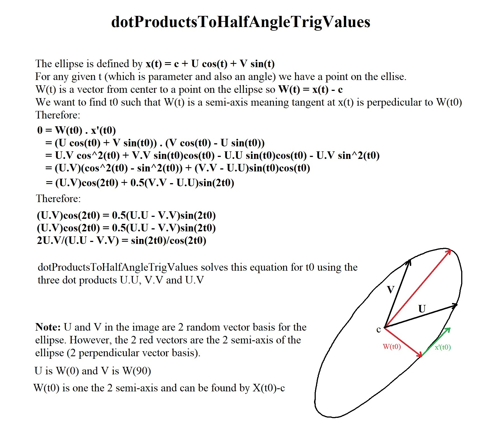

## fraction of an angle sweep returned by different API

## half-angle using the dot products to find ellipse semi-axis

## Derivation of 3d Rotation Matrices

## Conversion of OrderedRotationAngles to Matrix3d

## Derivation of Axis and Angle from a Rotation Matrix

